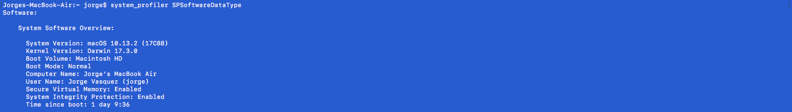
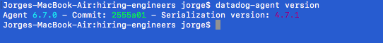
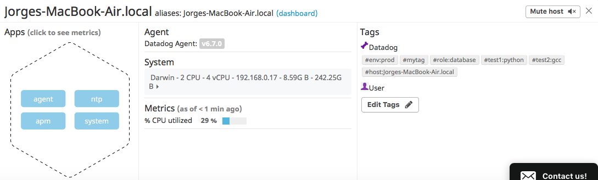
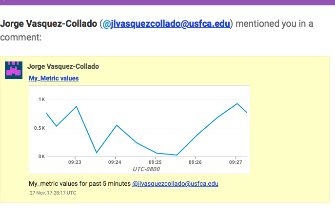
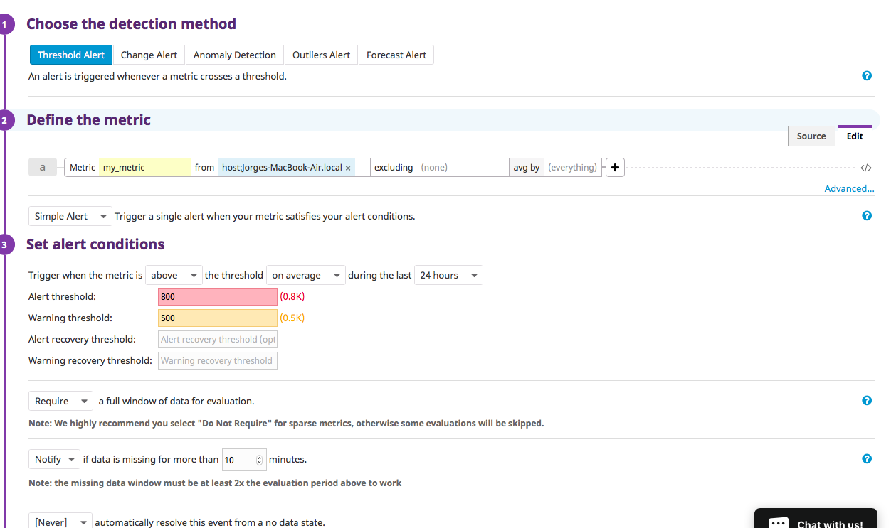
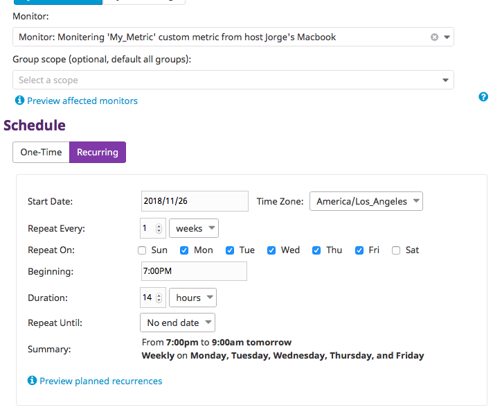
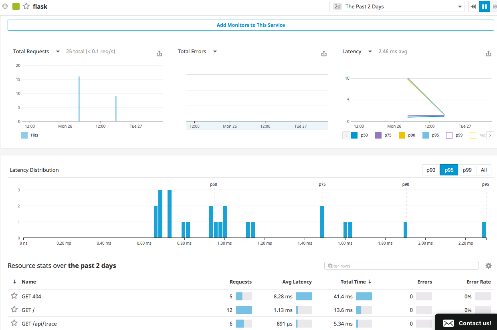

# Jorge Vasquez-Collado : Solutions Engineer Exercise Answer

## Prerequisite: Knowing and setting up my enviornment 
I decided to not use a virtual box, which I could have easily done, but chose to use my macOS as my host because I like to challenge prereq problems. 

I am using my macbook air's current OS: macOS High Sierra (macOS version: 10.13.2)
</img>
### Next: Installing Datadog agent
After creating a Datadog Account, I went ahead and proceeded to download the Agent for the macOSX enviornment.
The link to install the agent for OS can be found here <a href= "https://app.datadoghq.com/account/settings#agent/mac"> macOSX agent installation</a>

After installing the agent, I can check the agent version using 
```
datadog-agent version
```
</img>

## [](https://github.com/DataDog/hiring-engineers/tree/solutions-engineer#collecting-metrics)Collecting Metrics:

### Add tags in the Agent config file
I added tags by updating the main agent configuration file `/etc/datadog-agent/datadog.yaml`.
There were already defualt tags present after uncommenting the tags section of the yaml config file, so I added some other random tags for the sake understanding. 

We can see my host and the tags from Host Map page in Datadog:
</img>

You can see that tags have been enabled as well the nondefualt tags I added : mytag, test1 and test2.

### Installing Datadog integration for Postgres
In my current machine I have already have Postgres version 10.5 installed, therefore I do not need to install it.
However, I do need to install the postgress Datadog integration and create a read-only administrator user for the Datadog agent. 

####Change image source after commit with postgres vers img
</img> 


In order to install Postgres integration for the my host's Datadog agent, I followed the instuctions from <a href="https://app.datadoghq.com/account/settings#integrations/postgres">the Datadog integrations page</a>

After creating the read_only user for the Datadog agent, I tested the Datadog user with the test given by the instruction.

####Change image source after commit with datadog user test img.
</img>

In Addition to creating a Postgres Datadog user, I also needed to edit the postgres.yaml file located in the datadog-agent/conf.d directory. 
`/etc/datadog-agent/conf.d/postgres.yaml`

Finally, the agent must be restarted to complete the Postgres Datadog integration.
To restart the agent we can use :

```
launchctl stop com.datadoghq.agent
```
followed by
```
launchctl start com.datadoghq.agent
```
These particular instructions are for a macOSX agent such as mine. They can be different for other OS systems.


####replace this aswell for metrics explorer
</img>

If we check the <a href="https://app.datadoghq.com/dashboard/lists">dashboard list page <a/> we can see that Postgres is present in the list:
####replace this for dashboard img
</img>

### Creating a custom Agent check
To complete this task, I learned to create a custom check from the 
<a href= "https://docs.datadoghq.com/developers/write_agent_check/?tab=agentv6"> Writing a custom Agent check</a> page in the Datadog Docs.

To create my own custom Agent check, I create 2 files: `custom_check.yaml` in `/etc/datadog-agent/conf.d/` and the python script `custom_check.py` in `/etc/datadog-agent/checks.d/`

#### custom_check.yaml
```
init_config:

instances:
    - min_collection_interval: 45

 ```   

According the Docs page, the collection interval can only be changed at the instance level and configured for each instance.


##### custom_check.py
```
# the following try/except block will make the custom check compatible with any Agent version
try:
    # first, try to import the base class from old versions of the Agent...
    from checks import AgentCheck
except ImportError:
    # ...if the above failed, the check is running in Agent version 6 or later
    from datadog_checks.checks import AgentCheck

# content of the special variable __version__ will be shown in the Agent status page
__version__ = "1.0.0"
import random
class custom_check(AgentCheck):
    def check(self, instances):
        self.gauge('my_metric', random.randint(0,1001))
```
The check class inherits from AgentCheck and send a gauge of a random number for the metric 'my_metric' on each call.

##### Note: random.randint follows a low inclusive to high exclusive, hence the need for 1001 high and not 1000.
#####       Default collection interval without change in yaml file is 15 seconds. 
#####       See bottom for some extra notes I discovered while writing this custom check


#### Bonus Question: To change the collection interval outside of the python check file, changed the yaml file of our Agent check to include - "min_collection_interval : <seconds here>" under the instances section.


## Visualizing Data:
The first step was to create an Application key for my Datadog account. This could be achieved at <a href="https://app.datadoghq.com/account/settings#api">APIs page</a>

The new timeboard will contain:

The new metric: my_metric scoped over my host.

Anomolies graph of cpu usage by the system from all host (in this case just mine)

'my_metric' with the rollup function applied to sum up all the points for the past hour into one bucket scoped over my host.

Find more about Timeboard creation <a href="https://docs.datadoghq.com/api/?lang=python#create-a-timeboard">here</a>

```
from datadog import initialize, api

options = {
    'api_key': 'Blocked out for security reasons',
    'app_key': 'Blocked out for security reasons'
}

initialize(**options)


title = "Custom_Timeboard"
description = "My_Metric_timeboard"
graphs = [{
    "definition": {
        "events": [],
        "requests": [
            {"q": "my_metric{host:Jorges-MacBook-Air.local}"},
        ],
        "viz": "timeseries"
    },
    "title": "My_Metric values"
},
{
    "definition": {
        "events": [],
        "requests": [
            {"q": "anomalies(system.cpu.system{*}, 'basic', 3)"},
        ],
        "viz": "timeseries"
    },
    "title": "anomolies of my system cpu"
},
{
    "definition": {
        "events": [],
        "requests": [
            {"q": "my_metric{host:Jorges-MacBook-Air.local}.rollup(sum, 3600)"}
        ],
        "viz": "timeseries"
    },
    "title": "Roll up of my metric over the past 1hr"
},
{
          "definition": {
          "events": [],
          "requests": [
                       {"q": "my_metric{host:Jorges-MacBook-Air.local}.rollup(sum, 3600)"}
                       ],
          "viz": "query_value"
          },
          "title": "Roll up of my metric over the past 1hr as query value for sake of visual"
}
  ]


read_only = True
response = api.Timeboard.create(title=title,
                      description=description,
                      graphs=graphs,
                      read_only=read_only)
print(response)
```

I printed the response to show what was sent back from the Datadog API.

##### CHANGE THIS LATER
</img>>


### Taking a snapshot of the graph
I took a snapshot of the graph by clicking on the camera icon, and select my email using @ notation and send it to myself.

</img>


meanwhile the entire timeboard I created titled "My_Custom_Timeboard" looks like 
</img>

### Bonus Question: What is the Anomaly graph displaying?
The highlighted area in the graph represent the expected range of the metric based on previous values, so anything outside that range is an anomaly.

## Monitoring Data:

I created a new Metric Monitor that watches the average of my custom metric "my_metric" and will alert if it’s above the following values for a duration of 5 minutes:

Warning threshold of 500
Alerting threshold of 800
a notify if No data reported.

</img>

This moniter will send an email whenever the monitor is triggered.
The message it sends is based on whether the monitor is in an Alert, Warning, or No Data state.
Included is the metric value that caused the monitor to trigger and host ip when the Monitor triggers an Alert state.

</img>

The moniter indeed sends me notification to my email when it is triggered.
</img>

### Bonus Question:
Set up two scheduled downtimes for this monitor:

</img>

Out of Office Downtime

</img>

scheduled weekend downtime

</img>

Scheduled downtimes are set up from this <a href="https://app.datadoghq.com/monitors#/downtime">page</a>

## Collecting APM Data:
The first step I needed to do in order to start collecting APM data was to enable APM tracing in the main Agent Configuration yaml file, ```/opt/datadog-agent/etc/datadog.yaml```

By defualt, the APM tracer listens on port:8126.

### However,the macOS agent does not come included with the Datadog APM Agent (Trace Agent)
In order to install the APM Agent, I followed directions from the
<a href="https://github.com/DataDog/datadog-trace-agent">Datadog APM Agent Github page</a>

The most recent OSX APM agent download was actually an executable itself.
```trace-agent-darwin-amd64-6.7.0
```
MacOS is can be very nitpicky about downloaded programs and executables, I used ```chmod +x trace-agent-darwin-amd64-6.7.0```
to give executable permissions to the downloaded APM agent.

Because the APM Agent is seperate, it must be started on the manually on the side. Once started, I can begin collecing APM data from my flask APP. To start the APM Agent, I executed the APM agent with my Datadog Agent main config file.
   ```./trace-agent-darwin-amd64-6.7.0 -config /opt/datadog-agent/etc/datadog.yaml ```
   
With the APM Agent running and listening on port 8126, I can finally start collecting APM Data from my app.

Tracing Python Applications using Ddtrace:
The First step is to have an app, in this case the python flask app given was used. I saved it to a python file called "Ddog_trace_app.py"

There are two ways of collecting APM data from the python flask app. 

1) use middleware.

   The Flask trace middleware will track request timings and templates. It requires the Blinker library, which Flask uses for    signalling.

   To import the middleware, add:
   ```
   from ddtrace import tracer
   from ddtrace.contrib.flask import TraceMiddleware
   ```
   and create a TraceMiddleware object:
   ```
   traced_app = TraceMiddleware(app, tracer, service="my-flask-app", distributed_tracing=False)
   ```
   <a href="http://pypi.datadoghq.com/trace/docs/web_integrations.html#flask">See Web Frameworks documentation </a>

2) Use the ddtrace python wrapper, which I used. 
   First I install ddtrace to my python library using:
   ```pip install ddtrace```
   
   Then I started the flask app using:
   ```ddtrace-run python Ddog_trace_app.py```
   
   

Final Flask App code:
```
from flask import Flask
import logging
import sys


# Have flask use stdout as the logger
main_logger = logging.getLogger()
main_logger.setLevel(logging.DEBUG)
c = logging.StreamHandler(sys.stdout)
formatter = logging.Formatter('%(asctime)s - %(name)s - %(levelname)s - %(message)s')
c.setFormatter(formatter)
main_logger.addHandler(c)

app = Flask(__name__)


####   COULD DO THIS INSTEAD OF ddtrace-run python <pythonfile>.py
#from ddtrace import tracer
#from ddtrace.contrib.flask import TraceMiddleware
#traced_app = TraceMiddleware(app, tracer, service="my-flask-app", distributed_tracing=False)

@app.route('/')
def api_entry():
    return 'Entrypoint to the Application'

@app.route('/api/apm')
def apm_endpoint():
    return 'Getting APM Started'

@app.route('/api/trace')
def trace_endpoint():
    return 'Posting Traces'

if __name__ == '__main__':
    app.run(host='0.0.0.0', port='5050')

 ```
 
 
 Link of dashboard : 
https://app.datadoghq.com/apm/service/flask/flask.request?start=1536299777594&end=1536303377594&paused=false&env=prod
 
 </img>
 
### Bonus Question: What is the difference between a Service and a Resource?
A **service** is a set of processes that do the same thing, for example a database is one service and a webapp is another.
A **resource** is a particular action for a given service (typically an individual endpoint or query).

## Final Question:
Datadog has been used in a lot of creative ways in the past. We’ve written some blog posts about using Datadog to monitor the NYC Subway System, Pokemon Go, and even office restroom availability!

Is there anything creative you would use Datadog for?
  ### Answer this question.
