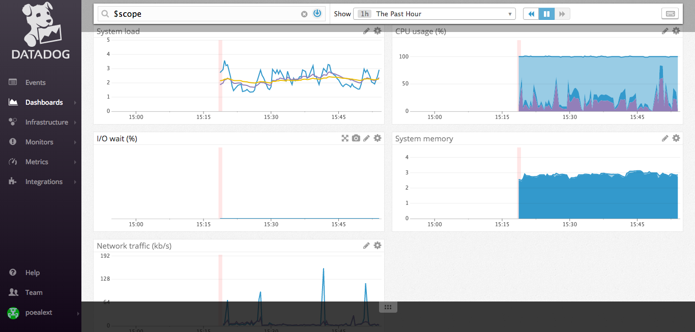
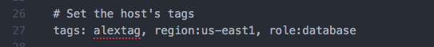
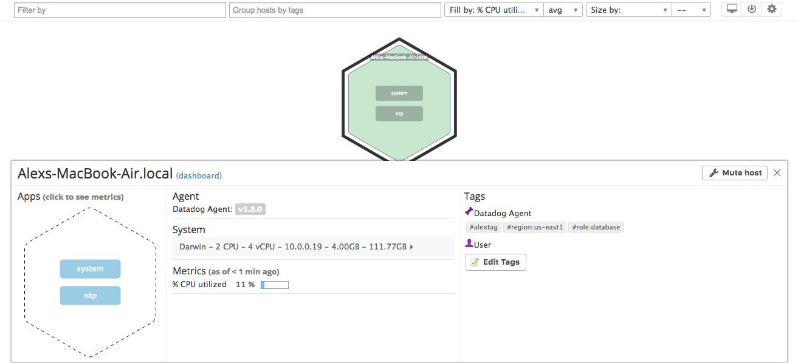
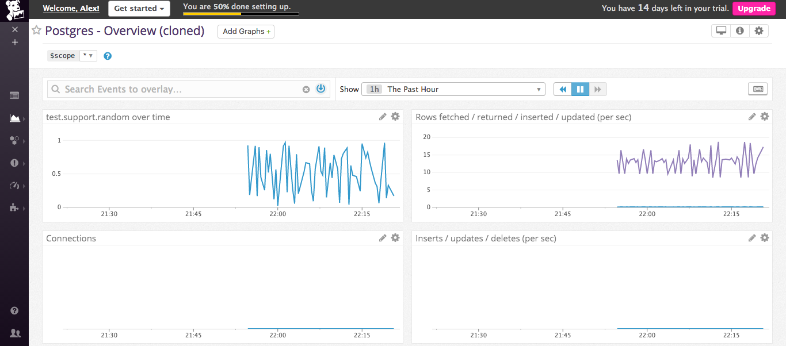
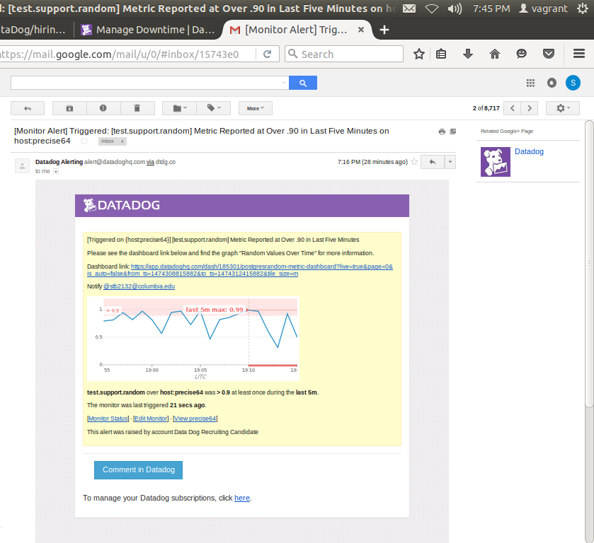
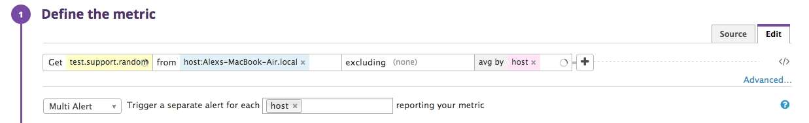
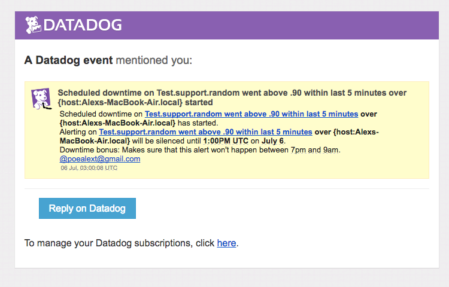

Your answers to the questions go here.


# Level 1 - Collecting your Data

## Screenshot of metrics after sign up:

  

  In order to add tags to the agent, you have to change the config file.  I removed the hash/comment symbol in front of the
  tags line.

## Bonus:  
  The Agent is software that runs on the user's hosts.  The Agent collects, organizes, and forwards the events and metrics
  to Datadog so that the user can use Datadog to create useful monitoring tools and comparisons.  The Agent uses three main parts to accomplish this; 1) the collector, which runs checks and captures standard system metrics, 2) Dogstatsd, which allows the user to create and track custom metrics, and 3) the forwarder, which retrieves the data from both the collector and Dogstatsd and sends the data to Datadog.  All of this is controlled by one supervisor process.

## Screenshot of config file:
  

## Screenshot of tags in Host Map:
  

## Agent Check
  The Agent check is as follows:

  ```python
  from checks import AgentCheck
  import random
  class RandomCheck(AgentCheck):
      def check(self, instance):
          self.gauge('test.support.random', random.random())
  ```

  The random number is generated in the second argument of self.gauge.  It may be clearer to bring the random number out into a variable, but here I decided that the increase in clarity would have been minimal.

# Level 2 - Visualizing your Data

## Screenshot of PostgreSQL Dashboard:


## Bonus:
  The big picture difference between TimeBoards and ScreenBoards is that the TimeBoards are generally better used to troubleshoot and find correlation.  This is because the TimeBoard lines up all graphs and charts so that it is easy to compare side by side.  The ScreenBoards are used for more of a general view of performance.  The grid is not fixed and many different widget types can be added.

## Screenshot of Snapshot with @ Notification:


# Level 3 - Alerting on your Data

## Screenshot of Monitor Email Alert:


## Bonus:
  Screenshot of the multi-host:
  

## Bonus:
  Screenshot of scheduled downtime:
  
