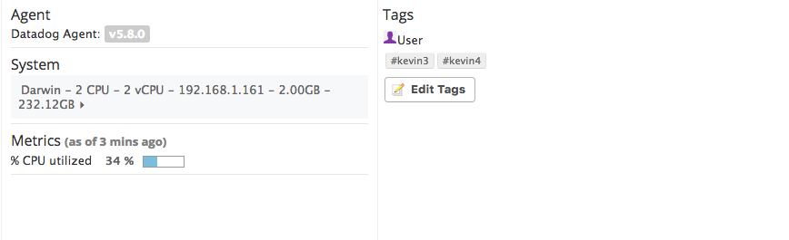
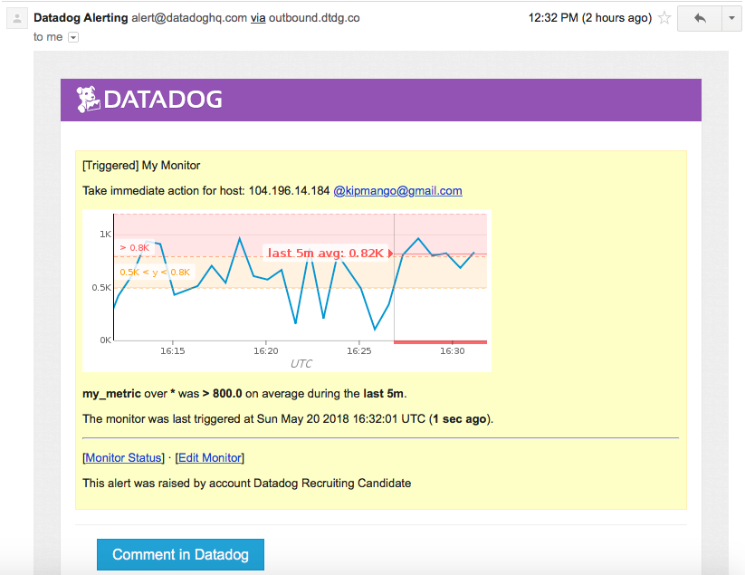
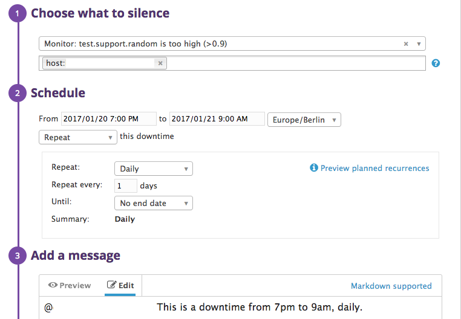
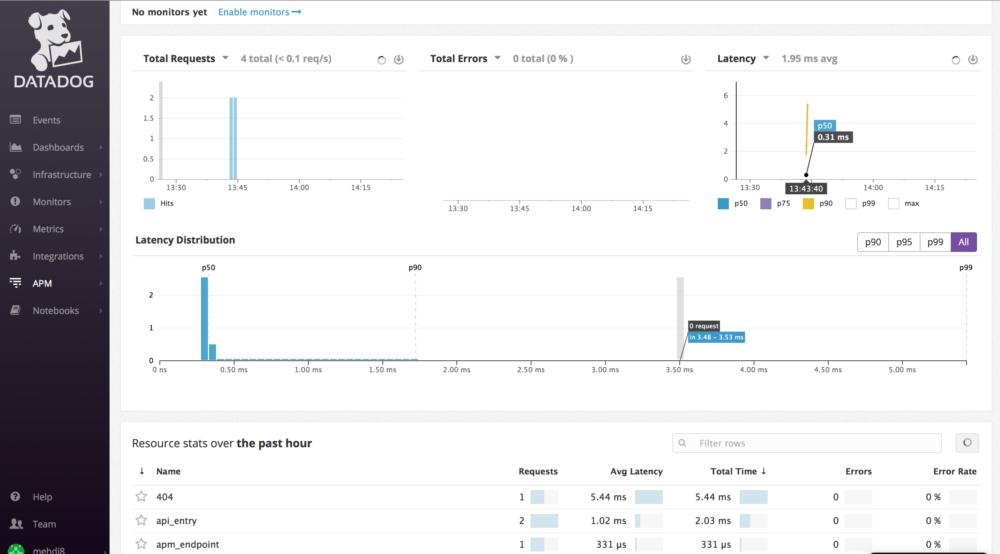

Your answers to the questions go here.
## Prerequisites - Setup the environment

The following procedure was followed to install a Ubuntu 20.04 environment using Vagrant and to connect to it over SSH:

```
vagrant init ubuntu/focal64
vagrant up && vagrant ssh
```

Then the environment was set-up to be used to complete the technical interview:
```
# Installing the Datadog agent

DD_AGENT_MAJOR_VERSION=7 DD_API_KEY=d3b887843aa784abe42b47e2a18cf28b DD_SITE="datadoghq.eu" bash -c "$(curl -L https://s3.amazonaws.com/dd-agent/scripts/install_script.sh)"

# Installing the required binaries
sudo apt update
sudo apt install python3-pip
sudo apt install mysql-server

# configuring mysql
sudo mysql_secure_installation

# Installing the required Python packages
pip3 install cython
pip3 install ddtrace
pip3 install flask
```

## Collecting Metrics

Adding the relevant tags was made by un-commenting and filling the `tags:` section of the file `/etc/datadog-agent/datadog.yaml`:

```
tags:
  - environment:dev
  - machine:vm.vagrant
  - role:demonstrator
  - service:flask_app
#  - <TAG_KEY>:<TAG_VALUE>

## @param env - string - optional
## @env DD_ENV - string - optional
## The environment name where the agent is running. Attached in-app to every
## metric, event, log, trace, and service check emitted by this Agent.
#
env: dev
```

**Add tags in the Agent config file and show us a screenshot of your host and its tags on the Host Map page in Datadog.**



*Install a database on your machine (MongoDB, MySQL, or PostgreSQL) and then install the respective Datadog integration for that database.*
The mysql DB has been previously installed. The following procedure has been followed to setup the integration with Datadog:
```
sudo mysql
> CREATE USER 'datadog'@'localhost' IDENTIFIED WITH mysql_native_password by '<password>';

mysql -u datadog --password=<password> -e "show status" | \
grep Uptime && echo -e "\033[0;32mMySQL user - OK\033[0m" || \
echo -e "\033[0;31mCannot connect to MySQL\033[0m"

mysql -u datadog --password=<password> -e "show slave status" && \
echo -e "\033[0;32mMySQL grant - OK\033[0m" || \
echo -e "\033[0;31mMissing REPLICATION CLIENT grant\033[0m"

sudo mysql
> GRANT REPLICATION CLIENT ON *.* TO 'datadog'@'localhost' WITH MAX_USER_CONNECTIONS 5;
/ OR /
> GRANT PROCESS ON *.* TO 'datadog'@'localhost';
> ALTER USER 'datadog'@'localhost' WITH MAX_USER_CONNECTIONS 5;

sudo mysql
> GRANT SELECT ON performance_schema.* TO 'datadog'@'localhost';
```
**Create a custom Agent check that submits a metric named my_metric with a random value between 0 and 1000.**
This was done by, in addition to creating the minimal configuration in `/etc/datadog-agent/conf.d/my_metric.yaml`, adding the following file in `/etc/datadog-agent/checks.d/my_metric.py`:
```python
try:
    # first, try to import the base class from new versions of the Agent...
    from datadog_checks.base import AgentCheck
except ImportError:
    # ...if the above failed, the check is running in Agent version < 6.6.0
    from checks import AgentCheck

import random as rd
# content of the special variable __version__ will be shown in the Agent status page
__version__ = "1.0.0"
class RandomCheck(AgentCheck):
    def check(self, instance):
        self.gauge('my_metric', rd.randint(0,1001))
```

**Can you change the collection interval without modifying the Python check file you created?**
Yes, it can be done by specifying it in the YAML configuration file in `/etc/datadog-agent/conf.d/my_metric.yaml`:

```
init_config:

instances:
        - min_collection_interval: 45
```

## Visualizing Data
**Please be sure, when submitting your hiring challenge, to include the script that you've used to create this Timeboard.**
The script, also present in the file `timeboard.sh`, is made using curl:

```
curl -X POST "https://api.datadoghq.eu/api/v1/dashboard" \
-H "Content-Type: application/json" \
-H "DD-API-KEY: ${DD_API_KEY}" \
-H "DD-APPLICATION-KEY: ${DD_APP_KEY}" \
-d @- << EOF
{"title":"Timeboard",
"description":"",
"widgets":[
    {"definition":{
        "title":"my_metric",
        "title_size":"16",
        "title_align":"left",
        "show_legend":true,
        "legend_layout":"auto",
        "legend_columns":["avg","min","max","value","sum"],
        "time":{},
        "type":"timeseries",
        "requests":[{"formulas":[{"formula":"query1"}],
        "queries":[{"query":"avg:my_metric{*} by {host}","data_source":"metrics","name":"query1"}],
        "response_format":"timeseries",
        "style":{"palette":"dog_classic","line_type":"solid","line_width":"normal"},"display_type":"line"}],
        "yaxis":{"include_zero":true,"scale":"linear","label":"","min":"auto","max":"auto"},
        "markers":[]
        }
    },
    {"definition":
        {
        "title":"mysql_anomalies",
        "title_size":"16",
        "title_align":"left",
        "show_legend":true,
        "legend_layout":"auto",
        "legend_columns":["avg","min","max","value","sum"],
        "time":{},
        "type":"timeseries",
        "requests":[
            {
                "formulas":[{"formula":"anomalies(query1, 'basic', 2)"}],
                "queries":[{"data_source":"metrics","name":"query1","query":"avg:mysql.net.connections{*}"}],
                "response_format":"timeseries",
                "on_right_yaxis":false,
                "style":{"palette":"dog_classic","line_type":"solid","line_width":"normal"},"display_type":"line"}
        ],
        "yaxis":{"scale":"linear","include_zero":true,"label":"","min":"auto","max":"auto"},
        "markers":[]
        }
    },
    {"definition":{"title":"my_metric_rollup","title_size":"16",
        "title_align":"left",
        "show_legend":true,
        "legend_layout":"auto",
        "legend_columns":["avg","min","max","value","sum"],
        "time":{},
        "type":"timeseries",
        "requests":[{"formulas":[{"formula":"query1"}],
        "queries":[{"data_source":"metrics","name":"query1","query":"avg:my_metric{*}.rollup(sum, 3600)"}],
        "response_format":"timeseries",
        "style":{"palette":"dog_classic","line_type":"solid","line_width":"normal"},"display_type":"line"}],
        "yaxis":{"scale":"linear","include_zero":true,"label":"","min":"auto","max":"auto"},
        "markers":[]
        }
    }
],
"template_variables":[],
"layout_type":"ordered",
"is_read_only":false,
"notify_list":[],
"reflow_type":"auto"
}
EOF
```

## Monitoring Data
**What is the Anomaly graph displaying?**
The anomaly graph is displaying a confidence interval indicating the expected range in which a data is considered generated by the process monitored in its "normal" mode.

**When this monitor sends you an email notification, take a screenshot of the email that it sends you.**


**Make sure that your email is notified when you schedule the downtime and take a screenshot of that notification.**
Here is the frequency rule used to manage downtime during the weekdays: ```FREQ=DAILY;INTERVAL=1;BYDAY=MO,TU,WE,TH,FR```.

Here is the one used to manage downtime during the week-end: ```FREQ=WEEKLY;INTERVAL=1;BYDAY=SA,SU```


**What is the difference between a Service and a Resource?**
A service is a building block of a micro-service: it groups together endpoints, queries, or jobs. A resource represent a particular domain of a customer application and typically is an instrumented web endpoint, database query, or background job.

**Provide a link and a screenshot of a Dashboard with both APM and Infrastructure Metrics.**
The screenshot:


The link=
https://p.datadoghq.eu/sb/449c0ec0-3668-11ec-bc8d-da7ad0900005-3b82b9568b11fdb00598c8c366f011a8

**Please include your fully instrumented app in your submission, as well.**
The script used to launch the instrumented app, also present in the file ```init_APM.sh```, is
```
DD_SERVICE="Flask_App" DD_ENV="dev" DD_LOGS_INJECTION=true DD_TRACE_SAMPLE_RATE="1" DD_TRACE_ENABLED=true DD_PROFILING_ENABLED=true DD_RUNTIME_METRICS_ENABLED=true ddtrace-run python3 APM.py
```

The Python app used is the one provided, also present in the file `APM.py`:
```python
from flask import Flask
import logging
import sys

# Have flask use stdout as the logger
main_logger = logging.getLogger()
main_logger.setLevel(logging.DEBUG)
c = logging.StreamHandler(sys.stdout)
formatter = logging.Formatter('%(asctime)s - %(name)s - %(levelname)s - %(message)s')
c.setFormatter(formatter)
main_logger.addHandler(c)

app = Flask(__name__)

@app.route('/')
def api_entry():
    return 'Entrypoint to the Application'

@app.route('/api/apm')
def apm_endpoint():
    return 'Getting APM Started'

@app.route('/api/trace')
def trace_endpoint():
    return 'Posting Traces'

if __name__ == '__main__':
    app.run(host='0.0.0.0', port='5050')
```

Here is the content put in the configuration file `/etc/datadog-agent/conf.d/process.d/conf.yaml`, to be sure the APM would sync with the infrastructure metrics:
```
init_config:

## Every instance is scheduled independent of the others.
#
instances:
    - name: mysql
      search_string: ["mysql"]
      exact_match: false
      service: mysql
    - name: flask_app
      search_string: ["flask_app"]
      exact_match: false
      service: flask_app
```


**Datadog has been used in a lot of creative ways in the past. We’ve written some blog posts about using Datadog to monitor the NYC Subway System, Pokemon Go, and even office restroom availability!
Is there anything creative you would use Datadog for?**

Datadog could be to monitor some connected utilities like enterprise coffee machines across offices. It would allow to monitor in live their usages and their current status and thus a more efficient management. 
