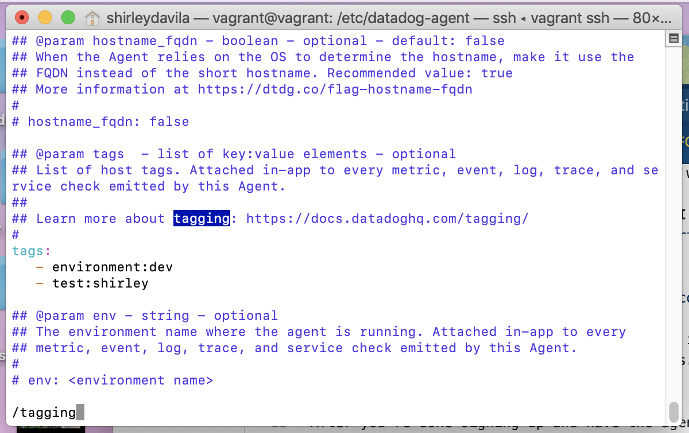
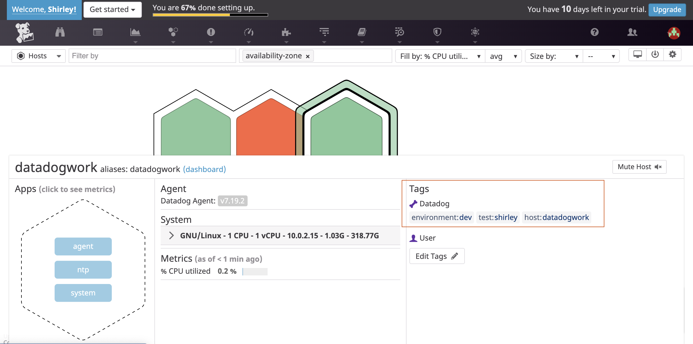
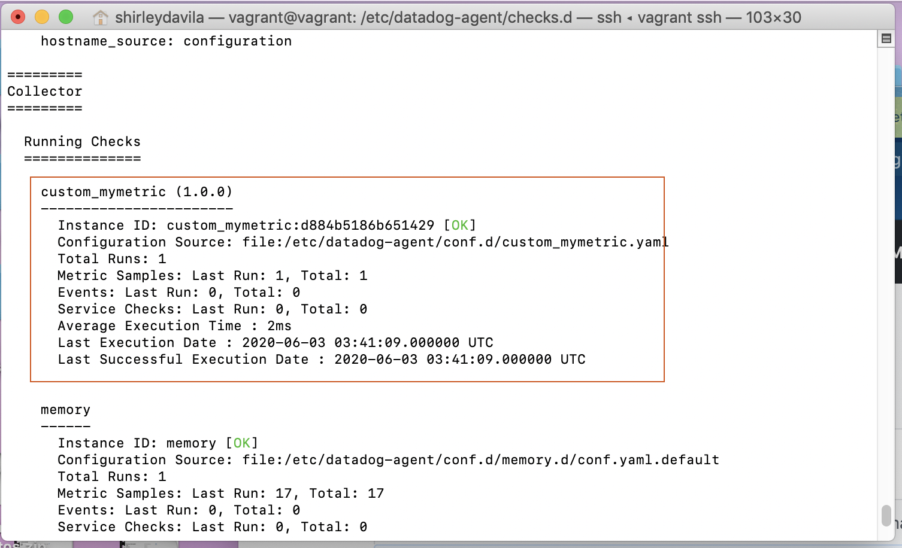
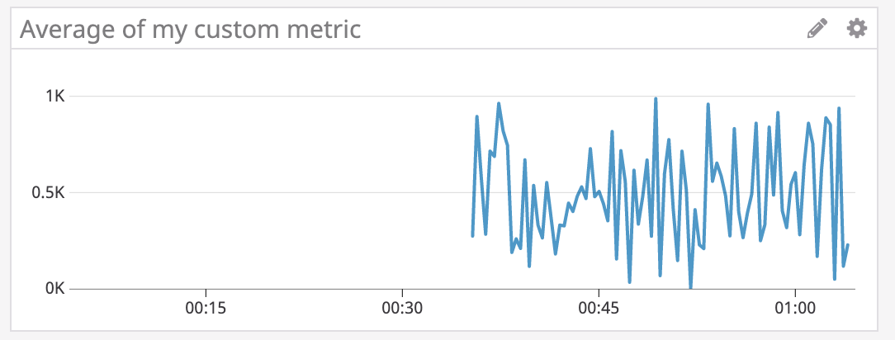
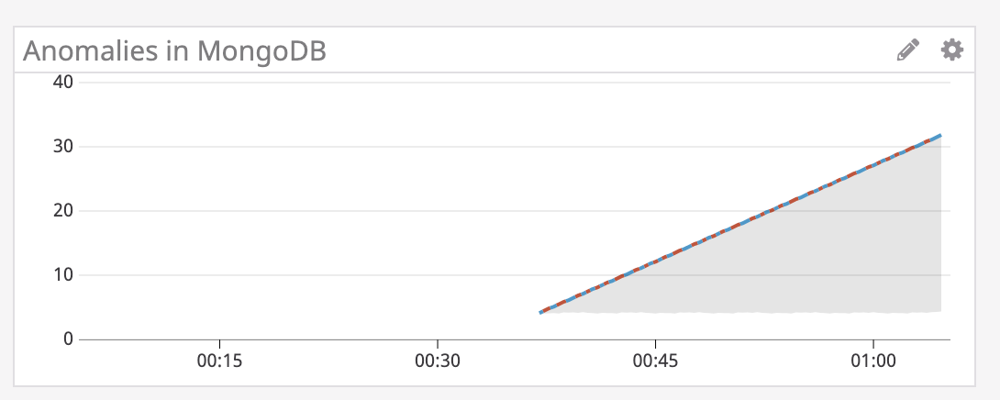
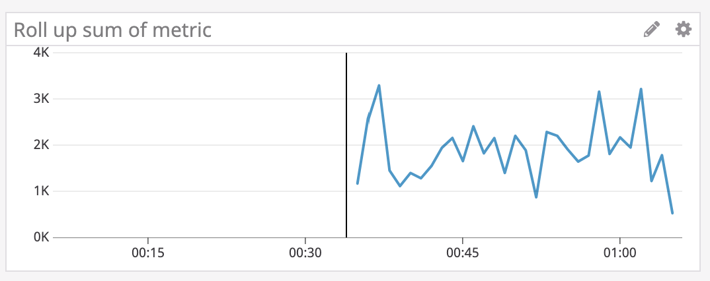
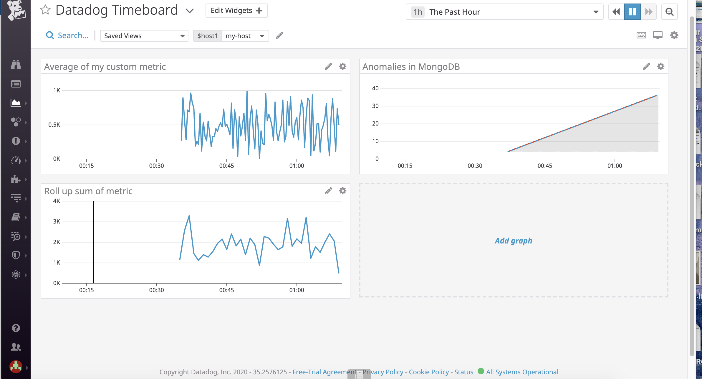
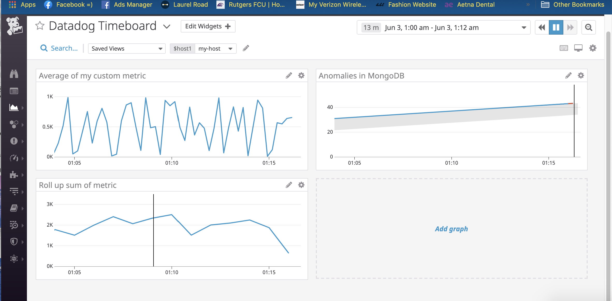

# A Hands-on Introduction to Datadog!
## About Datadog
If you've never heard or used the Datadog monitoring tool, this is a great exercise for you to tackle. 
In this tutorial, I will spin up a VM, sign up for Datadog, and begin using their tools. 

## Setting up your environment
You can utilize any OS/host that you would like to complete this exercise. However, the Datadog team has recommend one of the following approaches:
  * You can spin up a fresh linux VM via Vagrant or other tools so that you don’t run into any OS or dependency issues.
  * You can utilize a Containerized approach with Docker for Linux and our dockerized Datadog Agent image.

#### I decided to spin up a VM via Vagrant. I followed the instructions from [here.](https://www.vagrantup.com/intro/getting-started)

## Signing up for Datadog
Sign up for [Datadog](https://www.datadoghq.com/) (use “Datadog Recruiting Candidate” in the “Company” field), get the Agent reporting metrics from your local machine.
Once you sign up, you'll follow the steps to install the Datadog agent on your machine. In this case since I'm using Vagrant I'm following the CentOS/Red Hat instructions. 

## Let's collect some metrics
After you're done signing up and have the agent installed. You will now go to the Datadog Infrastructure/[Host Map page.](https://docs.datadoghq.com/infrastructure/hostmap/) 
Here you are able to see your hosts!

1. Now that we have all that set up. Let's add some tags in the Agent config file (/etc/datadog-agent/datadog.yaml) and make sure the tags appear on the Host Map page in Datadog app. I also went ahead and changed my hostname in the same file to "datadogwork". 

2. Now the next step is to install a database on your machine (MongoDB, MySQL, or PostgreSQL) and then install the respective Datadog integration for that database! I decided to go with MongoDB.
  * I first installed MongoDB on my box using the instructions [here](https://docs.mongodb.com/manual/tutorial/install-mongodb-on-ubuntu/)
  * I then followed the [instructions](https://docs.datadoghq.com/integrations/mongo/) 
  * I went to the integrations page on the Datadog app and searched for Mongodb
  * I followed the instructions, created a new user in Mongodb and made a [conf file](mongodb_conf.yaml)
  * After I made all these changes I restarted the agent: sudo service datadog-agent restart

3. After you're done setting up your database. It's time to do some work! 
* Let's create a custom Agent check that submits a metric named my_metric with a random value between 0 and 1000. 
We can use this [guide](https://docs.datadoghq.com/developers/write_agent_check/?tab=agentv6v7) to create our new agent.
The first step is to create our two files (make sure the two have the same name)!
    * [conf.d/custom_mymetric.yaml](custom_mymetric.yaml)
    * [checks.d/custom_mymetric.yaml](custom_mymetric.py)
    
* Now let's change your check's collection interval so that it only submits the metric once every 45 seconds. 
    * I imported threading/timer and made changes to my python script [custom_mymetric_45sec.py](custom_mymetric_45sec.py)
* Bonus Round - Let's change the collection interval without modifying the Python check file we created. 
    * In order to change the collection interval without modifying the python file you have to [update the custom_mymetric.yaml file](custom_mymetric_45sec.yaml)

In order to check if your metric is working - you can enter "sudo service datadog-agent status".

### WOOHOO! We are done with that section! Now on to the next one!! 

## Let's actually see some data! 

Let's utilize the Datadog API to create a Timeboard that contains:

1. Your [custom metric scoped over your host](custom_metricavghost.py) python script
You can check if your board was created if you check the Dashboard List on the Datadog App. 

2. Any metric from the Integration on your Database (I used [the documentation for MongoDB](https://docs.datadoghq.com/integrations/mongo/)) with the anomaly function applied.

3. Your custom metric with the rollup function applied to sum up all the points for the past hour into one bucket
Please be sure, when submitting your hiring challenge, to include the script that you've used to create this Timeboard.

4. The whole time board script is [here](TheWholeTimeboard.py)

Once this is created, access the Dashboard from your Dashboard List in the UI:

Set the Timeboard's timeframe to the past 5 minutes

Take a snapshot of this graph and use the @ notation to send it to yourself.
Bonus Question: What is the Anomaly graph displaying?
