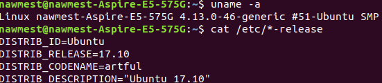
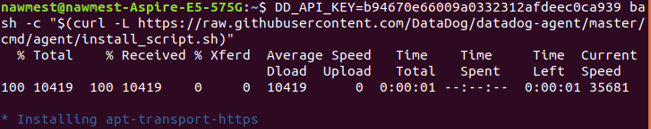

# Nawfel Mestoui - DataDog Technical Test

## Prerequisites - Setup the environment
I am using my current OS, Ubuntu 17.10 to complete this exercise.
</img>
### Installing Datadog agent
After sign in to Datadog, I did <a href="https://app.datadoghq.com/account/settings#agent/ubuntu">install Datadog agent</a> for Ubuntu:
</img>

## Collecting Metrics:

### Add tags in the Agent config file
