Your answers to the questions go here.

## Prerequisites - Setup the environment
My environment for this exercise is below :
  Vagrant Ubuntu VM 16.04 (xenial)
  Docker (Ubuntu 16.04), MySQL on the Vagrant

## Collecting Metrics:

* Add tags in the Agent config file and show us a screenshot of your host and its tags on the Host Map page in Datadog.
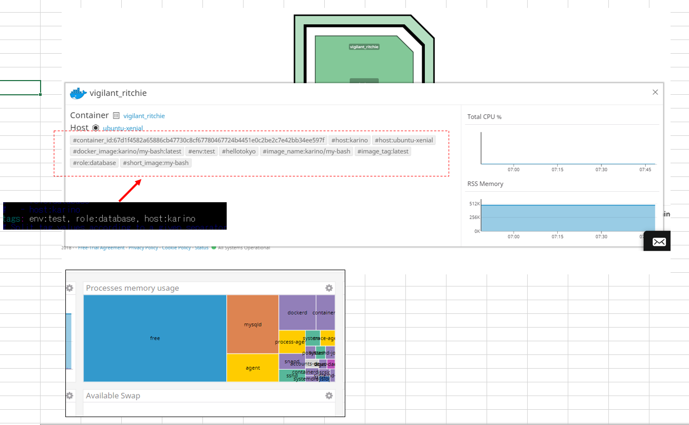

* Install a database on your machine (MongoDB, MySQL, or PostgreSQL) and then install the respective Datadog integration for that database.

### Following is the steps from installing MySQL to installing & confirming Datadog integration. (Karino)
### Install MySQL
>sudo apt-get update
>sudo apt-get install mysql-server

After MySQL is installed, take following steps on Dashboard.  
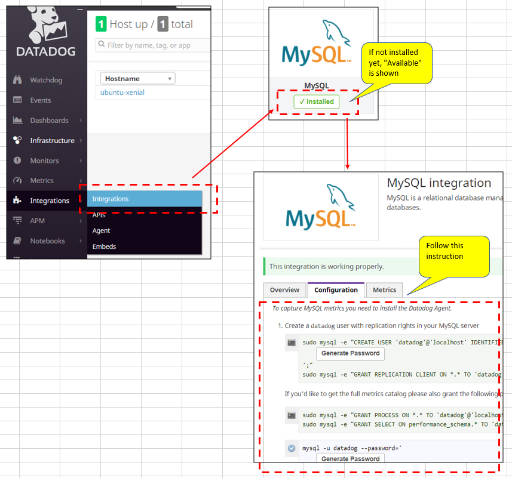

Then give commands shown on Dashboards step by step.

### Create a datadog user in MySQL  
>sudo mysql -e "CREATE USER 'datadog'@'localhost' IDENTIFIED BY 'nl7ZchKVbXCEHux(MXG5LbkF';"  
>sudo mysql -e "GRANT REPLICATION CLIENT ON *.* TO 'datadog'@'localhost' WITH MAX_USER_CONNECTIONS 5;"  
>sudo mysql -e "GRANT PROCESS ON *.* TO 'datadog'@'localhost';"  
>sudo mysql -e "GRANT SELECT ON performance_schema.* TO 'datadog'@'localhost';"  

### Verification
>mysql -u datadog --password='nl7ZchKVbXCEHux(MXG5LbkF' -e "show status" | \
grep Uptime && echo -e "\033[0;32mMySQL user - OK\033[0m" || \
echo -e "\033[0;31mCannot connect to MySQL\033[0m"
mysql -u datadog --password='nl7ZchKVbXCEHux(MXG5LbkF' -e "show slave status" && \
echo -e "\033[0;32mMySQL grant - OK\033[0m" || \
echo -e "\033[0;31mMissing REPLICATION CLIENT grant\033[0m"  

You can see as below when it is successful.
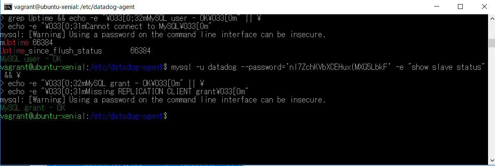

>mysql -u datadog --password='nl7ZchKVbXCEHux(MXG5LbkF' -e "SELECT * FROM performance_schema.threads" && \
echo -e "\033[0;32mMySQL SELECT grant - OK\033[0m" || \
echo -e "\033[0;31mMissing SELECT grant\033[0m"
mysql -u datadog --password='nl7ZchKVbXCEHux(MXG5LbkF' -e "SELECT * FROM INFORMATION_SCHEMA.PROCESSLIST" && \
echo -e "\033[0;32mMySQL PROCESS grant - OK\033[0m" || \
echo -e "\033[0;31mMissing PROCESS grant\033[0m"  

You can see as below when it is successful.  
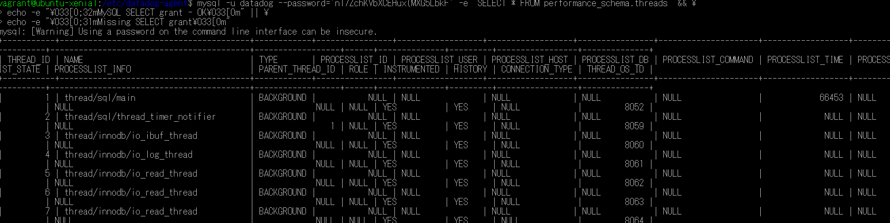

### Configure the Agent to connect to MySQL
1) create config file  
>cd /etc/datadog-agent  
>sudo vi conf.d/mysql.yaml  

>---------------------------------
>init_config:
>
>instances:
>     - server: localhost
>       user: datadog
>       pass: nl7ZchKVbXCEHux(MXG5LbkF
>       tags:
>         - optional_tag1
>         - optional_tag2
>    options:
>      replication: 0
>      galera_cluster: 1
>---------------------------------

2) Restart the Agent
>   sudo systemctl stop datadog-agent
>   sudo systemctl start datadog-agent

3) Confirm Agent status
>  sudo datadog-agent status | grep 'mysql'

You can see as below when it is successful.
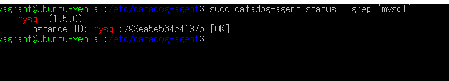

* Create a custom Agent check that submits a metric named my_metric with a random value between 0 and 1000.
### This is "my_metric" on Metric Explore.  
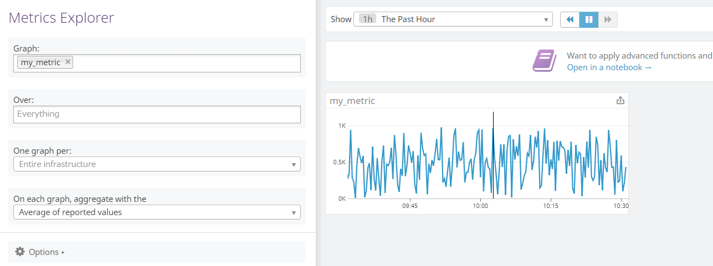

To create custom Agent Check, I prepared two files
  1) /etc/datadog-agent/checks.d/my_custom_check.py
  2) /etc/datadog-agent/conf.d/my_custom_check.yaml
>/etc/datadog-agent/checks.d/my_custom_check.py
>-----------------------------------------------
> from checks import AgentCheck
> from random import *
> class HelloCheck(AgentCheck):
>    　 def check(self, instance):
>     　 self.gauge('my_metric', randint(0,1000))
>-----------------------------------------------
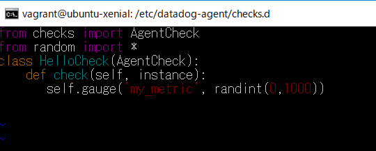

* Change your check's collection interval so that it only submits the metric once every 45 seconds.
>/etc/datadog-agent/conf.d/my_custom_check.yaml
> -----------------------------------------------
>init_config:
>
>instances:
> - min_collection_interval: 45
>-----------------------------------------------

* **Bonus Question** Can you change the collection interval without modifying the Python check file you created?  
How about changing flush interval?  
https://docs.datadoghq.com/developers/faq/data-aggregation-with-dogstatsd-threadstats/

## Visualizing Data:
* Utilize the Datadog API to create a Timeboard that contains:

* Your custom metric scoped over your host.
* Any metric from the Integration on your Database with the anomaly function applied.
* Your custom metric with the rollup function applied to sum up all the points for the past hour into one bucket
* Please be sure, when submitting your hiring challenge, to include the script that you've used to create this Timeboard.  
<a href="api_a.py">--> This is the link for source code</a>

* Once this is created, access the Dashboard from your Dashboard List in the UI:  
I've created "My_Dashboard_1".  
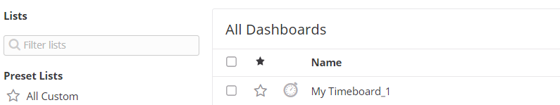
----------------------------------------------------------
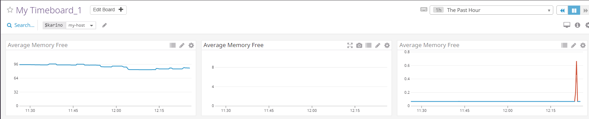  

* Set the Timeboard's timeframe to the past 5 minutes  
Take a snapshot of this graph and use the @ notation to send it to yourself.     
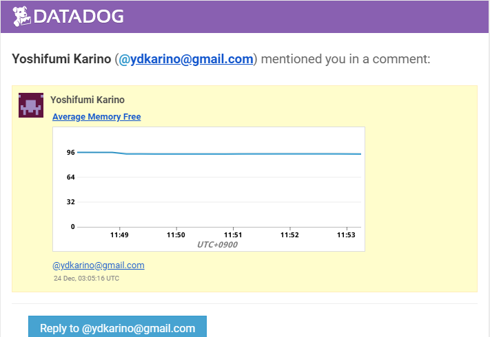

* **Bonus Question**  What is the Anomaly graph displaying?  
Anomaly graph displays data that is different from regular one with comparing the data with regular values on the same time zone in past.

## Monitoring Data
Since you’ve already caught your test metric going above 800 once, you don’t want to have to continually watch this dashboard to be alerted when it goes above 800 again. So let’s make life easier by creating a monitor.

Create a new Metric Monitor that watches the average of your custom metric (my_metric) and will alert if it’s above the following values over the past 5 minutes:

* Warning threshold of 500
* Alerting threshold of 800
* And also ensure that it will notify you if there is No Data for this query over the past 10m.  

Please see this screen shot.  
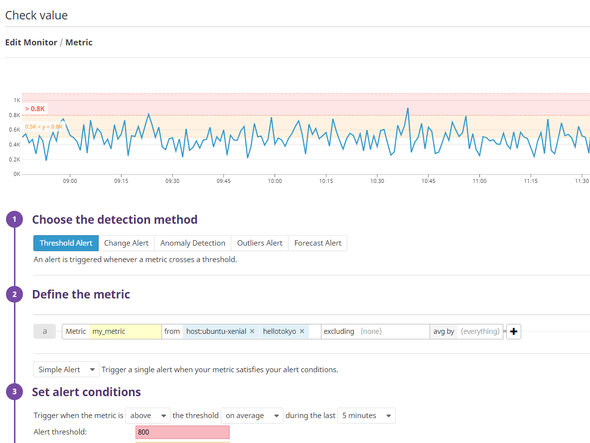

Please configure the monitor’s message so that it will:
* Send you an email whenever the monitor triggers.
* Create different messages based on whether the monitor is in an Alert, Warning, or No Data state.
* Include the metric value that caused the monitor to trigger and host ip when the Monitor triggers an Alert state.
Please see this screen shot.   
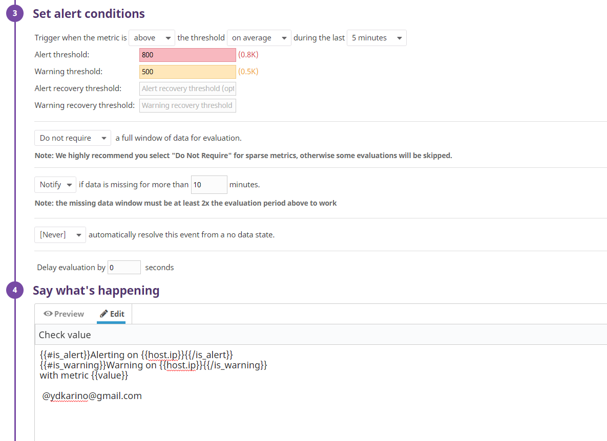

* When this monitor sends you an email notification, take a screenshot of the email that it sends you.
Please see this screen shot.   
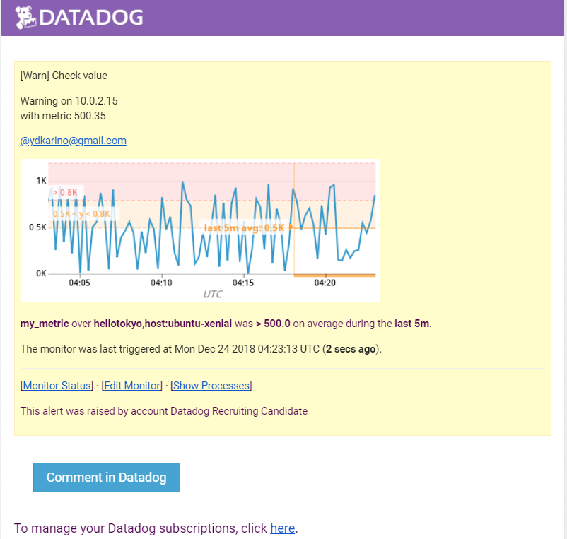

* **Bonus Question** Since this monitor is going to alert pretty often, you don’t want to be alerted when you are out of the office. Set up two scheduled downtimes for this monitor:

** One that silences it from 7pm to 9am daily on M-F,
Please see this screen shot.   
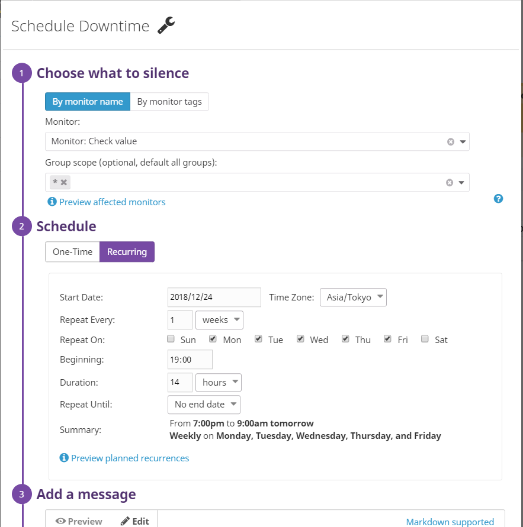
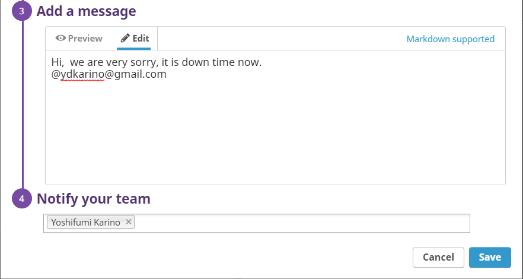

** And one that silences it all day on Sat-Sun.
Please see this screen shot.   
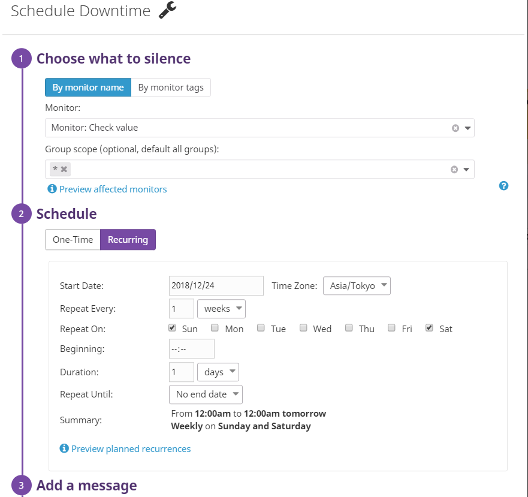
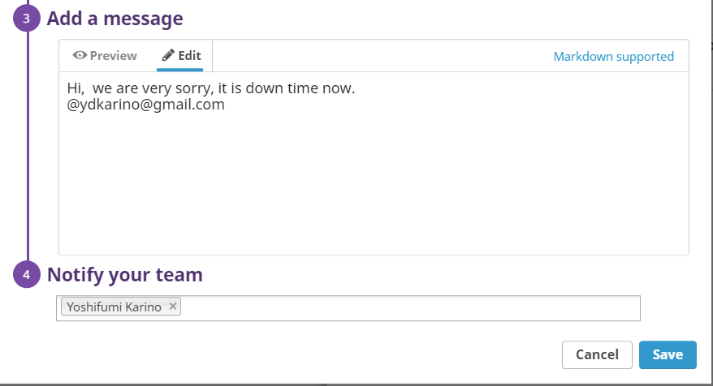

** Make sure that your email is notified when you schedule the downtime and take a screenshot of that notification.
Please see this screen shot.   
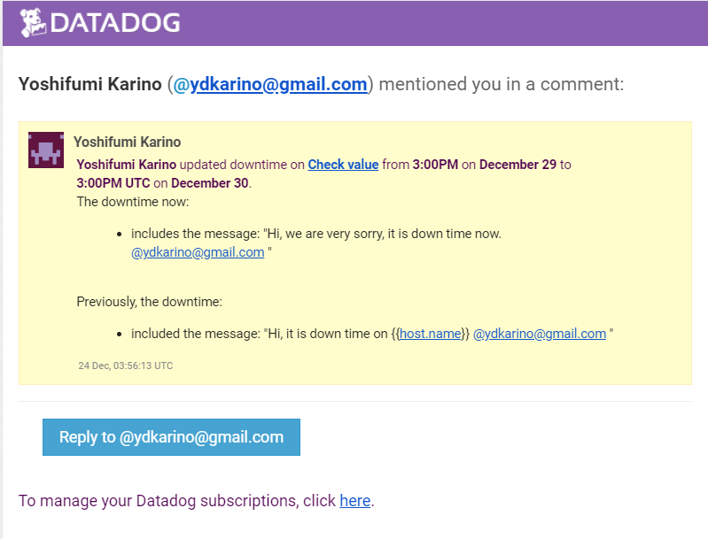
---------------------------------------------------------------------

## Collecting APM Data:
Given the following Flask app (or any Python/Ruby/Go app of your choice) instrument this using Datadog’s APM solution:

* Note: Using both ddtrace-run and manually inserting the Middleware has been known to cause issues. Please only use one or the other.

* Bonus Question: What is the difference between a Service and a Resource?  
Service is the name of a set of processes that do the same job. 
For instance, a simple web application may consist of two services: a single webapp service and a single database service

Resource is a particular query to a service. 
For a web application, some examples might be a canonical URL like /user/home or a handler function like web.user.home

* Reference: https://help.datadoghq.com/hc/en-us/articles/115000702546-What-is-the-Difference-Between-Type-Service-Resource-and-Name-

Provide a link and a screenshot of a Dashboard with both APM and Infrastructure Metrics.
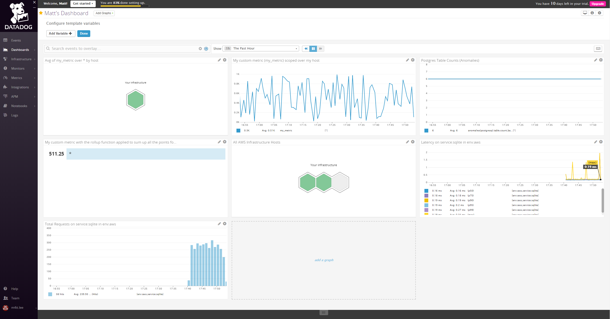
https://app.datadoghq.com/apm/traces?end=1545627553279&env=none&paused=false&start=1545022753279 

Please include your fully instrumented app in your submission, as well.

<a href="trace-demo-sqlite.py">-->This is the link of app source</a>

