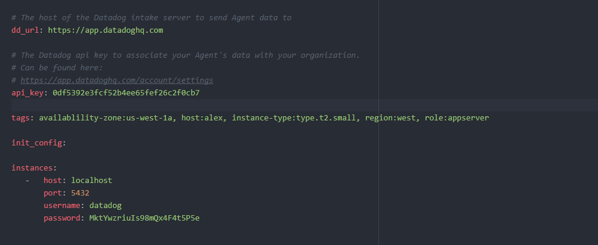
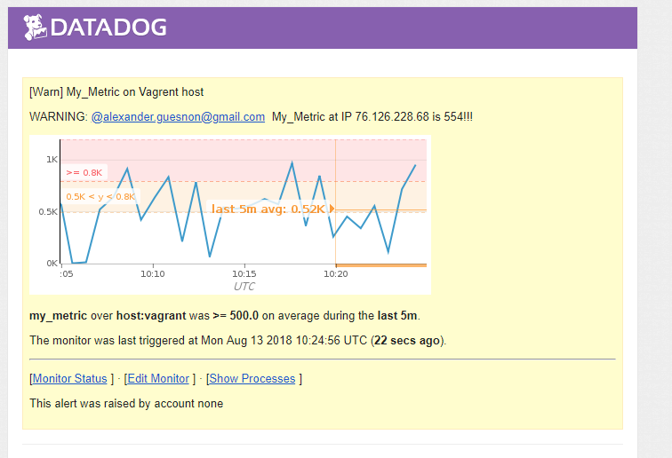

## Prerequisites - Setup the environment

You can utilize any OS/host that you would like to complete this exercise. However, we recommend one of the following approaches:

-   You can spin up a fresh linux VM via Vagrant or other tools so that you don’t run into any OS or dependency issues. [Here are instructions](https://github.com/DataDog/hiring-engineers/blob/solutions-engineer/README.md#vagrant) for setting up a Vagrant Ubuntu VM. We strongly recommend using minimum `v. 16.04` to avoid dependency issues.
-   You can utilize a Containerized approach with Docker for Linux and our dockerized Datadog Agent image.

Then, sign up for Datadog (use “Datadog Recruiting Candidate” in the “Company” field), get the Agent reporting metrics from your local machine.

### Install

Open the `hiring-engineers` file and start Vagrent with the following command

    vagrant up

Then log into the machine

    vagrant ssh

install datadog agent

    DD_API_KEY=0df5392e3fcf52b4ee65fef26c2f0cb7 bash -c "$(curl -L https://raw.githubusercontent.com/DataDog/datadog-agent/master/cmd/agent/install_script.sh)"

## Collecting Metrics:

-   Add tags in the Agent config file and show us a screenshot of your host and its tags on the Host Map page in Datadog.

Install tags and other stuff in agent config file




    cp datadog.yaml /etc/datadog-agent/datadog.yaml

Then restart the agent

    	sudo service datadog-agent restart

-   Install a database on your machine (MongoDB, MySQL, or PostgreSQL) and then install the respective Datadog integration for that database.

installed through vagrant and Datadog plugins

install database:

plugin:

Articles:

-   Create a custom Agent check that submits a metric named my_metric with a random value between 0 and 1000.

This is controlled through the `my_metric.py`

    class MyMetric(AgentCheck):
        def check(self, instance):
            self.gauge('my_metric', random.randint(0, 1000)) # 0 to 1000

Article: [Custom Check Agent](https://blog.devopscomplete.com/writing-a-custom-datadog-agent-check-7367c98ffc5a)

-   Change your check's collection interval so that it only submits the metric once every 45 seconds.

This is the `my-metric.yaml` file

    init_config:
        key1: val1
        key2: val2

    instances:
        - username: vagrant
          password: 1234
          min_collection_interval: 45 // <- this will tell to loop every 45s

Article: [Check Agent](https://docs.datadoghq.com/developers/agent_checks/)

-   **Bonus Question** Can you change the collection interval without modifying the Python check file you created?

## Visualizing Data:

Utilize the Datadog API to create a Timeboard that contains:

Article: [TimeBoard](https://docs.datadoghq.com/api/?lang=python#timeboards)

-   Your custom metric scoped over your host.

Create `my_metric` graph

    {
        "definition": {
            "events": [],
            "requests": [
                {
                    "q": "avg:my_metric{*}",
                    "type": "area",
                    "style": {
                        "palette": "warm",
                        "type": "solid",
                        "width": "normal"
                    },
                    "conditional_formats": [],
                    "aggregator": "avg"
                }
            ],
            "viz": "timeseries"
        },
        "title": "My_Metric"
    },

-   Any metric from the Integration on your Database with the anomaly function applied.

Create PSQL graph in JSON

    {
    "definition": {
    		"events": [],
    		"requests": [
    				{
    						"q": "avg:postgresql.buffer_hit{*}",
    						"type": "bars",
    						"style": {
    								"palette": "dog_classic",
    								"type": "solid",
    								"width": "normal"
    						},
    						"conditional_formats": [],
    						"aggregator": "avg"
    				}
    		],
    		"viz": "timeseries"
    },
    "title": "PostgreSQL"
    },

-   Your custom metric with the rollup function applied to sum up all the points for the past hour into one bucket file


    {
    "definition": {
    		"requests": [
    				{
    						"q": "avg:my_metric{*}.rollup(avg, 3600)",
    						"type": "line",
    						"style": {
    								"palette": "purple",
    								"type": "solid",
    								"width": "thick"
    						},
    						"conditional_formats": [],
    						"aggregator": "avg"
    				}
    		],
    		"viz": "timeseries",
    		"autoscale": "true",
    		"status": "done"
    },
    "title": "My_Metric_AVG_H"
    }

Please be sure, when submitting your hiring challenge, to include the script that you've used to create this Timeboard.

    python /vagrant/DataDogAPI/DataDogAPITimeBoard.py

Once this is created, access the Dashboard from your Dashboard List in the UI:

Article: <https://docs.datadoghq.com/api/?lang=python#graph-snapshot>

Article: <https://docs.datadoghq.com/api/?lang=python#create-a-comment>

-   Set the Timeboard's timeframe to the past 5 minutes


    import time
    import json
    from datadog import initialize, api

    options = {'api_key': '0df5392e3fcf52b4ee65fef26c2f0cb7',
               'app_key': '958de7a7ae45656320a630d7de70ae4efbddac5f'}

    initialize(**options)

    # Take a graph snapshot
    end = int(time.time())
    start = end - (60 * 5) # <- 5 minute is the end
    response = api.Graph.create(

-   Take a snapshot of this graph and use the @ notation to send it to yourself.


    img = "" # snapshot url in markdown and store in img
    message = '@alexander.guesnon@gmail.com' + '\n\n' + img # send it to this email

    api.Comment.create(
         handle='alexander.guesnon@gmail.com',
        message = message
    )

Screenshot file

    python /vagrant/DataDogAPI/DataDogAPIScreenShoot.py

-   **Bonus Question**: What is the Anomaly graph displaying?

## Monitoring Data

Since you’ve already caught your test metric going above 800 once, you don’t want to have to continually watch this dashboard to be alerted when it goes above 800 again. So let’s make life easier by creating a monitor.

Article: [Monitor](https://docs.datadoghq.com/api/?lang=python#monitors)

Article: [Temp Vars](https://docs.datadoghq.com/monitors/faq/how-do-i-add-custom-template-variables-to-my-monitor-message/)

Create a new Metric Monitor that watches the average of your custom metric (my_metric) and will alert if it’s above the following values over the past 5 minutes:

-   Warning threshold of 500


    "warning": "500"

-   Alerting threshold of 800


    "critical": "800"

-   And also ensure that it will notify you if there is No Data for this query over the past 10m.


    "no_data_timeframe": "10",

Please configure the monitor’s message so that it will:

-   Send you an email whenever the monitor triggers.


    @alexander.guesnon@gmail.com @(email)

-   Create different messages based on whether the monitor is in an Alert, Warning, or No Data state.


    {{#is_alert}}{{/is_alert}}
    {{#is_warning}}{{/is_warning}}
    {{#is_no_data}}{{/is_no_data}}

-   Include the metric value that caused the monitor to trigger and host ip when the Monitor triggers an Alert state.

```
    {{host.ip}}
    {{host.name}}
```

-   When this monitor sends you an email notification, take a screenshot of the email that it sends you.



-   **Bonus Question**: Since this monitor is going to alert pretty often, you don’t want to be alerted when you are out of the office. Set up two scheduled downtimes for this monitor:

    -   One that silences it from 7pm to 9am daily on M-F,
    -   And one that silences it all day on Sat-Sun.
    -   Make sure that your email is notified when you schedule the downtime and take a screenshot of that notification.


## Collecting APM Data:

Given the following Flask app (or any Python/Ruby/Go app of your choice) instrument this using Datadog’s APM solution:

Article: [APM DataDog Docs](https://docs.datadoghq.com/tracing/)

Article: [flask DataDog APM](http://pypi.datadoghq.com/trace/docs/#flask)

```
    from flask import Flask
    import logging
    import sys

    # Have flask use stdout as the logger
    main_logger = logging.getLogger()
    main_logger.setLevel(logging.DEBUG)
    c = logging.StreamHandler(sys.stdout)
    formatter = logging.Formatter('%(asctime)s - %(name)s - %(levelname)s - %(message)s')
    c.setFormatter(formatter)
    main_logger.addHandler(c)

    app = Flask(__name__)

    @app.route('/')
    def api_entry():
        return 'Entrypoint to the Application'

    @app.route('/api/apm')
    def apm_endpoint():
        return 'Getting APM Started'

    @app.route('/api/trace')
    def trace_endpoint():
        return 'Posting Traces'

    if __name__ == '__main__':
        app.run(host='0.0.0.0', port='5050')
```
* **Note**: Using both ddtrace-run and manually inserting the Middleware has been known to cause issues. Please only use one or the other.

* **Bonus Question**: What is the difference between a Service and a Resource?

File:

```
python /vagrant/DataDogAPI/DataDogAPM.py
```

# Final Question:

Datadog has been used in a lot of creative ways in the past. We’ve written some blog posts about using Datadog to monitor the NYC Subway System, Pokemon Go, and even office restroom availability!

* Is there anything creative you would use Datadog for?

I want to collect data on parasites in standing fresh water. I want to see how conditions affect the population and patterns. Datadog would be great at aggregating data.
