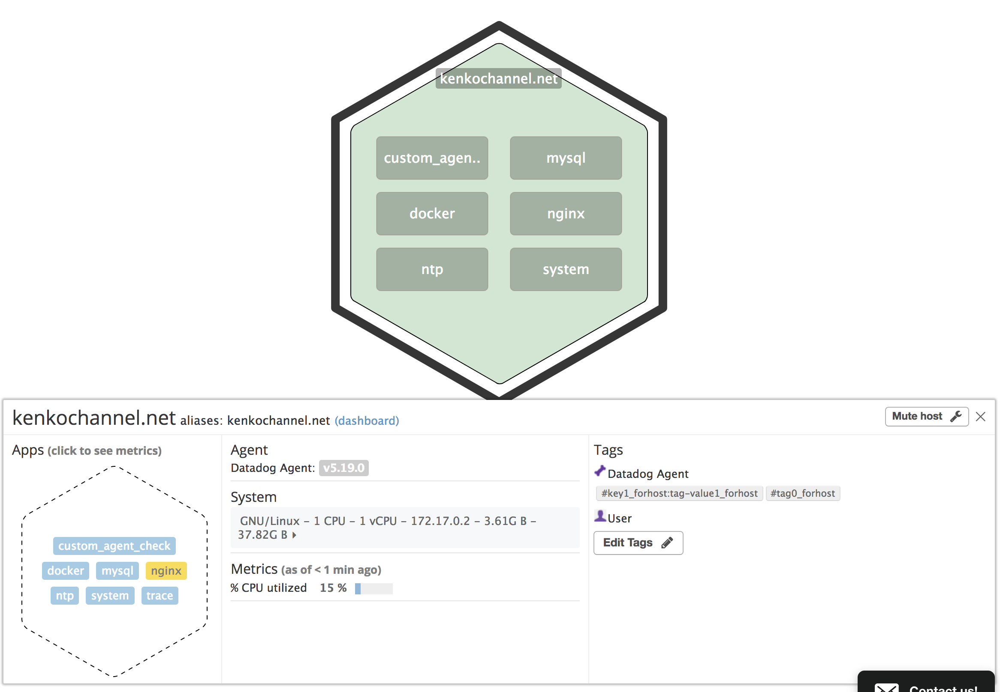
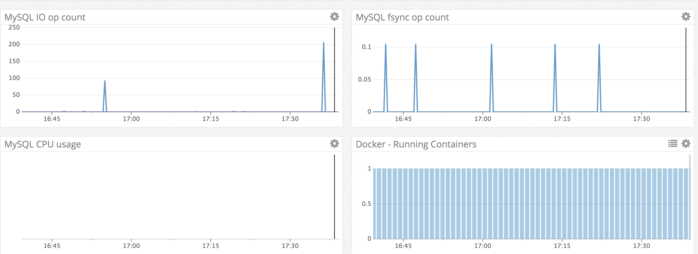
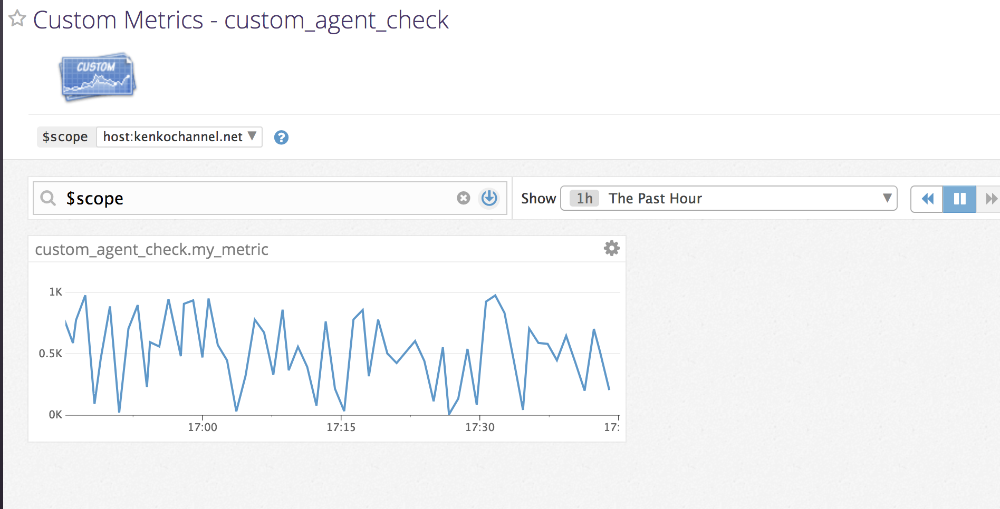
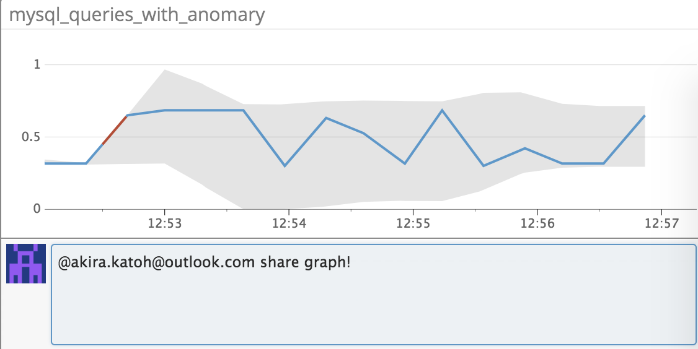
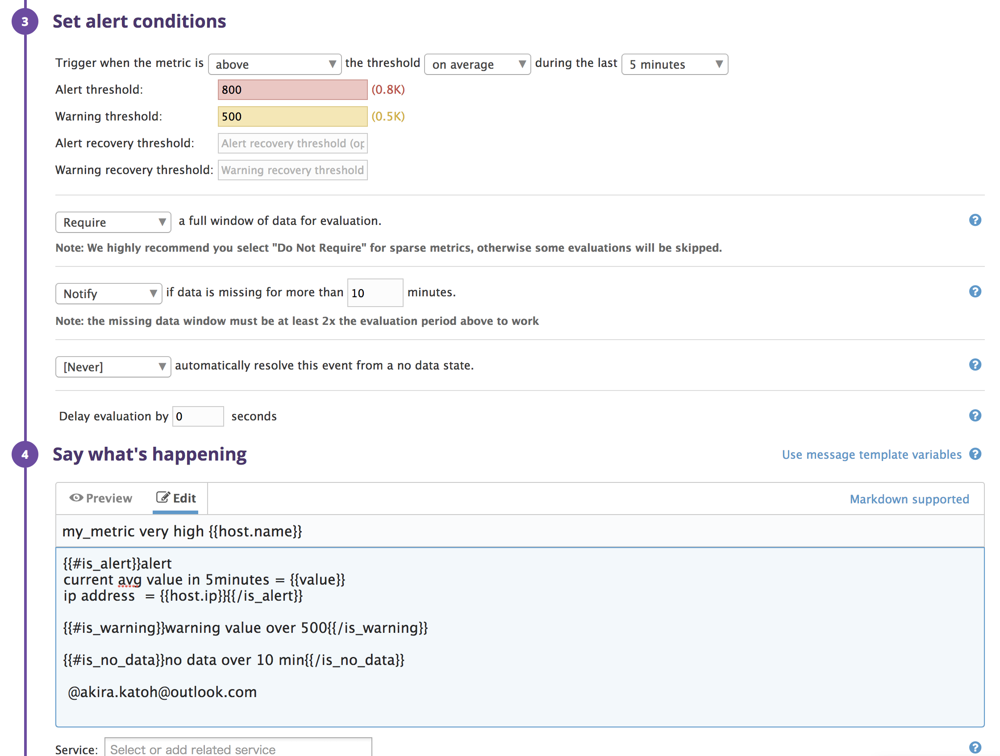
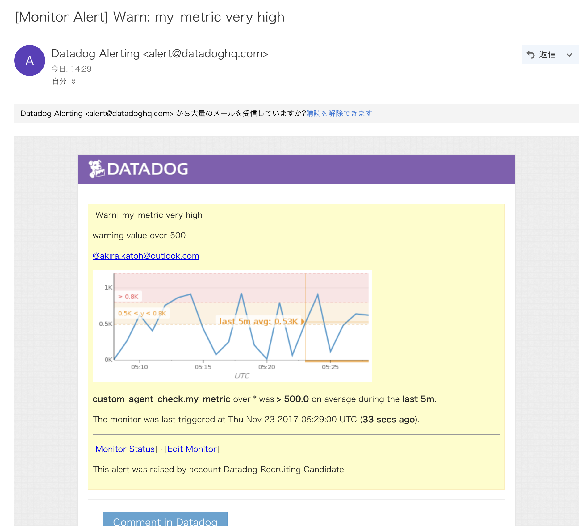
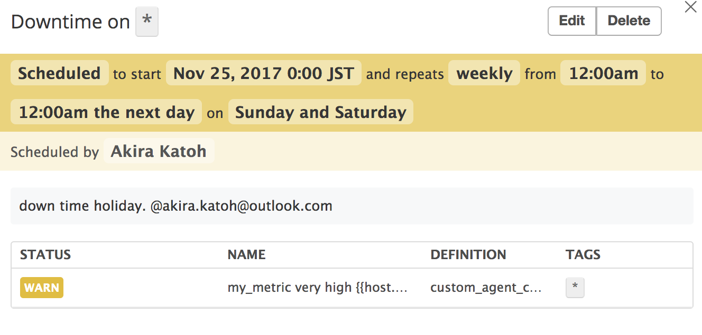
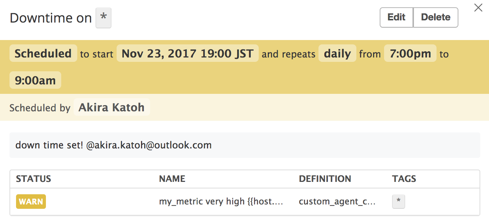
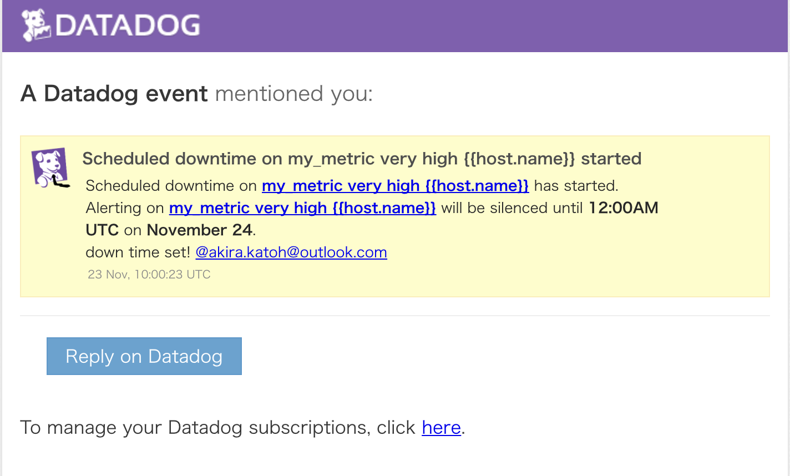
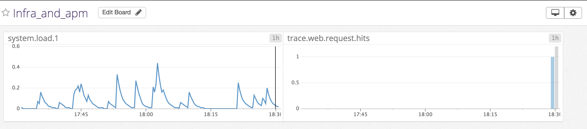

# Prerequisites - Setup the environment

centos7 with docker-dd-agent

Docker is troublesome.

By default can't connect to APM agent in docker, I need this extra setting.

/etc/dd-agent/datadog.conf

    bind_host = 172.17.0.2

# Collecting Metrics:

> Add tags in the Agent config file and show us a screenshot of your host and its tags on the Host Map page in Datadog.

> Install a database on your machine (MongoDB, MySQL, or PostgreSQL) and then install the respective Datadog integration for that database.

> Create a custom Agent check that submits a metric named my_metric with a random value between 0 and 1000.

> Change your check's collection interval so that it only submits the metric once every 45 seconds.
> Bonus Question Can you change the collection interval without modifying the Python check file you created?

/etc/dd-agent/conf.d/custom_agent_check.yaml

    init_config:
      min_collection_interval: 45
      key1: testvalue1
      key2: testvalue2

# Visualizing Data:

> Utilize the Datadog API to create a Timeboard that contains:

command(dog timeboard update post command can't create multi graphs at once?)

    docker exec dd-agent dog timeboard update 405949 "timeboardtest" "TimeBoard Add graphs" "$(cat graph3.json)"

graph3.json

        [{
        "definition": {
          "viz": "timeseries",
          "requests": [
            {
              "q": "avg:custom_agent_check.my_metric{*}",
              "conditional_formats": [],
              "type": "line"
            }
          ],
          "autoscale": true
        },
        "title": "my_metric"
      },
      {
        "definition": {
          "viz": "timeseries",
          "requests": [
            {
              "q": "anomalies(avg:mysql.performance.queries{*}, 'basic', 2)",
              "conditional_formats": [],
              "type": "line"
            }
          ],
          "autoscale": true
        },
        "title": "mysql_queries_with_anomary"
      },
      {
        "definition": {
          "viz": "timeseries",
          "requests": [
            {
              "q": "sum:custom_agent_check.my_metric{*}.rollup(sum, 3600)",
              "conditional_formats": [],
              "type": "line"
            }
          ],
          "autoscale": true
        },
        "title": "rollup3600seconds"
      }]

> Set the Timeboard's timeframe to the past 5 minutes
> Take a snapshot of this graph and use the @ notation to send it to yourself.

https://p.datadoghq.com/sb/a459e47c2-758f2a81fc

> Bonus Question: What is the Anomaly graph displaying?

Anomaly graph shows outliers in a certain time frame.

# Monitoring Data

> Warning threshold of 500
> Alerting threshold of 800
> And also ensure that it will notify you if there is No Data for this query over the past 10m.

> Send you an email whenever the monitor triggers.
> Create different messages based on whether the monitor is in an Alert, Warning, or No Data state.
> Include the metric value that caused the monitor to trigger and host ip when the Monitor triggers an Alert state.

> When this monitor sends you an email notification, take a screenshot of the email that it sends you.

> One that silences it from 7pm to 9am daily on M-F,
> And one that silences it all day on Sat-Sun.
> Make sure that your email is notified when you schedule the downtime and take a screenshot of that notification.

# Collecting APM Data:

> Provide a link and a screenshot of a Dashboard with both APM and Infrastructure Metrics.

https://p.datadoghq.com/sb/a459e47c2-9894ee5bf8

# Final Question:

> Is there anything creative you would use Datadog for?

Integrate with lifelog service like beddit.
