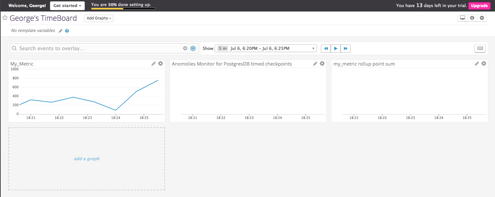
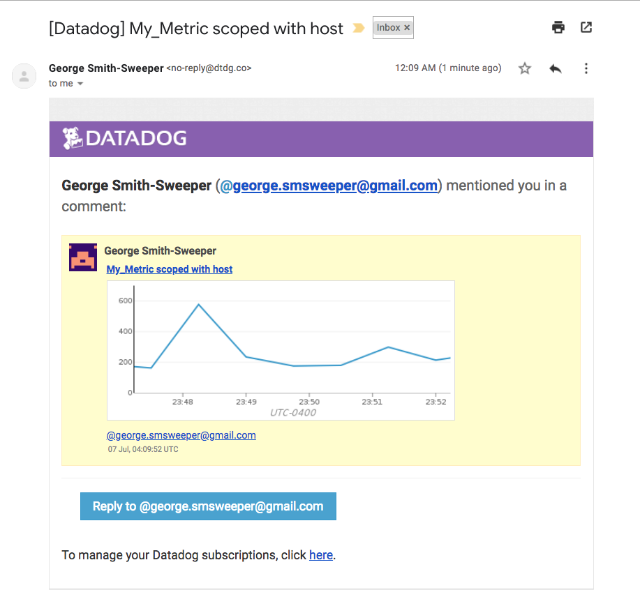
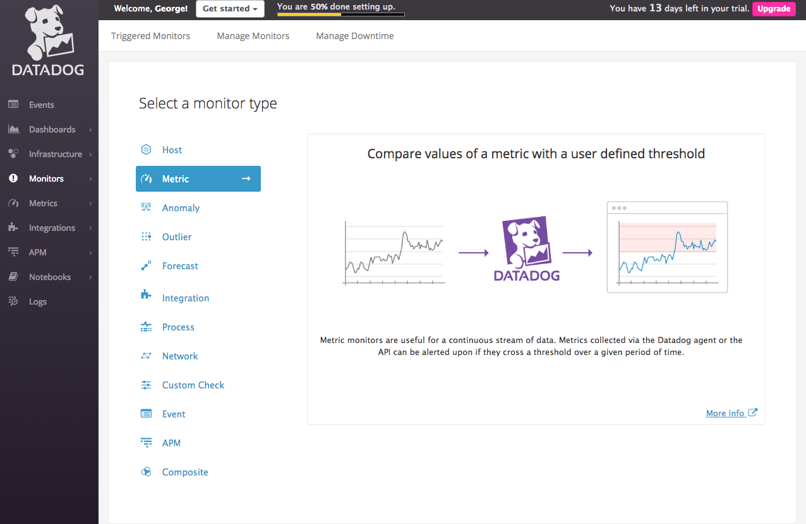
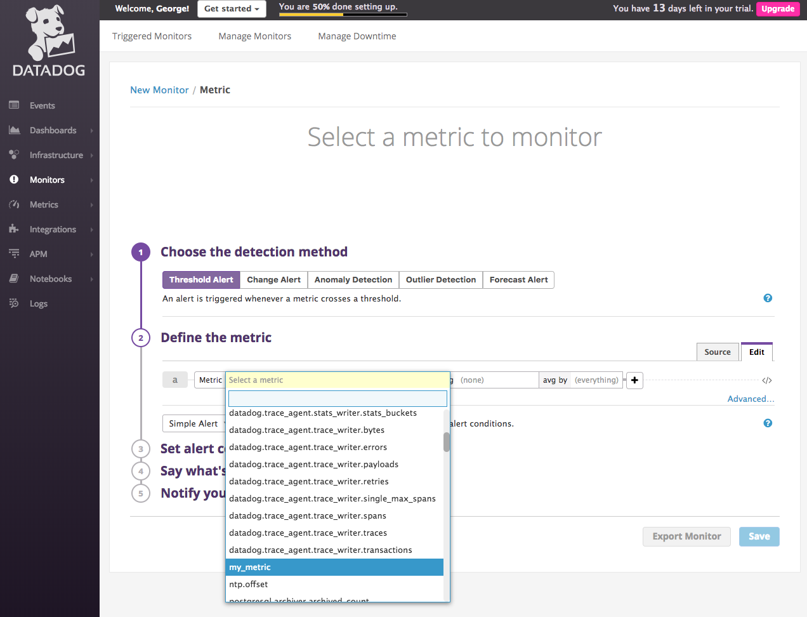
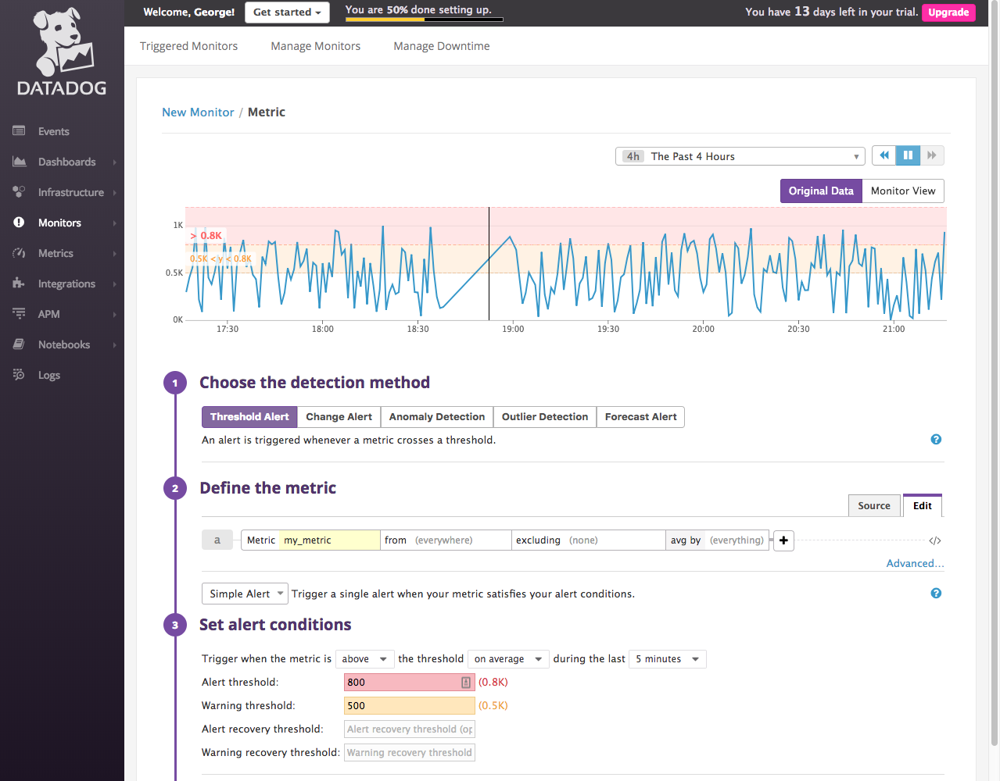
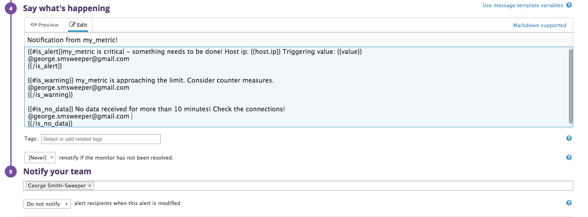
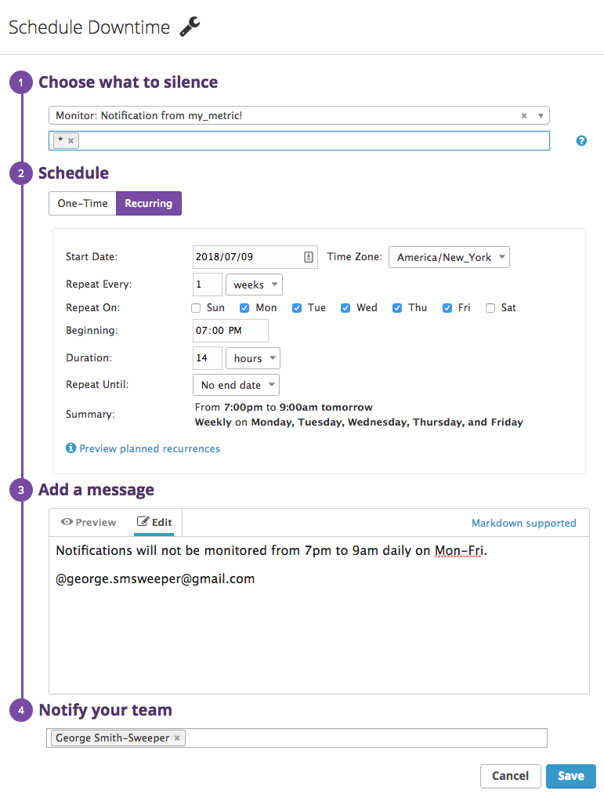
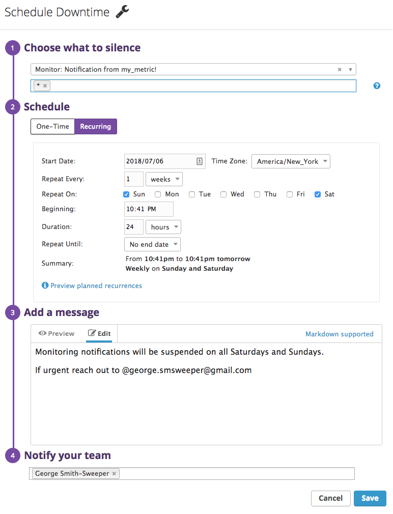
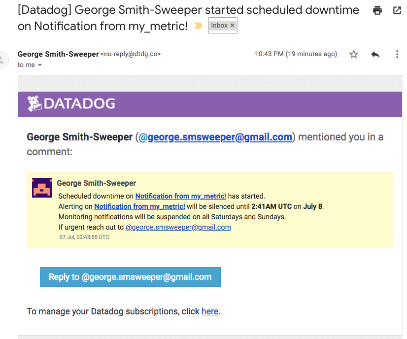

Your answers to the questions go here.

# Solutions Engineer Exercises - George Smith-Sweeper

## Prerequisites - Setup the environment

I chose to use Vagrant and Virtual-Box to complete these exercises. Since I’ve been using HomeBrew as my package manager I chose to install Vagrant and Virtual-Box via the command-line.

`brew cask install vagrant`
[BrewInstllVagrantCommand](images/Prereq/VagrantInstall.png)
`brew cask install virtualbox`
[BrewInstallVirtualBoxInstall](images/Prereq/VirtualBoxInstall.png)

Once these have been installed it’s time to spin up a fresh Ubuntu VM. The first step is to create a new folder for the exercises `mkdir dataDogExercises` and the jump into that newly created folder `cd dataDogExercise`.

In order to avoid dependency issues I searched the [vagrant cloud](https://app.vagrantup.com/boxes/search) for a Ubuntu 16.04 LTS build (ubuntu/xenial64) and initialized my vagrant with this build. `vagrant init ubuntu/xenial64`.

[Photo of command line prompts initializing Vagrant](images/Prereq/InitializeVagrant.png)

Now that Vagrant has been initialized you have to run `vagrant up` to start the VM. Once the VM is up and running typing`vagrant ssh` into the command prompt will log you into the to the newly started VM.

When done correctly, your prompt should now look similar to the one below:
[Vagrant Prompt](images/Prereq/VagrantPrompt.png)

After logging into the new virtual machine, you must sign up for data dog in order to get access to my Data Dog agent metrics, your API KEY, and Dashboard.

[Datadog sign up](images/Prereq/DD_API_KEY.png)

I suggest using copying the entire provided prompt and pasting it into the prompt in your VM. Doing this will install DataDogs agent onto your VM, store your API_KEY, and provide access to the DataDog dashboard.

[Installing DataDog Agent messages](images/Prereq/InstallingAgent)
[Data Dog Agent Installed messages](images/Prereq/AgentInstalled)

## Collecting Metrics:

I took some time to read the [tagging documentation](https://docs.datadoghq.com/getting_started/tagging/) and added my tags to the agent config file at `/etc/datadog-agent/datadog/yaml`.

[Tags inside the config file](images/Collecting_Metrics/TagsInConfig.png)

Initially the tags weren’t showing up in my Host Map, so I ran `sudo datadog-agent status` to check if my agent was running. It wasn’t.

[Agent not running](images/Collecting_Metrics/AgentNotRunning.png)

I then ran `sudo data dog-agent start` and checked again. The tags can now be viewed under the host map.

[Tags in host map](images/Collecting_Metrics/TagsInHostMap.png)

******Install database

I chose to install PostgreSQL as my data base since I had used it in the past. The install is handled by running the command `sudo apt-get install postgresql`.

[PostgreSQL install](images/Collecting_Metrics/PostgresInstall.png)

After installing postgres, it’s important to log in to the database in order to setup the data dog integration. `sudo -u postgres -i`.

Once logged in I simply followed the integration instructions from the data dog docs.

[Postgres Integration](images/Collecting_Metrics/Postgres Integration.png)

 I took the provided example at conf.yaml.example, and renamed it conf.yaml, so that I would have uneasily editable template to work with. (`sudo mv conf.yaml.example conf.yaml`).

This is my edited conf.yaml for this step:
[PostgresYaml](images/Collecting_Metrics/PostgresYaml.png)

******Create Custom Agent Check

I had to do some digging in order to setup my custom agent check, but the [documentation](https://docs.datadoghq.com/developers/agent_checks/) helped me immensely.

The first step is to create a check file inside of the checks.d folder.

“from inside the root directory”
`sudo touch /etc/datadog-agent/checks.d/firstCheck.py`

Next I created the Check inside of the `firstCheck.py` file, and imported the [random pacage](http://www.pythonforbeginners.com/random/how-to-use-the-random-module-in-python) in order to generate integers from 0-1000.

[CheckUsingRandom](images/Colleting_Metrics/CheckUsingRandom.png)

Finally, in order to set the interval at which the data was collected, I had to create a  `firstCheck.yaml` file  inside of the conf.d directory that contains the configurations.
`sudo touch /etc/datadog-agent/conf.d/firstCheck.yaml`

[SettingCheckInterval](images/Colleting_Metrics/SettingCheckInterval.png)

“my_metric” can now be viewed in the metrics explorer:
[MyMetricsExplorer](images/Colleting_Metrics/MyMetricsExplorer.png)


* **Bonus Question** Can you change the collection interval without modifying the Python check file you created?

  Yes! It’s possible to change the collection interval my setting the min_collection_interval in the checks Yaml file. (firstCheck.yaml).

## Visualizing Data:

I spent a while reading the [documentation](https://docs.datadoghq.com/api/?lang=python#create-a-timeboard) for using the DataDog API to setup timeboards, the [graphing documentation](https://docs.datadoghq.com/graphing/), and searching through the help forums before coming up with a way to make my timeboard.

I chose to use Postman when making my requests after reading this great article [Using Postman with DataDog API’s](https://help.datadoghq.com/hc/en-us/articles/115002182863-Using-Postman-With-Datadog-APIs).

Postman interface:
[PostManRequest](images/Visualizing_Data/PostmanRequest.png)

My request looks like this:

```JSON
{
  "title" : "George's TimeBoard",
    "description" : "A TimeBoard for solutions engineers",
    "graphs" : [{
        "title": "My_Metric scoped with host",
        "definition": {
            "events": [],
            "requests": [{
              "q": "avg:my_metric{host:ubuntu-xenial}",
              "type": "line"
            }]
        },
      "viz": "timeseries"
    }, {
        "title": "Anomoly monitor for Postgresql timed checkpoints",
        "definition": {
          "events": [],
          "requests": [{
            "q": "anomalies(avg:postgresql.bgwriter.checkpoints_timed{host:ubuntu-xenial}, 'basic', 2)",
            "type": "line"
          }]
        }
    }, {
        "title": "my_metric rollup point sum",
        "definition": {
          "events": [],
          "requests": [{
            "q": "avg:my_metric{host:ubuntu-xenial}.rollup(sum,3600)",
            "type": "line"
          }]
        }
      }],
    "read_only": "True"
}
```

The script version can be viewed at [Georges TimeBoard Script](scripts/time_board.py)

Once the TimeBoard had been created I went to the dash board, and set the timeframe for the past 5 minutes.


Next I took a snapshot of my graph and sent it to myself using @george.smsweeper@gmail.com



* **Bonus Question**: What is the Anomaly graph displaying?

My Anomaly graph is displaying a red spike that represents a deviation from an expected range of values. There isn’t much data coming in, and I’m using a basic algorithm, so it will be difficult to build up a long trend and present them in a cloud.

## Monitoring Data

Our custom metric routinely goes above 800, so we would like to create a monitor that automatically alerts us when this happens. I found the [Monitor Documentation](https://docs.datadoghq.com/monitors/) very helpful when creating my own monitor.

The first thing I did was select a monitor type to create:


Next I selected the monitor I would like the track:


The third step was to create a “Warning” threshold of 500, and “Alerting” threshold of 800 if my_metric exceeds these values in the past 5 minutes:


Next I configured the monitor to notify me if data was missing for more than to minutes:


Finally I added different messages for Alerts, Warnings and Missing data, and had the monitor notify me by email when a condition was met:

Setting messages:


Receiving emailed notification:


* **Bonus Question**

In order to complete the bonus requirements,I created two downtimes for the new monitor, and had them email me once they had been configured.

Silences monitor from 7pm to 9am daily on M-F:


Email confirmation:


Silences monitor on Saturday and Sunday:


Email confirmation:


## Collecting APM Data:

## Final Question:
