Your answers to the questions go here.

##Add tags in the Agent config file and show us a screenshot of your host and its tags on the Host Map page in Datadog.

installed curl on my linux command line. then installed datadog package using Ubuntu. successful installation:

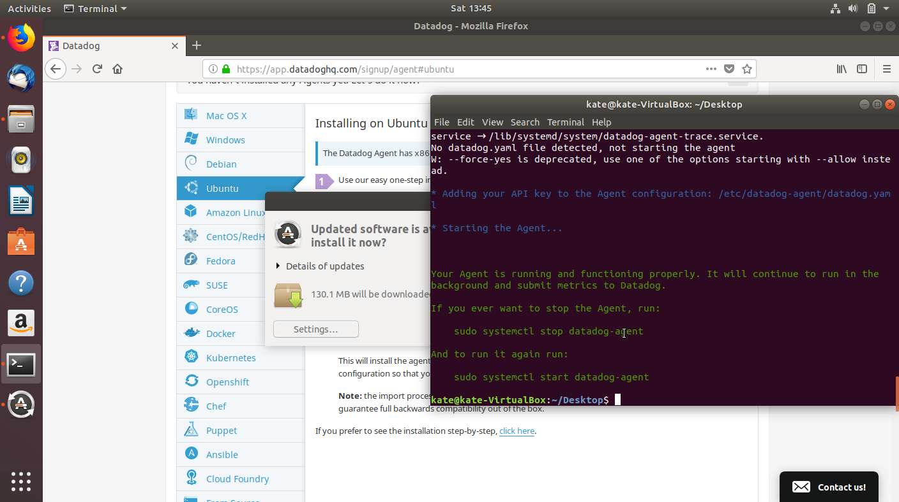

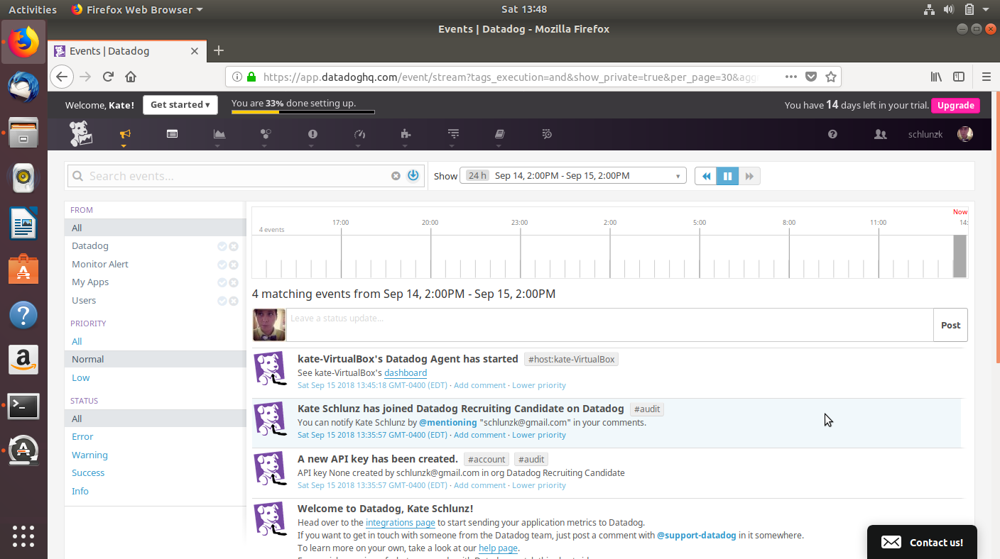

Since this is the first time working with the Ubuntu environment, I had to look up some basic commands to get to the config file for Linux. Once I found how to access and edit my yaml file through the command: 

sudo nano /etc/datadog-agent/datadog.yaml 

I edited the config file on my terminal, however when I saved the file the agent would stop running, and would then would fail to run. I realized later my mistake and that was the syntax of my tags. Once I got the hang of editing the yaml files and understanding to only use the space bar and not tabs, I was able to go back and edit the datadog.yaml file to have tags coming from that as well. Before I realized this I used the GUI tag editing on my host map. So the final host map has GUI tags and tags from my yaml file.

Screenshot of first GUI tags- 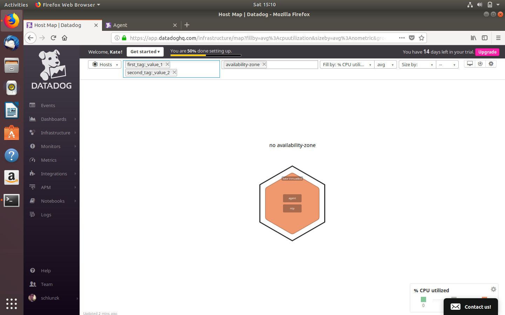
Screenshot of final tags included from yaml file- 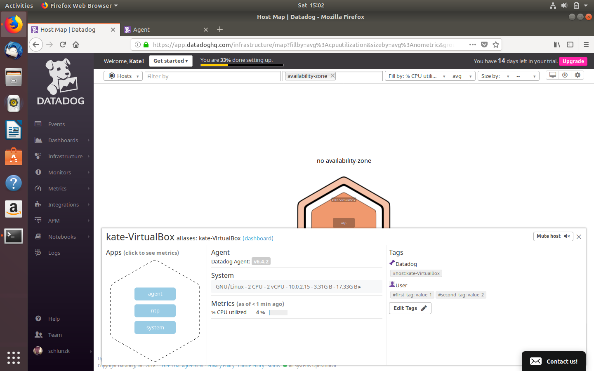

After successfully editing the Postgres config file and after doing some troubleshooting/research, I think my error of Datadog agent failing to run came from not waiting long enough between stopping/starting/restarting the agent through the command.  Now that I understand that Datadog takes time to restart and run again, hopefully this will prevent failures due to editing the config files in the future.

##Install a database on your machine (MongoDB, MySQL, or PostgreSQL) and then install the respective Datadog integration for that database.

Here I have installed and connected PostgreSQL to Datadog following the integration setup and editing the config file. I had some initial trouble with the agent failing to run after restarting it, but after digging around I found again people have mentioned that it takes time for the agent to start up. After about 10 minutes I ran a status check on my agent and sure enough it was running. Looks like a successful integration with PostgreSQL.

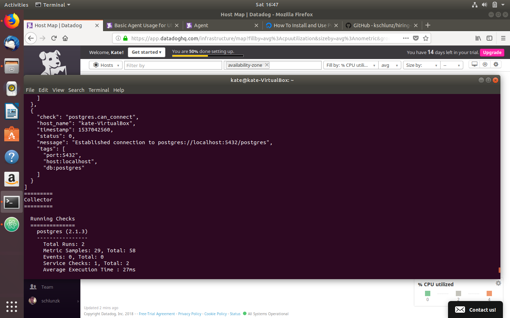

##Create a custom Agent check that submits a metric named my_metric with a random value between 0 and 1000.

I started this off by reading a few documents on Linux command line creation of files and movement between directories. As I am proficient in using terminal in Mac OSX I was happy to see that the commands are the same and movement between files follows the same commands. I carefully read the instructions in the docs for creating my first custom Agent check. I had seen a few people note online as well to be sure you watch which files you put your .yaml and .py files in as that can lead to errors. When I attempted to create a new yaml file in the conf.d directory I got a Permission Denied error. After consulting with with Kevin, he helped me to determine that you need to include 'sudo touch <filename>'. Because I am in an administrative file I need to include sudo. Please see my blog post regarding using sudo in Linux commands, why we use it and other useful commands. [kate's blogpost](https://medium.com/@schlunzk/some-helpful-linux-commands-2060de6f7314)

I first followed the example set up using 'hello.world' as a metric to make sure I could get this running before I proceeded. At first the metric I created in the my_metric.py file using:
```
from checks import AgentCheck
class HelloCheck(AgentCheck):
    def check(self, instance):
        self.gauge('hello.world', 1)
```
However, this was not showing up, I did some careful reading of the docs and realized that there was an important, Note: YAML files must use spaces instead of tabs. So I went back and rewrote both my config yaml file and my .py file and removed tabs. Now I have the hello.world metric running! 

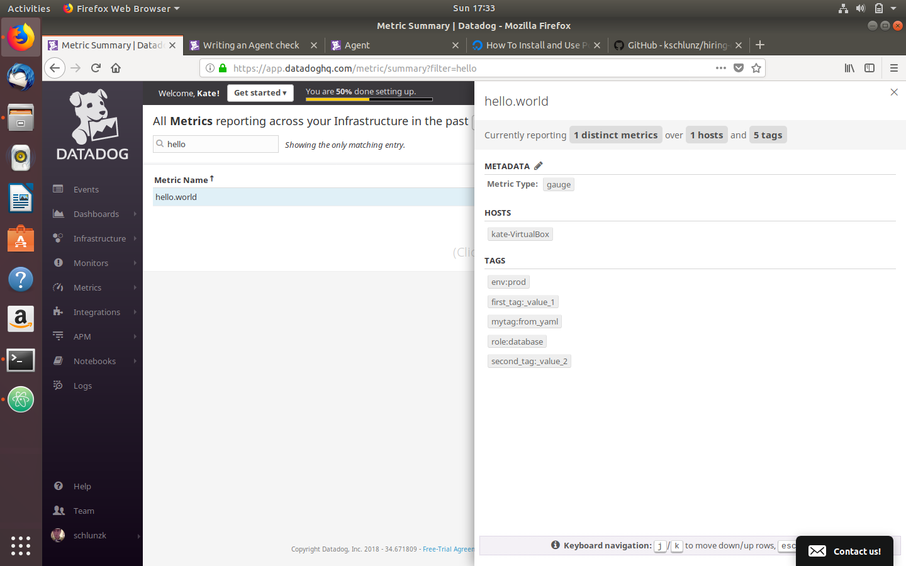

Now that I have my hello.world metric running, I will edit the file to reflect 'my_metric' as the metric name and a random integer. For this I had to do some digging regarding python, since my file is my_metric.py I found that you need to import the random module and then use random.randint(0,1000) as the integer randomizer. Here is my .py file code

```
from checks import AgentCheck
import random
class HelloCheck(AgentCheck):
  def check(self, instance):
      self.gauge('my_metric', random.randint(0,1000))
```
Since this was the first time I have used Python I wanted to check to make sure that my random.randint(0,1000) was working in a Python repl:
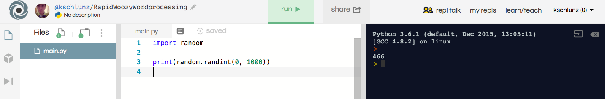

##Change your check's collection interval so that it only submits the metric once every 45 seconds.

I edited my my_metric.yaml file and added the min_collection_interval: 45

```
init_config:
instances:    
    -   min_collection_interval: 45
```

I have been restarting my agent after each time I edit my .py or .yaml file. I had seen in one of the docs that you should do this, wanted to confirm this is best practice.

##Bonus Question Can you change the collection interval without modifying the Python check file you created?

I edited my_metric.yaml as the docs say to do to change the check interval. "min_collection_interval must be added at an instance level, and can be configured individually for each instance." My instance level is in my init_config section and so therefore by adding min_collection_interval to my instance in this file I do not have to change my Python check file.

##Visualizing Data:
##Utilize the Datadog API to create a Timeboard that contains:

[dashboard](https://app.datadoghq.com/dash/916834/kates-dashboard?live=true&page=0&is_auto=false&from_ts=1537189173197&to_ts=1537192773197&tile_size=m)

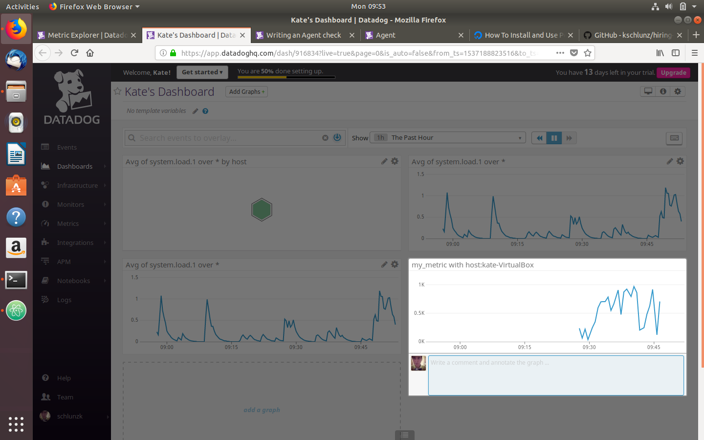

###Any metric from the Integration on your Database with the anomaly function applied.

```
{
    "name": "postgresql anomaly detection ",
    "type": "metric alert",
    "query": "avg(last_4h):anomalies(avg:postgresql.db.count{*}, 'basic', 2, direction='both', alert_window='last_15m', interval=60, count_default_zero='true') >= 1",
    "message": "notify @schlunzk@gmail.com ",
    "tags": [],
    "options": {
        "notify_audit": false,
        "locked": false,
        "timeout_h": 0,
        "new_host_delay": 300,
        "require_full_window": true,
        "notify_no_data": false,
        "renotify_interval": 0,
        "escalation_message": "",
        "no_data_timeframe": null,
        "include_tags": false,
        "thresholds": {
            "critical": 1,
            "critical_recovery": 0
        },
        "threshold_windows": {
            "trigger_window": "last_15m",
            "recovery_window": "last_15m"
        }
    }
}
```

###Your custom metric with the rollup function applied to sum up all the points for the past hour into one bucket

###Please be sure, when submitting your hiring challenge, to include the script that you've used to create this Timeboard.

I was having trouble finding answers in the docs as to where exactly my kat_script_timeboard.py file needs to go because I was unable to get my time board to show up on my dashboard list. I installed sudo apt install python-pip thinking that maybe this was the issue when using from datadog import initialize, api. Still looking to make sure that my .py file is in the right directory. Would be great if there was a bit more documentation in the API section on setting up the timeboard file and where it goes. I feel like I am missing something here…

```
kat_script_timeboard.py                                                             

from datadog import initialize, api

options = {
    'api_key': 'api_key: 8f1745668296dcdd675d719c067fd374',
    'app_key': 'd6a8f38bf72b4ceceb8bda4ecb261e631a7aa95d'
}

initialize(**options)

title = "Kate's Script Timeboard"
description = "An timeboard created with script."
graphs = [{
    "definition": {
        "events": [],
        "requests": [
            {"q": "avg:my_metric{*}"}
        ],
        "viz": "timeseries"
    },
    "title": "my_metric"
},
{
    "definition": {
             "events": [],
              "requests": [
                  {"q": "anomalies(avg:postgresql.db.count{*}, 'basic', 2, direction='both', alert_window='last_15m', interval=60, count_$
    "message": "notify @schlunzk@gmail.com "}
                ],
            "viz": "timeseries"
     },
       "title":"postgresql anomaly detection"
},
{
           "definition":{
                 "events":[],
                 "requests": [
                     {"q": "avg:my_metric{*}.rollup(sum,3600)"}
                   ],
               "viz": "timeseries"
         },


 "title":"Hourly summary of my_metric using rollup"
}]

template_variables = [{
    "name": "host1",
    "prefix": "host",
    "default": "host:my-host"
}]

read_only = True
api.Timeboard.create(title=title,
                     description=description,
                     graphs=graphs,
                     template_variables=template_variables,
                     read_only=read_only)
```

Once I figured out how to run python scripts, I used the example in the docs to create a timeboard called "My Timeboard" without any of my query information. It successfully showed up in my dashboard and shows what it is supposed to. However, when I edit this file with the above scripts and my added timeseries graphs the dashboard does not update with my new information. I restarted the agent and then I found this error in my infrastructure under timeboard.

```
Datadog's timeboard integration is reporting:
Instance #initialization[ERROR]:{"Core Check Loader":"Check timeboard not found in Catalog","JMX Check Loader":"check is not a jmx check, or unable to determine if it's so","Python Check Loader":"['Traceback (most recent call last):\\n', ' File \"/etc/datadog-agent/checks.d/timeboard.py\", line 1, in \u003cmodule\u003e\\n from datadog import initialize, api\\n', 'ImportError: No module named datadog\\n']"}
```
I once again attempted to install "pip install datadog" because since the import error states there is no module named datadog. I could never quite figure out why my timeboard did not work after I edited my file with adding the specified graphs. It worked when I initially set up the timeboard yet never showed on my GUI dashboard list as the correct title.

##Once this is created, access the Dashboard from your Dashboard List in the UI:
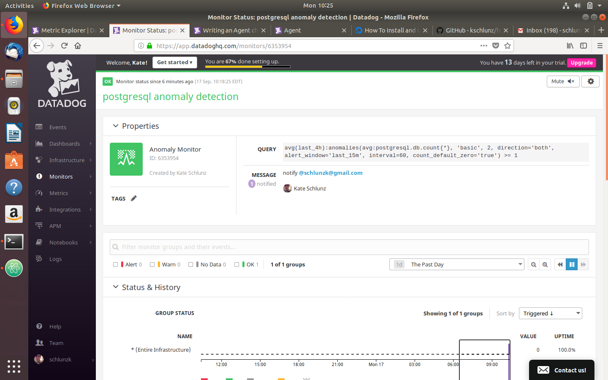

##Bonus Question:
What is the Anomaly graph displaying? In the monitor that I set up, it shows that the ave: my_metric the values have had more than 2 deviations from the predicted values. It compares the past behavior to the present behavior in the form of an algorithm, if you had a sudden drop or uptick anywhere this would pick it up and alert the user.

##Monitoring Data
I changed the Warning threshold of 500 Alerting threshold of 800
Here is the email I received in regards to my monitor:
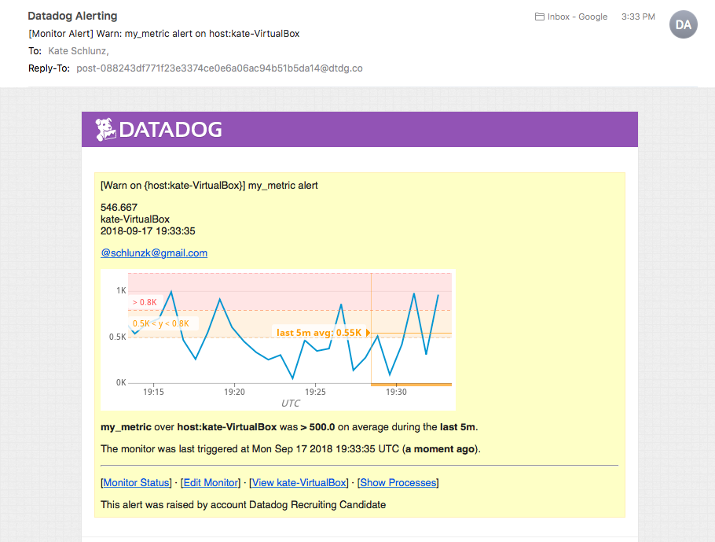

##Bonus Question:
Since this monitor is going to alert pretty often, you don't want to be alerted when you are out of the office. Set up two scheduled downtimes for this monitor:


##Collecting APM Data:
  This definitely was a challenge, it took me some time to get the trace to show up in my infrastructure list. But once I triggered the API a few times I was able to build my trace graph based on hits. The biggest step for me was making sure I had the correct Flask, ddtrace, python, env installed in my project folder. I ran into a couple of issues with blinker and installed that using pip install blinker. I was worried also about the ddtrace Middleware issue but once I figured out the last piece I was finally able to capture some trace information in my GUI dashboard.

###Provide a link and a screenshot of a Dashboard with both APM and Infrastructure Metrics.

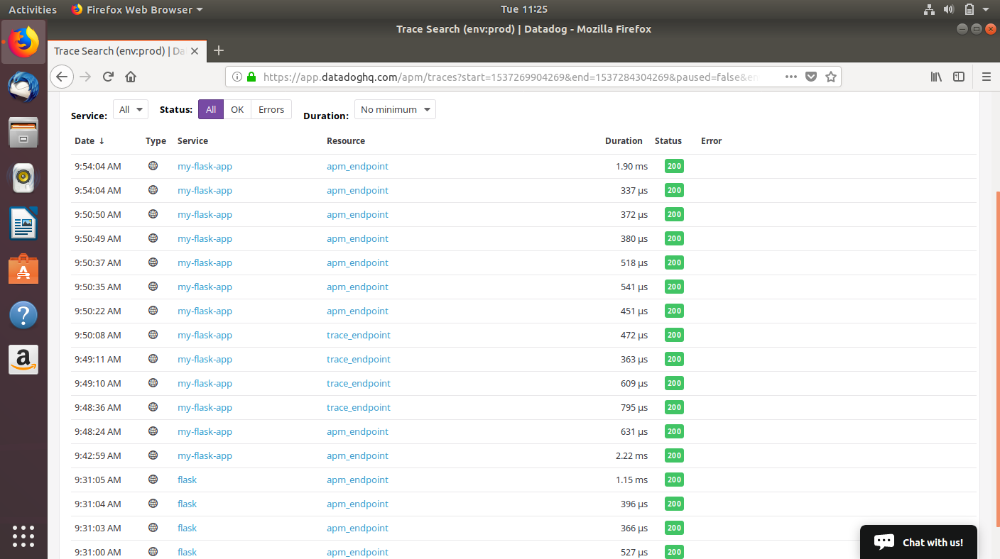

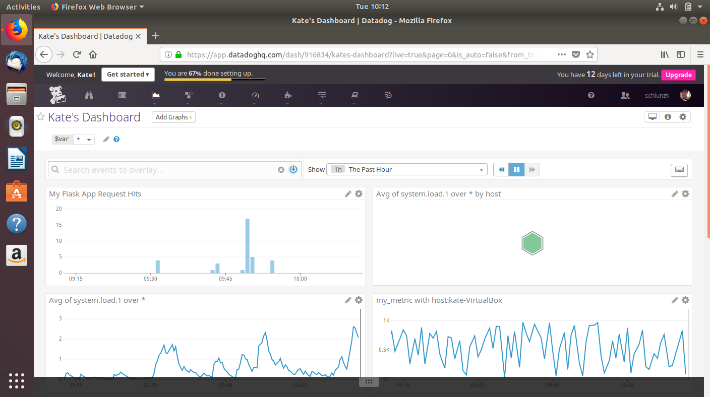

[link toA APM Dashboard](https://app.datadoghq.com/dash/916834/kates-dashboard?live=true&page=0&is_auto=false&from_ts=1537275306287&to_ts=1537278906287&tile_size=m)

##Bonus Question:
What is the difference between a Service and a Resource?
A Service is the name of a set of processes that work together to provide a feature set. For instance, a simple web application may consist of two services: a single webapp service and a single database service. 
A resource is a particular query to a service. For example, a web application might have a canonical URL /user/home. The Tracing backend can track thousands (not millions or billions) of unique resources per service.

##Please include your fully instrumented app in your submission, as well.

```
fom flask import Flask
import logging
import sys
from ddtrace import tracer
import blinker as _
from ddtrace.contrib.flask import TraceMiddleware


# Have flask use stdout as the logger
main_logger = logging.getLogger()
main_logger.setLevel(logging.DEBUG)
c = logging.StreamHandler(sys.stdout)
formatter = logging.Formatter('%(asctime)s - %(name)s - %(levelname)s - %(message)s')
c.setFormatter(formatter)
main_logger.addHandler(c)

app = Flask(__name__)
traced_app = TraceMiddleware(app, tracer, service="my-flask-app", distributed_tracing=False)

@tracer.wrap('myapp.api_entry')
@app.route('/')
def api_entry():
    return 'Entrypoint to the Application'
@tracer.wrap('myapp.apm_endpoint')
@app.route('/api/apm')
def apm_endpoint():
    return 'Getting APM Started'

@tracer.wrap('myapp.trace_endpoint')
@app.route('/api/trace')
def trace_endpoint():
    return 'Posting Traces'

if __name__ == '__main__':
    app.run(host='0.0.0.0', port='5050')
```

##Final Question:
Is there anything creative you would use Datadog for?
