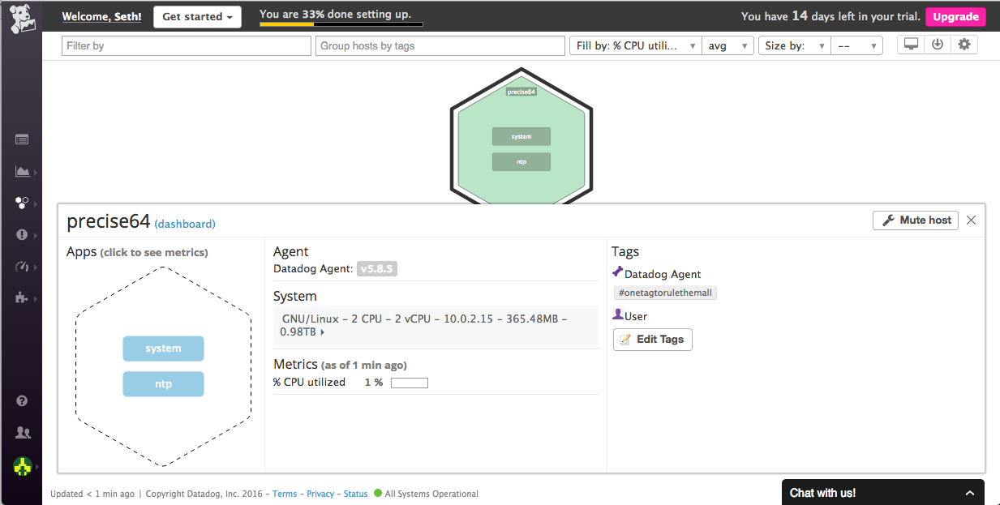

# Hiring Challenge for Data Dog:

## Setting the environment:

Before collecting the metrics, I needed to first set up the environment. To do this, I downloaded two tools, Vagrant and Virtual Box. I first installed Virtual Box as it needed to be opened before installing Vagrant. I went on the documentation on the Vagrant website that showcased the instructions of installing the application. As soon as I had followed  the instructions, I had Vagrant set up along with Precise64, which was a variation of Ubuntu.

## Collecting Metrics:

Once I had set up Ubuntu, I needed to register on the Data Dog website in order to download an agent, which should allow me to collect events and metrics from my Virtual Machine into Data Dog for monitoring and performance data.

In order to add tags, I needed to first follow the directions in setting up the agent by following the instructions labeled in the documentation. Once I've had that set up, and installed the agent on my virtual machine, I was able to get into the configuration files, which allowed me to edit the tags through the text editor vi.

### The location of the tags:

### The results:

