Your answers to the questions go here.


### Intro: Agent Set Up


Because the environment variables I set when creating the agent shaped my approach in building several of the features, I wanted to preface my responses by reviewing these customizations.  and I inc wanted to start by reviewing how these custom parameters


#### Agent Setup

I created an agent in a Docker container using the dockerized Datadog Agent image by running the following command:

```bash
docker run -d --name dd-agent
-p 8126:8126/tcp
-v /var/run/docker.sock:/var/run/docker.sock:ro  \
-v /proc/:/host/proc/:ro \
-v /sys/fs/cgroup/:/host/sys/fs/cgroup:ro \
-v /Users/siobhanpmahoney/Development/take-home-assignments/datadog/hiring-engineers/SiobhanMahoneyAssignment/datadog-agent-conf.d:/conf.d:ro \
-v /Users/siobhanpmahoney/Development/take-home-assignments/datadog/hiring-engineers/SiobhanMahoneyAssignment/datadog-agent-checks.d:/checks.d:ro \
-e DD_APM_ENABLED=true \
-e DD_APM_NON_LOCAL_TRAFFIC=true \
-e DD_API_KEY=4dc7304832d0ab2d0d1048ab35c0b86f datadog/agent:latest \
```

The above command includes several environment variables in addition those included in the [Docker Agent one-step install instruction](https://app.datadoghq.com/account/settings#agent/docker) that I found to be helpful, if not necessary, in completing the assignment:

- Mounting directories:

```bash
-v [..]/datadog-agent-conf.d:/conf.d:ro
-v [..]/datadog-agent-checks.d:/checks.d:ro
```

The above commands mount YAML configuration files and Python files in the host's local `/conf.d` and `check.d` directories to the agent container, copying them the agent's `/etc/datadog-agent/conf.d/` and `/etc/datadog-agent/check.d/` directories when the container starts. By mounting these two directories, files can be created locally and accessed by the container — which proved helpful when writing the `my_metric` custom Agent check.

- Tracing-related: the following allowed for the agent to trace data from an application outside it's container:  

| Commmand | Description |
|-|-|
|`-p 8126:8126/tcp`|Enables tracing on port 8126/tcp from any host |
|`-e DD_APM_ENABLED=true`| Enables the trace-agent to run along with the infrastructure Agent, allowing the container to accept traces on `8126/tcp`|
|`-e DD_APM_NON_LOCAL_TRAFFIC=true`| Allows for non-local traffic when tracing from other containers |


### I: Collecting Metrics:

* *Add tags in the Agent config file and show us a screenshot of your host and its tags on the Host Map page in Datadog.*

I accessed the Agent's config file (`datadog.yaml`) through the container's shell and running `vim`:

  ```bash
  docker exec -it dd-agent /bin/bash
  vim /etc/datadog-agent/datadog.yaml
   ```

I then added the `tag` property and a list of tags in a `<key>:<value>` format:

  <a href='./images/1.01-datadog.yaml-tag-screenshot.jpeg'></a>


I saved my changes and exited vim's edit mode by entering pressing `esc`, followed by `:wq`. I then exited the container's terminal (by running `exit`), and restarted the agent:

  * Restart your Datadog agent with the following command:

  ```sh
  docker container stop dd-agent
  docker container start dd-agent
  ```

  * Navigate to Host Map in your Datadog Dashboard and you should see the new tags listed:

  <a href='./images/1.01-datadog.yaml-tag-screenshot.jpeg'></a>


* *Install a database on your machine (MongoDB, MySQL, or PostgreSQL) and then install the respective Datadog integration for that database.*

I selected PostgreSQL from the list of Integration options.

I created a read-only datadog user with proper access to your PostgreSQL Server by running the following command in a `psql` shell:

```sql
create user datadog with password <PASSWORD>;
grant SELECT ON pg_stat_database to datadog;
```

After exiting the `psql` shell, I confirmed that the permissions were set by running:

```sh
psql -h localhost -U datadog postgres -c "select * from pg_stat_database LIMIT(1);" && echo -e "\e[0;32mPostgres connection - OK\e[0m" || echo -e "\e[0;31mCannot connect to Postgres\e[0m"
```

* I created the `postgres.yaml` config file in the `/datadog-agent-conf.d/` local directory with the below contents. Because this directory is mounted to the container, it will be copied to the container's `conf.d` directory.

```yaml
init_config:

instances:
  - host: host.docker.internal
    port: 5432
    username: datadog
    password: <FILL IN>
```


* I then restarted the agent. To verify that Postgres had been successfully integrated, I ran the agent status command to make sure the `postgres` section under `Checks` did not include any errors.

```sh
docker container stop dd-agent
docker container start dd-agent
sudo docker exec -it dd-agent agent status
```

  <a href='./images/1.02-agent-db-check-screenshot.jpeg'></a>


* *Create a custom Agent check that submits a metric named my_metric with a random value between 0 and 1000.*

Creating a custom Agent metric check involves creating a check (Python) file, which collects the metric data, and a corresponding config (YAML) file, which holds the collection of the metric data collected.

Because the local `/datadog-agent-checks.d` and `/datadog-agent-conf.d` directories are mounted to the agent container, the necessary config and check files for `my_metric` can be created locally and stored in the respective directory. Here's what the files look like:

  - `mymetric.yaml`

    ```yaml
    init_config:

    instances: [{}]
    ```

  - `mymetric.py`: uses the Python `random` library to generate a random integer in the range of 1 and 1000:

    ```py
  try:
    from checks import AgentCheck
  except ImportError:
    from datadog_checks.checks import AgentCheck

    __version__ = "1.0.0"

    import random

    class HelloCheck(AgentCheck):
      def check(self, instance):
        self.gauge('my_metric', random.randint(1,1000))
  ```

After restarting the agent, I ran the `agent status check` and `agent status` commands and reviewed the host map on the Datadog platform to confirm `my_metric` had been implemented successfully:

`agent status` Results_:
<a href='./images/1.03.2-mymetric-agent-status.jpeg
'></a>

`agent status check` Results_:
<a href='./images/1.03.3-mymetric-check-status.jpeg'>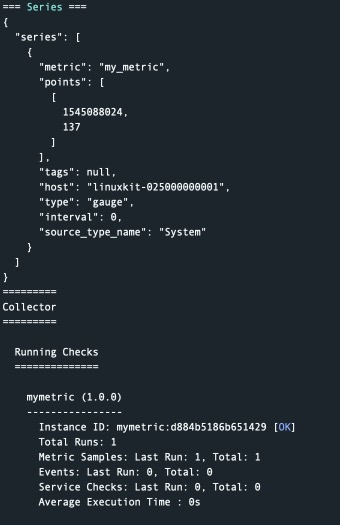</a>

`my_metric` Dashboard in Host Map:
<a href='./images/1.03.1-mymetric-dashboard-nomarkup.jpeg'>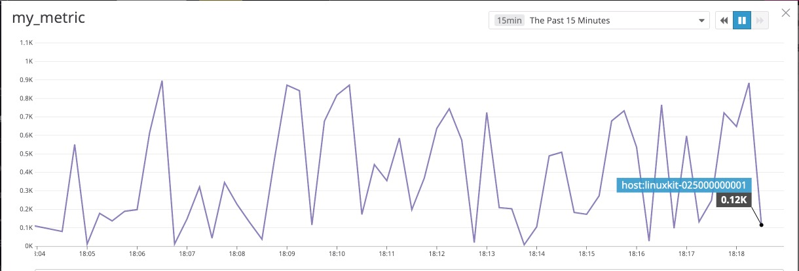</a>


* *Change your check's collection interval so that it only submits the metric once every 45 seconds.*

To update `my_metric` so that it submits the metric on a 45-second interval, I updated `my_metric.yaml` to include the `min_collection_interval` property:

```yaml
init_config:

instances:
  - min_collection_interval: 45
```

Comparison of the `my_metric` graph before the collection frequency was updated from its default of 15-second to its current 45-second interval:

<a href='./images/1.04.2-mymetric-dashboard-markup.jpeg'>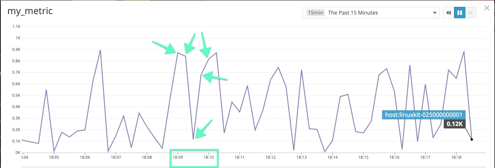</a>

<a href='./images/1.04.2-mymetric-interval-dashboard-markup.jpeg'>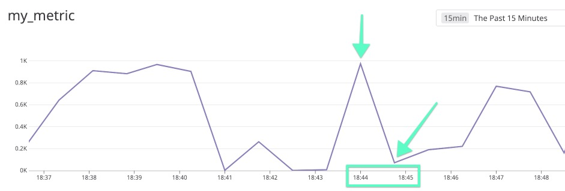</a>


### II. Visualizing Data:

Utilize the Datadog API to create a Timeboard.  that contains:

* *Your custom metric scoped over your host.*

  <a href='./images/2.01-timeboard_graph1_my_metric.jpeg'>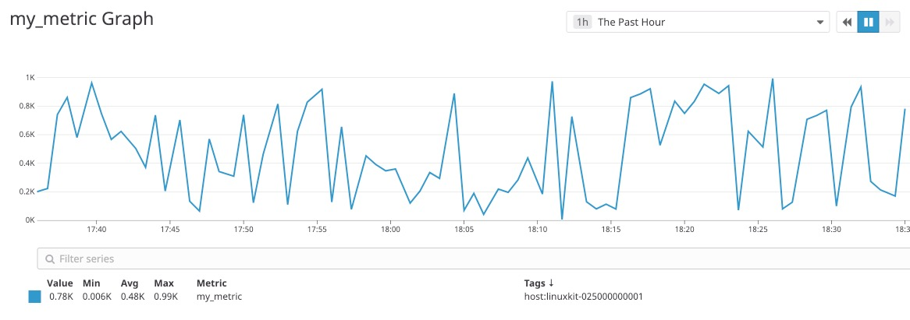</a>

* *Any metric from the Integration on your Database with the anomaly function applied.*

  <a href='./images/2.02-timeboard_graph2_postgres_metric.jpeg'>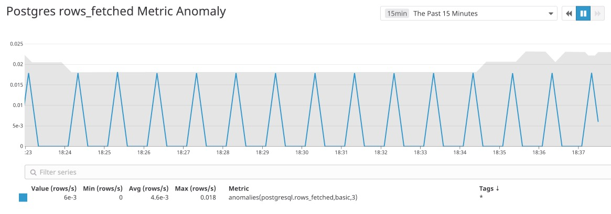</a>

* *Your custom metric with the rollup function applied to sum up all the points for the past hour into one bucket.*

  <a href='./images/2.03-timeboard_graph3_my_metric_anomaly.jpeg'>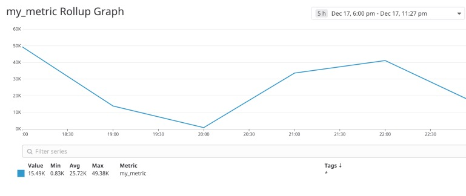</a>

* *Please be sure, when submitting your hiring challenge, to include the script that you've used to create this Timeboard.*

```py
from datadog import initialize, api

options = {
    'api_key': '4dc7304832d0ab2d0d1048ab35c0b86f',
    'app_key': '7e8dffc303beb44b4f83d36c3c22a6a84561db87'
}

initialize(**options)

title = "Siobhan's DataViz Timeboard"
description = "Timeboard with my_metric metric, database integration metric, and sum of my_metric metrics."

graphs = [
  {
    "definition": {
      "events": [],
      "requests": [
        {"q": "avg:my_metric{host:linuxkit-025000000001}"}
      ],
      "viz": "timeseries"
    },
    "title": "my_metric Graph"
  },
  {
    "definition": {
      "events": [],
      "requests": [
        {"q": "anomalies(avg:postgresql.rows_fetched{*}, 'basic', 3)"}
      ],
      "viz": "timeseries"
    },
    "title": "Postgres rows_fetched Metric Anomaly"
  },
  {
    "definition": {
      "events": [],
      "requests": [
        {"q": "avg:my_metric{*}.rollup(sum, 3600)"}
      ],
      "viz": "timeseries"
    },
    "title": "my_metric Rollup Graph"
  }
]


template_variables = [{
"name": "linuxkit-025000000001",
"prefix": "host",
"default": "host:linuxkit-025000000001"
}]


api.Timeboard.create(title=title, description=description, graphs=graphs, template_variables=template_variables)
```

>Once this is created, access the Dashboard from your Dashboard List in the UI:

* *Set the Timeboard's timeframe to the past 5 minutes*

<a href='./images/2.05-timeboard-5min.jpeg'>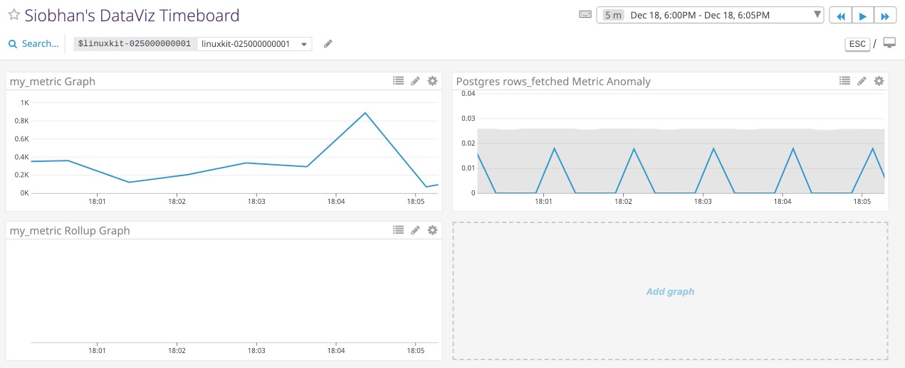</a>


* *Take a snapshot of this graph and use the @ notation to send it to yourself.*

<a href='./images/2.06-timeboard-email.jpeg'>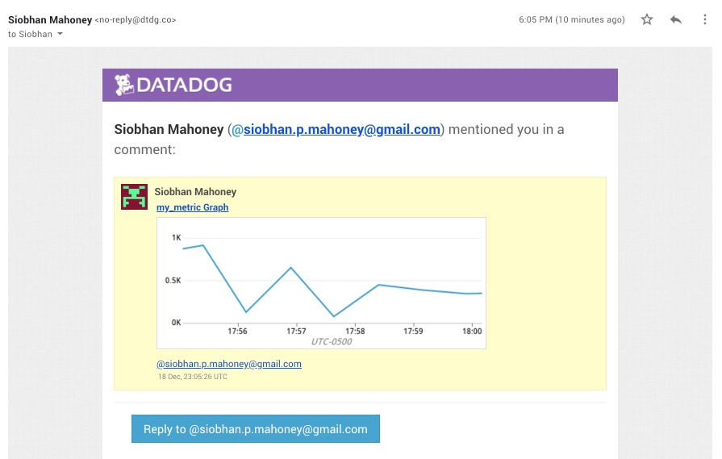</a>


### III. Monitoring Data

* *Create a new Metric Monitor that watches the average of your custom metric (my_metric) and will alert if it’s above the following values over the past 5 minutes:*
 - Warning threshold of 500
 - Alerting threshold of 800
 - And also ensure that it will notify you if there is No Data for this query over the past 10m.

I configured a Metric alert using the [Create Monitor](https://app.datadoghq.com/monitors#/create) tool to  meet the conditions described above:

<a href='./images/3.01-creating-monitor.jpeg'>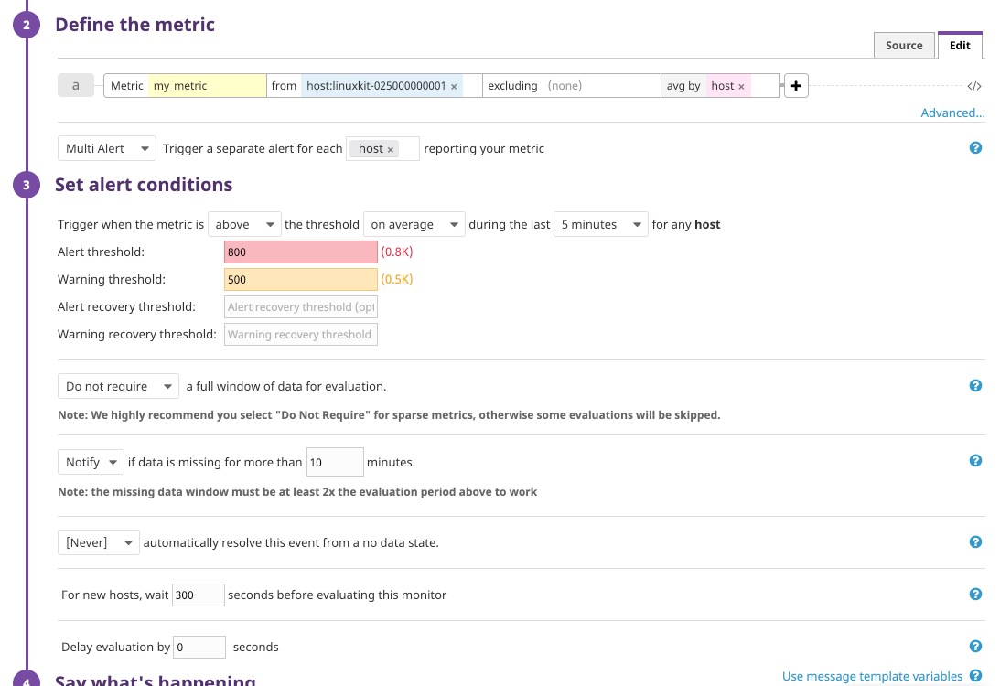</a>


* *Please configure the monitor’s message so that it will:*
  - Send you an email whenever the monitor triggers.
  - Create different messages based on whether the monitor is in an Alert, Warning, or No Data state.
  - Include the metric value that caused the monitor to trigger and host ip when the Monitor triggers an Alert state.

I created distinct content for each of the alert, warning, and no data notification types within the same message using Datadog's tag notation:

-----
  __{{#is_alert}}__

  `my_metric`  ALERT In the past 5 minutes,  the values produced by `my_metric` averaged at {{value}}, surpassing  the alert threshold of 800.
  @siobhan.p.mahoney@gmail.com

  Host Info:
  name: {{host.name}}
  ip: {{host.ip}}

  __{{/is_alert}}__


  __{{#is_warning}}__

  `my_metric` WARNING:  In the past 5 minutes,  the values produced by `my_metric` averaged at {{value}}, surpassing  the warning threshold of 500

  @siobhan.p.mahoney@gmail.com  

  __{{/is_warning}}__


  __{{#is_no_data}}__
  NOTIFICATION: `my_metric` produced no data in the past 10 minutes.
  @siobhan.p.mahoney@gmail.com

  __{{/is_no_data}}__


-----


* *When this monitor sends you an email notification, take a screenshot of the email that it sends you.*

<a href='./images/3.02-my_metric-monitor-alert-notification-email.jpeg'>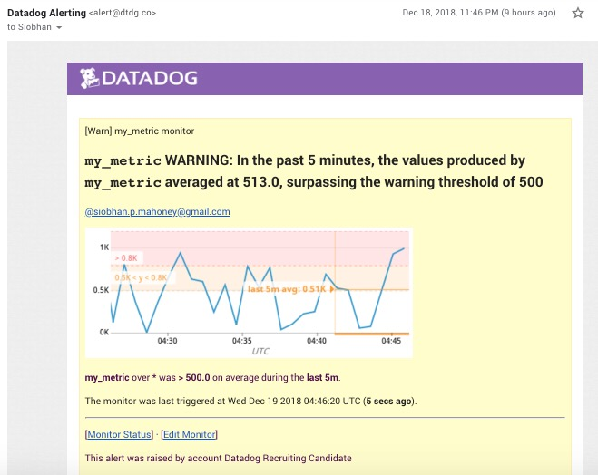</a>


### IV. Collecting APM Data:

Here's an overview of the steps I took to implement the collection of APM data:

1. I began by configuring my agent for trace collection by updating `datadog.yaml` (located in the agent container's `/etc/datadog-agent/datadog.yaml` directory) by adding the `apm_config` key and parameters:

```yaml
listeners:
  - name: docker
config_providers:
  - name: docker
    polling: true
tags:
  - env:production
  - app:web
  - version:1

apm_config:
  enabled: true # enables collection of tracing data
  apm_non_local_traffic: true # enables agent to collect tracing data outside of the docker container
  receiver_port: 8126 # sets port that agent trace receiver listen on.
  analyzed_spans: #make available in trace searches
    flask|flask.request: 1

```
2. I next built a Python app outside of the agent container, which involved:
  - Installing the necessary packages, including:
    - __Flask__ web framework (`pip install flask`)
    - __ddtrace__ library, which will connect the application to our agent, enabling the application to be traced (`pip install ddtrace`)
  - Retrieved the agent's hostname by running `hostname -I` in the agent container's shell
  - Saved the app code provided in the assignment's ReadMe file with the following line:

    ```py
    tracer.configure(hostname='172.17.0.2', port=8126)
    ```

    Here, the application's default ddtrace.tracer object is modified to use the agent's hostname and port, the agent to collect trace data.
3. I then ran the app by prepending `dd-trace` to the run command:

  ```sh
  ddtrace-run python FlaskApp/flaskapp.py
  ```

Once the app was up and running, the tracing data will be available to view in the Datadog platform, both in the host's main infrastructure map and under the APM tab, which offers visuals for the collected data at both the app (or __service__) and individual route (or __resource__) levels:


__Infrastructure Map__:
<a href='./images/4.01-infrastructure-map-with-tracing.jpeg'>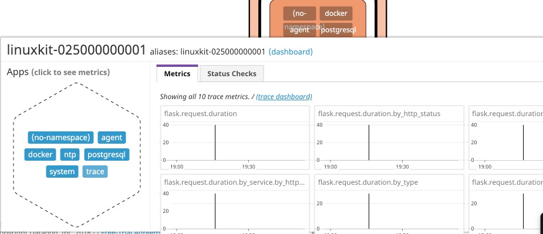</a>


__APM Tab — Service View:__

<a href='./images/4.02.1-trace-data-service.jpeg'>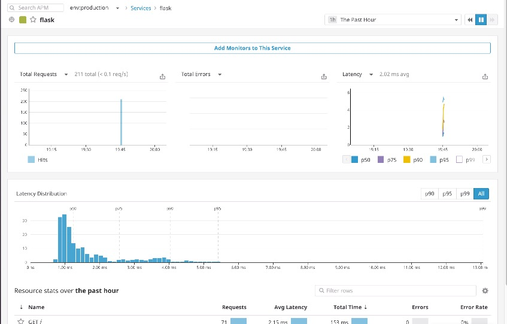</a>

__APM Tab — `/get` Resource View:__

<a href='./images/4.02.2-trace-data-resource.jpeg'>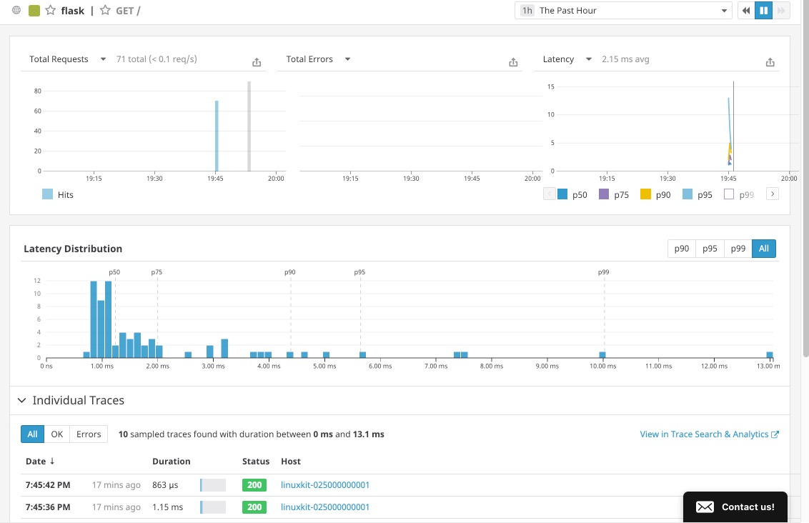</a>


* *Provide a link and a screenshot of a Dashboard with both APM and Infrastructure Metrics*.

I created a dashboard titled 'APM + Infrastructure Metrics', which includes clones of the host's top host-level metrics and the Flask Application's Latency on Service data:

[APM + Infrastructure Metrics Dashboard Link](https://app.datadoghq.com/dash/1026232/apm--infrastructure-metrics?tile_size=m&page=0&is_auto=false&from_ts=1545264540000&to_ts=1545268140000&live=true)
<a href='./images/4.03-APM-infrastructure-metric-dashboard.jpeg'>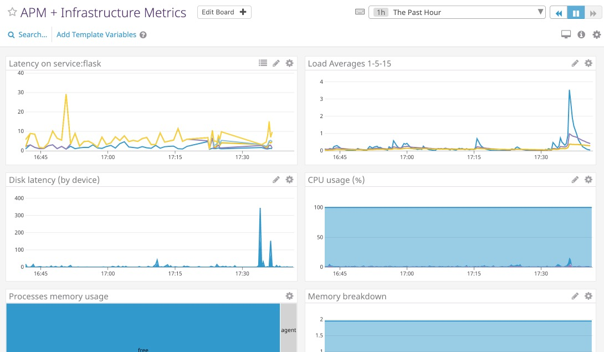</a>

* *Please include your fully instrumented app in your submission, as well*.
The Flask application code with dd-trace below:

```py
from flask import Flask
import logging
import sys
from ddtrace import tracer

main_logger = logging.getLogger()
main_logger.setLevel(logging.DEBUG)
c = logging.StreamHandler(sys.stdout)
formatter = logging.Formatter('%(asctime)s - %(name)s - %(levelname)s - %(message)s')
c.setFormatter(formatter)
main_logger.addHandler(c)

app = Flask(__name__)
tracer.set_tags({ 'env': 'production'})

@app.route('/')
def api_entry():
    return 'Entrypoint to the Application'

@app.route('/api/apm')
def apm_endpoint():
    return 'Getting APM Started'

@app.route('/api/trace')
def trace_endpoint():
    return 'Posting Traces'

if __name__ == '__main__':
    app.run(host='0.0.0.0', port='5050')

tracer.configure(hostname='172.17.0.2', port=8126)
```

### V. Final Question

* *Is there anything creative you would use Datadog for?*
After getting hands-on experience with just a few of Datadog's powerful tools, the possibilities seem endless! However, when thinking of how real time data analytics, monitoring, and graphing, 2 areas in particular come to mind:


###### Weather Forecast and Alerts
Is the temperature going to rise or fall mroe than 10° in the next 4 hours?
