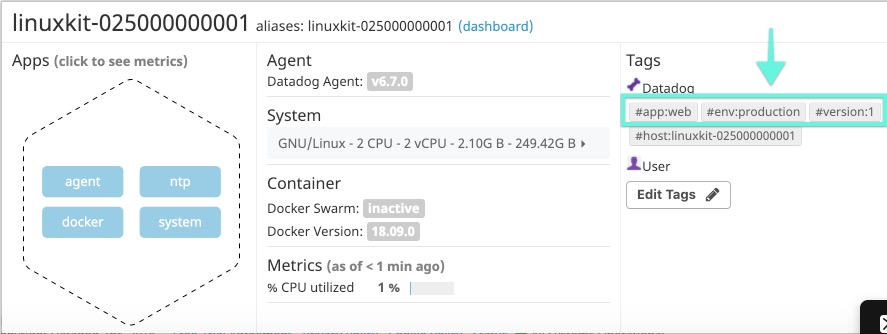
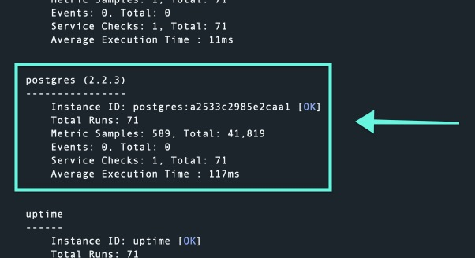

Your answers to the questions go here.

#### Intro

##### Setup:

```sh
docker run -d --name dd-agent -v /var/run/docker.sock:/var/run/docker.sock:ro -v /proc/:/host/proc/:ro  -v /sys/fs/cgroup/:/host/sys/fs/cgroup:ro -v /Users/siobhanpmahoney/Development/take-home-assignments/datadog/hiring-engineers/SiobhanMahoneyAssignment/datadog-agent-conf.d:/conf.d:ro -v /Users/siobhanpmahoney/Development/take-home-assignments/datadog/hiring-engineers/SiobhanMahoneyAssignment/datadog-agent-checks.d:/checks.d:ro -e DD_API_KEY=4dc7304832d0ab2d0d1048ab35c0b86f datadog/agent:latest
```


#### Part 1: Collecting Metrics:

1. _Add tags in the Agent config file and show us a screenshot of your host and its tags on the Host Map page in Datadog._


__Tag Setup__:

* Create agent by running command provided in 1-setup

* Once the agent has been created, start a Docker container Bash session with command

  ```bash
  docker exec -it dd-agent /bin/bash
   ```


* Access and update agent config file (`datadog.yaml`) from terminal by running the following command:

  ```bash
  vim /etc/datadog-agent/datadog.yaml
  ```


* Once you see the file contents in your terminal, press `i` (for "insert") and add tag list to `datadog.yaml`:


  <a href='./images/1.01-datadog.yaml-tag-screenshot.jpeg'></a>


  * When you're satisfied with your updates to `datadog.yaml`, press `esc` to exit vim's edit mode, and type `:wq` to exit from vim

  * End the docker container bash session by running `exit`

  * Restart your Datadog agent with the following command:

  ```bash

  ```

  * Navigate to Host Map in your Datadog Dashboard and you should see the new tags listed:

  <a href='./images/1.01-datadog.yaml-tag-screenshot.jpeg'></a>


#### 2. Install a database on your machine (MongoDB, MySQL, or PostgreSQL) and then install the respective Datadog integration for that database.

Start by selecting PostgreSQL from the list of Integration options and follow directions the as summarized (with additional annotations) below:


* Start a Postgres shell session _by enter `psql` from your Mac terminal_ and create a read-only datadog user with proper access to your PostgreSQL Server by running the following command:

```sql
create user datadog with password <PASSWORD>;
grant SELECT ON pg_stat_database to datadog;
```

* Exit the `psql` shell, and from your Mac terminal, confirm that the permissions were sent:

```sh
psql -h localhost -U datadog postgres -c "select * from pg_stat_database LIMIT(1);" && echo -e "\e[0;32mPostgres connection - OK\e[0m" || echo -e "\e[0;31mCannot connect to Postgres\e[0m"
```

* Configure the integration by creating a `postgres.yaml` in the `/datadog-agent-conf.d/` directory (__note__: this this the directory located in the respository on the host machine that is mounted to the `dd-agent` Docker container) with the following contents:

```yaml
init_config:

instances:
  - host: host.docker.internal
    port: 5432
    username: datadog
    password: <FILL IN>
```

* From the host's terminal, run the following commands to restart the agent and verify that Postgres was successfully integrated:

```sh
docker container stop dd-agent
docker container start dd-agent
sudo docker exec -it dd-agent agent status
```

*  Look for postgres under the Checks section to verify the integration:

  <a href='./images/1.02-agent-db-check-screenshot.jpeg'></a>


#### 3. Create a custom Agent check that submits a metric named my_metric with a random value between 0 and 1000.

- overview
  - Parts: `mymetric.py` check file and `mymetric.yaml` config file
  - Process: because the `/datadog-agent-conf.d` and `/datadog-agent-checks.d` directories on the host machine are mounted to the agent Docker container, the necessary config and check files for the `my_metric` can be created locally and stored in the respective directory
- screenshots
  - `mymetric.yaml` code

    ```yaml
    init_config:

    instances: [{}]
    ```

  - `mymetric.py` code

    ```py
  try:
    from checks import AgentCheck
  except ImportError:
    from datadog_checks.checks import AgentCheck

    __version__ = "1.0.0"

    import random

    class HelloCheck(AgentCheck):
      def check(self, instance):
        self.gauge('my_metric', random.randint(1,1000))
  ```
  - dashboard // take screen shot after before adding back interval


#### 4. Change your check's collection interval so that it only submits the metric once every 45 seconds.

- process: updating `mymetric.yaml` by adding `min_collection_interval: 45`
- screenshots/visuals:
  - updated yaml file
  - screen shot of mymetric check status results
  - screen shot of mymetric dashboard graph

#### 5. Bonus Question Can you change the collection interval without modifying the Python check file you created?
