# DataDog Hiring Exercise - Sales Engineer NYC
### Matt McCreadie
###### November, 2021
 
First things first... I really appreciate the opportunity to complete this exercise and progress through the interview process. Admittedly, this project was daunting from the second I looked at the assignment. Between juggling closing out a strong October in my current position as an Account Executive and training for the NYC Marathon (pic below of me completing IronMan Lake Placid a few months ago) coming up this weekend, I knew I had my work cut out for me! 
  
By the end of the assignment, I was truly appreciative and agree that this is the best way to dive right into DataDog myself. I quickly became appreciate of one of my major classes back at James Madison University, "Operating Systems and Server Administration". This was a huge help in completing this project, as well as my exposure to various languages; Python, for example.
 
 

 
 
Let's walk through some of the steps I took to complete this assignment, along with learnings, challenges, and how I worked to troubleshoot these issues.
 
 

## Assignment Breakdown

### Setting up the Environment

I took the advise in using Vagrant Ubuntu VM, and it turned out as a good choice. Pretty easy to get stood up and running right away.
  
I quickly noticed how quick and easy much of the setup was, especially the DataDog Agent. This was a theme across the assignment; everything was easy to follow, tons of documentation online, and a one-step install for the Agent had me setup right away.
  

### Collecting Metrics

I made sure to add tags to the Agent config file so that I can structure the data and easily filter the data when using dashboards and visualizations.
(screen shot tags)
  
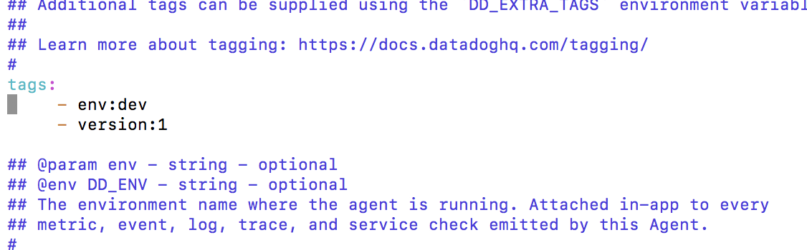
  
I went on to install mySql via the command-line. I had experience with mySql in the past, so I felt comfortable installing and working with this database; 
&nbsp;&nbsp;&nbsp;&nbsp;&nbsp;&nbsp; - I made sure to edit the yaml and conf.d files, renamed conf.yaml.example to conf.yaml.new 
&nbsp;&nbsp;&nbsp;&nbsp;&nbsp;&nbsp; - I then ran the DataDog Agent status check to confirm that mySql was showing under my "checks" section
  
Building out the custom agent check was pretty straight forward as well; I created a new directory called custom_check.d, created a new file called custom_check.yaml, then editted that file to include my script. I then created a python file in checks.d called custom_check.py, and editted that file to include my script.
  
Bonus Question: I was able to edit the collection interval; I did so by editting the yaml file (rather than the python file I created) by editting the min_collection_interval to be 45.
  
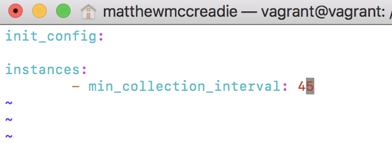
  

### Visualizing the Data

  
Here's where I ran into a bit of a hiccup. I started by downloading Postman and going that route, but I could not get it to function as I needed, so I quickly pivoted to Python as my method.
  
&nbsp;&nbsp;&nbsp;&nbsp;&nbsp;&nbsp; - ran pip install datadog, created new file under /etc/python, added script to this example.py to test  
&nbsp;&nbsp;&nbsp;&nbsp;&nbsp;&nbsp; - I then executed my timeboard.py file to write my own dashboards; my_metrics, anamoly function and rollup function
  
Here's a screenshot of the email I received including a snapshot of one of the graphs.
  
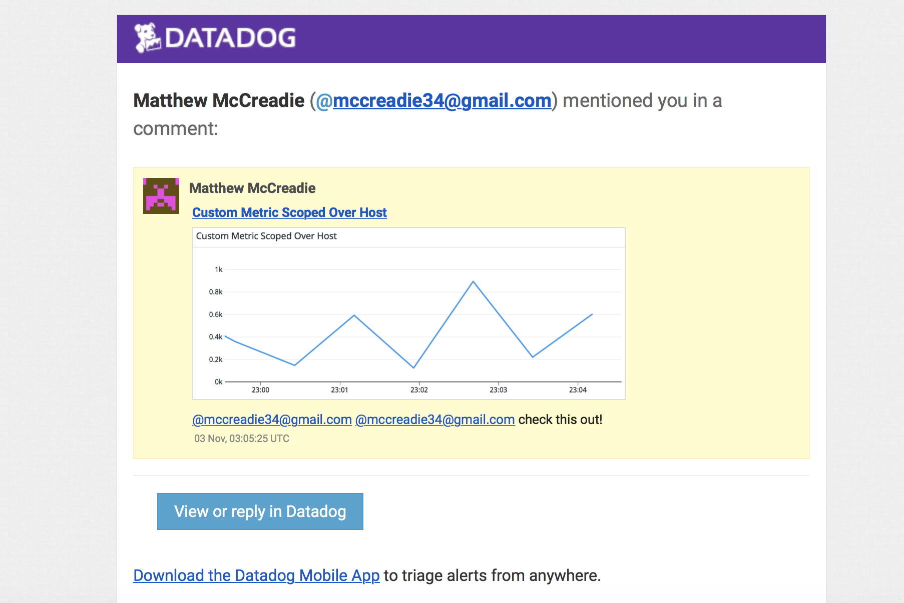
  
[Collecting Metrics - Timeboard](https://app.datadoghq.com/dashboard/s2d-shp-ud2/datadog-exercise-timeboard?from_ts=1636169951234&to_ts=1636170251234&live=true)
  
Bonus Question: Anomaly Function is triggering on any value outside of 2 standard deviations.
  

### Monitoring Data

Monitoring Data was another straight-forward section of the assignment, especially using the DataDog UI. I was able to follow documentation to set up warning, alert and "no data" emails. I was definitely eager to get the downtime set up once I was getting send notification emails non-stop once this was up and running!
  
Configuring Email Notifications; Warning, Alert and No Data 
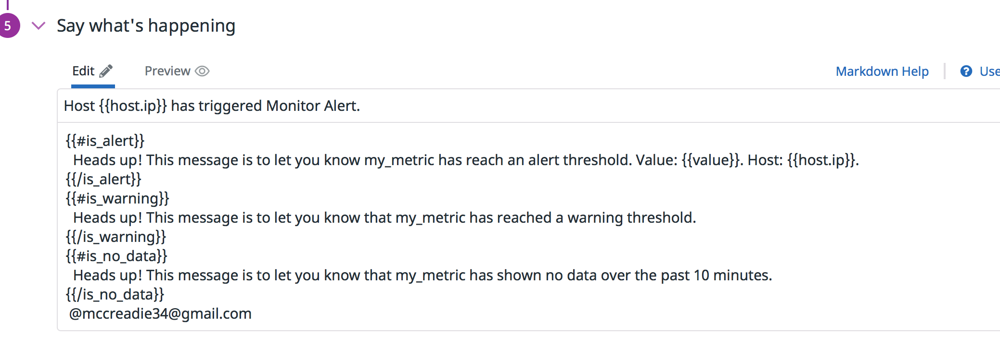
  
Email Triggered and Sent 
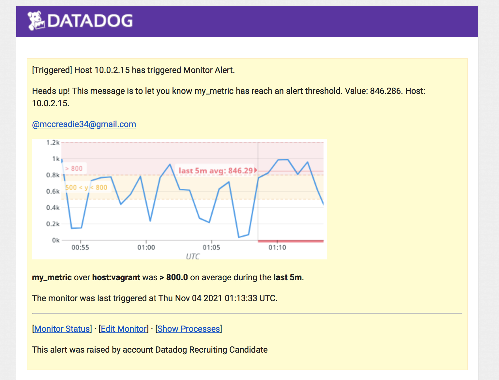
  
Email sent after scheduling weeknight downtime 
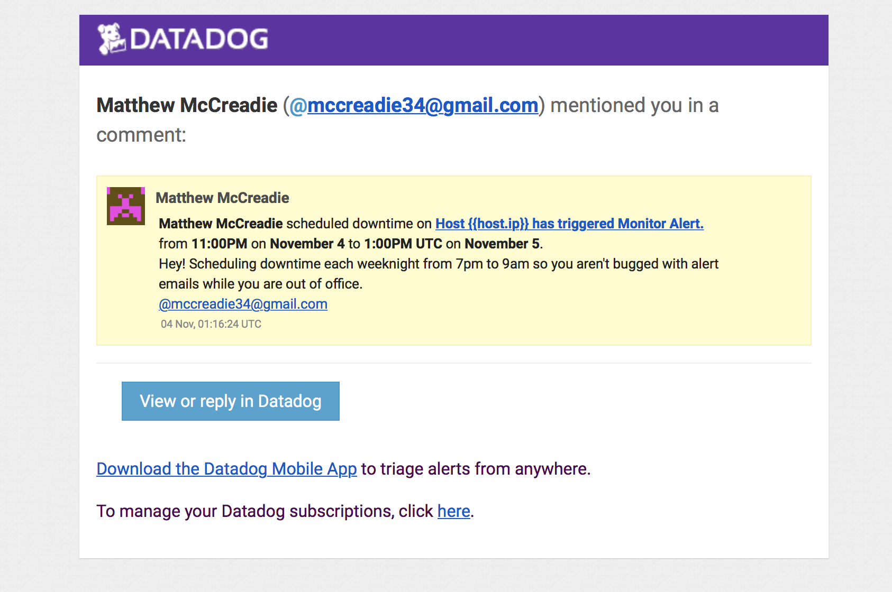
  
Email sent after scheduling weekend downtime 
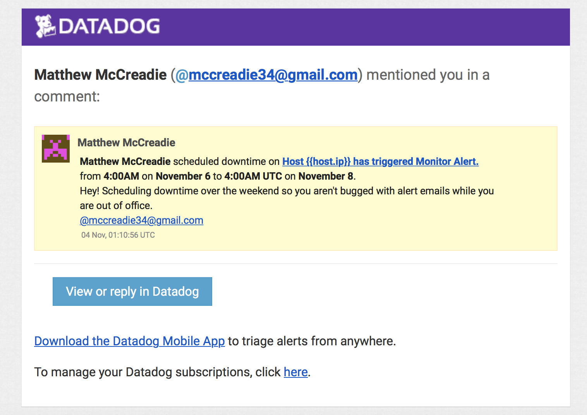

### Collecting APM Data

Collecting APM Data was my biggest battle of the assignment. I followed all the documentation exactly; pip install ddtrace, built the python file using the flask code under the python directory, named it flaskApp.py, and then ran ddtrace-run python flaskApp.py
  
I was running into an issue where I wasn't seeing traces and was unable to confirm by running a curl command at the address it was returning. Ultimately I had to open a new terminal to executive the command while the flask script was running for the traces to begin appearing in the DataDog UI.
  
Here's a few screenshots and a link for review;
  
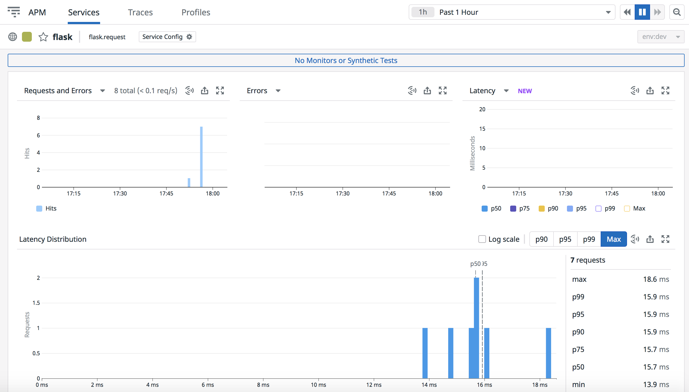
  

  
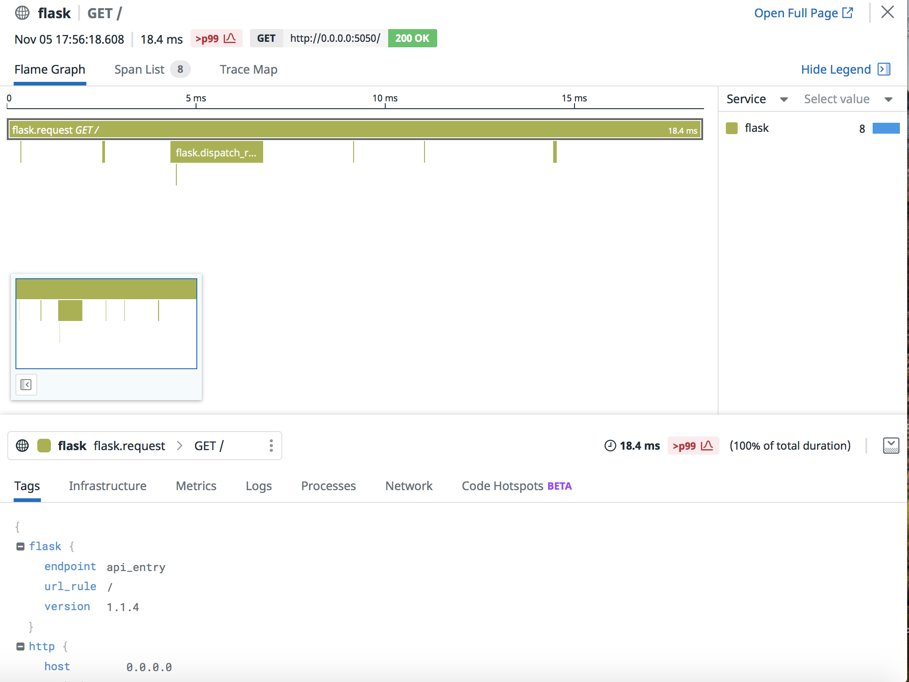
  
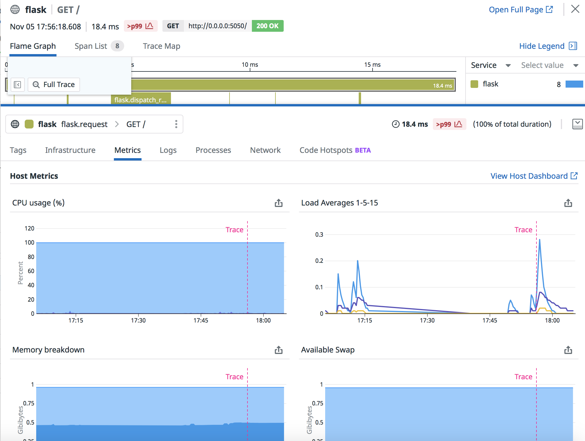
  
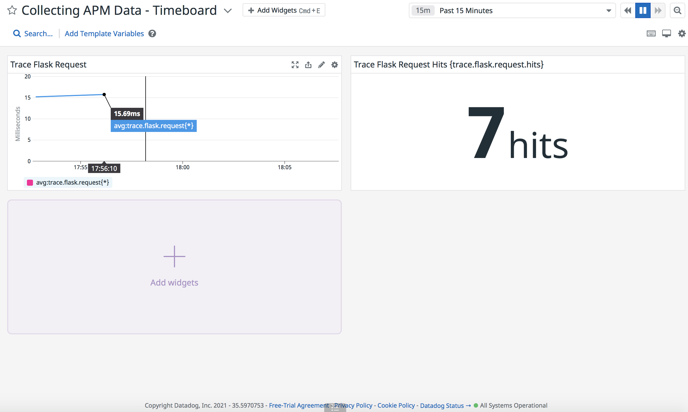
  
[Link to Traces](https://app.datadoghq.com/apm/traces?query=env%3Adev&cols=core_service%2Ccore_resource_name%2Clog_duration%2Clog_http.method%2Clog_http.status_code&historicalData=true&messageDisplay=inline&sort=desc&streamTraces=true&start=1636083895436&end=1636170295436&paused=false)
  
Bonus Question: Service vs Resource
  
Service; Services are the building blocks of modern microservice architectures - broadly a service groups together endpoints, queries, or jobs for the purposes of building your application.
“Flask”, in my project for example.
 
Resource; Resources represent a particular domain of a customer application - they are typically an instrumented web endpoint, database query, or background job.
This would relate to the trace metrics that are encompassed by the Flash service mentioned above, in my project for example.
  

### Final Question

Final Question:
  
As I mentioned earlier, I've been pretty active in the fitness space with marathons, IronMan races, etc. I am a big user of wearable technology as well, specifically Whoops wearable tech.
  
I absolutely love the product, but I recently ran into an issue where my hardware could not connect to the app on my phone/ data was not feeding to the software. There wasn't much visibility to my hardware/software from their support team and I had to download logs for them to review.
  
A creative application of DataDog might be to leverage DataDog's IoT solution to help minimize downtime for Whoop's userbase. As wearable tech gets more complex and more user's rely on this for their sport, fitness and overall health, keeping downtime minimized and ensuring function of their applications will be more important than ever.
  
  

### Thank you

Thank you again for the consideration, and I look forward to more opportunity with DataDog!
