# Datadog Solutions Engineer Exercises - David Leung

## Prerequisites - Setup the environment

### Vagrant Installation
I am completing this exercise using Windows 10 and to avoid any OS or dependency issues, I setup a Vagrant Ubuntu VM. To setup the virtual machine, I used the command `vagrant init hashicorp/precise64` after installing the Vagrant packages. Unfortunately, I had already installed Vagrant before taking a screenshot.

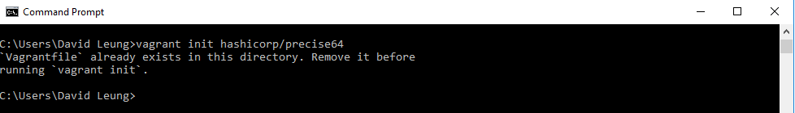

Then I used the command `vagrant up` to start up the virtual machine and used the command `vagrant ssh` to connect to it and interact with the virtual machine.

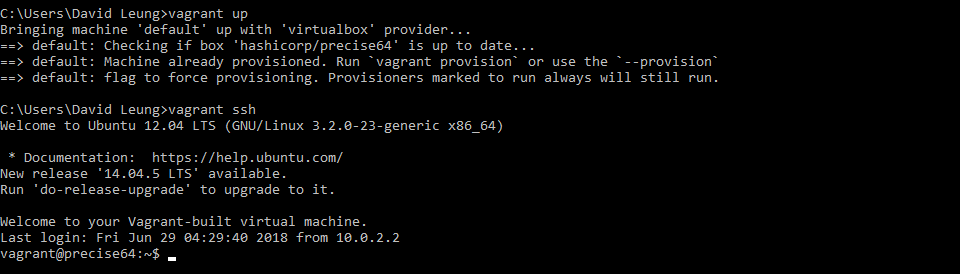

### Datadog Account Signup

Signed up for a Datadog with the appropriate company title.

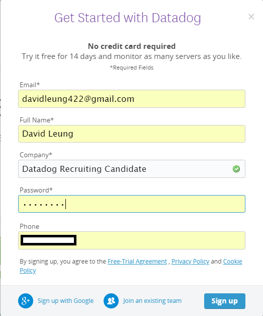

Then I followed the instructions on screen to lead me through the sign up process.

### Datadog Agent Installation

I chose the Ubuntu Datadog Agent because I was running a Ubuntu VM with Vagrant.

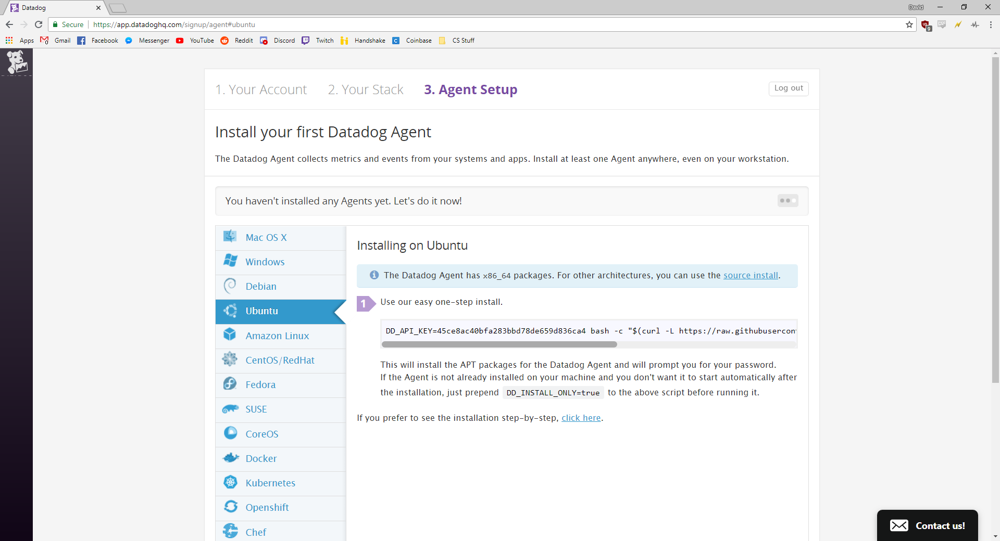

I followed the instructions to install the agent onto a Ubuntu machine. After pasting the one line of command, I needed to install curl before proceeding.

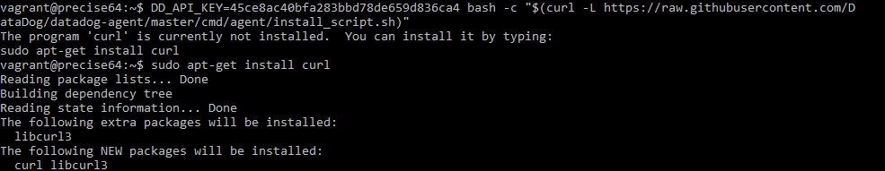

After installing curl, the installation sequence was able to run and it was able to give me an installation success message.

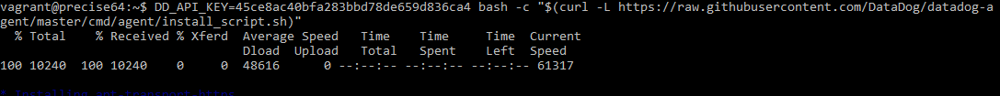

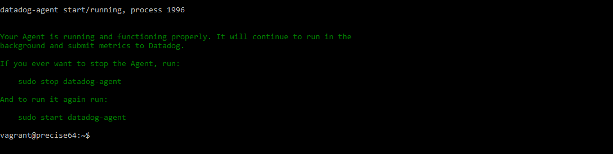

I was able to access the main dashboard.

## Collecting Metrics

### Adding tags
The instructions told me to add tags to the Agent config file which would also display onto the Host Map page in Datadog. I was able to find the config file from this [page](https://help.datadoghq.com/hc/en-us/articles/203037169-Where-is-the-configuration-file-for-the-Agent-) and learned how to add tags appropriately from this [instructional page](https://docs.datadoghq.com/getting_started/tagging/assigning_tags/#assigning-tags-using-the-configuration-files). Initially I had trouble seeing the tags displayed onto the Host Map because my spacing wasn't correct in the 'datadog.yaml' file.

Tags written in the configuration file.

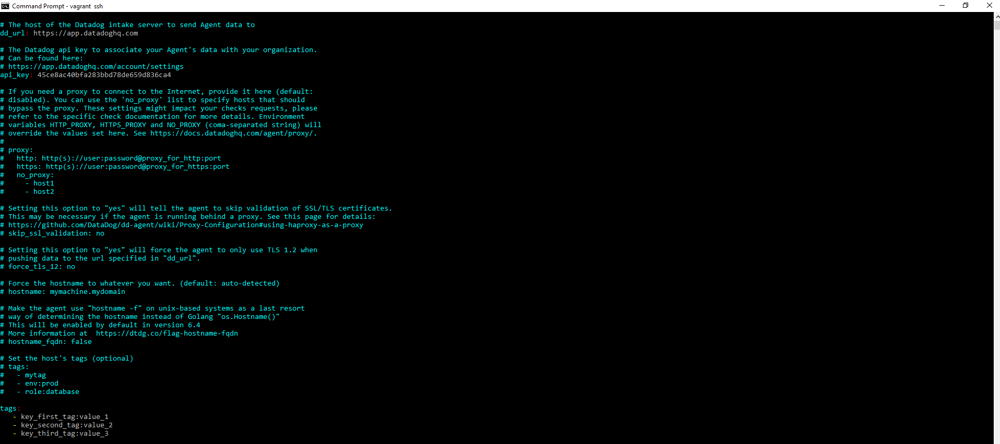

Tags displayed on the Host Map.

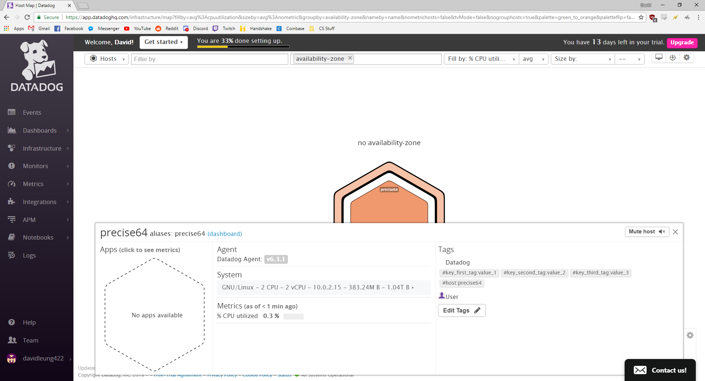

### Installing database
I chose to install a PostgreSQL database onto my machine because I have some experience with this specific database and am used to the commands. To understand how to install the Datadog integration for Postgre, I used the available [instructional page](https://docs.datadoghq.com/integrations/postgres/).

Successful Integration of PostgreSQL into my Datadog Agent.
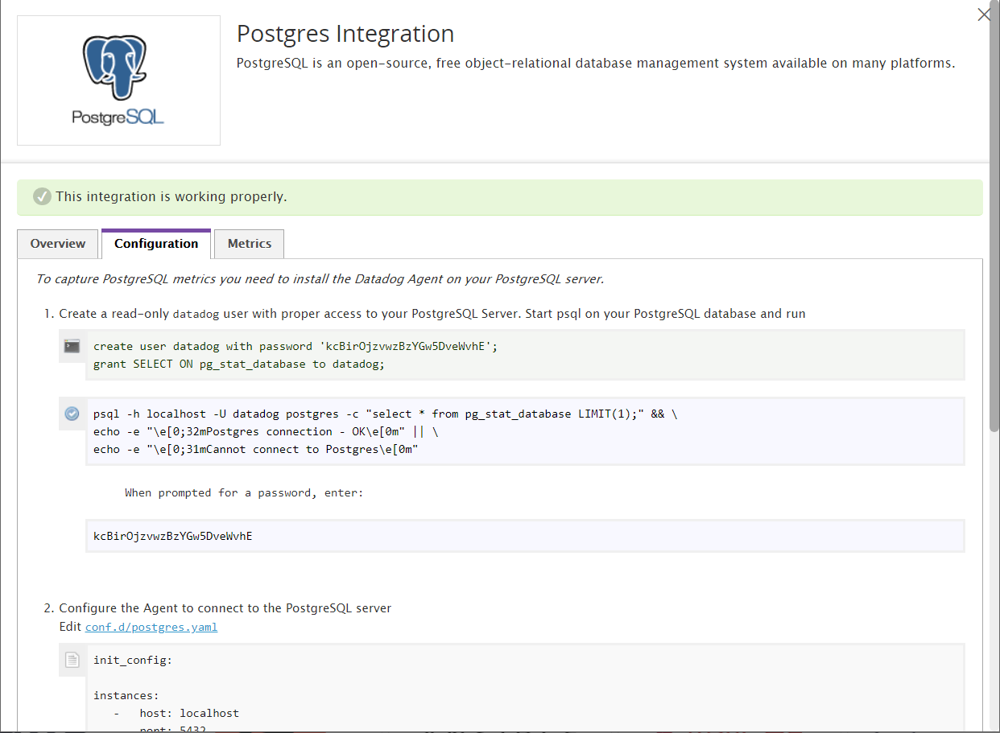

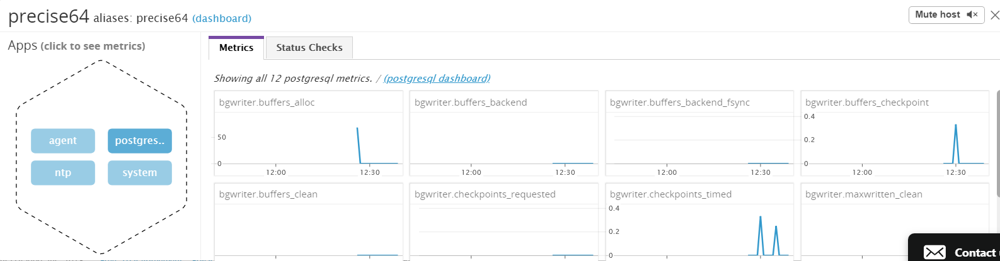

When I run the 'sudo datadog-agent status' command to display Agent information, it shows a successful PostgreSQL integration to my host.

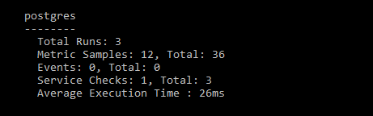

### Creating Custom Agent Check
The next steps were to create a custom Agent check that submits a metric with a random value between 0 and 1000. I used these [directions](https://docs.datadoghq.com/developers/agent_checks/) to understand how to create an Agent check. From these instructions, I created a `mycheck.py` file inside the `checks.d` directory and a `mycheck.yaml` file inside the `conf.d` directory. To have the metric return a random value within a specified range, I used the `random.randInt()` function from the standard Python library.

`mycheck.py`

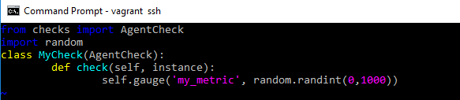

Afterwards, I had to change the check's collection interval so that it only submits the metric once every 45 seconds. The bonus question also challenged me to change this interval without editing the python file I created. After studying the AgentCheck class, I came to the conclusion that using `min_collection_interval` would be the best way to limit my_metric's collection interval.

`mycheck.yaml`

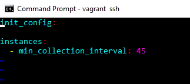

Here is `my_metric` after setting the check's collection interval to 45 seconds.

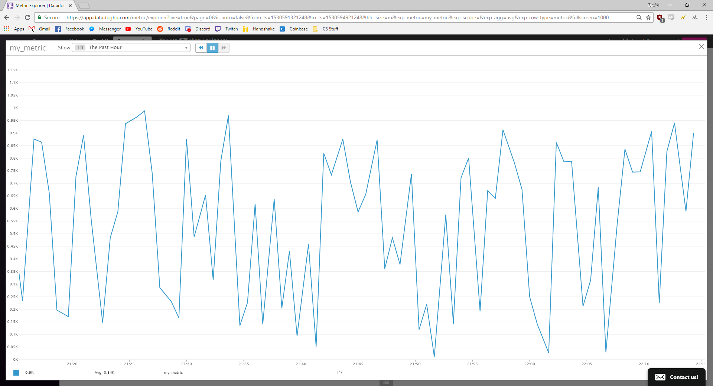

## Visualizing Data:

To understand how to use Datadog's API to create a Timeboard, I used this [reference guide](https://docs.datadoghq.com/api/?lang=python#timeboards) to learn about the different functions that Datadog offers.

The script to create this timeboard is included in this respository as `timeboard.py`.

Finished Timeboard with the various metrics.

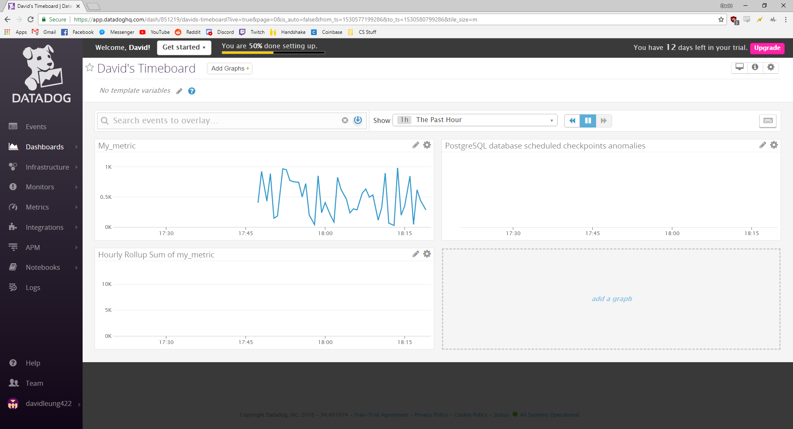

Snapshot of Timeboard's timeframe to past five minutes.

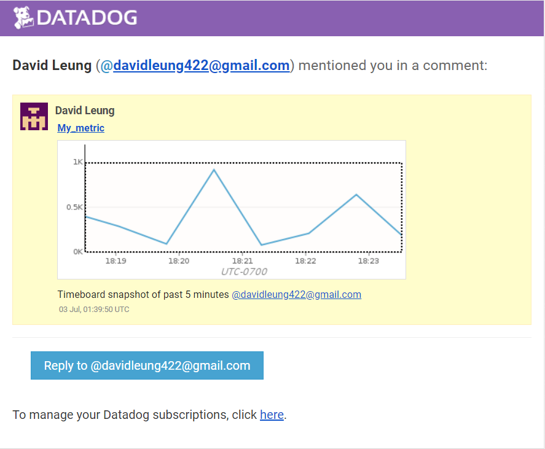

The Anomaly graph displays changes in behavior of the metric it tracks by keeping track of historical data and patterns and being able to detect any deltas that may occur. Anomaly graphs are useful for metrics that have a consistent reoccuring pattern as any significant changes to those patterns means a very drastic issue that metric may have.

## Monitoring Data

I created a Metric Monitor that warns me if `my_metric` reaches 500 or above or alerts me if it reaches to 800 or above. Another check I implemented was to alert me if `my_metric` did not report any data for over 10 minutes. Some options that I included was to have the monitor email me whenever it triggers, have different messages based on what the monitor reports, and display the host name and IP for the metric value that triggers an Alert state.

Options I set for the Metric Monitor.

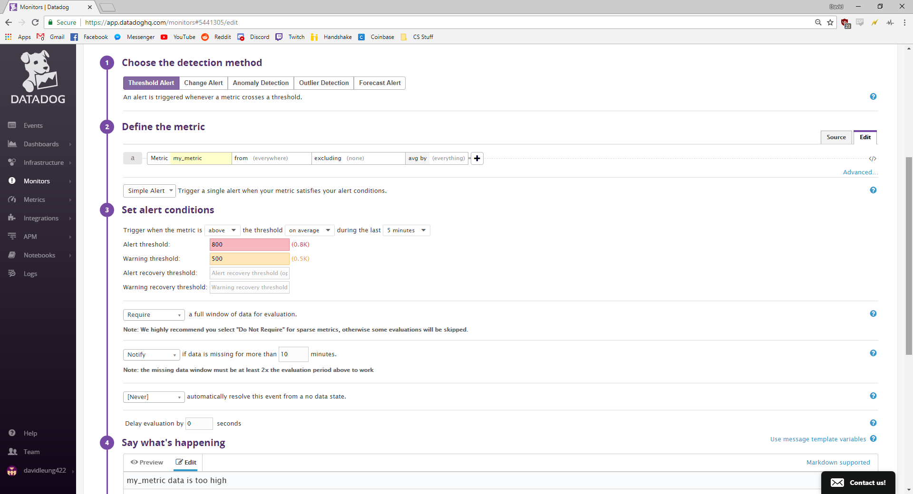

Description of the different messages the Metric Monitor may email me.

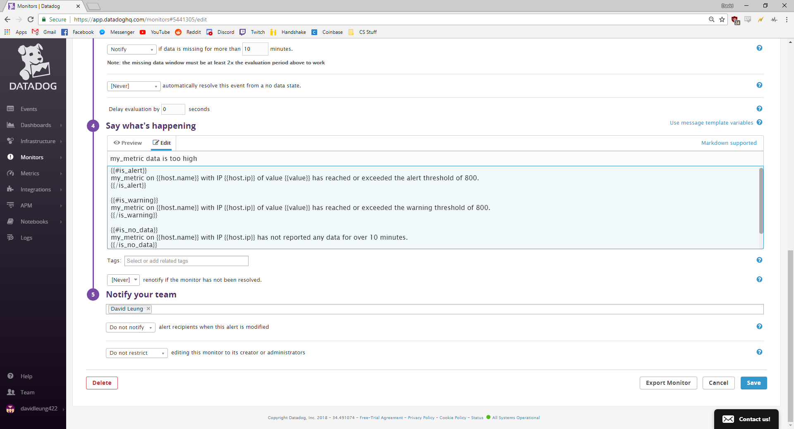

Screenshot of the email that Datadog sends when the monitor is triggered.

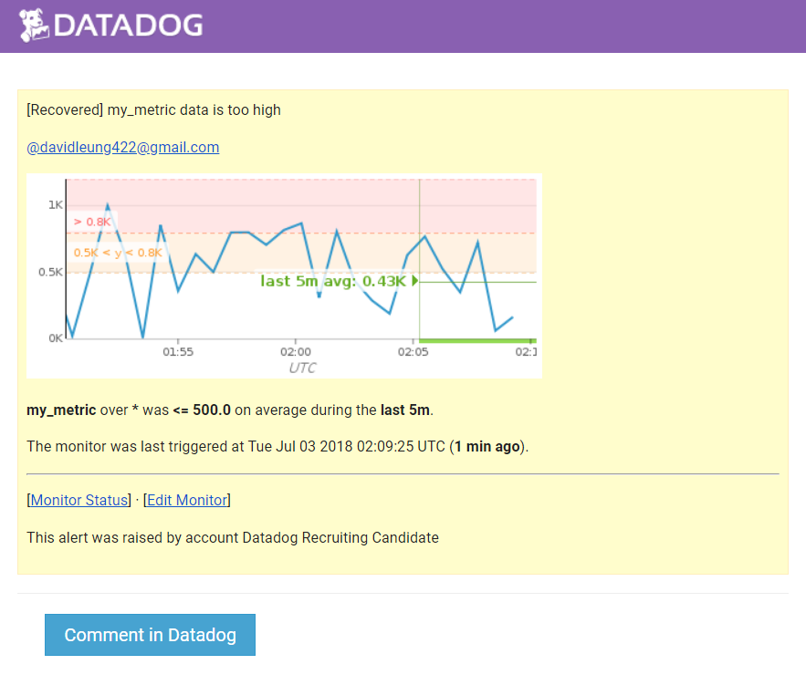

To create a downtime for the monitor, I implemented one that silenced itself between a certain time frames. Because I was filling out the downtime options after 7pm, Datadog did not allow me to create a recurring downtime for 7pm as it was an earlier time. This is why I set the downtime range from 8pm to 10am.

Options that I set for the downtime.

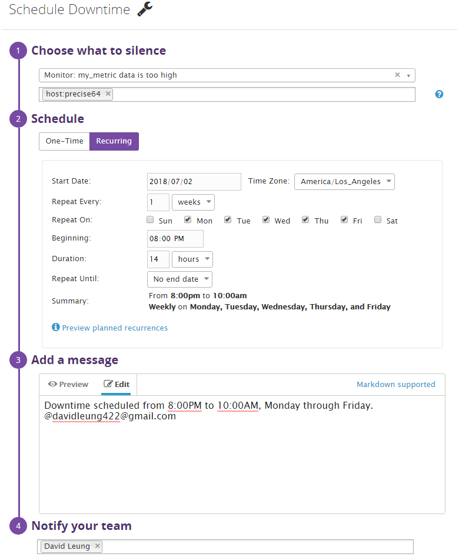

Screenshot that Datadog sends when the downtime is active.

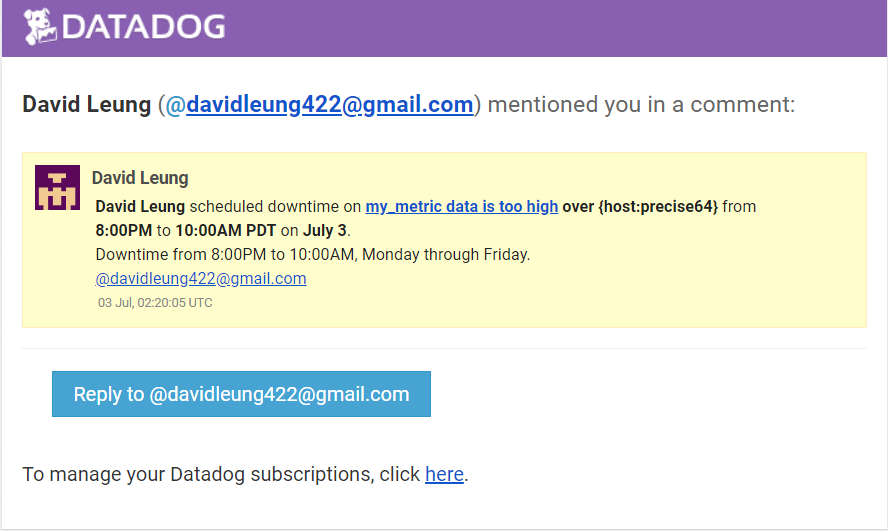

## Collecting APM Data:

To understand how Datadog's APM solution worked, I used this given Python guide and these [specific instructions](http://pypi.datadoghq.com/trace/docs/#module-ddtrace.contrib.flask) to walk me through the process. When I was instrumenting the given Flask app using Datadog's APM solution, I had trouble displaying it onto the Datadog tracing client. The prompt exclaimed that I should not use both `ddtrace-run` and Middleware at the same time so I chose to use Middleware. Unfortunately, I believe that my Flask was not able to connect with the APM solution even though it was able to run. Below, I have displayed the output of running my flask app.

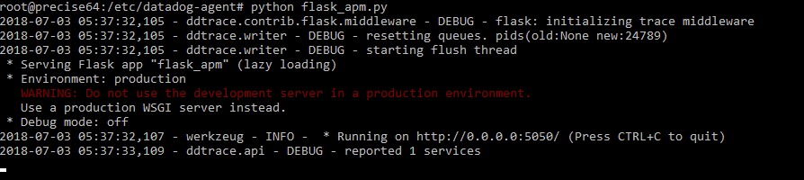

When I tried using the flask command `export FLASK_APP=apm_flask.py` and then `python -m flask run` it gave me a very specific error. 

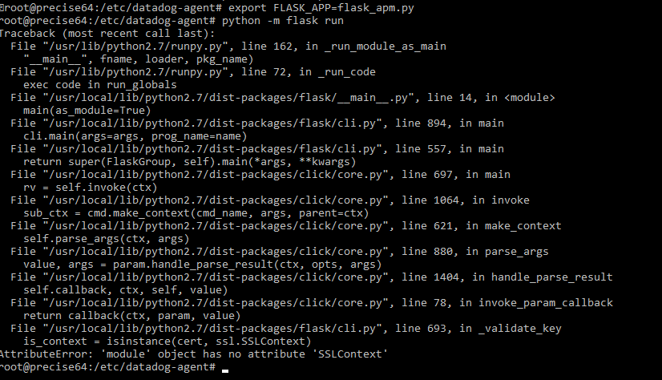

After Googling the error, it appears to be an issue with running older versions of Python. Even after upgrading Python to a newer version, a similar error also occured. There wasn't much else for me to do without risking my entire virtual machine and agent so I wanted to document this error in my report.

I have attached the instrumented app as `flask_apm.py` in this respository.

Bonus Question: A Service is a set of processes that work in conjunction to provide a feature. A simple web application may consist of two services: a single webapp service and a single database service. A Resource is a particular query or action to a service.

## Final Question

I think an interesting use of Datadog would be to monitor gym equipment usage to track lifting progress for a user or an entire gym. For users interested in seeing their efficiency in progressing with powerlifting, by being able to keep track of different exercises over a period of time, they can see what works best for their bodies which would save a lot of time. In powerlifting, the three competitive exercises are the bench press, squats, and deadlifts. Because there are numerous accessory lifts that are able to improve these competitive lifts, keeping track of each accessory lift would allow powerlifters to see what works and what doesn't.

Datadog can also be used for gyms looking to see the critical areas that they need to expand on and for users to see if the gym is busy. After reading Datadog's article on using its platform for office bathrooms, I was inspired to see that Datadog can also be used various other physical locations. Gyms can benefit from Datadog by keeping metrics on popular gym equipment such as benches and squat racks to understand the maximum efficiency between space and equipment. This would also allow gyms to understand the general motives of the population as to whether its mostly people who enjoy using treadmills or lifters who mainly use weights.

## Conclusion

This Solutions Engineer technical challenge was very interesting and I had a lot of fun learning about the Datadog platform and the numerous functions that it provides.

