Datadog is a monitoring service.  These documents allow anyone to build a basic Datadog integration allowing them greater insight to their infrastructure metrics.  

To do so, we will do the following:
1. [Setup the Datadog Environment](#Setup-the-Environment)
2. [Collect Metrics](#Collect-Metrics)
3. [Visualize Data](#Visualize-Data)
4. [Monitor Data](#Monitor-Data)
5. [Collect APM Data](#Collect-APM-Data)

# Setup the Environment
DataDog recommends the use of virtual machine's (VM) as to avoid dependency issues.  

VirtualBox is your virtualization software.  Vagrant is environment workflow software that will interface with VirtualBox.  

Building a VM from scratch is laborious.  Instead, Vagrant creates a clone of a VM through the use of 'boxes' leaving you with more time to create other computer bugs.  

Our four steps for setting up the environment:
1. Install VM & Vagrant software
2. Build the VM's environment
3. Create a clone of a virtual machine
4. Setup a Datadog Account

## Step 1: Install the virtual machine software  

1. Download VirtualBox [here](https://www.virtualbox.org/wiki/Downloads)  

2. Download Vagrant [here](https://www.vagrantup.com/downloads.html)

3. Confirm the installation from your command line:  
```
$ vagrant --version
> Vagrant 2.2.1
```

## Step 2: Build the project environment  
[Project Setup Docs](https://www.vagrantup.com/intro/getting-started/project_setup.html)

1. Create a directory/folder to store the VM and the related files.  I created a folder on my desktop.
```
$ cd ~/Desktop
$ mkdir DataDog2
```
2. Enter the new directory
```
$ cd DataDog2
```

3. Initialize Vagrant.  This will create the Vagrant workflow [See what the Vagrantfile does](https://www.vagrantup.com/docs/vagrantfile/)
```
$ vagrant init
```
4. Check out your work so far. You should see a ‘vagrantfile’ in the directory.
```
$ ls
```

## Step 3: Create a clone of a virtual machine

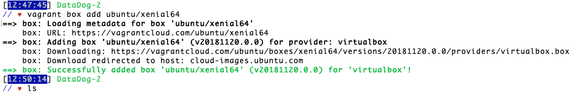
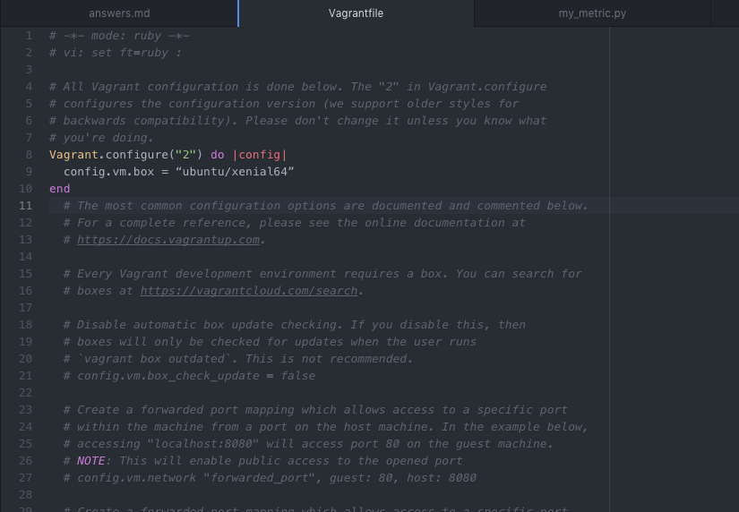

1. Create the clone of a VM using a 'box'. Choose a [box here](https://app.vagrantup.com/boxes/search)  
i.e. The documentation uses hashicorp/precise64 but I ran ubuntu/xenial64
```
$ vagrant box add ubuntu/xenial64
```

2. Change the contents of 'vagrantfile' to include the Ubuntu/Xenial box (or whatever box) you added in the prior step. Open the vagrantfile in a code editor.  Replace code as follows:
```
$ atom vagrantfile

//In the vagrantfile:

Vagrant.configure("2") do |config|
  config.vm.box = “ubuntu/xenial64”
end
```
4. Boot up the Vagrant environment.  
```
$ vagrant up
```
5. To interact with the VM environment and/or check if it is working, use the vagrant ssh command.
```
$ vagrant ssh

Your command line $ becomes:

vagrant@ubuntu-xenial:~$
```
DO NOT exit the VM, but if you want if you wish to do so
```
press 'CTRL' + 'D'
```

## Step 4: Setup DataDog Account

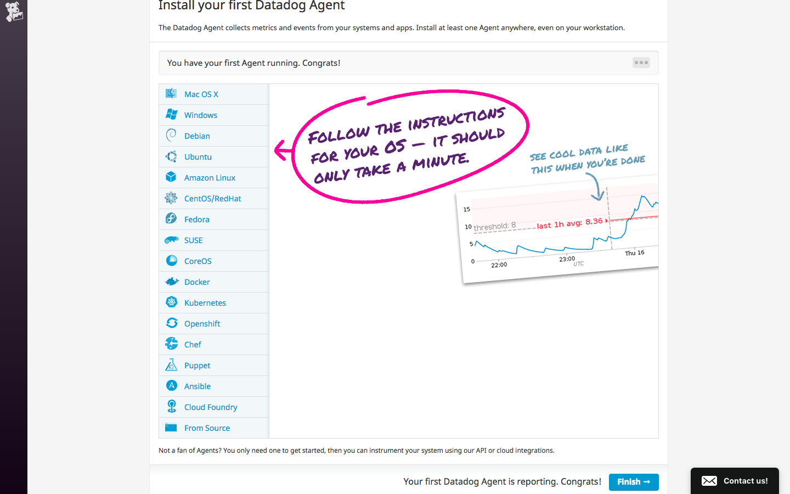

**If**, you installed the Agent to the desktop and want to remove it from the host, go [here](https://docs.datadoghq.com/agent/faq/how-do-i-uninstall-the-agent/?tab=agentv6)

**Else**,
1. Sign up for an [Account](https://app.datadoghq.com/signup)  

2. Double check your command prompt is inside the VM environment.  If not, get inside your VM directory (Step 2.2 in 'Setup the Environment') and enter the VM environment with **$ vagrant ssh** (Step 3.5 in 'Setup the Environment')

```
**This will be the command line prompt going forward:**
vagrant@ubuntu-xenial:~$
```

3. Install Agent.  Find this by entering Integrations menu and clicking Agent tab.  Copy and paste the "one-step install" command in your Vagrant SSH. The agent will run in the background.  
```
$ DD_API_KEY=abcdefghijklmnopqrstuv bash -c "$(curl -L https://raw.githubusercontent.com/DataDog/datadog-agent/master/cmd/agent/install_script.sh)"
```

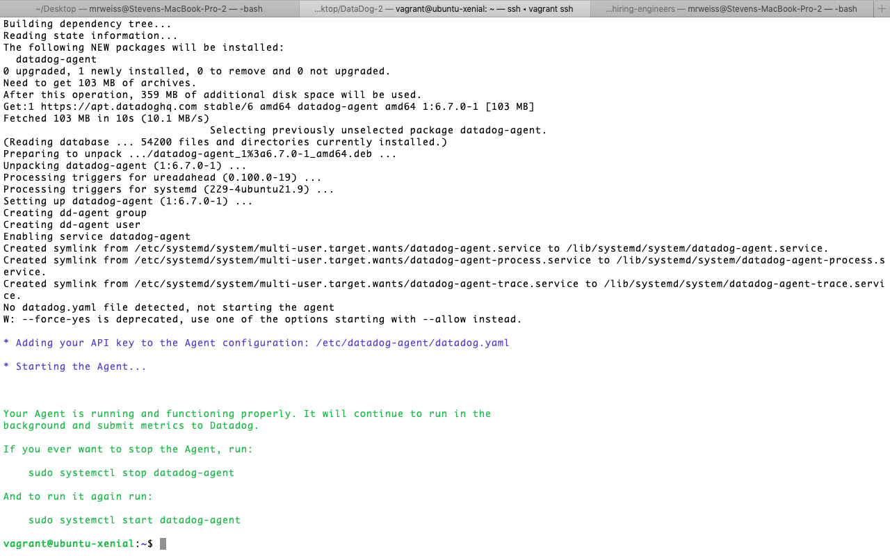

To halt the program:
```
$ sudo systemctl stop datadog-agent
```
To start it again:
```
$ sudo systemctl start datadog-agent
```
To check status. This will tell you where there you have errors.  For example, I had the wrong spaces into my datadog.yaml configuration.  
```
$ sudo datadog-agent status
```
-------------------------------------
</br>

# Collect Metrics
Tagging is used throughout Datadog to query the machines and metrics you monitor. Without the ability to add tags, finding problems in your environment poses some difficulty.  The tags, in sum, help you keep your ship in order.

The goal here is to install a database on the VM and integrate your database with the Datadog agent so they can begin monitoring your metrics or the health of your systems.

Our steps for collecting metrics:
1. Add tags to the Agent's config file
2. Install a database & respective Datadog integration
3. Create a custom Agent check that submits a metric named my_metric with a random value between (0, 1000)
4. Change your check's collection interval so that it only submits the metric once every 45 seconds.

## Step 1: Add tags in the Agent config file

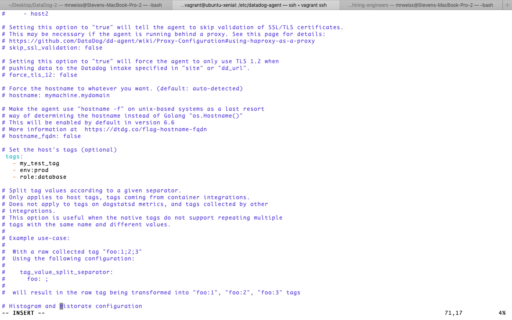

1. Configure the host tags submitted by the Agent inside datadog.yaml. [Relevant Docs](https://docs.datadoghq.com/agent/basic_agent_usage/ubuntu/?tab=agentv6)
```
$ cd /etc/datadog-agent
$ ls
$ sudo vim datadog.yaml
```
The above commands opens up the Linux virtual editor.  [How to use VIM](https://www.linux.com/learn/vim-101-beginners-guide-vim)

2. Scroll down to the line that reads **"Set the host's tags"**, **type 'i'** to enter Insert mode, and **delete** the hash next to tags.

3. When you are done, hit **ESC**, save and exit, type **:wq**

4. Restart the agent
```
$ sudo service datadog-agent restart
```
5. Check if it worked. Go to Host Map on the dashboard. After a few minutes, my tags should read 'stevetag'

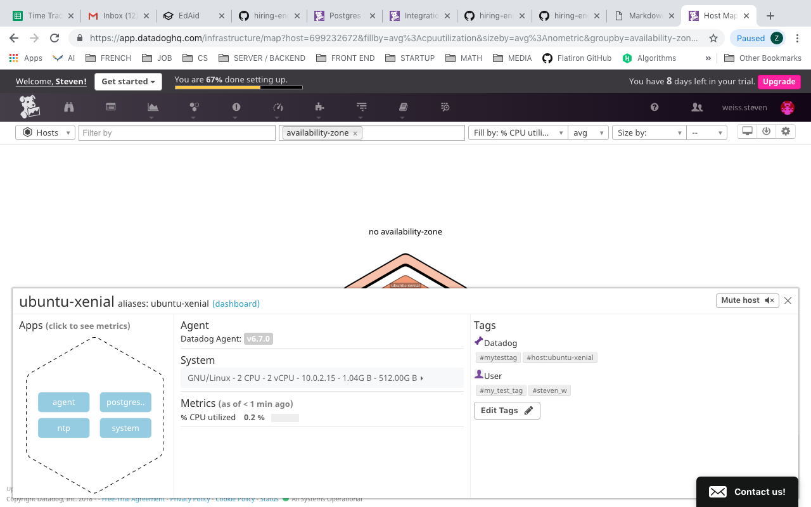

## Step 2: Install a database & respective Datadog integration
[Relevant Docs](https://docs.datadoghq.com/integrations/postgres/#prepare-postgres)

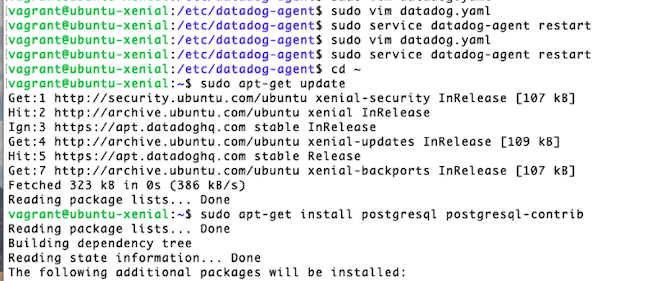

1. Install your database.  I used Postgresql and typed the following commands while it in my VM's root directory.  
```
$ sudo apt-get update
$ sudo apt-get install postgresql postgresql-contrib
```
2. Enter your database to check if it works.
```
$ sudo su - postgres
$ psql
```
If you wish to exit, this is how
```
postgres=# \q (or Ctrl + D)
```
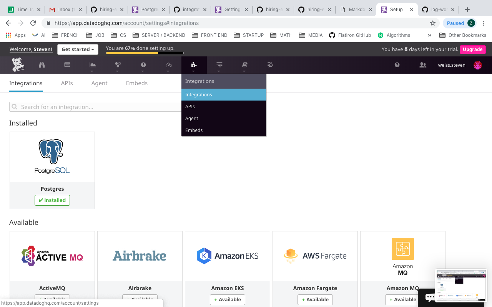
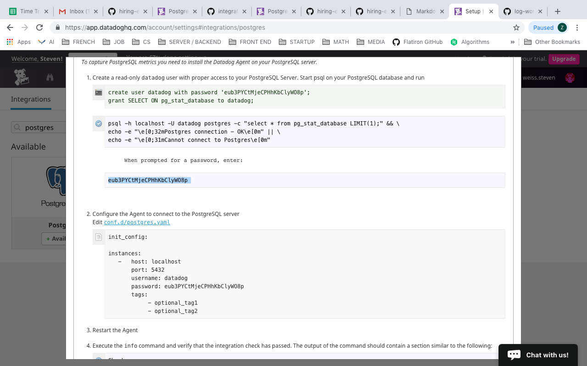

3. Click 'Integrations' (under the puzzle piece) on the Dashboard.  Install and Configure.  A window should appear:

Press 'generate password'. Then head over to your terminal.  

```
$ sudo su - postgres
postgres@ubuntu-xenial:~$ psql
```

4. Copy and paste the code next to the **terminal** icon.  Check the [docs](https://docs.datadoghq.com/integrations/postgres/) to reconcile your database version versus their code.  
```
postgres=# create user datadog with password 'the password they provide';
postgres=# grant SELECT ON pg_stat_database to datadog;
postgres=# \q
```

5. Copy and paste the code next to the **check** icon. Then, hit **enter** and copy and paste the password.  Your database will be connected.  

```
postgres@ubuntu-xenial:~$ psql -h localhost -U datadog postgres -c "select * from pg_stat_database LIMIT(1);" && \
echo -e "\e[0;32mPostgres connection - OK\e[0m" || \
echo -e "\e[0;31mCannot connect to Postgres\e[0m"
```

6. Edit the **conf.yaml.example** inside the conf.d/postgres.yaml directory.

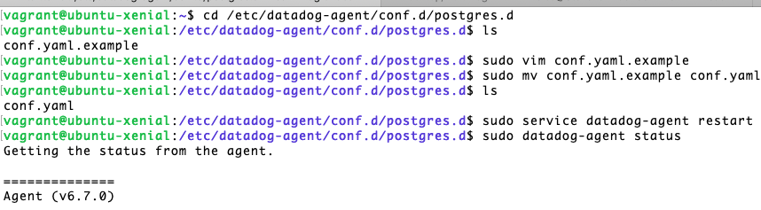
```
postgres@ubuntu-xenial:~$ Press Ctrl + D
$ cd /etc/datadog-agent/conf.d/postgres.d
$ ls
/etc/datadog-agent/conf.d/postgres.d$ sudo vim conf.example.yaml
```

7. Hit **'i'** and copy/paste the code from the configuration.  When you are done, hit **ESC**, save and exit, type **:wq**
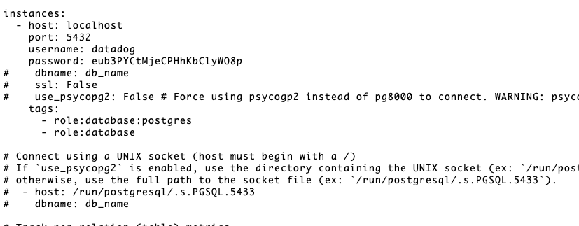
```
init_config:

instances:
   -   host: localhost
       port: 5432
       username: datadog
       password: eub3PYCtMjeCPHhKbClyWO8p
       tags:
            - optional_tag1
            - optional_tag2

```

8. Rename conf.yaml.example file to conf.yaml.
```
/etc/datadog-agent/conf.d/postgres.d$ sudo mv conf.yaml.example conf.yaml
```

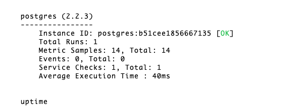

9. Restart the Agent & Check the Agent's status
```
$ sudo service datadog-agent restart
$ sudo datadog-agent status
```


10. Press "Install Integration".  Check back in a few minutes to see if the integration is working properly.  


## Step 3: Create a custom Agent check that submits a metric named my_metric with a random value between (0, 1000)
We can create a custom check to submit metrics to the Agent. To do so requires:
  1. A check file
  2. a YAML configuration file     

When this is set up, a random number will be sent with our check.  The check, by default, will try and run every 15 seconds.  
[Relevant Docs](https://docs.datadoghq.com/developers/write_agent_check/?tab=agentv6)


1. Head to the **checks.d** directory & create a Python file called 'my_metric'.
```
$ cd /etc/datadog-agent/checks.d
/etc/datadog-agent/checks.d$ sudo touch my_metric.py
```
2. Open up my_metric using **sudo touch my_metric.py**.  Edit by typing **i** and adding the code below.  When you are done, hit **ESC**, save and exit, type **:wq**

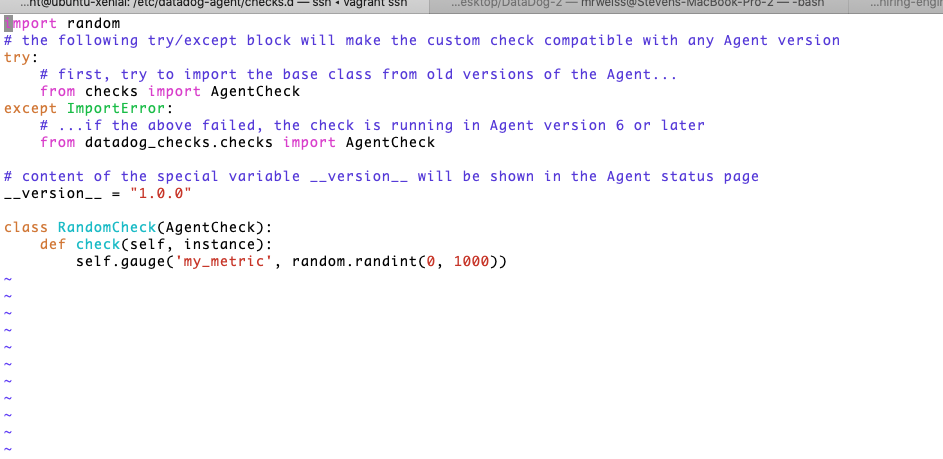

```
import random
# the following try/except block will make the custom check compatible with any Agent version
try:
    # first, try to import the base class from old versions of the Agent...
    from checks import AgentCheck
except ImportError:
    # ...if the above failed, the check is running in Agent version 6 or later
    from datadog_checks.checks import AgentCheck

# content of the special variable __version__ will be shown in the Agent status page
__version__ = "1.0.0"

class RandomCheck(AgentCheck):
    def check(self, instance):
        self.gauge('my_metric', random.randint(0, 1000))
```

4. Head into the conf.d directory.  Create a corresponding my_metric yaml file **sudo touch my_metric.yaml**.  Edit by typing **i** and adding the code below.  When you are done, hit **ESC** and save, by typing **:wq**

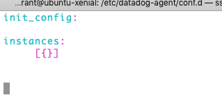

```
init_config:

instances: [{}]
```
3. Restart the Agent & check the Agent's status. my_metric should be now be visible under the category "Running Checks".
```
$ sudo service datadog-agent restart
$ sudo datadog-agent status
```

## Step 4: Change your check's collection interval so that it only submits the metric once every 45 seconds.

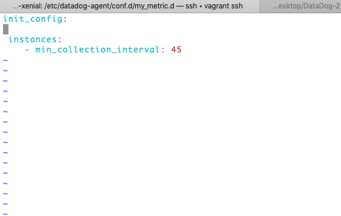
1. Open up my_metric.yaml file in the conf.d directory. When you are done, hit **ESC**, save and exit, type **:wq**
```
$ sudo vim my_metric.yaml

init_config:

 instances:
    - min_collection_interval: 45
```

2. Restart the Agent & Check the Agent's status
```
$ sudo service datadog-agent restart
$ sudo datadog-agent status
```

3. After about 45 seconds, repeat above step. Note in these images that the 'Metric Sample' has incremented by 1.

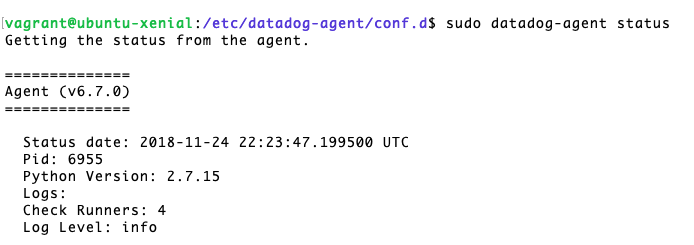 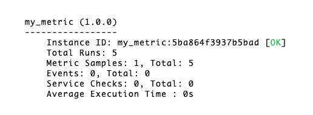
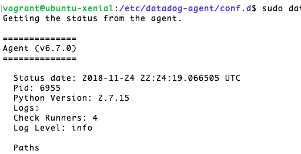 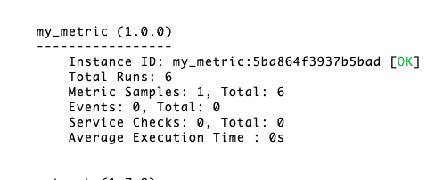


**Bonus Question** Can you change the collection interval without modifying the Python check file you created?

Yes.  You can run this command with the -d flag and an integer argument standing for desired seconds.  
```
sudo -u dd-agent -- datadog-agent check my_metric -d 30
```
-------------------------------------
</br>

# Visualize Data
In math we use analysis to see phenomena, but it is also useful to apply different approaches to gain a greater understanding of a particular problem.  For example, we may use geometry to under why a number squared is a side multiplied by itself, two times.  

Datadog doesn't leave us staring at the matrix.  It gives us perspective.  Their tools provide robust data visualization features to help us gain a greater grasp of the metrics we are tracking.

We can manipulate data through scripts and the API or we can adjust the graphs manually.  With this data, we can notify our team to pertinent data points.  In our example, we will adjust our grapht to five minutes and sent a note using the @ notation.

The two major tools Datadog has are the Timeboard and the Screenboard.  [Boards](https://www.youtube.com/watch?v=uI3YN_cnahk)

Our two steps for visualizing data:
1. Create a Timeboard
2. Accessing it and sending ourselves information

## Step 1: Create a Timeboard

1. To utilize the Datadog API we need to add software to VM // [Relevant Docs](https://docs.datadoghq.com/integrations/python/)

```
$ sudo apt-get install python-pip
$ sudo pip install datadog

```
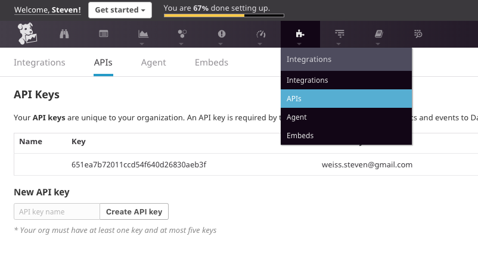
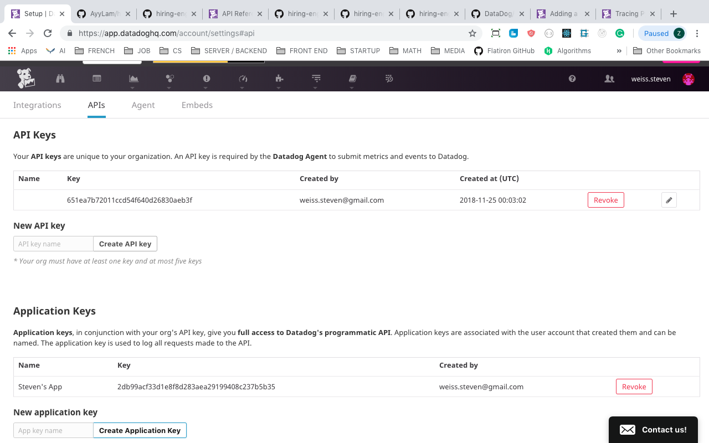

2. Click the 'API' menu item on the Dashboard. Then, generate an **application key**


3. Head to the datadog-agent folder. Create a Python file.  

```
$ cd etc/datadog-agent
$ sudo touch timeboard.py
$ sudo vim timeboard.py
```
4. Open the timeboard.py file using an editor and add in the following code from the [API documentation](https://docs.datadoghq.com/api/?lang=python#create-a-timeboard)

5. Edit the code using an editor **sudo vim timeboard.py** to adjust graphs accordingly - Aggregation function, an Anomaly function, and a Rollup function.  [Relevant Docs](https://docs.datadoghq.com/graphing/graphing_json/)

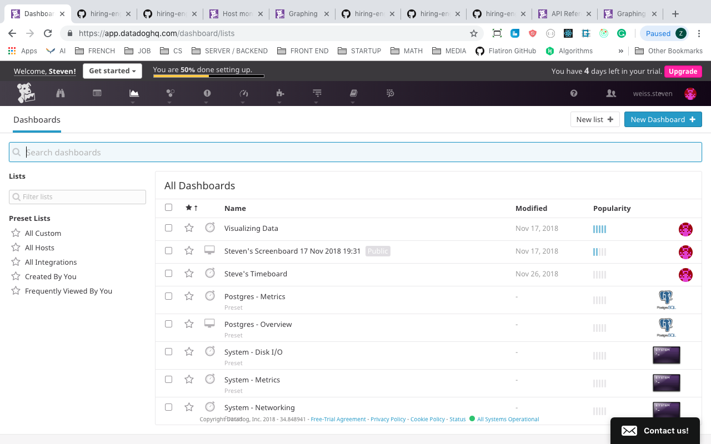
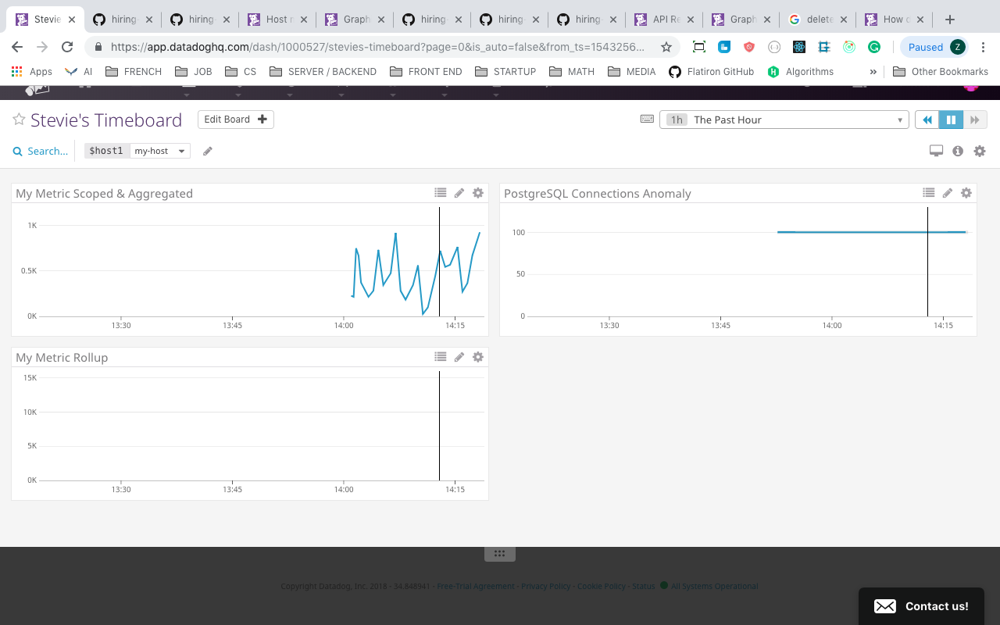

6. Exit editor, save, and execute code to create Timeboard
```
$ python timeboard.py
```
Here is the [Timeboard Code](./files/timeboard.py)

## Step 2: Access the Timeboard and notify yourself

1. Once this is created, access the Dashboard from the Datadog user interface.

2. Set the Timeboard's timeframe to the past 5 minutes by selecting a starting point on the graph and dragging the cursor for five minutes.  

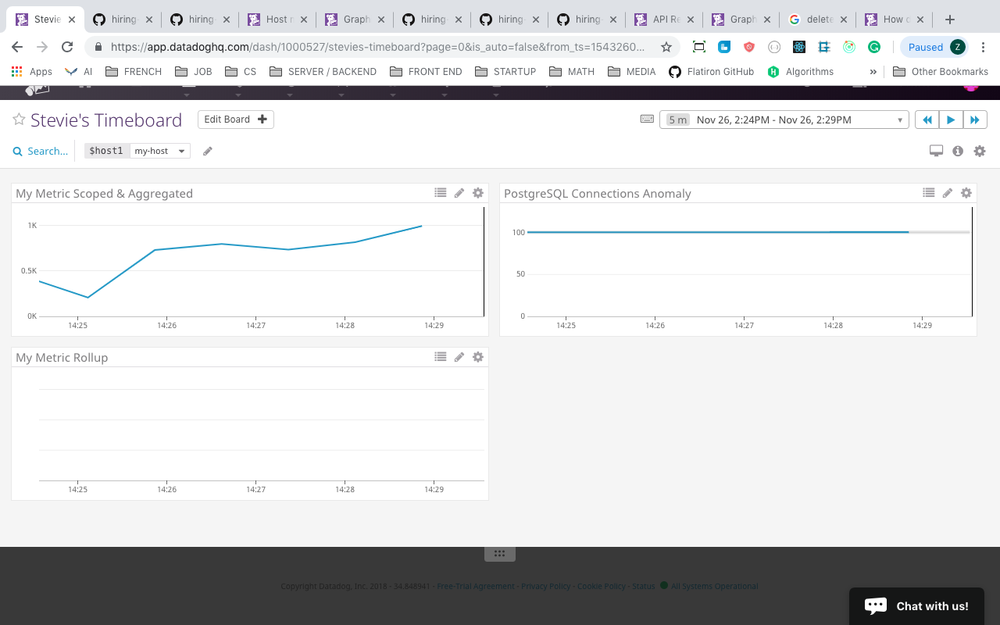

3. Send a notification with the @ notation

 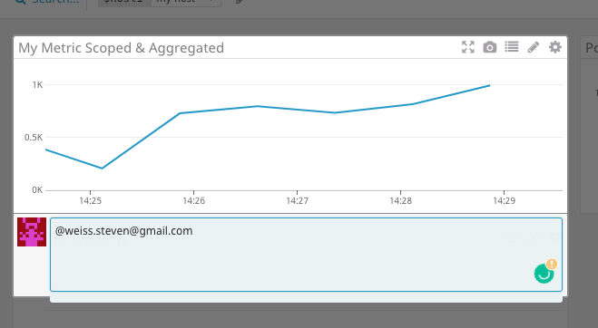

**Bonus Question:** What is the Anomaly graph displaying?

It graphs a metrics' normal context.  Often, our metrics can have a few peaks and valleys.  The anomaly function considers this, then graphs a chart to show the trend of the graph without the peaks and valleys.  

For example, if a zoologist wanted to set an alarm clock for the coming month based on the prior month's wake times.  First, she would input all her waking times over thirty days.  Then, sort through the average days.  Finally, she would disregard all the long nights out at the bar till 4am.  Then, with the 'normalized' data, she would set the alarm.  The anomaly function is the zoologist's alarm analysis.  

-------------------------------------
</br>

# Monitor Data
While reading and seeing our metrics goes a long way towards understanding, Datadog has additional tools to create an even richer picture.  Often we have undesired or unexpected data.  By creating monitors with custom parameters and notifications, we can take proactive approaches to our data.  

Our two steps to monitor data:
1. Create a new monitor with the desired parameters
2. Configure the monitor’s message when thresholds (or nothing) occurs

## Step 1: Create a new monitor with the desired parameters
Create a new Metric Monitor that watches the average of your custom metric (my_metric) and will alert if it’s above the following values over the past 5 minutes:

1. Find the 'sprocket' icon in whatever graph you want to monitor. Click 'new monitor'.

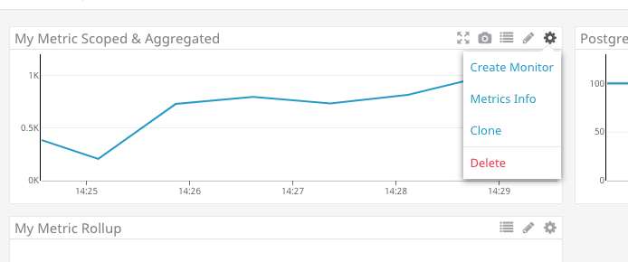

2. Check if metric is defined, in this case I want 'my_metric' and 'ubuntu-xenial' as host

3. Create thresholds and decide on notification if data is missing

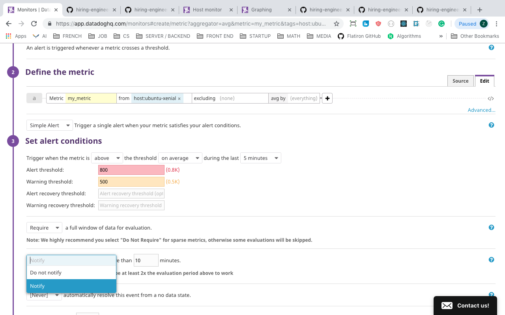

## Step 2: Configure the monitor’s message when thresholds (or nothing) occurs
// [Relevant Docs](https://docs.datadoghq.com/monitors/notifications/?tab=is_alertis_warning)

1. Send you an email whenever the monitor triggers.

2. Create different messages **{{#is_warning}}** based on whether the monitor is in an Alert, Warning, or No Data state.

3. Include the metric value **{{value}}** that caused the monitor to trigger and host ip **{{host.ip}}** when the Monitor triggers an Alert state.

```
{{#is_alert}} <br/>
Alert: Value has exceeded an average of 800 over the past 5 minutes. <br/>
Value: {{value}}  <br/>
Host: {{host.name}} <br/>
{{/is_alert}} <br/>
<br/>
{{#is_warning}} <br/>
Warning: Value has exceeded an average of 500 over the past 5 minutes.  <br/>
Value: {{value}} <br/>
Host: {{host.ip}} <br/>
{{/is_warning}} <br/>
<br/>
{{#is_no_data}} <br/>
Alert: No data over the past 10 minutes.<br/>
Value: Unknown <br/>
Host: {{host.name}} <br/>
{{/is_no_data}} <br/>
<br/>
Contact @weiss.steven@gmail.com
```
4. Notify team member(s)

5. Hit **Save**

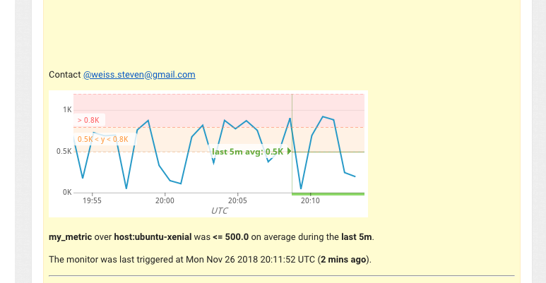


* **Bonus Question**: Since this monitor is going to alert pretty often, you don’t want to be alerted when you are out of the office. Set up two scheduled downtimes for this monitor:

- One that silences it from 7pm to 9am daily on M-F,
- And one that silences it all day on Sat-Sun.
- Make sure that your email is notified when you schedule the downtime and take a screenshot of that notification.

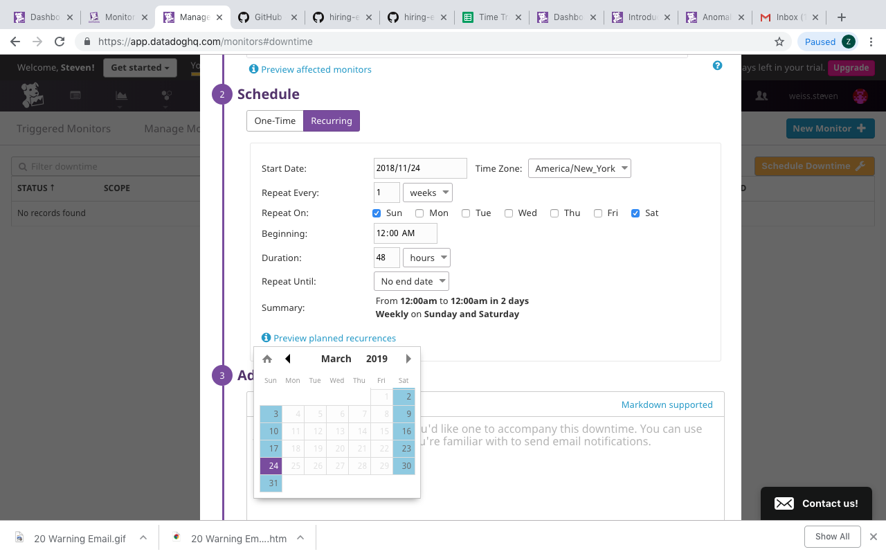
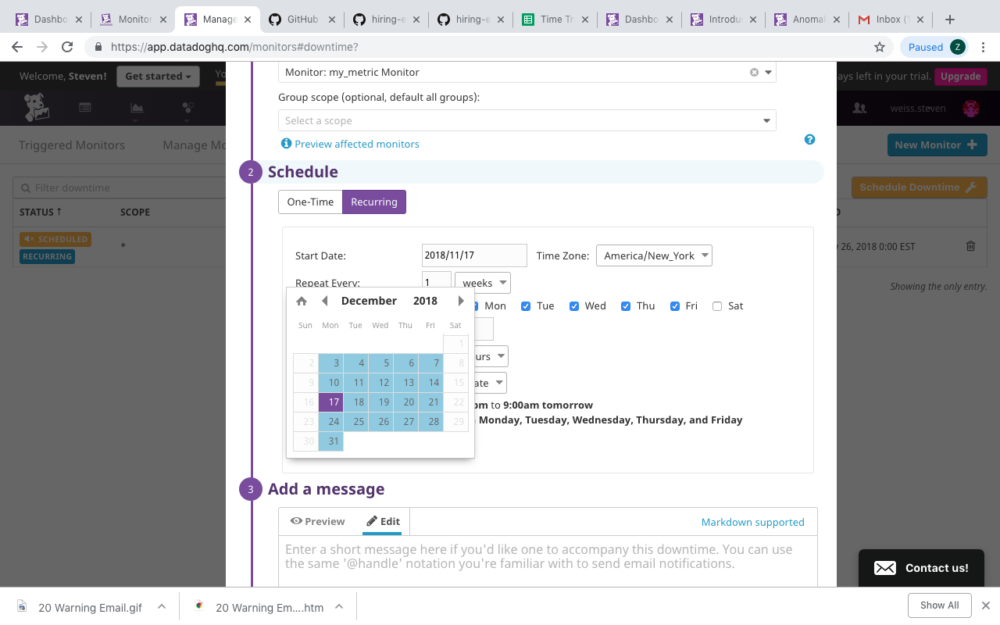

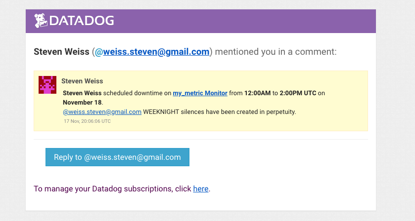

-------------------------------------
</br>

# Collect APM Data
Thus far we have setup tools to observe our infrastructure.  As the infrastructure grows, the complexity and the root causes for problems will become more opaque.  Ideally, we will use better tools/applications.  But what if the tools are faulty?  How would we collect data on the tool?  This is a blind spot in our monitoring.  Fortunately, this is where Application Performance Monitoring (APM) comes in.  APM allows the user to collect, search, and analyze traces across fully distributed architectures.

Our three steps to collect APM data:
1. Create the application
2. Instrument the application
3. Let the world know with a Screenboard

## Step 1: Create the application
1. Navigate to the *etc/datadog-agent* and create a file for the application
```
$ sudo touch app.py
```
2. Open file and add your code.

[Flask App](.files/app.py)

3. Add corresponding libraries (if necessary)
```
$ sudo pip install flask
```

## Step 2: Instrument the application
**Note**: Using both ddtrace-run and manually inserting the Middleware has been known to cause issues. Please only use one or the other.

1. Open your datadog.yaml file and delete the hashes such that your code looks like this. This will enable APM trace.  Save and restart.  
```
apm_config:
#   Whether or not the APM Agent should run
  enabled: true
```
2. Head over to the docs menu under APM in the UI [APM Docs](https://app.datadoghq.com/apm/docs) and follow the first command
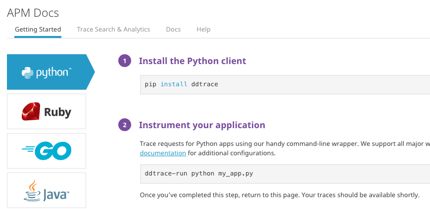

```
$ pip install ddtrace
```

3. Run application. A server will start.  

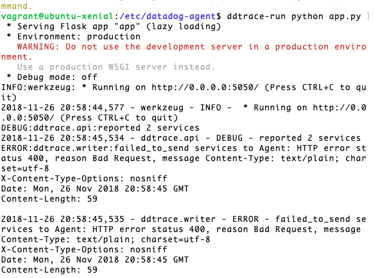

```
$ ddtrace-run python app.py
```

4. Open a new tab in terminal (Ctrl + T), enter the VM **vagrant ssh** and make calls to the localhost,.
```
curl localhost:5050/
curl localhost:5050/
curl localhost:5050/
```
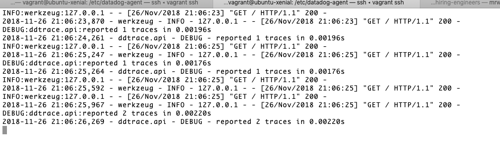
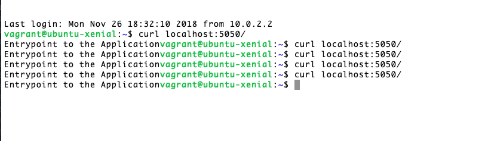


## Step 3: Create a Screenboard

1. Create a new dashboard.  Choose Screenboard.

2. Choose metrics to display.  I chose the system.cpu and the flask app requests.

[Public URL](https://p.datadoghq.com/sb/6ac05d7a5-6b9d92bd8824c3a8030e158d0bbe2e44)

28. * **Bonus Question**: What is the difference between a Service and a Resource?

First, let's define a service and a resource.

From the Datadog FAQ, a "Service" is the name of a set of processes that work together to provide a feature set.  In my working solution, the Flask app is an example of a service.  In general, a service would be any front-end built with functions or any backend algorithms.  

A "Resource" is the query to a service.  In apps, we see resources as 'routes'; in databases, we see resources in the form of database queries.  An example, a frontend user making a POST request to an app's backend to create a login account.  

Since most programs can be distilled down to procedures, the differences are akin to the separation of concerns in the design of any procedure - we create the body of a procedure that describes the behavior and we call the procedure with a desired input.  In a procedure we 'blackbox' an action and and provide a thing.  

In terms of service and resource, a service is the function/procedure that describes and embodies the desired behaviors of the program.  The resources are the calls and arguments that feed the functions.  While services and resources are not dependent on each other, that is, we can still have services designed without resources and resources designed without services, they are designed to know of each others existence.   

-------------------------------------
</br>

## Final Question:
Datadog has been used in a lot of creative ways in the past. We’ve written some blog posts about using Datadog to monitor the NYC Subway System, Pokemon Go, and even office restroom availability!

Is there anything creative you would use Datadog for?

Companies want great teams, but still recruit disparate individuals.  I think it would be possible to create a system, using several Datadog integrations (Slack, Github, Hipchat), that monitor a group of programmers that are friends, track their collaboration, and create a score to see how they work together and collaborate.  This would allow a company to recruit groups with an emphasis on collaboration.  
