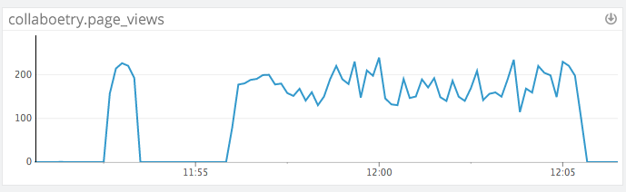
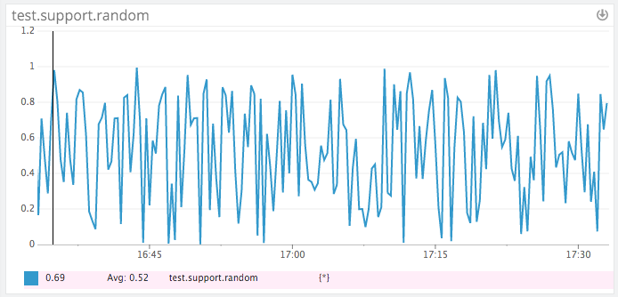

# Level 1
* Sign up for Datadog: done!
* Bonus question: what is the agent?
  * The agent is software that runs on your hosts, and it collects events and metrics for you. It then delivers this information to Datadog so that you can make good use of your performance and monitoring data. It's made up of three parts:
    1. the collector: this monitors your current machine for installed integrations, and tracks your system metrics (such as CPU and memory).
    2. dogstatsd: this is a statsd backend server which you can use to send custom metrics from an application.
    3. the forwarder: this fetches the data from #'s 1 and 2, and then prepares said data for transfer to Datadog.


* Submit an event via the API:
  * I instrumented code for a MEAN stack app called [Loci](https://github.com/kwwalter/MemoryPalace), using the dogapi npm package):

  ```javascript
  var dogapi = require('dogapi');

  // dogapi configuration
  var options = {
    api_key: process.env.DD_API_KEY,
    app_key: process.env.DD_APP_KEY
  };

  dogapi.initialize(options);

  // dummy event submission via API

  var title = "It works!",
      text  = "Loci app successfully accessed through Heroku!",
      properties = {
        priority: "low",
        tags: ["loci", "heroku"],
        alert_type: "info"
      };

  dogapi.event.create(title, text, properties, function(err, res){
    if (err) {
      console.log("error posting dummy event to dogapi: ", err);
    } else {
      console.log("here's the response: ", res);
    }
  });
  ```

* Get an event to appear in your email inbox:
  * Hooray!
  

# Level 2
* Take a simple web app and instrument your code with dogstatsd
  * For this, I used a different app, [Collaboetry](https://github.com/kwwalter/Collaboetry), as well as the node-dogstatsd npm package:

    ```javascript
    var StatsD = require('node-dogstatsd').StatsD;

    // node-dogstatsd setup
    var dogstatsd = new StatsD();

    // increment
    router.get('/login', function(req, res){
      dogstatsd.increment('collaboetry.page_views');
      res.render('users/login');
    });
    ```

* While running a load test for a few minutes, visualize page views per second. Send a link to the graph.
  * Note: instead of using ab or tsung, I used an npm package called loadtest.
  * With loadtest, I used the following test: `loadtest -c 100 -n 10000 http://localhost:3788/users/login`, and I executed it a few times.
  * The last test I ran completed the 10000 requests in 46.79s, with the longest request taking 1123ms.
  
  * You can see the graph [here](https://app.datadoghq.com/metric/explorer?live=false&page=0&is_auto=false&from_ts=1452531330055&to_ts=1452531938344&tile_size=l&exp_metric=collaboetry.page_views&exp_scope=&exp_agg=avg&exp_row_type=metric&exp_calc_as_rate=true).


* Create a histogram to see the latency; also give us the link to the graph
  * I did a couple of tests here:
    1. Load one poem/post: `collaboetry-1poem.latency`
      ```javascript
        router.get('/authors/:authorID/:poemID', function(req, res) {
          var start = Date.now();

          if (res.locals.userLoggedIn) {
            Poem.findOne( {
              _id: req.params.poemID
            }, function(err, foundPoem) {
              if (err) {
                console.log("Error finding individual poem with id: ", req.params.poemID);
              } else {
                console.log("found poem is: ", foundPoem);
                var latency = Date.now() - start;
                dogstatsd.histogram('collaboetry-1poem.latency', latency);
                dogstatsd.increment('collaboetry.page_views');

                res.render('poems/show', {
                  poem: foundPoem,
                  currentUser: req.session.currentUser
                });
              }
            });
          } else {
            res.redirect(302, '/');
          }
        });
      ```
      * You can see this graph [here](https://app.datadoghq.com/metric/explorer?las=1h&exp_metric=collaboetry_1poem.latency.count&exp_scope=&live=false&page=0&is_auto=false&from_ts=1452529111726&to_ts=1452536947885&tile_size=l&exp_agg=avg&exp_row_type=metric).
    2. And a simpler example, for accessing and rendering the login page (in keeping with what I did for the load test): `collaboetry-login.latency`
      ```javascript
      router.get('/login', function(req, res){
          var start = Date.now();

          var latency = Date.now() - start;
          dogstatsd.histogram('collaboetry-login.latency', latency);
          dogstatsd.increment('collaboetry.page_views');

          res.render('users/login');
      });
      ```
      * You can take a look at this graph [here](https://app.datadoghq.com/metric/explorer?las=1h&exp_metric=collaboetry_login.latency.count&exp_scope=&live=false&page=0&is_auto=false&from_ts=1452530307991&to_ts=1452535837113&tile_size=l&exp_agg=avg&exp_row_type=metric)


* Bonus points for putting together more creative dashboards.
  * [Here](https://app.datadoghq.com/dash/90969/collaboetry-latency--views?live=false&page=0&is_auto=false&from_ts=1452534851274&to_ts=1452547486479&tile_size=m) is a dashboard I put together. I ended up tweaking it later in the process, so it doesn't show the `collaboetry-1poem.latency` or `collaboetry-login.latency` anymore, but it's more pertinent to later examples.

# Level 3
* tag your metrics with `support` (one tag for all metrics).
  * Building on the same example from Level 2, I've added the `support` tag to both `collaboetry-login.latency` and `collaboetry.page_views`, as well as `collaboetry-1poem.page_views`:
  ```javascript
  router.get('/login', function(req, res){
      var start = Date.now();

      var latency = Date.now() - start;
      dogstatsd.histogram('collaboetry-login.latency', latency, ['support']);
      dogstatsd.increment('collaboetry.page_views', ['support']);

      res.render('users/login');
  });
  ```
* tag your metrics per page
  * I went through and added page-specific metrics throughout my app, with tags such as:

    ```javascript
    dogstatsd.increment('collaboetry.page_views', ['support', 'page:root']);
    dogstatsd.increment('collaboetry.page_views', ['support', 'page:home']);
    dogstatsd.increment('collaboetry.page_views', ['support', 'page:404']);
    dogstatsd.increment('collaboetry.page_views', ['support', 'page:all-author-poems']);
    dogstatsd.increment('collaboetry.page_views', ['support', 'page:all-authors']);
    ...
    ```
  You can see them all here:
  

* visualize the latency by page on a graph (using stacked areas, with one color per `page`)
  * I updated the code to calculate the latency for each distinct route (and had 14 unique `page` tags), and this is the resulting graph:
  

  * I also made a simple dashboard for this [here](https://app.datadoghq.com/dash/91007/collaboetry-latency-by-page?live=false&page=0&is_auto=false&from_ts=1452538753944&to_ts=1452539146526&tile_size=m).

# Level 4
* **NOTE**: because I had to be logged in to access particular pages, the numbers here are low because they're just the result of me clicking around in the app. If I were to do the load test using any other route from the app, it would just be redirected to the login page anyway.
* count the overall number of page views using dogstatsd counters
  

  You can see the results on [this dashboard](https://app.datadoghq.com/dash/90969/collaboetry-latency--views?live=false&page=0&is_auto=false&from_ts=1452524208016&to_ts=1452542317147&tile_size=m) as well.
* count the number of page views, split by page (hint: use tags), and visualize the results on a graph
  

  These results can be found on the [same dashboard](https://app.datadoghq.com/dash/90969/collaboetry-latency--views?live=false&page=0&is_auto=false&from_ts=1452524208016&to_ts=1452542317147&tile_size=m).
* Bonus question: do you know why the graphs are very spiky?
  * I'm guessing that this has to do with how the data is being collected. The graphs in the previous two bullet points aren't really great examples since, again, they're the result of my haphazard clicking through the app. However, if we were to look at an example from one of my load tests, like [this](https://app.datadoghq.com/metric/explorer?las=1h&exp_metric=collaboetry.page_views&exp_scope=host%3AFields-of-Wheat.local&live=false&page=0&is_auto=false&from_ts=1452531037713&to_ts=1452531990134&tile_size=m&exp_agg=avg&exp_row_type=metric):

    

  * We can see here that it's a little more spiky, which is likely a result of the number of requests that the loadtest is sending per second, and the refresh rate for Datadog's agent. They're almost certainly not executing at the exact same rate, hence the jagged line graph.

# Level 5
* Write an agent check that samples a random value. Call this new metric: `test.support.random`
  * To do this, I followed along with the two examples in the Datadog ["Writing an Agent Check"](http://docs.datadoghq.com/guides/agent_checks/) documentation. Once I figured out how to actually *run* the check through the agent, it was smooth sailing :)

  * In the `conf.d` folder, I created the following `level5-test.yaml` file:

    ```yaml
    init_config:

    instances:
        [{}]
    ```

  * Then, in the `checks.d` folder, I touched a new `.py` file with the exact same name as the configuration file. Here's what my `level5-test.py` file ended up looking like:

    ```python
    import random
    from checks import AgentCheck

    class TestCheck(AgentCheck):
        def check(self, instance):
            self.gauge('test.support.random', random.random(), tags=['level_5_test'])
    ```
* Visualize this new metric on Datadog, send us the link.
  The dashboard I created for this can be found [here](https://app.datadoghq.com/dash/91336/level-5----testsupportrandom?live=true&page=0&is_auto=false&from_ts=1452631074844&to_ts=1452634674844&tile_size=m).
  And here's a screenshot as well!

  
