## Questions

Please provide screenshots and code snippets for all steps.

## Prerequisites - Setup the environment

### Environment Setup
#### Step 1- Download and install Vagrant
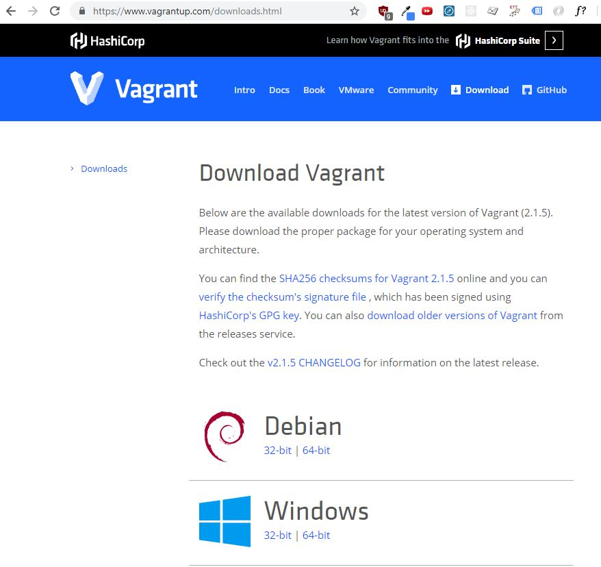

#### Step 2- Download and install Vitural Box
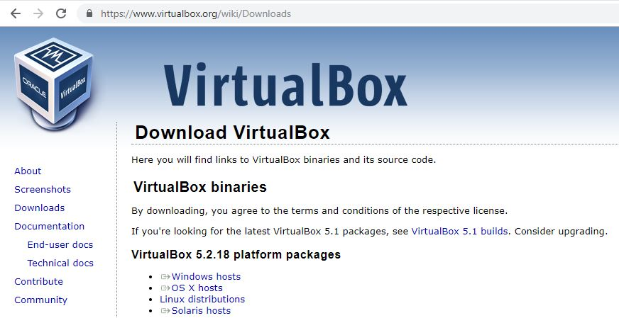

#### Step 3- Make a directory to house Vagrantfile
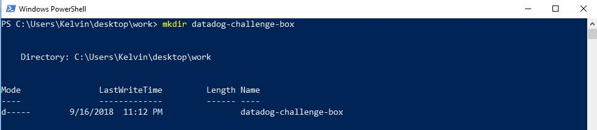

#### Step 4- Download Vagrant Box Base File
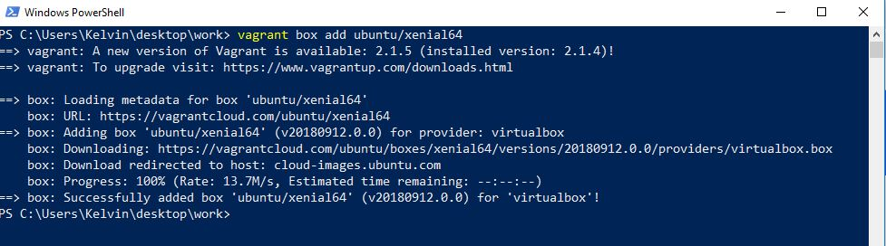

#### Step 5- Add Vagrantfile snippet as directed for box
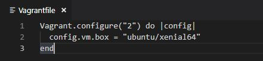

#### Step 6- Run `vagrant up`
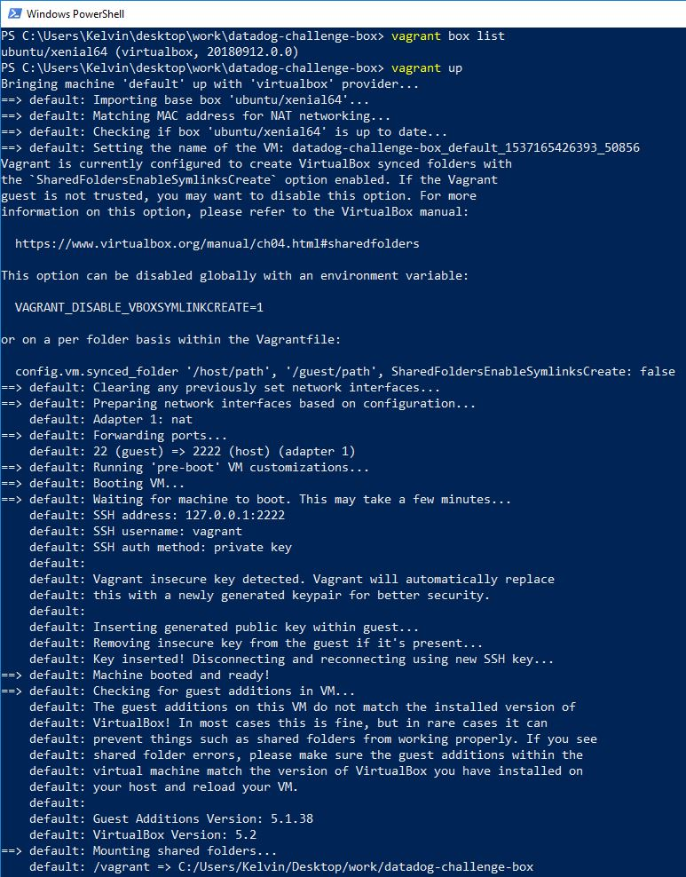

#### Step 7- SSH into vagrant box that is setup
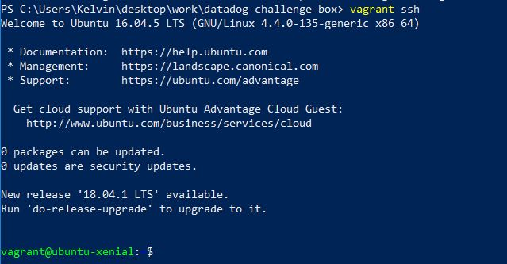

#### Step 8- Look at Virtual Box GUI to show vagrant box being setup
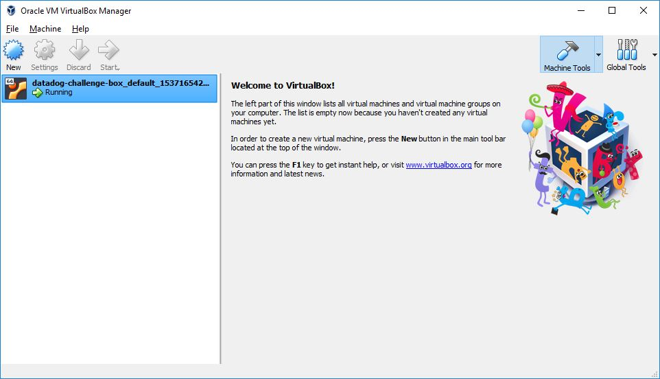

#### Step 9- Sign up for Datadog
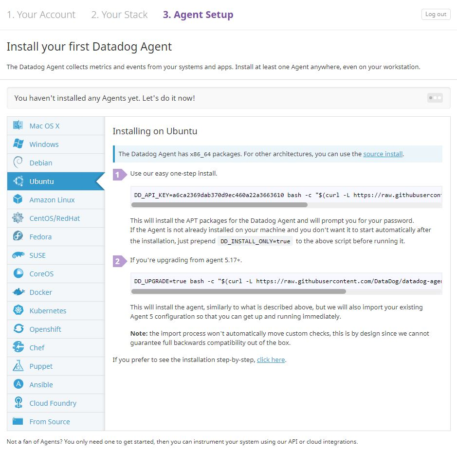

## Collecting Metrics:

### Add tags in the Agent config file and show us a screenshot of your host and its tags on the Host Map page in Datadog.
#### Step 1 - Add tags in agent config file
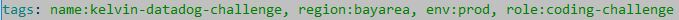

#### Step 2 - Inspect tags in hostmap view
**Tags showed after restarting services and rebooting**  
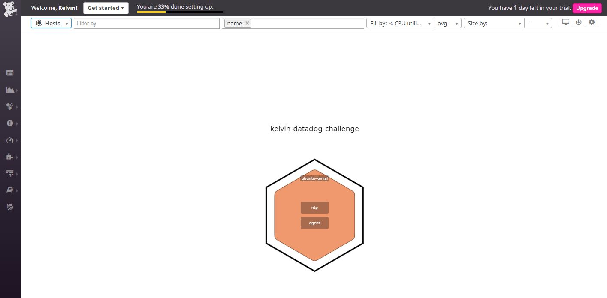  
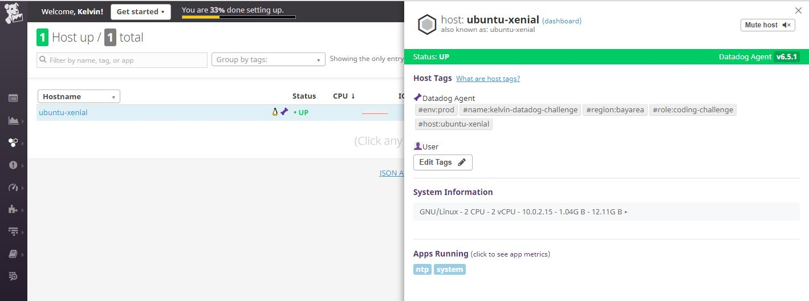

### Install a database on your machine (MongoDB, MySQL, or PostgreSQL) and then install the respective Datadog integration for that database.
#### Step 1 - Install PostgreSQL
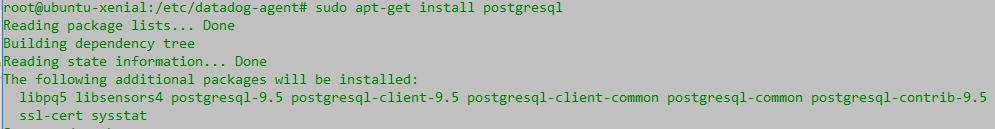  
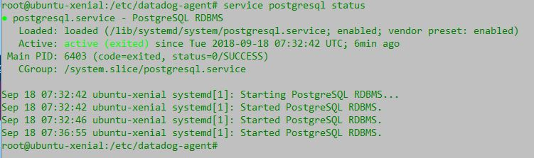  

#### Step 2 - Grant Table Permissions to user datadog
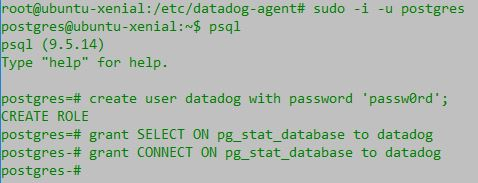  

#### Step 3 - Confirm Database is setup correctly
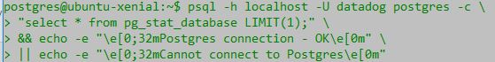  
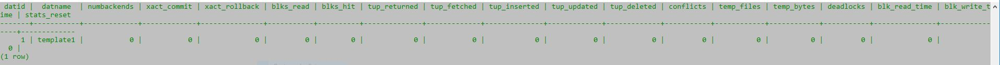  
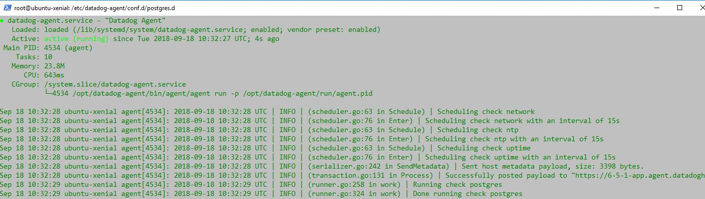  
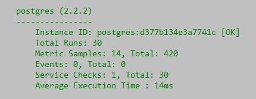  

#### Step 4 - Install integration on datadog site
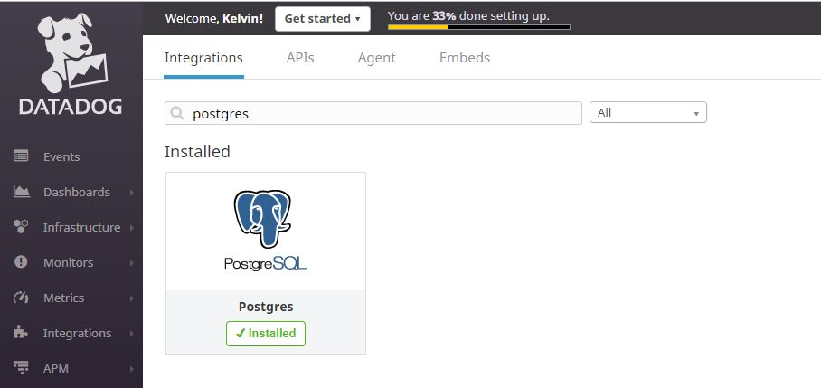  
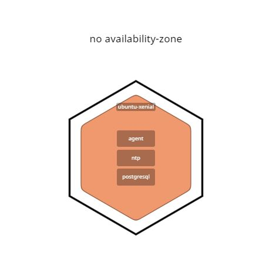  

### Create a custom Agent check that submits a metric named my_metric with a random value between 0 and 1000.
#### Step 1 - Create `my_metric.py` file under `etc/checks.d`
  
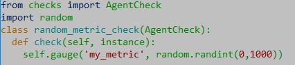  

#### Step 2 - Create `my_metric.yaml` under `etc/conf.d`
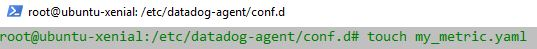  

#### Change your check's collection interval so that it only submits the metric once every 45 seconds.
**Modified `my_metric.yaml` to the following**  
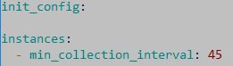  

A timeout function could also be written in the python file under `checks.d` to ensure metrics are sent only once every 45 seconds.  
**Checked that my_metrics were being recorded on the datadog site**  
**Had to restart datadog agent service and reboot server in order for my_metric to show up in metrics page**  
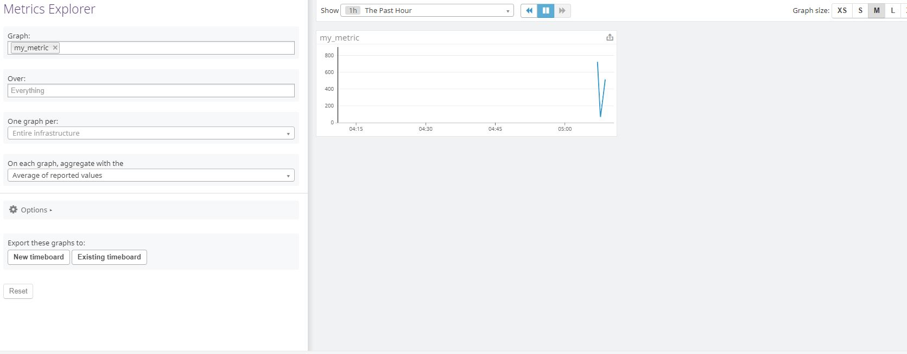  

### **Bonus Question** Can you change the collection interval without modifying the Python check file you created?
By including the property `min_collection_interval` in the yaml file, we've ensured that reporting is done as often as once every 45 seconds.  
According to the documentation, this doesn't mean that the metric is collected once every 45 seconds, but rather that it could be collected as often as once every 45 seconds.  
I assume that this would mean that setting the time in the python file would be more accurate.  

## Visualizing Data:

### Utilize the Datadog API to create a Timeboard that contains:

* Your custom metric scoped over your host.
* Any metric from the Integration on your Database with the anomaly function applied.
* Your custom metric with the rollup function applied to sum up all the points for the past hour into one bucket

### Please be sure, when submitting your hiring challenge, to include the script that you've used to create this Timeboard.

Installed python, pip, and pip datadog on to the virtual box.  
Ran the following script  
```
from datadog import initialize, api

options = {
    'api_key': '<REDACTED>',
    'app_key': '<REDACTED>'
}

initialize(**options)

title = "My Timeboard 5"
description = "An informative timeboard."
graphs = [{
    "definition": {
        "events": [],
        "requests": [
            {"q": "my_metric{*}"},
	    {"q": "my_metric{*}.rollup(sum,3600)"}
        ],
        "viz": "timeseries"
    },
    "title": "my_metric"
},
{
    "definition": {
        "events": [],
        "requests": [
            {"q": "anomalies(avg:postgresql.total_size.user_time{*}, 'basic', 3)"}
        ],
        "viz": "timeseries"
    },
    "title": "Postgresql Total Size"
}]

read_only = True
datadog_time_board = api.Timeboard.create(title=title,
                                          description=description,
                                          graphs=graphs,
                                          read_only=read_only)

print(datadog_time_board)
```

### Once this is created, access the Dashboard from your Dashboard List in the UI:
**Timeboard showing two graphs and the rollup function**
[Timeboard link](https://app.datadoghq.com/dash/919881/my-timeboard-5?live=false&page=0&is_auto=false&from_ts=1537334014353&to_ts=1537334314353&tile_size=m)
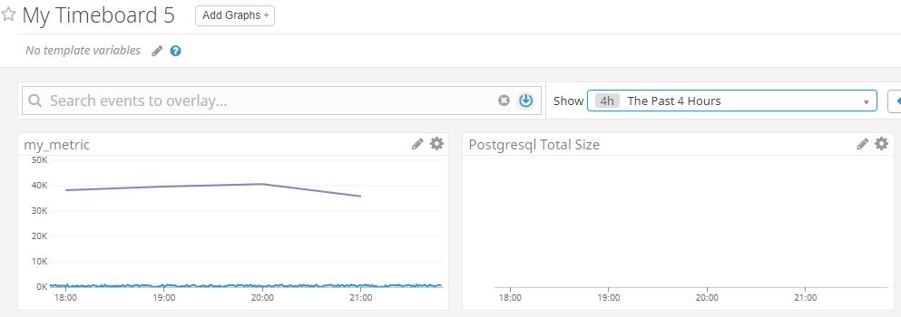 

### Set the Timeboard's timeframe to the past 5 minutes
### Take a snapshot of this graph and use the @ notation to send it to yourself.
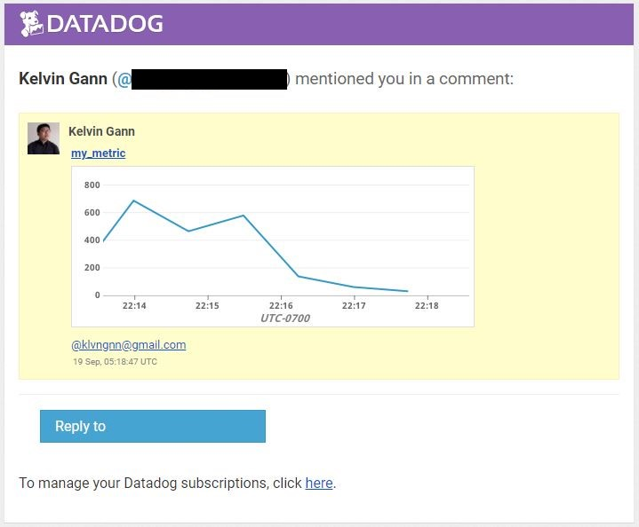  

* **Bonus Question**: What is the Anomaly graph displaying?
Since Postgresql wasn't running for this section, I looked up some examples.  
The graph would have been showing normal values represented by gray areas with lines in it, and red lines with peaks that represent the anomalies that are, in my case, 3 standard deviations away from normal values.  

## Monitoring Data

Since you’ve already caught your test metric going above 800 once, you don’t want to have to continually watch this dashboard to be alerted when it goes above 800 again. So let’s make life easier by creating a monitor.

Create a new Metric Monitor that watches the average of your custom metric (my_metric) and will alert if it’s above the following values over the past 5 minutes:

* Warning threshold of 500
* Alerting threshold of 800
* And also ensure that it will notify you if there is No Data for this query over the past 10m.

Please configure the monitor’s message so that it will:

* Send you an email whenever the monitor triggers.
* Create different messages based on whether the monitor is in an Alert, Warning, or No Data state.
* Include the metric value that caused the monitor to trigger and host ip when the Monitor triggers an Alert state.
* When this monitor sends you an email notification, take a screenshot of the email that it sends you.

* **Bonus Question**: Since this monitor is going to alert pretty often, you don’t want to be alerted when you are out of the office. Set up two scheduled downtimes for this monitor:

  * One that silences it from 7pm to 9am daily on M-F,
  * And one that silences it all day on Sat-Sun.
  * Make sure that your email is notified when you schedule the downtime and take a screenshot of that notification.

## Collecting APM Data:

Given the following Flask app (or any Python/Ruby/Go app of your choice) instrument this using Datadog’s APM solution:

```python
from flask import Flask
import logging
import sys

# Have flask use stdout as the logger
main_logger = logging.getLogger()
main_logger.setLevel(logging.DEBUG)
c = logging.StreamHandler(sys.stdout)
formatter = logging.Formatter('%(asctime)s - %(name)s - %(levelname)s - %(message)s')
c.setFormatter(formatter)
main_logger.addHandler(c)

app = Flask(__name__)

@app.route('/')
def api_entry():
    return 'Entrypoint to the Application'

@app.route('/api/apm')
def apm_endpoint():
    return 'Getting APM Started'

@app.route('/api/trace')
def trace_endpoint():
    return 'Posting Traces'

if __name__ == '__main__':
    app.run(host='0.0.0.0', port='5050')
```

* **Note**: Using both ddtrace-run and manually inserting the Middleware has been known to cause issues. Please only use one or the other.

* **Bonus Question**: What is the difference between a Service and a Resource?

Provide a link and a screenshot of a Dashboard with both APM and Infrastructure Metrics.

Please include your fully instrumented app in your submission, as well.

## Final Question:

Datadog has been used in a lot of creative ways in the past. We’ve written some blog posts about using Datadog to monitor the NYC Subway System, Pokemon Go, and even office restroom availability!

Is there anything creative you would use Datadog for?

## Instructions

If you have a question, create an issue in this repository.

To submit your answers:

* Fork this repo.
* Answer the questions in answers.md
* Commit as much code as you need to support your answers.
* Submit a pull request.
* Don't forget to include links to your dashboard(s), even better links and screenshots. We recommend that you include your screenshots inline with your answers.

## References

### How to get started with Datadog

* [Datadog overview](https://docs.datadoghq.com/)
* [Guide to graphing in Datadog](https://docs.datadoghq.com/graphing/)
* [Guide to monitoring in Datadog](https://docs.datadoghq.com/monitors/)

### The Datadog Agent and Metrics

* [Guide to the Agent](https://docs.datadoghq.com/agent/)
* [Datadog Docker-image repo](https://hub.docker.com/r/datadog/docker-dd-agent/)
* [Writing an Agent check](https://docs.datadoghq.com/developers/agent_checks/)
* [Datadog API](https://docs.datadoghq.com/api/)

### APM

* [Datadog Tracing Docs](https://docs.datadoghq.com/tracing)
* [Flask Introduction](http://flask.pocoo.org/docs/0.12/quickstart/)

### Vagrant

* [Setting Up Vagrant](https://www.vagrantup.com/intro/getting-started/)

### Other questions:

* [Datadog Help Center](https://help.datadoghq.com/hc/en-us)
