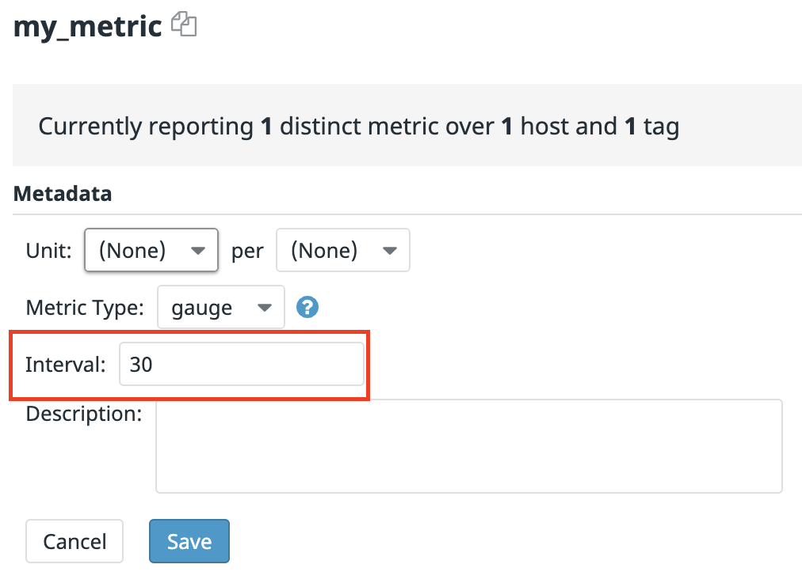
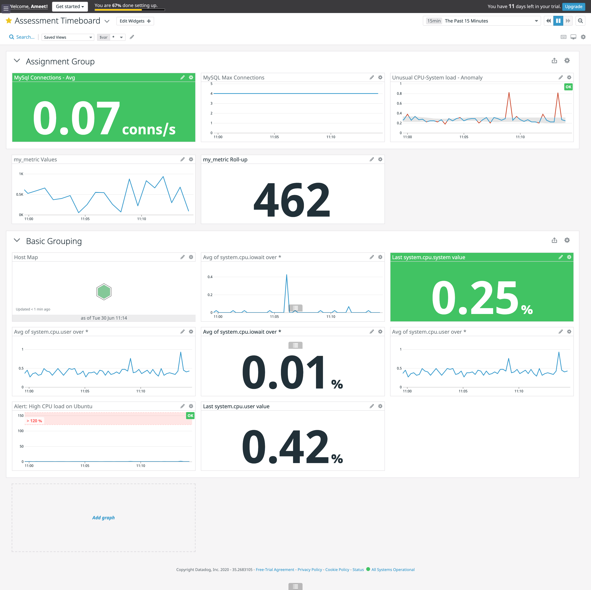
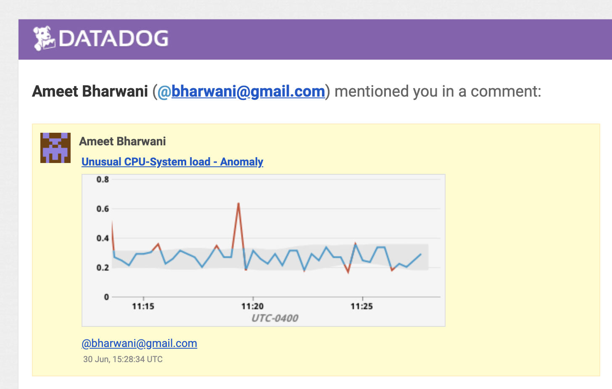
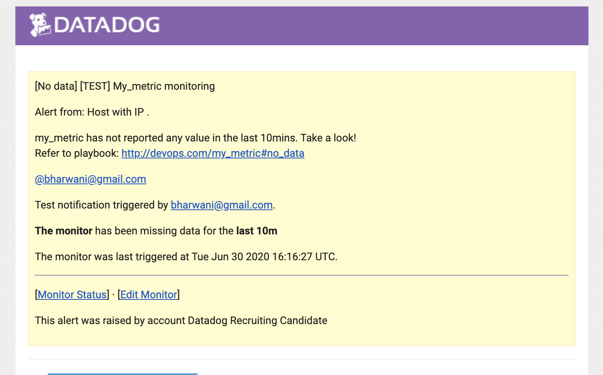
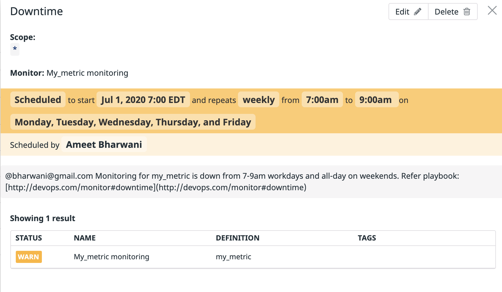
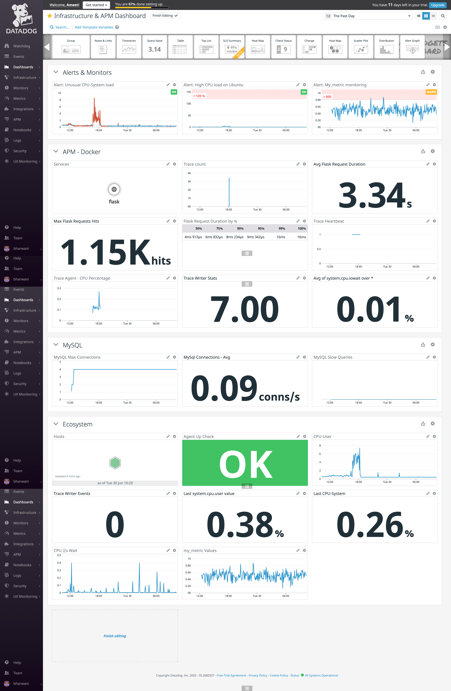

# Introduction

The assessment was to conduct a self-guided tour of the Datadog platform. The assessment involved exploring the key areas of the platform (such as APM, Agents, UI, Documentation) to address key usage of the platform. As such, I viewed the assessment from a DevOps standpoint, who is evaluating Datadog for their company's monitoring needs. The effort represents the first steps with Datadog as DevOps gets familiar with the platform with a small scope before deploying in a larger setting.

This was a great exercise and the sections only stratched the surface of the product offerrings yet piqued my curiousity to dive in. 

# 0. Setup the enviroment

For the infrastructure, I used a combination of a VPS running Ubuntu and Docker running on a Mac to simulate two instances in a single DC/Zone. I will refer to the instances as *VPS* and *Docker* respectively moving forward. Once DevOps is familiar with the platform, tools like Ansible, Terraform, Puppet, Fabric could be used to deploy at scale. 

# 1. Collecting Metrics
To install the Agents on the instances, I used these recipes:
- VPS: [https://app.datadoghq.com/account/settings#agent/ubuntu](https://app.datadoghq.com/account/settings#agent/ubuntu)
- Docker: [https://app.datadoghq.com/account/settings#agent/docker](https://app.datadoghq.com/account/settings#agent/docker)

I applied tags in the Agent config file (for example, located /etc/datadog-agent/datadog.yaml on VPS). Tags help when filtering activity per environment, service.  *Environment* and *location* tags were used.

I installed the MySQL integration in the VPS. Recipe I followed: [https://docs.datadoghq.com/integrations/mysql/](https://docs.datadoghq.com/integrations/mysql/). Additional integration was not installed on Docker. The VPS's Agent is already setup for MySQL so no additional libraries/packages were required with the exception of adding the datadog user to the database and enabling grant select on performance.schema.* tables so db metrics can be collected. As for db load, there is a web app already on VPS so metrics would be generated from that activity.

The yaml file from VPN is found: [ameetb/datadog.yaml](ameetb/datadog.yaml)

I added a **Custom Agent check** by creating a python app (see: [ameetb/src/custom_check/checks.d/custom_check.py](ameetb/src/custom_check/checks.d/custom_check.py)) and its related config file (see: [ameetb/src/custom_check/conf.d/custom_check.yaml](ameetb/src/custom_check/conf.d/custom_check.yaml)).  These files were placed in /etc/datadog-agent. The yaml file has a directive, *min_collection_interval*,  which governs how often the custom check is sent. The custom metric is called my_metric.

In addition to min_collection_interval directive, there is an option to set the send internal in Metrics > Summary such as:


Related to the setup, I also did the following:
- I wanted to override the reported hostname of the VPS, which was easy via the datadog.yaml file.
- I disabled the GUI on the VPS to reduce attack vectors plus it would not be used anyway. Set *GUI_port* to -1 in datadog.yaml file.

# 2. Visualize Data

I wanted to create a a basic grouping of my custom metric and environment measures. So I created a timeboard is system resources focused. More metrics/widgets could/should be added to present a full picture. Also, I setup an anomaly graph to show cpu load. 

As for the time frame, I did not find a way to reduce the duration to be less than 15m, even using the 5min shortcut. The smallest timeframe was achived by selecting 15m from the time frame drop-down or Select Range option.

The JSON for timeboard can be found: [ameetb/timeboards/AssessmentTimeboard--2020-06-29T19_07_47.json](ameetb/timeboards/AssessmentTimeboard--2020-06-29T19_07_47.json)

And here is a screenshot of the timeboard: 

## What does Anomaly graph display?

Using historical data from metrics, Anomaly graph can determine a range of operating values, such as a range of values where normal operations is excepted and range of values where operations are  abnormal. DD will determine bands of operating values based on aggregated values and standard deviations.  These determined ranges can be adjusted to suit. 

As compared to standard alerts, anomaly graphs give starting points to determine good/bad operating values, reduce trial & errors and unnecessary triggers if guesswork is inaccurate. 

I setup an anomoly monitor on the cpu-system metric. I used [stress](https://linux.die.net/man/1/stress) to push system resources and trigger the alert. 
Here is the JSON for the monitor: [ameetb/monitors/anomaly.json](ameetb/monitors/anomaly.json).

Here is a snapshot of the monitor, using the @ shortcut: 

# 3. Monitoring Data

For this section, I added a monitor for the custom metric, **my_metric**. The parameters of the monitors are:
- Alert: x < 800
- Warning: 500 < x <= 800
- Notification if no data for 10mins
- Evalution window: 5mins

The message to the target included: 
- Hostname and IP of offending machine
- Condition message depending on the alert type (alert|warning|no data)
- The message include the value of the metric.

Here is the JSON for the monitor: [ameetb/monitors/my_metric.monitor.json](ameetb/monitors/my_metric.monitor.json) 

I used the *Simulate* function to see what the messages would look. Here is the *Warning* message: 
 

Here is the *No Data* message: 
 

Alerts can be disregarded during certain time using the *Downtime* function of Monitors or using the *Mute* option. Mute is help if you want to disregard the alert for a short time and for one-offs, for instance, a planned upgrade.  Downtime would be helpful for recurring not-so-important monitors and for higher noise-to-signal but lesser mointors. I enabling dowtime to cover the target time (7am-9am M-F and all day on Saturdays & Sundays). Here is a screenshot: 


I had to create two downtimes, however. One for M-F and another for S-S. I didn't come across a way to combine the downtimes into one. 

# 4. Collecting APM data
For this section, I used the Flask sample app and I went the ddtrace-run route as I wanted to see how little developers would have to alter their code to accomodate Datadog services. 

Here is the code I used: [ameetb/src/app/app.py](ameetb/src/app/app.py). 
Pip [requirements.txt](ameetb/src/app/requirements.txt) file is also provided.

Frankly, not much change was needed. I added the *from datadog import  initialize, api* line. 
Also, I had to enable *APM* directive in the Agents's datadog.yaml file and restart the agent. 

I started the flask app using: 
```
export DD_TRACE_ANALYTICS_ENABLED=true ;ddtrace-run python3 [app.py](http://app.py/)
```

To simulate traffic on the app's endpoint, I used [https://github.com/rakyll/hey](https://github.com/rakyll/hey). 
```
hey -n 100 http://127.0.0.1:5050
hey -n 100 http://127.0.0.1:5050/api/apm
hey -n 100 http://127.0.0.1:5050/api/trace
```

Here is the Dashboard with APM, Monitors and other Environment metrics: [https://app.datadoghq.com/dashboard/kvw-h77-xvg/infrastructure--apm-dashboard?from_ts=1593451445737&to_ts=1593537845737&live=true](https://app.datadoghq.com/dashboard/kvw-h77-xvg/infrastructure--apm-dashboard?from_ts=1593451445737&to_ts=1593537845737&live=true)

Here is a screenshot of the combined Dashboard: 


And here is the JSON for the combined Dashboard: [ameetb/timeboards/Infrastructure&APMDashboard--2020-06-30T14_12_56.json](ameetb/timeboards/Infrastructure&APMDashboard--2020-06-30T14_12_56.json)

## Service vs Response

A service, in the software sense, is an utility that performs a task such as handling requests, addressing hardware events. For example, when you make a browser request for a site, a DNS request is made to translate the name to an IP. The DNS is a service as the name implies.  In Flask app case, the service would the bundle of apis made available by the Flask app. 

A resource can be virtual or hardware component with a system.  A service will leverage one or more resources to handle the assigned task. For example, a database (service) will need resources (cpu, memory, disk, network connection) in order to function.  In this case, the resource would be an endpoint of the Flask app.  

# Final Question

Thinking about other uses not covered in Datadog blog or mentioned in the assessment guidelines, I came up these:
- *Monitor status of a 3D Printer*: While 3D printers have become quicker over time, they still take a long time to complete the job. You can add a monitor agent to printer ([https://octoprint.org/](https://octoprint.org/)) and then I can access the status of the printer and the job in a DD dashboard.
- *Intrusion detection*: Paired with Computer Vision, Datadog can collect and trigger an alert when an unauthorized person tries to enter a sensitive area of the building. The alert could embed the image of the person and thus Security have an representation of whom to look out for.  The info could be tracked in the Datadog platform.
- *Stock Dashboard*: Combining stock market performance and Machine Learning, a company's Stock dashboard could be created that shows the market performance yesterday and using ML, shows projections for today and tomorrow. Possible metrics: Price open/closed yesterday, price over the 30 days, and much more.
