# DataDog Exercise #

Philip Sharman

2016-03-15

I'm not sure how much detail you'd like, so I'll err on the side of providing too much rather than too little. Since I'm interested in documentation, I'll mention the things that I had issues with. These are the sorts of things that I try to help people avoid when I write.

## Level 1 ##

### Installing the agent

* I was impressed how easy this was.
* I installed it on two machines running OS X, one machine running Windows 7, and one machine running Ubuntu.
* I noticed that the Windows installation gives more prominent access to the configuration file than the OS X installation does. I'm not sure I would have realized those configuration settings were there, on OS X, if I hadn't happened to poke around.

### What is the agent?

* It collects data on the host (such as CPU and memory usage).  It also runs the StatsD server that can be sent data (via the code of a web application on that same host) to be forwarded to DataDog.  (I didn't realize the significance of that when I first read the docs.  It was only when I was setting up metrics monitoring in my web app that I wondered why I didn't need to specify any credentials in the call to `statsd`.  Then I realized that the StatsD server was doing it.)

* I was curious what was going on behind the scenes, so I took a look:

    * On OS X, `ps -ax` shows that the agent uses an embedded version of Python, lives in `/opt/datadog-agent`, and has these processes running:
    ```bash
    /opt/datadog-agent/embedded/bin/python /opt/datadog-agent/bin/supervisord -c /opt/datadog-agent/etc/supervisor.conf

    opt/datadog-agent/embedded/bin/python /opt/datadog-agent/agent/dogstatsd.py --use-local-forwarder

    /opt/datadog-agent/embedded/bin/python /opt/datadog-agent/agent/ddagent.py

    /opt/datadog-agent/embedded/bin/python /opt/datadog-agent/agent/agent.py foreground --use-local-forwarder
```
    * The LittleSnitch Network Monitor tool shows that the version of Python is 2.7:
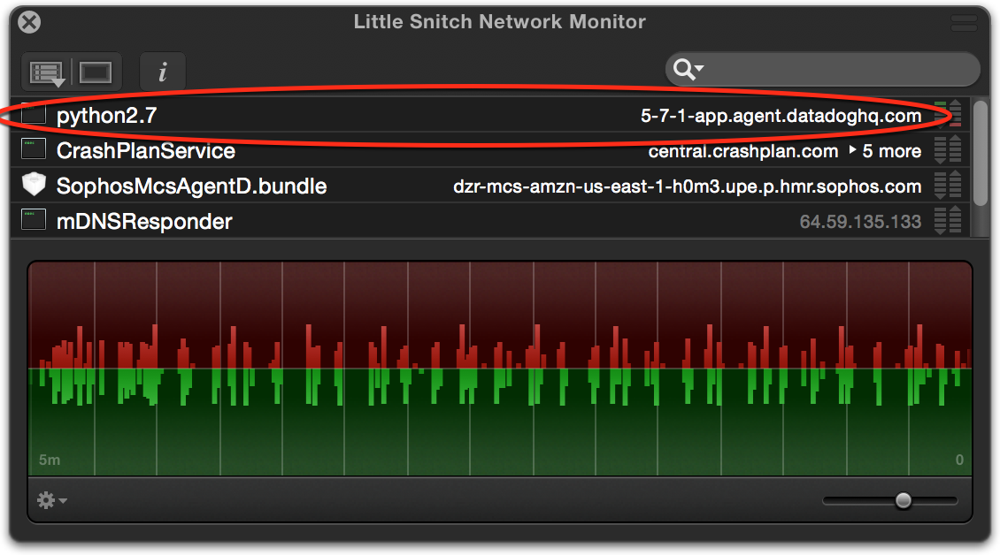

### Submitting an event via the API

* I used [SoapUI](https://www.soapui.org/) to do this.

	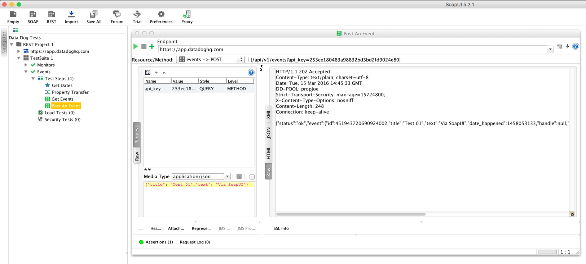

	And the event shows up in the Dashboard correctly.

	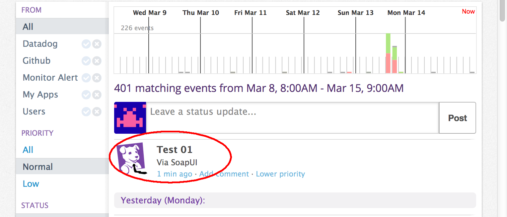

* Things that tripped me up:
    * The docs use `app_id` as a shorthand for `application_id`.  Until I read them more carefully, I didn't realize that I needed to use `application_id` as the parameter name.
    * The docs mention IDs, for example the `monitor_id` in "Get a monitor's details".  But until I read down further (in "Get all monitor details"), it wasn't clear to me how to obtain a monitor's ID. I'd like to mention this when the ID is first mentioned.
    * The Shell example for "Query the Event Stream" shows this

        ```bash
        currenttime2=$(date --date='1 day ago' +%s)
        ```
        but that doesn't work on OS X.  I needed to change it to

        ```bash
        currenttime2=time2=$(date -v-1d +%s)
        ```

        (I notice that it is correct in "Query time series points".)

* I used the API to query events for the last few days. I noticed that
 the data returned always starts and ends at midnight, even if other start/end times are specified.
* For other metrics, what determines how many data points I get back? DataDog seems to automatically keep the number of points to a certain range:
    * 1 day = 93 points
    * 2 days = 120 points
    * 3 days = 128 points
    * 4 days = 85 points

	It's convenient, but it wasn't what I was expecting. I was expecting to have to parse many more points for a wider time interval.


### Getting an email

I did this two ways.

#### Method One

1. I set up a Monitor to email whenever an event with `error` status was received. 

	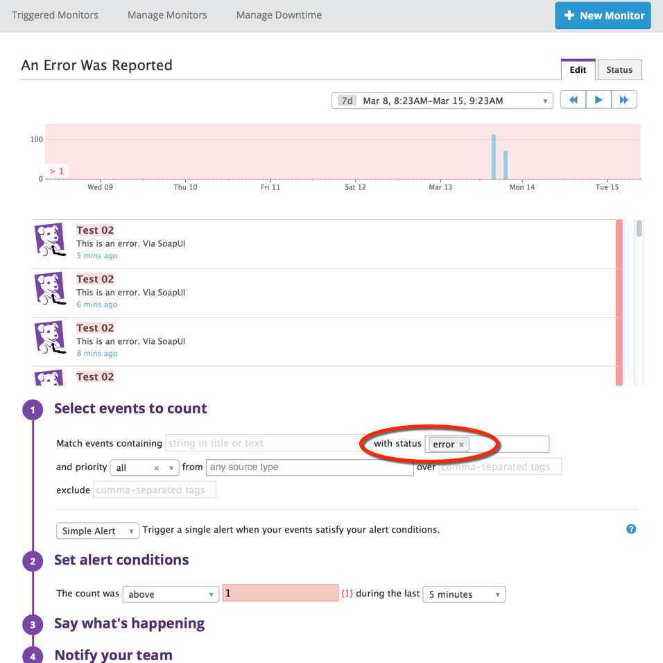

2. Then I used the API to send an event with `alert_type` set to `status`.  Sure, enough, the email comes through.

	

#### Method Two
For the second method, I set up an Events API Email and sent an email to it with a JSON body: 

```json
{
"title": "Error sent via email",
"text": "This is an error. Via JSON and email.",
"priority": "normal",
"alert_type": "error"
}
```

The email triggers the monitor and sends an email to my primary account.

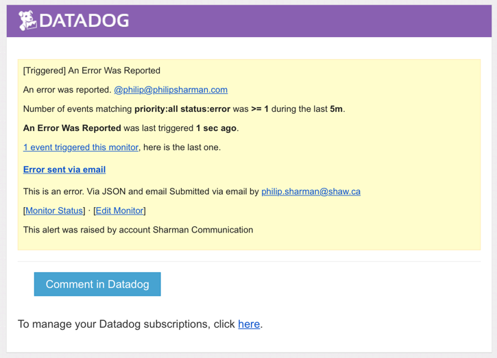

* Something that tripped me up:
    * Even though I had my email client set to use plain text, it put in curly quotation marks instead of straight ones, which stopped the event working.  I found [JSONLint](http://jsonlint.com/) helpful for debugging this.

## Level 2 ##

* I chose to use PHP using the `php-datadogstatsd` library.

* Here is the dashboard showing the page views and latency:
	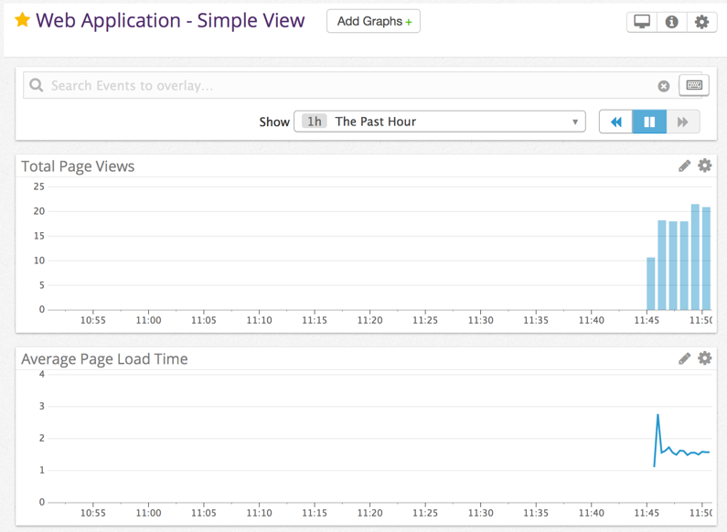
	* That dashboard is [here](https://app.datadoghq.com/dash/107088/web-application-a).

	But I don't know if you'll have permission to see that link.  Since it isn't a ScreenBoard, I don't see a way to generate a public URL.  The [FAQ](http://docs.datadoghq.com/faq) says that I should be able to share one of the graphs: "In a time board, pick a graph on a dashboard, click on the cog to edit it and you’ll find the “share” tab", but I don't see that option.
    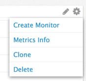
    
    Am I looking in the wrong place?

* I also tried using Perl.
    * I noticed that the `dogstatsd-perl` link on the [Libraries](http://docs.datadoghq.com/libraries) page in the documentation points to https://github.com/zipkid/dogstatsd-perl but that link is out of date.  It should point to https://github.com/binary-com/dogstatsd-perl.
    
## Level 3  & 4 - Using Metrics

### Tagging the metrics

* I tagged the metrics with identifiers for the different pages. Here are the results:

	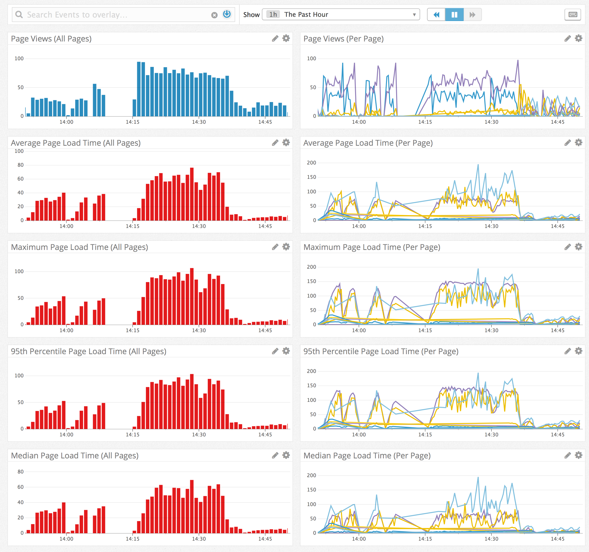

	(I experimented with using lines, as shown here, and areas.  I found the lines made it easier to see the different pages.)

	* The dashboards are here:
		* [stacked areas](https://app.datadoghq.com/dash/106080/web-application)
        * [stacked lines](https://app.datadoghq.com/dash/107088/web-application-b)

* I also made a dashboard showing each page individually.  But unless you look carefully, it is hard to notice that the vertical scale for Page 09 is very different from most of the other pages.

	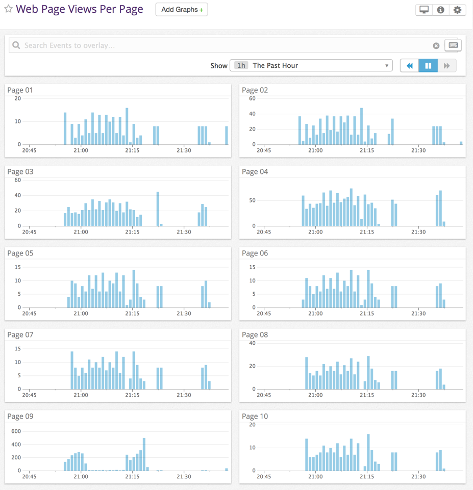

* It would be nice to add samples for PHP and other languages) to [Metrics](http://docs.datadoghq.com/guides/metrics/).  There are enough differences to make life confusing.
    * At first I didn't realize that in the `php-datadogstatsd` library, `histogram` takes a `rate` parameter before the tags.  It took me a while to figure out why none of my tags were showing up.  I eventually looked into the source of the library and realized my mistake.
    * That library also supports `timing` and `microtiming` methods which are slightly different from the Python and Ruby samples shown in the docs.

* I also noticed that if I have the Metrics Explorer open, and have "one graph per tagname" set, the new tags don't show up as I add them to the code.  Until I realized this, I thought my new tags weren't working.  I found I needed to clear the "Graph" setting and re-set it to force the page to update the list of tags available.  (If I were writing a tutorial, this might be something I would point out.)

* Why are graphs spiky? I'm not sure.  I gather the data is gathered periodically, so I would have thought that would even out the data. In the screenshots shown here, my load tests (using SoapUI) have some extra variance deliberately configured. But even when I turn that off, I still see more variation than I would expect.

* Another dashboard, just for fun:
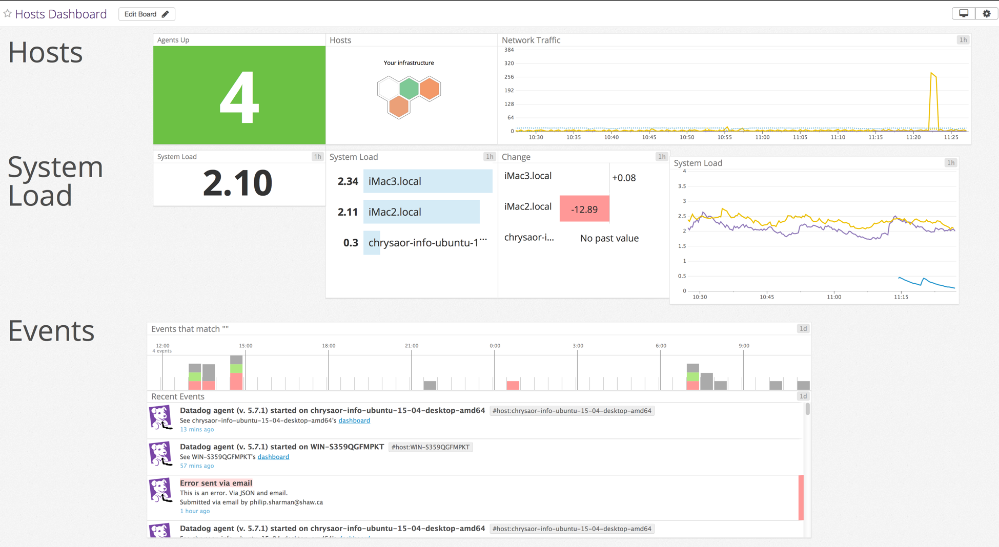
https://p.datadoghq.com/sb/112bf9d0b-fe250a9082

## Level 5 - Agent Check

This one has stumped me.

* I tried to follow the instructions given on http://docs.datadoghq.com/guides/agent_checks/ so I created `hello.py` and `hello.yaml` and placed them in `checks.d` and `conf.d` respectively.
    * If I run the command
    ```bash
     PYTHONPATH=. python checks.d/hello.py
     ```
     I get `ImportError: No module named checks`.
    * I'm guessing that DataDog is looking for the `checks` directory in `/opt/datadog-agent/agent/ ` so I tried running this
    ```bash
    PYTHONPATH=.:/opt/datadog-agent/agent/ python checks.d/hello.py
    ```
    But then I get `ImportError: No module named yaml`.

    I did some research on the web to try to get around this, but nothing seems to work.  I was unable to install the modules that DataDog seems to be looking for. I reached out to Technical Support to see if there's something obvious that I'm missing. (I let them know that I'm not a paying customer so my question shouldn't take priority.)  I tried it on OS X, Windows, and Ubuntu, and I get the same issue on each platform. If I get the Agent Check working, I'll update this document.

* Some of the other things that gave me problems:

    * On Windows, I initially thought using `run_check()` via `shell.exe` ran the Agent Check, but then I realized that it just checks it but doesn't actually execute it. I'd like to clarify that in the docs.

    * Other documentation issues:

        * These directory paths in the docs seem incorrect:
            * On OS X:
                * `~/.datadog-agent/agent/checks.d/` should be `~/.datadog-agent/checks.d/`.
                * `~/.datadog-agent/agent/conf.d/` should be `~/.datadog-agent/conf.d/`.
            * On Windows:
                * `C:\Program Files (x86)\Datadog\Agent\checks.d\` should be `C:\Program Files (x86)\Datadog\Datadog Agent\checks.d`.

        * The docs show the command `PYTHONPATH=.` but it needs to be `set PYTHONPATH=.` on Windows.
        * The docs refer to the "Agent root" directory, but it wasn't clear to me what directory that is. (On OS X, I believe it means `~/.datadog-agent/`.)
        * The docs say that this
        ```bash
        timing = end_time - start_time
        self.gauge('http.reponse_time', timing, tags=['http_check'])
        ```
        tags the metric with the URL but the code actually appears to tag it with  'http_check'.

## Documentation Notes ##

Some other minor documentation issues I happened to notice:

* The https://github.com/DataDog/hiring-engineers/tree/devops-evangelist page  has an outdated link to `ab`.  Instead of https://httpd.apache.org/docs/2.2/programs/ab.html, the latest version is at https://httpd.apache.org/docs/2.4/programs/ab.html.
* There is a minor typo on the [Agent Checks](http://docs.datadoghq.com/guides/agent_checks/) page: "Once you’re check" should be "Once your check".

## Other Explorations ##
I wrote an iOS application, using Swift, to pull data from DataDog via the API.  Currently it's more of a proof of concept than a finished app, but it graphs some data and lists recent events.

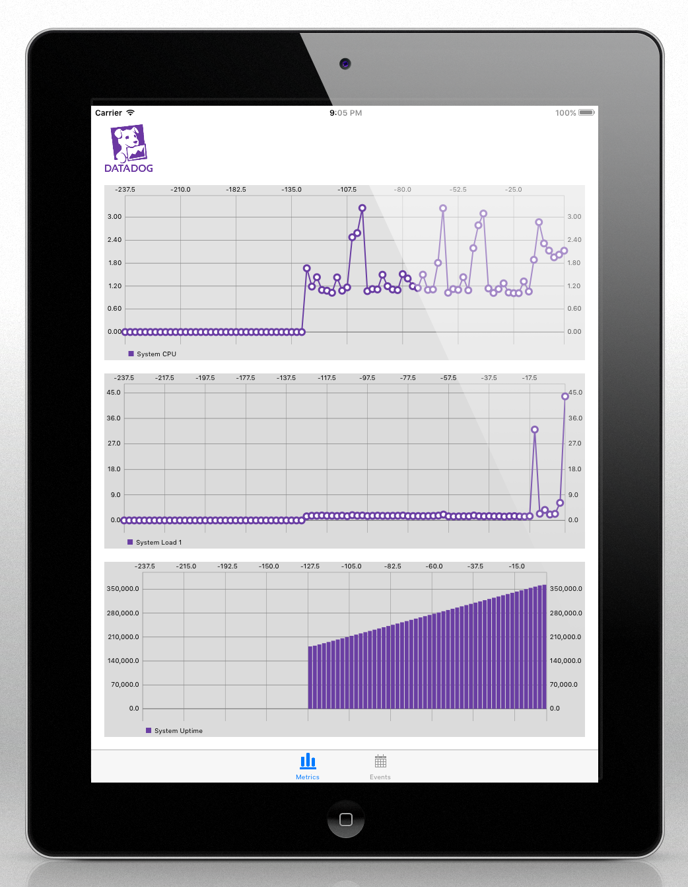

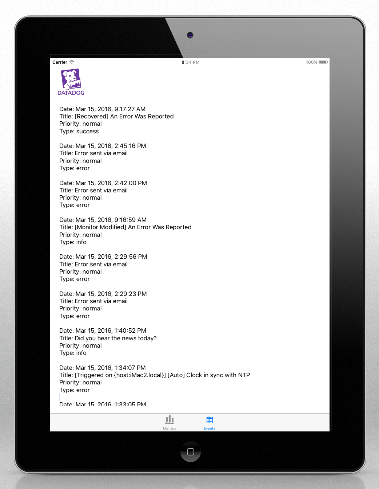

## Conclusion
This was a fun exercise. I learned a lot.

