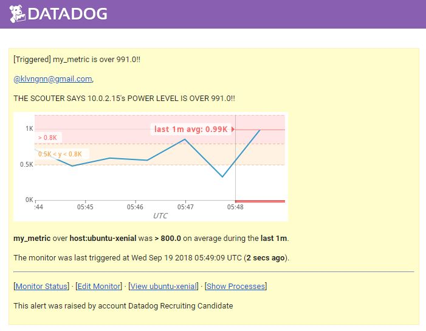
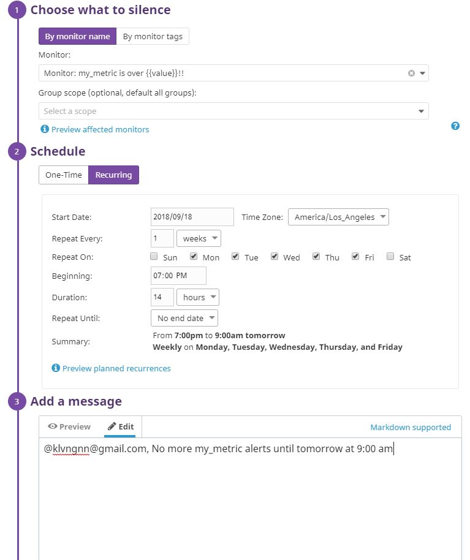
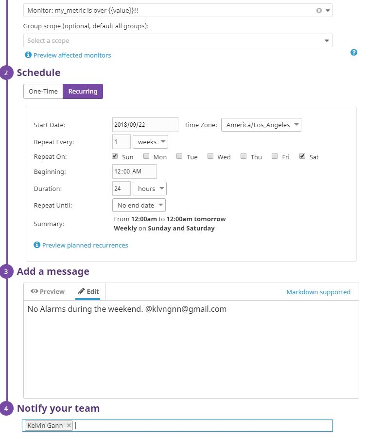
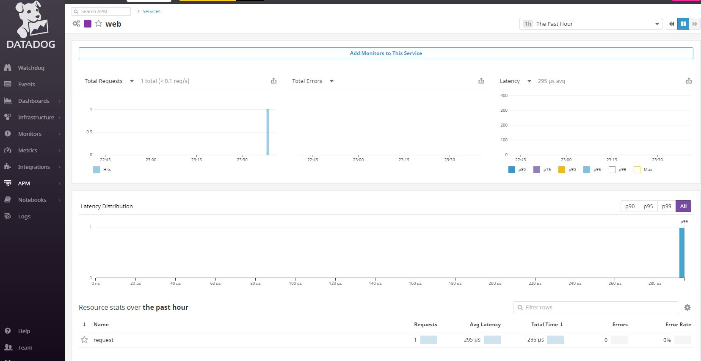

## Questions

Please provide screenshots and code snippets for all steps.

## Prerequisites - Setup the environment

### Environment Setup
#### Step 1- Download and install Vagrant
In the browser, navigate to Vagrant's main page and download the latest version corresponding to the current operating system.  
For this coding challenge, the OS that it'll be running on will be Windows 10.  
[link to Vagrant download](https://www.vagrantup.com/downloads.html)  


#### Step 2- Download and install Virtual Box
In order to successfully complete the challenge, we'll need to download virtual box to setup the linux environment datadog will be collecting metrics from.  
Navigate to Virtual Box's website and download the latest version.  
For this coding challenge, we will again be downloading the Windows 10 version.  
[link to Virtual Box download](https://www.virtualbox.org/wiki/Downloads)  


#### Step 3- Make a directory to house Vagrantfile
In order to setup our Virtual Box server easily, we'll need to create a Vagrantfile.  
This directory will house our Vagrantfile.  
Run the following command in the terminal to create the directory `mkdir datadog-challenge-box`.  


#### Step 4- Download Vagrant Box Base File
In order to have an ubuntu image to work with, we'll need to download the vagrant box base image.  
Run the following command in the terminal to download the base file `vagrant box add ubuntu/xenial64`.  
This will install the base file of ubuntu 16.04.   


#### Step 5- Add Vagrantfile snippet as directed for box
Navigate into the directory we've created previously by running the command `cd datadog-challenge-box`.  
Inside of the directory, create the Vagrantfile by running the command `touch Vagrantfile`.  
Then paste the following snippet inside the Vagrantfile.  
```
Vagrant.configure("2") do |config|
    config.vm.box = "ubuntu/xenial64"
end
```


#### Step 6- Run `vagrant up`
To make sure we've installed the correct box, run the following command `vagrant box list`.  
This will provide a list of vagrant box images that are installed onto the machine.  
As we can see from the screenshot, our ubuntu box image has been successfully added to Vagrant.  
Run the command `vagrant up` to bring up the server.  


#### Step 7- SSH into vagrant box that is setup
To ensure that our box is up and running, we'll now ssh into the server that's been setup.  
Run the command `vagrant ssh` to ssh into our box.  


#### Step 8- Look at Virtual Box GUI to show vagrant box being setup
To further verify that our server has been brought up correctly, we can bring up the Virtual Box GUI and visually see that our server is up and running.  


#### Step 9- Sign up for Datadog
In the final step of setting up our environment, we'll be signing up for a datadog account.  
[link to sign up for a datadog account](https://www.datadoghq.com/)


## Collecting Metrics:

### Add tags in the Agent config file and show us a screenshot of your host and its tags on the Host Map page in Datadog.
In order to start collecting our first metrics, we'll need to setup datadog on our brand new ubuntu server.  
While ssh'ed into our ubuntu server, run `sudo su` to gain root privileges.  
Then run the convenient easy one step install command provided on the Agent setup page.  
Once the terminal shows the message `Your Agent is running and functioning properly.`, our datadog agent is successfully installed, and we my proceed with the following steps.  

#### Step 1 - Add tags in agent config file
Navigate to `/etc/datadog-agent` on the server.  
Create the `datadog.yaml` file in the the directory by running `touch datadog.yaml`  
We'll be using vim to edit the yaml file created.  
Type `vim datadog.yaml` in the console.  
Then provide the tags that you'd like to have.  
Our tags are shown in the screenshot below.  
Please note that multi-line tags do NOT work.  


#### Step 2 - Inspect tags in hostmap view
**Tags showed after restarting services and rebooting**  
Navigate back to the datadog web portal.  
As we can see in the hostmap and infrastructure list, our tags are cleanly listed.   
  


### Install a database on your machine (MongoDB, MySQL, or PostgreSQL) and then install the respective Datadog integration for that database.
#### Step 1 - Install PostgreSQL
We'll be installing a PostgreSQL database on our server.  
Run the following command `apt-get install postgresql`.  
  

Once the message shows that PostgreSQL is successfully installed, we in make sure that the install and process is successful by running the command `service postgresql status`.  
  

#### Step 2 - Grant Table Permissions to user datadog
We now need to allow datadog to use the database we installed.  
Under the PostgreSQL integrations on the datadog website, convenient instructions are provided.  
Run ` sudo -i -u postgres` to sudo under the postgres role.  
Then, run `psql` to get into our database console.  
Following further instructions, create our datadog user.  
  

#### Step 3 - Confirm Database is setup correctly
Paste in the following command to ensure that our database has installed correctly.  
```
psql -h localhost -U datadog postgres -c "select * from pg_stat_database LIMIT(1);" && \
echo -e "\e[0;32mPostgres connection - OK\e[0m" || \
echo -e "\e[0;31mCannot connect to Postgres\e[0m"
```
  

As long as we see columns and not `Cannot connect to Postgres`, we are good to go.  


Checking on the status of our PostgreSQL database, services should be green.  
  
  

#### Step 4 - Install integration on datadog site
Following the instructions provided under the integration, create the `postgres.yaml` file under `conf.d`.  
  
After the integration is successfully installed, we should see postgresql in our hostmap.  
  

### Create a custom Agent check that submits a metric named my_metric with a random value between 0 and 1000.
#### Step 1 - Create `my_metric.py` file under `etc/checks.d`
Under `checks.d`, run the command `touch my_metric.py` to create a python file.  
This python file will generate random metrics to post onto datadog.  
  

The code that was written is showing the the image below.  
  

#### Step 2 - Create `my_metric.yaml` under `etc/conf.d`
Next, we'll be configuring the intervals in which our python file is run.  
Under conf.d, run the following command, `touch my_metric.yaml`.  
  

#### Change your check's collection interval so that it only submits the metric once every 45 seconds.
**Modified `my_metric.yaml` to the following**  
  

A timeout function could also be written in the python file under `checks.d` to ensure metrics are sent only once every 45 seconds.  
**Checked that my_metrics were being recorded on the datadog site**  
**Had to restart datadog agent service and reboot server in order for my_metric to show up in metrics page**  
  

### **Bonus Question** Can you change the collection interval without modifying the Python check file you created?
By including the property `min_collection_interval` in the yaml file, we've ensured that reporting is done as often as once every 45 seconds.  
According to the documentation, this doesn't mean that the metric is collected once every 45 seconds, but rather that it could be collected as often as once every 45 seconds.  
I assume that this would mean that setting the time in the python file would be more accurate.  

## Visualizing Data:

### Utilize the Datadog API to create a Timeboard that contains:

* Your custom metric scoped over your host.
* Any metric from the Integration on your Database with the anomaly function applied.
* Your custom metric with the rollup function applied to sum up all the points for the past hour into one bucket

### Please be sure, when submitting your hiring challenge, to include the script that you've used to create this Timeboard.

We'll install python, pip, and pip datadog on to the virtual box.  
`apt install python`  
`apt install python-pip`  
`pip install datadog`  

After installing the previous packages, we'll run the following script to visualize our data.  
```
from datadog import initialize, api

options = {
    'api_key': '<REDACTED>',
    'app_key': '<REDACTED>'
}

initialize(**options)

title = "My Timeboard 5"
description = "An informative timeboard."
graphs = [{
    "definition": {
        "events": [],
        "requests": [
            {"q": "my_metric{*}"},
	    {"q": "my_metric{*}.rollup(sum,3600)"}
        ],
        "viz": "timeseries"
    },
    "title": "my_metric"
},
{
    "definition": {
        "events": [],
        "requests": [
            {"q": "anomalies(avg:postgresql.total_size.user_time{*}, 'basic', 3)"}
        ],
        "viz": "timeseries"
    },
    "title": "Postgresql Total Size"
}]

read_only = True
datadog_time_board = api.Timeboard.create(title=title,
                                          description=description,
                                          graphs=graphs,
                                          read_only=read_only)

print(datadog_time_board)
```

### Once this is created, access the Dashboard from your Dashboard List in the UI:
**Timeboard showing two graphs and the rollup function**  
[Timeboard link](https://app.datadoghq.com/dash/919881/my-timeboard-5?live=false&page=0&is_auto=false&from_ts=1537334014353&to_ts=1537334314353&tile_size=m)  
 

### Set the Timeboard's timeframe to the past 5 minutes
### Take a snapshot of this graph and use the @ notation to send it to yourself.
  

* **Bonus Question**: What is the Anomaly graph displaying?
Since Postgresql wasn't running for this section, I looked up some examples.  
The graph would have been showing normal values represented by gray areas with lines in it, and red lines with peaks that represent the anomalies that are, in my case, 3 standard deviations away from normal values.  

## Monitoring Data

### Create a new Metric Monitor that watches the average of your custom metric (my_metric) and will alert if it’s above the following values over the past 5 minutes:

* Warning threshold of 500
* Alerting threshold of 800
* And also ensure that it will notify you if there is No Data for this query over the past 10m.

### Please configure the monitor’s message so that it will:

* Send you an email whenever the monitor triggers.
* Create different messages based on whether the monitor is in an Alert, Warning, or No Data state.
* Include the metric value that caused the monitor to trigger and host ip when the Monitor triggers an Alert state.
* When this monitor sends you an email notification, take a screenshot of the email that it sends you.

Set the triggered values and message on the datadog website:
  
  
[Link to Monitor Management](https://app.datadoghq.com/monitors/manage)  

Received the following email when monitor is triggered:  
  

* **Bonus Question**: Since this monitor is going to alert pretty often, you don’t want to be alerted when you are out of the office. Set up two scheduled downtimes for this monitor:

  * One that silences it from 7pm to 9am daily on M-F,
  * And one that silences it all day on Sat-Sun.
  * Make sure that your email is notified when you schedule the downtime and take a screenshot of that notification.

Setting downtime values on the website:  

  

## Collecting APM Data:

ran `pip install dd-trace`  
ran `pip install flask`  

#### included following flask app under `etc/datadog-agent`  

```
from flask import Flask
import logging
import sys
from ddtrace import tracer

# Have flask use stdout as the logger
main_logger = logging.getLogger()
main_logger.setLevel(logging.DEBUG)
c = logging.StreamHandler(sys.stdout)
formatter = logging.Formatter('%(asctime)s - %(name)s - %(levelname)s - %(message)s')
c.setFormatter(formatter)
main_logger.addHandler(c)

app = Flask(__name__)

trace = tracer.trace("request", "web")

@app.route('/')
def api_entry():
    return 'Entrypoint to the Application'
    trace.finish()

@app.route('/api/apm')
def apm_endpoint():
    return 'Getting APM Started'

@app.route('/api/trace')
def trace_endpoint():
    return 'Posting Traces'

if __name__ == '__main__':
    app.run(host='0.0.0.0', port='5050')
```

* **Bonus Question**: What is the difference between a Service and a Resource?
According to the datadog forums:
> A "Service" is the name of a set of processes that work together to provide a feature set. For instance, a simple web application may consist of two services: a single webapp service and a single database service, while a more complex environment may break it out into 6 services: 3 separate webapp, admin, and query services, along with a master-db, a replica-db, and a yelp-api external service.  

Resource  
> A particular query to a service. For a web application, some examples might be a canonical URL like /user/home or a handler function like web.user.home (often referred to as "routes" in MVC frameworks). For a SQL database, a resource would be the SQL of the query itself like select * from users where id = ? The Tracing backend can track thousands (not millions or billions) of unique resources per service, so resources should be grouped together under a canonical name, like /user/home rather than have /user/home?id=100 and /user/home?id=200 as separate resources.

### Provide a link and a screenshot of a Dashboard with both APM and Infrastructure Metrics.
[Link to APM Dashboard](https://app.datadoghq.com/apm/service/web/request?start=1537336326648&end=1537339926648&paused=false&env=prod)
  

## Final Question:
### Is there anything creative you would use Datadog for?
Hiring Challenges are often fairly time consuming. Perhaps Datadog could be utlized for unique hooks to gauge the amount of time used by each candidate for each section of challenges.