## Prerequisites - Setup the environment

You can utilize any OS/host that you would like to complete this exercise. However, we recommend one of the following approaches:

* You can spin up a fresh linux VM via Vagrant or other tools so that you don’t run into any OS or dependency issues. [Here are instructions](https://github.com/DataDog/hiring-engineers/blob/solutions-engineer/README.md#vagrant) for setting up a Vagrant Ubuntu 12.04 VM.
* You can utilize a Containerized approach with Docker for Linux and our dockerized Datadog Agent image.

Setting up the VM via Vagrant

We hit the three commands below to initate, create and connect to the VM from powershell:

```
$ vagrant init hashicorp/precise64
$ vagrant up
$ vagrant ssh
```

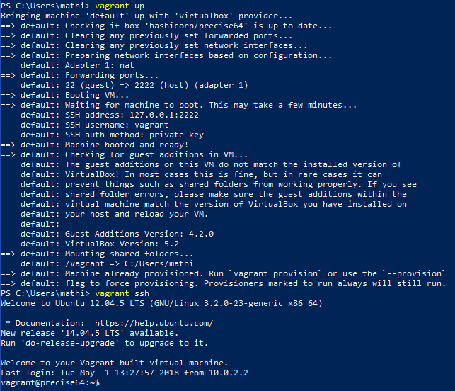

Then, sign up for Datadog (use “Datadog Recruiting Candidate” in the “Company” field), get the Agent reporting metrics from your local machine.

After signing up for Datadog and getting the API_KEY we can install the Agent on this VM:

```
DD_API_KEY=c9ad1ab3ba229d022cc99af54d0d448f bash -c "$(curl -L https://raw.githubusercontent.com/DataDog/datadog-agent/master/cmd/agent/install_script.sh)"
```

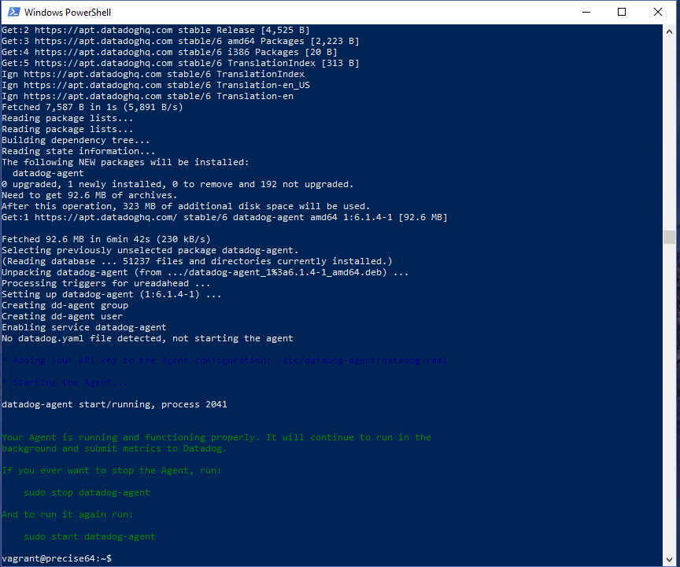

I also installed the Agent on my Windows local machine to have more data. 

After this, we can see our two machines in the Infrastructure section in the Host Map:

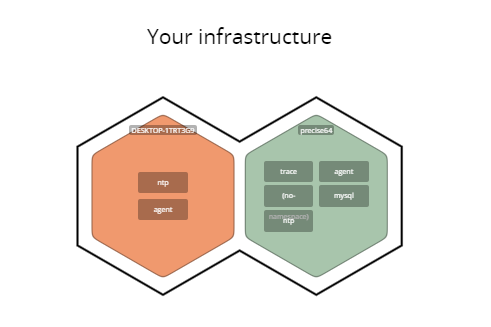

With more details when we click on one of the two machines (for example the VM Precise64):


And also in the Dashboard section (for example the VM Precise64):

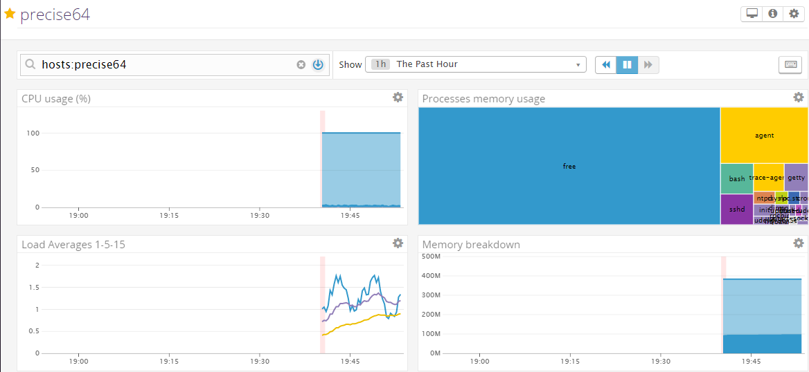

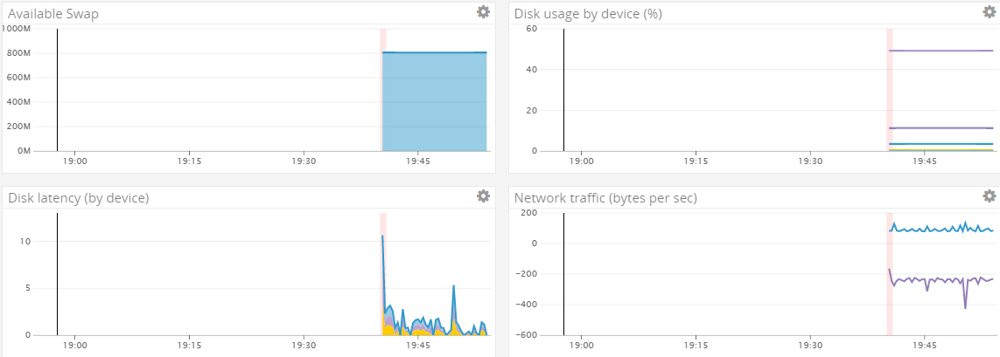


## Collecting Metrics:

* Add tags in the Agent config file and show us a screenshot of your host and its tags on the Host Map page in Datadog.

To add tags on the VM, we need to access to the datadog.yaml file:

```
/etc/datadog-agent/datadog.yaml
```

Rewrite it by using the command:

```
sudo nano datadog.yaml
```

And we change tags values:

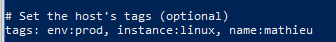

After changing the configuration file, we need to restart the agent to see the modifications:

```
sudo service datadog-agent restart
``` 

I did the same modifications on windows with these tags:

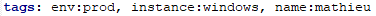

Now we can see the tags in the HostMap:

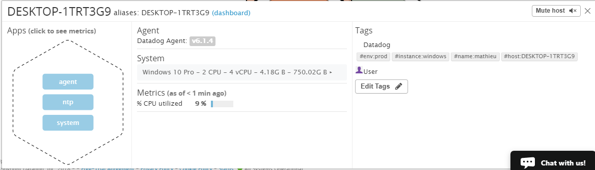

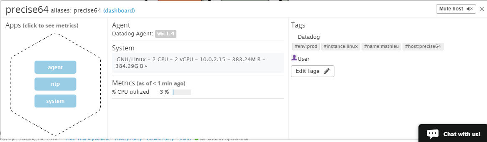

And by testing them we can check that it is working well. When we choose instance:linux, only Precise64 is displayed and when we choose env:prod both are displayed:

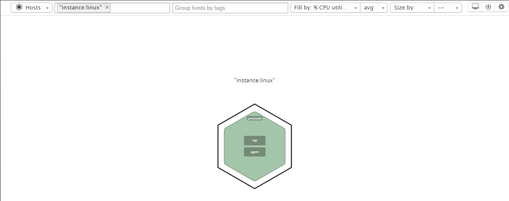

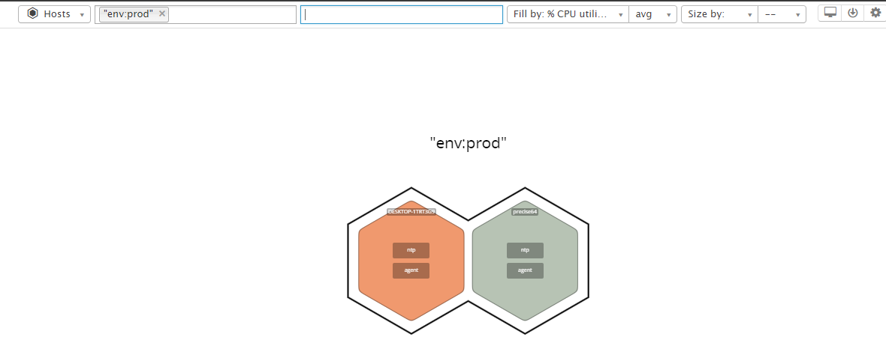

* Install a database on your machine (MongoDB, MySQL, or PostgreSQL) and then install the respective Datadog integration for that database.

To install MySQL on our VM and start it we use these commands:

```
sudo apt-get install mysql-server
mysql -u root -p
```

We need also to install it on Datadog Web UI and follow the steps indicated to configure it and get metrics.

User creation:

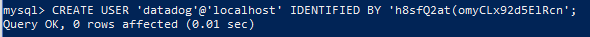

Privileges granted:

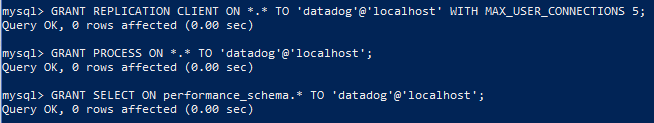

We create a file mysql.yaml in conf.d repository :

```
init_config

instances:
  - server: localhost
  	user: datadog
  	pass: h8sfQ2at(omyCLx92d5E1Rcn
  	tags:
  		- optional_tag1
  		- optional_tag2
  	options:
  		replication: 0
  		galera_cluster: 1
```

We can check if the integration succeeded:

```
sudo datadog-agent status
```

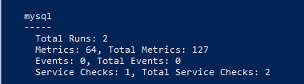

Finally we have 3 different metrics in VM Dashboard :

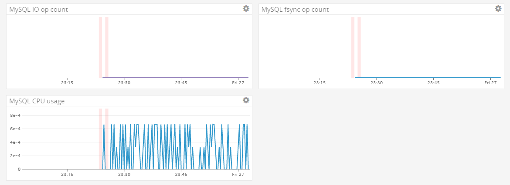

* Create a custom Agent check that submits a metric named my_metric with a random value between 0 and 1000.

We are now going to create a custom Agent check to create a metric from a Python file.

To proceed we need to write a Python file (my_metric.py) in checks.d directory and a configuration file in conf.d directory :

my_metric.py
```
from checks import AgentCheck
from random import randint
class HelloCheck(AgentCheck):
    def check(self, instance):
        random_numb = randint(0, 1000)
        self.gauge('my_metric', random_numb)

```

my_metric.yaml
```
init_config:
instances:
    [{}]

```

And we launch the following command to create the Agent Check and restart the Agent:

```
sudo -u dd-agent -- datadog-agent check myAgentCheck
sudo service datadog-agent restart
```

In the Metrics section we can find our new metric in the explorer

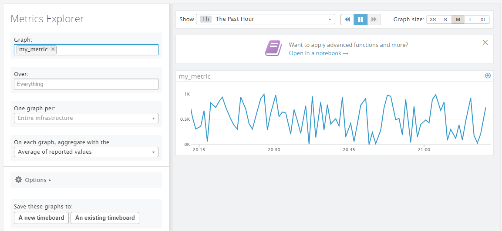

* Change your check's collection interval so that it only submits the metric once every 45 seconds.

To change check's collection interval we just need to modify our my_metric.yaml file like this:

```
init_config:
instances:
	min_collection_interval: 45
```

When we have a look to the new metric, we can realize that the interval between two points can be either 40s or 1 minute.

By reading the documentation I could find this:
*If the value is set to 30, it does not mean that the metric is collected every 30 seconds, but rather that it could be collected as often as every 30 seconds*

Which explain why it is not 45s exactly

* **Bonus Question** Can you change the collection interval without modifying the Python check file you created?

Check's collection interval has been changed in the configuration file and not the Python file.

## Visualizing Data:

Utilize the Datadog API to create a Timeboard that contains:

* Your custom metric scoped over your host.
* Any metric from the Integration on your Database with the anomaly function applied.
* Your custom metric with the rollup function applied to sum up all the points for the past hour into one bucket

Please be sure, when submitting your hiring challenge, to include the script that you've used to create this Timemboard.

Before to write our Python file to create the custom TimeBoard, we have to get the packages from datadog. We launch this command:

```
sudo pip install datadog
```

Then, you can find here [MyTimeboard.py](https://github.com/mathieucolin/hiring-engineers/blob/solutions-engineer-mathieucolin/MyTimeboard.py) my code to write a Timeboard with our custom metric over the VM, the database metric with the anomaly function applied (I chose the Percentage of CPU time spent in user space by MySQL) and the rollup function applied to my_metric.

We launch this command to create our TimeBoard:

```
python MyTimeBoard.py
```

The new Dashboard is available :

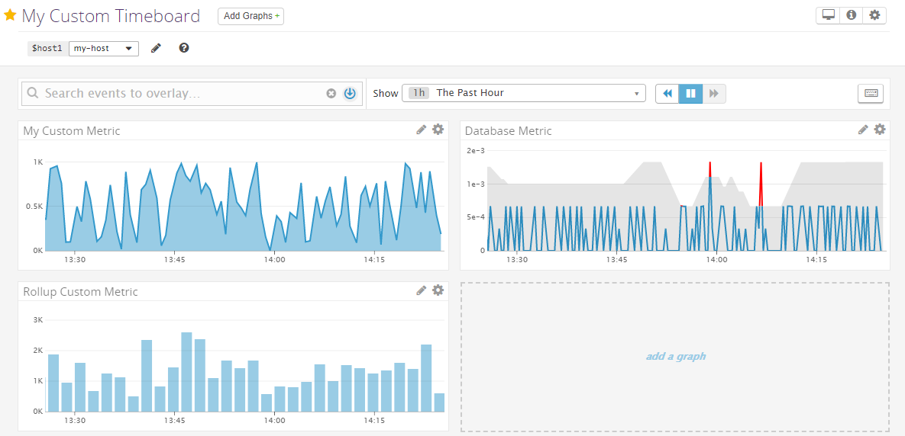

Once this is created, access the Dashboard from your Dashboard List in the UI:

* Set the Timeboard's timeframe to the past 5 minutes

We need to select on the graph a frame of 5 minutes and then we can see on the “show” section that the frame has been set to “5m”:

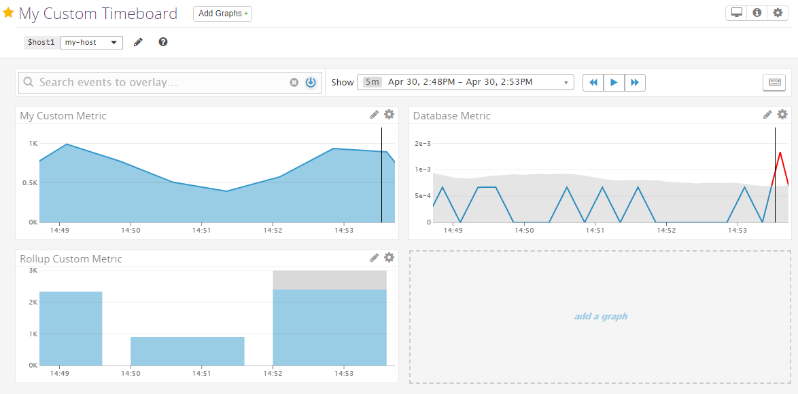

* Take a snapshot of this graph and use the @ notation to send it to yourself.

Here is the mail I received after clicking on the annotation button on the graph:

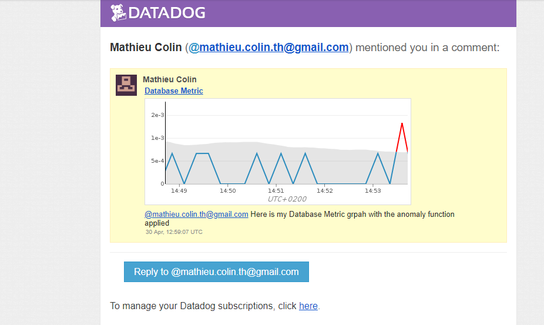

* **Bonus Question**: What is the Anomaly graph displaying?

According to the documentation:

*The gray band represents the region where the metric is expected to be based on past behavior. The blue and red line is the actual observed value of the metric; the line is blue when within the expected range and red when it is outside of the expected range.*

## Monitoring Data

Since you’ve already caught your test metric going above 800 once, you don’t want to have to continually watch this dashboard to be alerted when it goes above 800 again. So let’s make life easier by creating a monitor.

Create a new Metric Monitor that watches the average of your custom metric (my_metric) and will alert if it’s above the following values over the past 5 minutes:

* Warning threshold of 500
* Alerting threshold of 800
* And also ensure that it will notify you if there is No Data for this query over the past 10m.

Please configure the monitor’s message so that it will:

* Send you an email whenever the monitor triggers.
* Create different messages based on whether the monitor is in an Alert, Warning, or No Data state.
* Include the metric value that caused the monitor to trigger and host ip when the Monitor triggers an Alert state.
* When this monitor sends you an email notification, take a screenshot of the email that it sends you.

To create a monitor on our custom metric, we can click on this button:

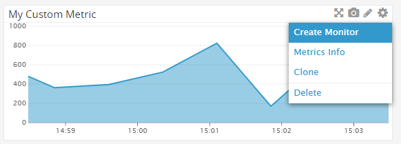

Configuration of the monitor:

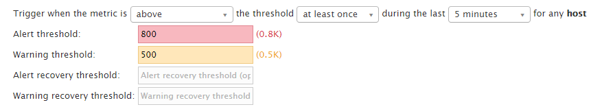

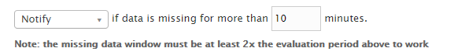

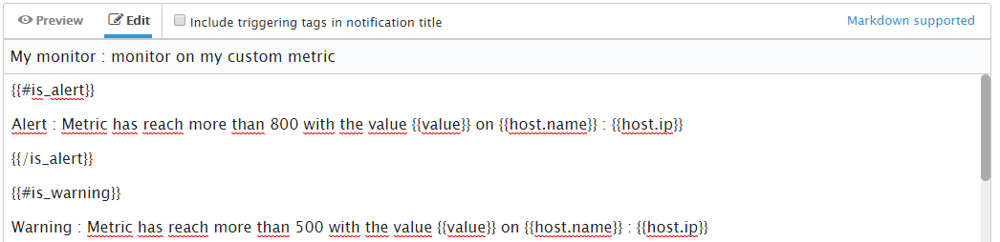

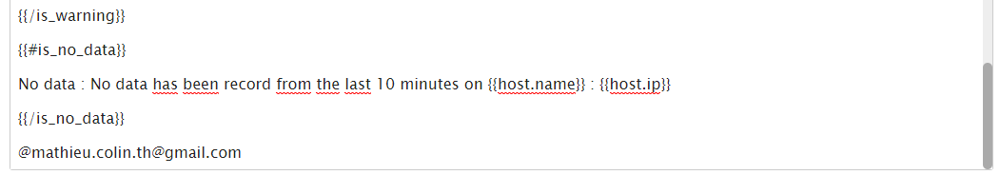

Here are the differents mails received respectively for alert, warning and no data alert:

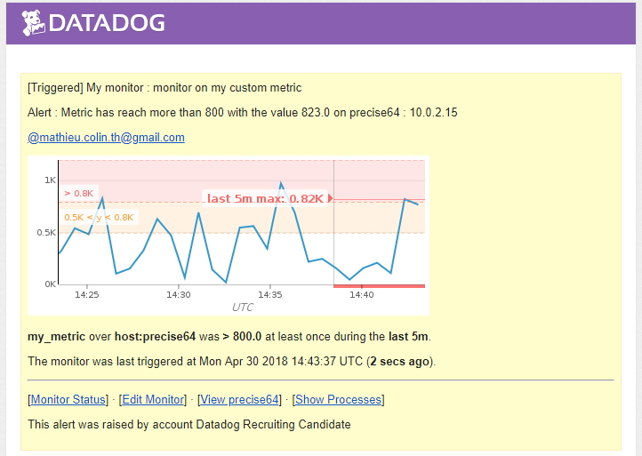

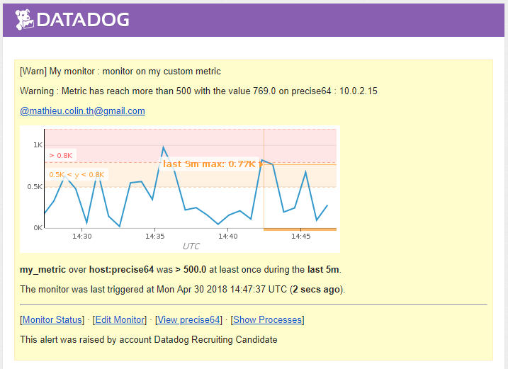

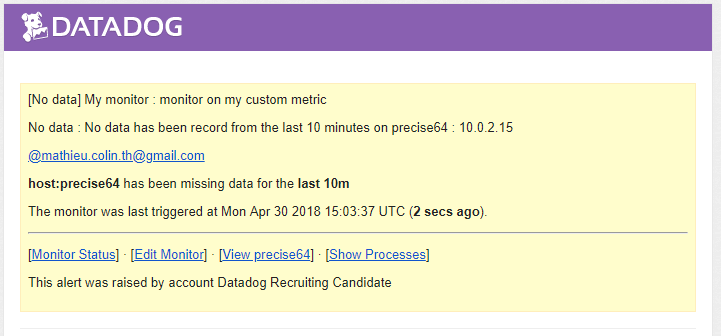

* **Bonus Question**: Since this monitor is going to alert pretty often, you don’t want to be alerted when you are out of the office. Set up two scheduled downtimes for this monitor:

    * One that silences it from 7pm to 9am daily on M-F,
    * And one that silences it all day on Sat-Sun.
    * Make sure that your email is notified when you schedule the downtime and take a screenshot of that notification.

Configuration for the two schedules downtimes for this monitor:

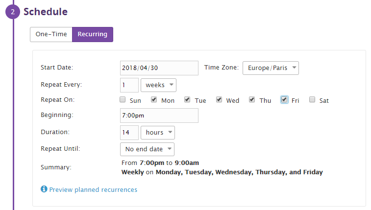

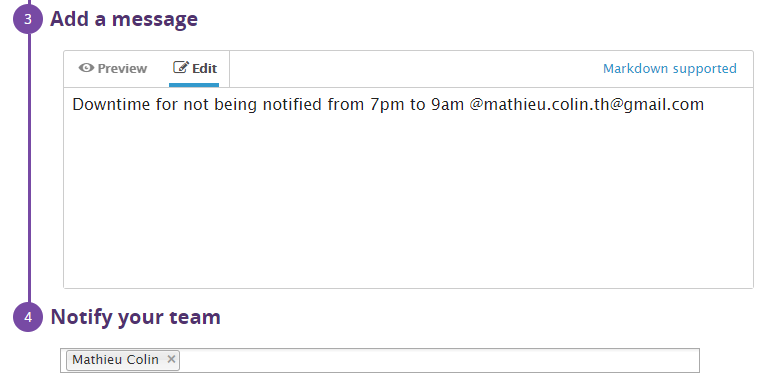

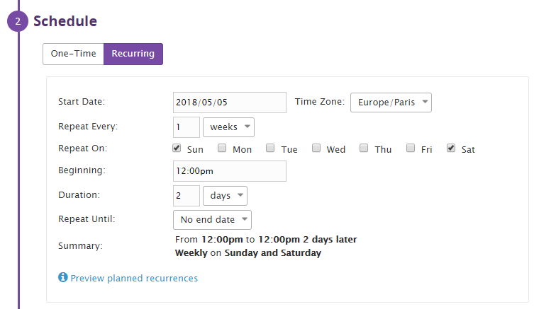

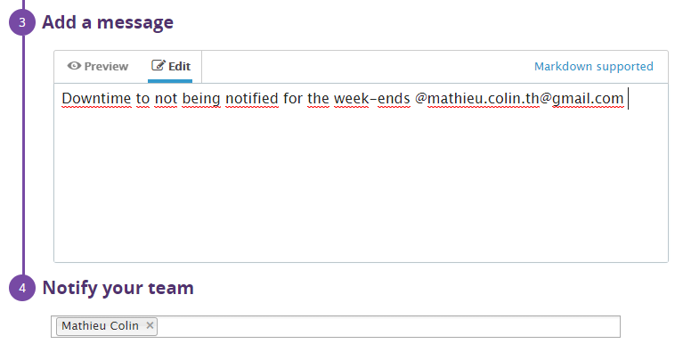

Mails received for these two downtimes:

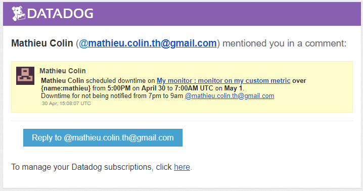

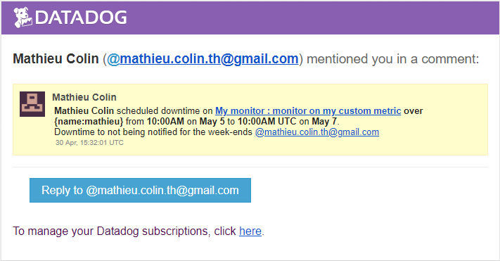


## Collecting APM Data:

Given the following Flask app (or any Python/Ruby/Go app of your choice) instrument this using Datadog’s APM solution:

```
from flask import Flask
import logging
import sys

# Have flask use stdout as the logger
main_logger = logging.getLogger()
main_logger.setLevel(logging.DEBUG)
c = logging.StreamHandler(sys.stdout)
formatter = logging.Formatter('%(asctime)s - %(name)s - %(levelname)s - %(message)s')
c.setFormatter(formatter)
main_logger.addHandler(c)

app = Flask(__name__)

@app.route('/')
def api_entry():
    return 'Entrypoint to the Application'

@app.route('/api/apm')
def apm_endpoint():
    return 'Getting APM Started'

@app.route('/api/trace')
def trace_endpoint():
    return 'Posting Traces'

if __name__ == '__main__':
    app.run()
```    

* **Note**: Using both ddtrace-run and manually inserting the Middleware has been known to cause issues. Please only use one or the other.

Provide a link and a screenshot of a Dashboard with both APM and Infrastructure Metrics.

Here is the metric displayed in the APM section:

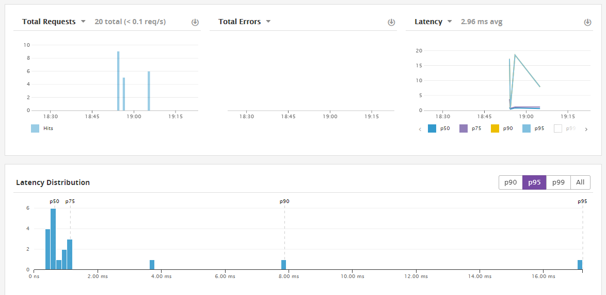

And here the Dashboard with both APM and infrastructure metrics:

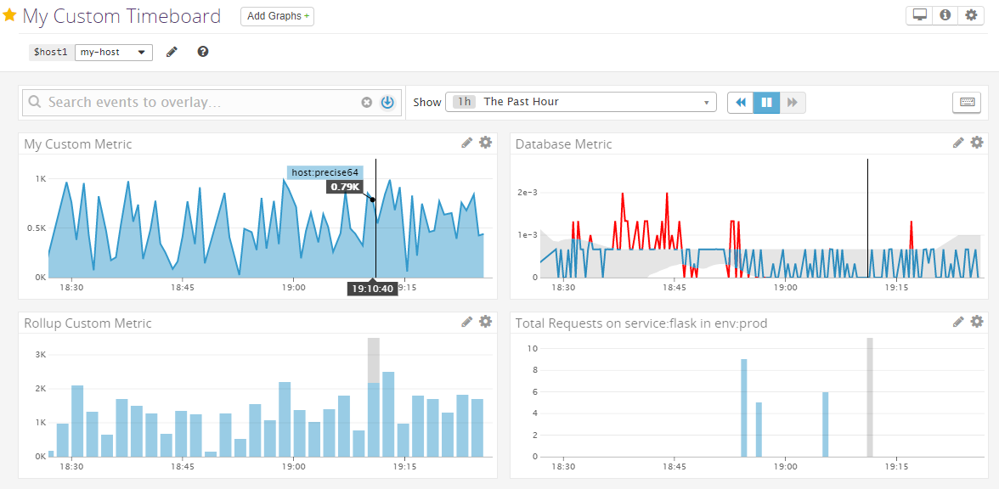

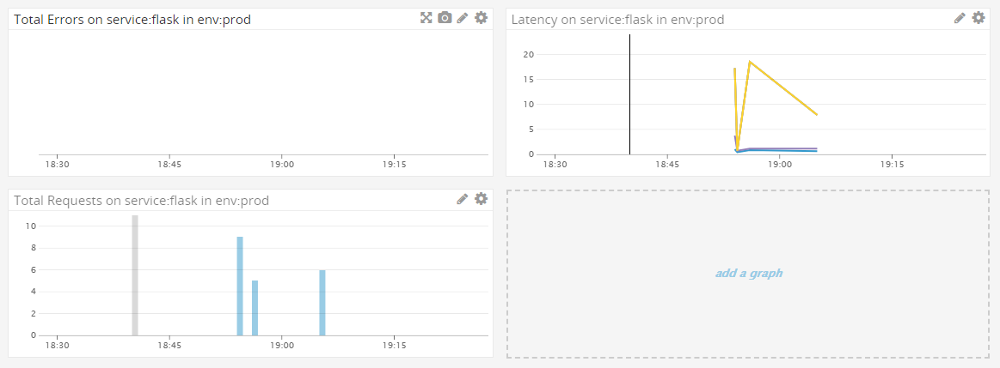

[Dashboard](https://app.datadoghq.com/dash/799153/my-custom-timeboard?live=true&page=0&is_auto=false&from_ts=1525206512136&to_ts=1525210112136&tile_size=m)

Please include your fully instrumented app in your submission, as well. 

You will find here [my_app.py](https://github.com/mathieucolin/hiring-engineers/blob/solutions-engineer-mathieucolin/my_app.py) my code for the instrumented Flask app. I just add ```app.run(host="0.0.0.0")``` at the end because I had some network errors when I try to connect to the webapp.

* **Bonus Question**: What is the difference between a Service and a Resource?

According to the documentation:

*A "Service" is the name of a set of processes that work together to provide a feature set.*
For example a web application can be composed of two services : a webapp service and a database service. In Datadog, in the APM section and more specifically in the traces search, we can see that there is a field to describe the service used and which resource of this service is used.

A resource is *a query to a service*. For example it can be a SQL query for a SQL database service. Here an example with the Flask application :

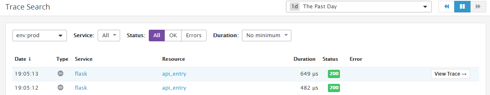

## Final Question:

Datadog has been used in a lot of creative ways in the past. We’ve written some blog posts about using Datadog to monitor the NYC Subway System, Pokemon Go, and even office restroom availability!

Is there anything creative you would use Datadog for?

A few months ago, I had the chance to discover Iceland and I noticed that lot of websites are covering the weather because it changes a lot and it could be very dangerous in this country. So I think it would be nice to use Datadog to give a better vizualisation of these data with a heatmap and send alerts when the weather is becoming dangerous.

It could be also very nice to use it for the nothern lights forecast ! :)