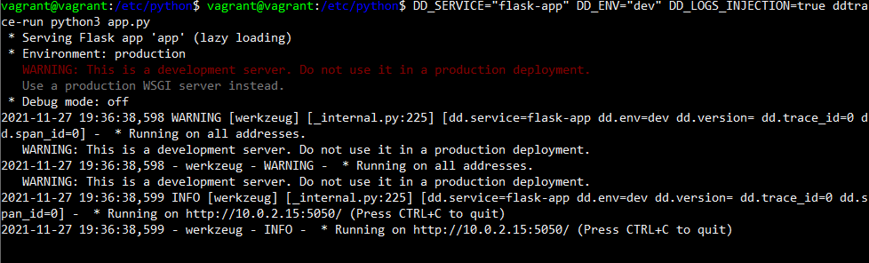

# Giuseppe Raimo - Sales Engineer Exercise

The following document shows the outcome of this first interaction with the Datadog products. The exercise is divided into different phases: the first one is about setting up the environment and collecting metrics from the datadog agent; followed by a demonstration of the creation of a dashboard; the setup of an automatic monitoring system; ending with the APM.

## Startup the environment

The chosen strategy for the environment setup is virtualization. I've installed vagrant and an ubuntu box v18. Once installed, the environment can be started up with the following commands:

`vagrant init hashicorp/bionic64`

`vagrant up`

And then ssh into the machine:

`vagrant ssh`

I've signed up for a trial version of Datadog and followed the ubuntu instructions to install the agent:

`DD_AGENT_MAJOR_VERSION=7 DD_API_KEY= DD_SITE="datadoghq.com" bash -c "$(curl -L https://s3.amazonaws.com/dd-agent/scripts/install_mac_os.sh)"`

## Collecting Metrics

In this section, it is shown how to collect metrics from the agent and transparently communicate them into the web UI.

### Adding tags

Datadog collects any kind of telemetry from the agents. A nice way to filter, aggregate, and compare them is by adding tags. Datadog tags are composed of a key and a value and we can define them into any agent configuration file conf.d/datadog.yaml.For this demonstration, I've changed the hostname and inserted some tags


Once the file is saved and the agent is restarted, from the web UI is possible to monitor the changes. In the infrastructure, we can observe the agent and its tags.


### Install DB

Datadog is able to collect telemetries from software deployed on the VM and provides integrations to bring together all the metrics and logs from the infrastructure and gain insights into the unified system. In this demonstration, I'm showing the installation of MongoDB on the virtual machine and its integration. To install MongoDB:

`sudo apt install -y mongodb`


After the install is complete, we need to enter the mongo shell and create a Datadog read-only user in the admin database


To collect metrics from the database it is needed to edit conf.d/mongo.d/conf.yaml


Enabled the logs in datadog.yaml as follows

`logs_enabled: true`

added into mongo.d/conf.yaml

```
logs:

  - type: file

    path: /var/log/mongodb/mongodb.log

    service: mongo

    source: mongodb
```

I've restarted the datadog's agent and then it is possible to see all the metrics for MongoDB


### Create a custom agent

Integrations aren’t the only way to collect metrics. Indeed we can create our own ones. In this section, it follows a demonstration. First of all, it is needed to create a python file generating metrics and a corresponding yaml file (with the same filename).

`vagrant@vagrant:/etc/datadog-agent/conf.d/checks.d $ sudo touch my_metric.py,``vagrant@vagrant:/etc/datadog-agent/conf.d $ sudo touch my_metric.yaml`

I've copy-pasted the templates for the two files, provided in the guide, and used the random library to generate integers between 0 and 1000. After that, it is possible to check the custom metric collection with the command

`vagrant@vagrant:/etc/datadog-agent$ sudo -u dd-agent datadog-agent check my_metric`


The collection interval can be managed in the metric generation logic into the python file or in the yaml file, by specifying the option … To satisfy the condition in the bonus question I've applied the second strategy.

## Visualizing Data

Metrics are collected to monitor the health of our infrastructure. Dashboards are an intuitive way of tracking, analyzing, and displaying key performance metrics.

Dashboards can either be generated on the web UI or by scripts. In this demonstration, it is shown how to create a custom dashboard with any kind of telemetry by script. Following the Datadog Docs API, we can access resources and templates to design and generate new dashboards.

I've first customized the python [legacy] example, but unfortunately, I wasn’t able to create the dashboard (might be a problem related to python).

After the first attempt, I've refactored the structure of the template into a JSON and followed the curl approach. And I've come up with the following command to be run in the command line. Note that it is first necessary to define an API\_KEY and an APP\_KEY and export them in the command line.

```
curl -X POST "https://api.datadoghq.eu/api/v1/dashboard" \
-H "Content-Type: application/json" \
-H "DD-API-KEY: ${DD_API_KEY}" \
-H "DD-APPLICATION-KEY: ${DD_APP_KEY}" \
-d @- << EOF
{"title":"Test Timeboard",
"description":"",
"widgets":[
    {"definition":{
        "title":"my_metric",
    "type":"timeseries",
        "requests":[{"q":"avg:my_metric{host:GiuseppeInterview}"}]
        }
    },
    {"definition":{
        "title":"MongoDB in-memory storage engine",
    "type":"timeseries",
        "requests":[{"q":"anomalies(avg:mongodb.mem.bits{host:GiuseppeInterview}, 'basic', 2)"}]
        }
    },
    {"definition":{
        "title":"my_metric rollup 1h",
    "type":"timeseries",
        "requests":[{"q":"avg:my_metric{host:GiuseppeInterview}.rollup(sum, 3600)"}]
        }
    }
],
"template_variables":[],
"layout_type":"ordered",
"is_read_only":false,
"notify_list":["giuseppe.raimo95@gmail.com"],
"reflow_type":"auto"
}
EOF
```

As intuitively understandable, the timeboard is composed of different requests on which I've applied different functions, described in the API docs. We are designing a timeboard with 3 metrics: the first one is the my\_metric, defined in the previous stages; the second one is mongodb.mem.bits (in-memory storage engine) with the basic anomaly function applied, and the last one is the rollup sum of my\_metric in the last hour.


After the successful execution of the command, we can observe the designed platform into the datadog web UI.


The user can interact with the web UI and, as shown in the screenshots below, I've set the timeboard timeframe to the past 5 minutes. It is also possible to share the view of a graph by taking a snapshot. In this demonstration, I've sent it to myself.


Bonus question: t he anomaly graph displays the selected metric, as usual, but visually marks the anomalies defined by the function. In this case, the anomalies are the values with a difference greater than double of the std dev. Anyway, it’s possible to customize the anomaly detection function.

## Monitoring Data

Timeboards and dashboards are created to give an easier interaction and understanding of telemetries, in order to check the health status of the system. We can make it even easier by setting alerts. In this demonstration, I show how to create a custom alert on a metric. We need to enter the monitor section and create a new one.

The pictures below show the creation of a threshold alert on _my\_metric_ metric. The conditions set are: a warning when the average value of the metric in the last 5 minutes is above 500 and an alert when the same value exceeds 800. Another notification is raised when no data is received in the past 10 minutes. I've set the recipient of the notification: me, and a dynamic custom message containing information about the alert.


The message:

```
@giuseppe.raimo@it.cdi.eu 

{{#is_alert}}
ALERT! my_metric has been on average {{value}}  over the last 5 minutes. 
Hostname and IP : {{host.name}} , {{host.ip}}.
{{/is_alert}}

{{#is_warning}}
WARNING! The average value of my_metric is above 500.
{{/is_warning}} 

{{#is_no_data}}
There has been no data for the last 10 minutes for my_metric.
{{/is_no_data}}
```

The outcome is the following


In order to check the validity of the monitor just created I've triggered a test and received the following e-mails, testing the different notifications.

**ALERT**


**WARNING**


**NO DATA**

_Note: the first line in the e-mail is the header that I've set (probably a better message should be set, as in this case the metric isn’t too high)_


Bonus question:

When we are out of office we don’t want to be notified with the monitoring values, as we can’t fix them.

In order to manage downtimes we can do as follows: click on _Manage downtime_ in the _monitor_ area and click on _Schedule downtime_. Set a recurrent downtime and select _my\_alert_ monitor. Define as downtime starting time 7 pm, lasting 14h. It should repeat every 1 week on the weekly days (select them). As the set timezone is Rome, I received the email with 6pm-8am UTC.

Following, you can see the two e-mails confirming the downtime settings


## Collecting APM data

Datadog APM is the application performance monitoring. It provides end-to-end distributed tracing with no sampling. APM enables monitoring service dependencies, reducing latency, and eliminating errors for the best possible experience.

In this demonstration, it is shown how to run a flask app and monitor it from Datadog’s APM solution. Let’s copy first the provided app into an app.py. In order to make it executable we need to install flask and ddtrace

`pip install flask`

`Pip install ddtrace`

I was getting some issues with the python 2 installation and then I've repeated it with pip3 successfully.

I've enabled in the datadog’s agent settings the APM as follows in datadog.yaml

```
apm_config:
  enabled: true
```

Once restarted the virtual machine, I've executed the following command

`DD_SERVICE="flask-app" DD_ENV="dev" DD_LOGS_INJECTION=true ddtrace-run python my_app.py`



From another instance of the VM, I've tried to reach the exposed service with the curl command and I was able to reach the web application. After a few minutes, the APM detected the web app and showed me the requests I'd made earlier.


The APM dashboard with infrastructure metrics: [APM Traces - Estimated Usage \| Datadog (datadoghq.eu)](<APM Traces - Estimated Usage | Datadog (datadoghq.eu)>)

Bonus question: What is the difference between a Service and a Resource?

A service is a software implementation of a specific business action, and they are usually named indeed with the business action they perform on a data structure. 

A resource is instead the representation of an entity, in the form of a data structure, that is usually created, transformed or deleted by services. 

**Final question**

Thinking at a creative way of using Datadog solutions, bike-sharing is what comes up to my mind.
I've chosen this application because I thought about some services, with possibly complex and distributed applications, that usually face some problems or downtime and hence need monitoring. 

When I was living in southern France I loved moving in the city by bike, but I didn't have one and the best solution was the VeloBleu service. Although very convenient, many times I had problem in either renting or returning the bike due to some problems at the station. I can assume there could have been a connection problem, or a back-end issue with my card, etc. 
Anyway, the application of Datadog solution could be beneficial for:
- the service provider, as they would be able to provide a better service by knowing immediately where and how to repair a return station, the status of the fleet and also they could have the possibility to translate logs into business knowledge (e.g. peak usage in a specific area);
- the service user, as many times a station is flagged as free for the return, but actually doesn't woimgrk properly, turning into unnecessary costs and wasted time. 