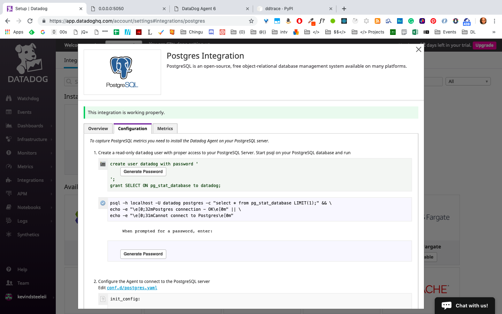

Answers to [Solutions Engineer Hiring Exercise](README.md)
## Part 01: Collecting Metrics

### Add tags in the Agent config file and show us a screenshot of your host and its tags on the Host Map page in Datadog.
#### Steps:
1. Go to the Agent config file (Mac OS), datadog.yaml.
```bash
  cd ~/.datadog-agent/ && code .
```
2. Uncomment tags section in datadog.yaml and add host tags.
```
  # Set the host's tags (optional)
  tags:
    - env_type:test
    - env_from:home
```
3. Get Screenshot

**[Full-size screenshot of host map w/ added tags](img/01-CollMetrics-002.png)**

-----------------
### Install a database on your machine (MongoDB, MySQL, or PostgreSQL) and then install the respective Datadog integration for that database.
#### Screenshots reflecting those instructions:
  **[Full-size screenshot of PostgreSQL on my machine](img/01-CollMetrics-004.png)**
  
---------
  **[Full-size Screenshot of PostgreSQL Integration](img/01-CollMetrics-003.png)**
  
-----------
### Create a custom Agent check that submits a metric named my_metric with a random value between 0 and 1000.

1. Go to the folder that holds the configuration files for datadog and open them in a text editor/IDE.
  ```bash
  cd ~/.datadog-agent/ && code .
  ```
2. Add a custom check and config file named **my_metric.py** and **my_metric.yaml** respectively. Used provided **[link](https://docs.datadoghq.com/developers/write_agent_check/)** from the README as base for the script.

Code Excerpt from **my_metric.py**:
```py
from random import randrange
# sourced code from the example on @ https://docs.datadoghq.com/developers/write_agent_check/?tab=agentv6
# the following try/except block will make the custom check compatible with any Agent version
try:
    # first, try to import the base class from old versions of the Agent...
    from checks import AgentCheck
except ImportError:
    # ...if the above failed, the check is running in Agent version 6 or later
    from datadog_checks.checks import AgentCheck

# content of the special variable __version__ will be shown in the Agent status page
__version__ = "1.0.0"


class MyMetricCheck(AgentCheck):
    def check(self, instance):
    # used the random module's randrange method to generate a random number b/n 0 and 1000
        amount = randrange(1000)
        self.gauge('my_metric', amount)
```
Code Excerpt from **my_metric.yaml** reflecting initial settings:
```bash
instances: [{}]
```
### Change your check's collection interval so that it only submits the metric once every 45 seconds?
Modified **my_metric.yaml** to change the check's collection interval.
```bash
init_config:
instances:
  - min_collection_interval: 45
```

### Bonus Question: Can you change the collection interval without modifying the Python check file you created?
- **Answer**: Yes, you do it by changing the the min_collection_interval's value in the config file, **my_metric.yaml**.

## Part 02: Visualizing Data:
### Utilize the Datadog API to create a Timeboard that contains:
- Your custom metric scoped over your host.
- Any metric from the Integration on your Database with the anomaly function applied.
- Your custom metric with the rollup function applied to sum up all the points for the past hour into one bucket
Please be sure, when submitting your hiring challenge, to include the script that you've used to create this Timeboard.

#### Solution in Steps:
1. Made Timeboard using GUI tools that reflected the requirements as per instructed.

1. Consulted Timeboard API **[documentation](https://docs.datadoghq.com/graphing/faq/timeboard-api-doc/?tab=python#pagetitle)** to create the **[template](timeboard_scaffold.py)** needed to produce Timeboard programmatically. **NOTE:** This documentation was marked as **_outdated_** and in future exercises may cause conflicts. Consult **[Dashboard API](https://docs.datadoghq.com/api/?lang=python#dashboards)** for further detail.
1. Looked up API and Application keys location using this **[doc](https://docs.datadoghq.com/account_management/faq/api-app-key-management/#api-keys)**. Transcribed keys to appropriate values inside of _option_ dictionary in timeboard creation script.
    ```js
      // JSON snippet for my_metric line graph
      {
      "viz": "timeseries",
      "requests": [
        {
          "q": "avg:my_metric{host:Kevins-Air.home}",
          "type": "line",
          "style": {
            "palette": "dog_classic",
            "type": "solid",
            "width": "normal"
          },
          "conditional_formats": []
        }
      ],
      "autoscale": true
    }
    ```
1. Created a local Python virtual environment in parent folder of script using pipenv tool and installed datadog package.
    ```bash
      pipenv shell 
      pipenv install datadog
    ```
1. Looked up and copied JSON file of each graph/widget inside previously made Timeboard. Rewrote them as Python dictionaries within a list called _graph_ in Timeboard creation script.
1. Culled or rearranged any attributes as specified by Timeboard API in the script.
1. Executed the **[timeboard creation script](create_timeboard.py)** in terminal.
```bash
  python create_timeboard.py
```
8. Confirmed results in GUI tool and datadog agent log.

### [Final Script Used to create Timeboard](create_timeboard.py)

### Once this is created, access the Dashboard from your Dashboard List in the UI:

Set the Timeboard's timeframe to the past 5 minutes
Take a snapshot of this graph and use the @ notation to send it to yourself.

**[Full-size Screenshot of TimeBoard Snapshot Email](img/02-VizData-001.png)**      

------------------
### Bonus Question: What is the Anomaly graph displaying?
- **Answer**: The Anomaly graph generally displays a given metric and it's adherence or deviation from its predicted behavior within a timeframe. The gray area indicates "safe" values or bounds. If a metric ends up being a standard deviation above or below, it ends up outside of these bounds. At this point, it's considered anomalous which suggests some kind of dysfunction or unintended behavior/ side-effect.
More specifically, my anomaly graph is showing the number of commits made by PostgreSQL and whether or not it is within the bounds of predicted behavior by the algorithm.

**[Full-size Screenshot of Anomaly Graph](img/02-VizData-002.png)**      

----------------
## Part 03: Monitoring Data
Since you’ve already caught your test metric going above 800 once, you don’t want to have to continually watch this dashboard to be alerted when it goes above 800 again. So let’s make life easier by creating a monitor.

### Create a new Metric Monitor that watches the average of your custom metric (my_metric) and will alert if it’s above the following values over the past 5 minutes:
- Warning threshold of 500
- Alerting threshold of 800
- And also ensure that it will notify you if there is No Data for this query over the past 10m.
#### Please configure the monitor’s message so that it will:
- Send you an email whenever the monitor triggers.
- Create different messages based on whether the monitor is in an Alert, Warning, or No Data state.

#### Include the metric value that caused the monitor to trigger and host ip when the Monitor triggers an Alert state.

- When this monitor sends you an email notification, take a screenshot of the email that it sends you.

[Full Size Warning Email](img/03-Monitor-02Warn.png)    

---
### Bonus Question: Since this monitor is going to alert pretty often, you don’t want to be alerted when you are out of the office. Set up two scheduled downtimes for this monitor:

- One that silences it from 7pm to 9am daily on M-F,
- And one that silences it all day on Sat-Sun.
- Make sure that your email is notified when you schedule the downtime and take a screenshot of that notification.

[Full-size Scheduled Weekend Downtime Email Notification](img/04-Downtime-02WkEnds.png)      
[Full-size Scheduled Weekdays Downtime Email Notification](img/04-Downtime-01MonFri.png)      

---
## Part 04: Collecting APM Data
### Given the following Flask app (or any Python/Ruby/Go app of your choice) instrument this using Datadog’s APM solution:

```python
from flask import Flask
import logging
import sys

# Have flask use stdout as the logger
main_logger = logging.getLogger()
main_logger.setLevel(logging.DEBUG)
c = logging.StreamHandler(sys.stdout)
formatter = logging.Formatter('%(asctime)s - %(name)s - %(levelname)s - %(message)s')
c.setFormatter(formatter)
main_logger.addHandler(c)

app = Flask(__name__)

@app.route('/')
def api_entry():
    return 'Entrypoint to the Application'

@app.route('/api/apm')
def apm_endpoint():
    return 'Getting APM Started'

@app.route('/api/trace')
def trace_endpoint():
    return 'Posting Traces'

if __name__ == '__main__':
    app.run(host='0.0.0.0', port='5050')
```

- **NOTE**: Using both ddtrace-run and manually inserting the Middleware has been known to cause issues. Please only use one or the other.
  - [x] ddtrace-run
  - [ ] MiddleWare
#### Solution in Steps:
1. Installed ddtrace and ran it with the provided Flask app as per the **[docs](https://app.datadoghq.com/apm/docs)**' instructions.
    ```bash
      pipenv install ddtrace
      ddtrace-run python my_app.py
    ```
1. The app ran and I went to the provided url, 0.0.0.0.:5050. Upon changing routes to 0.0.0.0.:5050/api/apm, the terminal running the app gave an error that explained that the trace was rejected.
    ```bash
    error:ddtrace.writer:cannot send services to localhost:8126: [errno 61] connection refused
    ```
1. I checked the datadog-agent log and found that the Application Program Manager or APM was not configured due to it not being enabled in the config file.
    ```bash
    2019-02-27 02:20:51 EST | ERROR | (loader.go:76 in Load) | core.loader: could not configure check APM Agent: APM agent disabled through main configuration file
    2019-02-27 02:20:51 EST | ERROR | (scheduler.go:184 in GetChecksFromConfigs) | Unable to load the check: unable to load any check from config 'apm'
    ```
1. I went to the config file, _datadog.yaml_ and examined it for settings for the APM. I enabled it according to the default settings provided. I also enabled its specific config file ending in .yaml.
    ```bash
    # datadog.yaml config file snippet
    apm_config:
      #   Whether or not the APM Agent should run
      enabled: true
      #   The environment tag that Traces should be tagged with
      #   Will inherit from "env" tag if none is applied here
      env: none
      #   The port that the Receiver should listen on
      receiver_port: 8126
    ```
    ```bash
    # apm.yaml config file snippet
    init_config:
    instances:
      - {} # default instance, if you need to customize its configuration, please comment out this instance
    # and customize the configuration options on the instance below
    ```
1. I ran the app again this time, enabling the debugging tools to get more information on what was happening.
    ```bash
    DATADOG_TRACE_ENABLED=false DATADOG_TRACE_DEBUG=true DATADOG_TRACE_AGENT_PORT=8126 
    DATADOG_TRACE_AGENT_HOSTNAME=localhost pipenv run ddtrace-run python simple_app.py 
    ```
1. Upon retrying the routes in the app, I got similar feedback; this time I could see the that there was an issue yet again with the main config file. So I searched for similar bugs in open issues in Datadog's various related repositories.
1. I came upon this **[issue](https://github.com/DataDog/datadog-agent/issues/2886)**. It mentioned a unique setting not in the config file so I added it to the main config file, _datadog.yaml_.
    ```bash
      apm_enabled: true
    ```
1. And it worked!
### Provide a link and a screenshot of a Dashboard with both APM and Infrastructure Metrics.
**[APM & Infrastructure Metrics Dashboard](https://p.datadoghq.com/sb/xz98xlrju6fj0v0f-e3d82eff9ab6856b3df087ce700208de)**


### Please include your fully instrumented app in your submission, as well.
### **[Instrumented App link](my_app.py)**
### Bonus Question: What is the difference between a Service and a Resource?
- **Answer**: A service is composed of resources. While a service is a grouping of processes that have the same job, resources are particular actions or specific executions of tasks for a given resource it belongs to. Somewhat similar to classes and functions or dictionaries and attributes.


