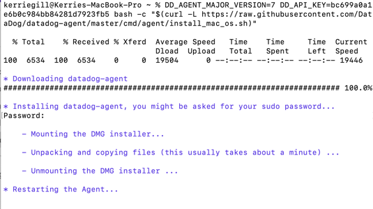

Setting up the DataDog Trial Account

Setting up the environment 
1.	First I spun up virtual box and vagrant then installed the Agent using Ubuntu (quick install method): 

The install output the message “No datadog.yaml file detected, not starting the agent.” Running the install a 2nd time resolved this. I verified the Agent status using $ sudo datadog-agent status. 

A few additional permissions were needed to access the Agent Config file. One was related to mismatched guest versions which a fresh Vagrant Up uncovered. Installing the vagrant-vbguest plugin resolved this. 
 

My host is MacOS so I had to use VSCode - Insiders with SSH Remote - Nightly to set up the SSH connection. I elevated the permissions throughout this process to access the files using ‘sudo chmod 777 /path/to/file.'

 

I also installed the Agent directly on host OS for a well-rounded approach and did encounter some dependency issues when configuring the database integration, so I promptly jumped ship on that but it was a fun time. 

Collecting Metrics   
•	Add tags in the Agent config file and show us a screenshot of your host and its tags on the Host Map page in Datadog. 
- Documentation: https://docs.datadoghq.com/tagging/
- I navigated to the agent config file (/etc/datadog-agent/datadog.yaml) to edit the Host name to reflect my current env: kerries-vm.vagrant and used the below tag format: 

 
- To process the changes, I refreshed the Agent and the tags were reflected on the Host Map page.  

•	Install a database on your machine (MongoDB, MySQL, or PostgreSQL) and then install the respective Datadog integration for that database.
-	While it's not the cream of the crop, I am most familiar with PostgreSQL, so I installed that on my VM using:
$ sudo apt update
$ sudo apt install postgresql postgresql-contrib
- I installed PostgreSQL on the GUI and followed the steps listed, like creating the datadog user in psql with proper permissions 

-	=# create user datadog with password '<PASSWORD>';
-	=# grant pg_monitor to datadog;
- I then set up the logging configuration
 
 

- I used the ‘sudo datadog-agent status’ command to verify the PostgreSQL connection. Initially, I used this command to debug the config file (mostly indentations). 

 
- I could see the connection was OK, but didn’t see the ‘Total Runs’ and ‘Metrics’ data I needed after a few hours of troubleshooting. 

•	Create a custom Agent check that submits a metric named my_metric with a random value between 0 and 1000.
 

•	Change your check's collection interval so that it only submits the metric once every 45 seconds.
 
 
- After creating the .py and .yaml files, I restarted the agent by running ‘sudo service datadog-agent restart’ then refreshed the browser. Voila, the metrics: 

  
•	Bonus Question Can you change the collection interval without modifying the Python check file you created? 
- Since this change is made in the configuration (.yaml) file, I assume this is referring to the checks you can write to run command line programs which capture outputs as a custom metric 

Visualizing Data
Documentation: https://docs.datadoghq.com/api/?lang=bash#dashboards
    https://docs.datadoghq.com/integrations/faq/postgres-custom-metric-collection-explained/
    https://docs.datadoghq.com/dashboards/graphing_json/
    https://docs.datadoghq.com/dashboards/functions/algorithms/#anomalies
    https://docs.datadoghq.com/dashboards/functions/rollup/

- To use the Datadog API, I installed Postman then downloaded the DataDog Postman Collection JSON file and imported it. I created an environment to house the API and Application Keys, then ran a check to verify the API calls: 
   

Utilize the Datadog API to create a Timeboard that contains:
•	Any metric from the Integration on your Database with the anomaly function applied.
- I used Postman to create the initial dashboard by selecting Put “Update Dashboard” under the Dashboard folder, and set the dashboard ID to “Overview Dash” and added my database metrics with the anomalies() function applied.
 
 
 
 

  
 
•	Your custom metric scoped over your host.
- To add my custom metric to a Timeboard, I selected “Export to Existing Timeboard” on the Metrics Explorer page 
•	Your custom metric with the rollup function applied to sum up all the points for the past hour into one bucket
- Here I added the graph as a widget and applied the .rollup() function. The given params are <METHOD> and <TIME> (in seconds).  To get the sum of data points in the last hour, I used <SUM> and <3600> (the number of seconds in an hour). 
 
 
 

  

Once this is created, access the Dashboard from your Dashboard List in the UI:
•	Set the Timeboard's timeframe to the past 5 minutes
•	Take a snapshot of this graph and use the @ notation to send it to yourself.
-	I referenced this blog post for guidelines on this: https://www.datadoghq.com/blog/real-time-graph-annotations/
 
 
 

•	Bonus Question: What is the Anomaly graph displaying?
- Spikes, in this case in system usage, that are abnormally high or low, based on historical data from my CPU during certain times of the day. 

Monitoring Data
Since you’ve already caught your test metric going above 800 once, you don’t want to have to continually watch this dashboard to be alerted when it goes above 800 again. So let’s make life easier by creating a monitor.
Create a new Metric Monitor that watches the average of your custom metric (my_metric) and will alert if it’s above the following values over the past 5 minutes:
•	Warning threshold of 500
•	Alerting threshold of 800
•	And also ensure that it will notify you if there is No Data for this query over the past 10m.

 
Please configure the monitor’s message so that it will:
•	Send you an email whenever the monitor triggers. Create different messages based on whether the monitor is in an Alert, Warning, or No Data state. Include the metric value that caused the monitor to trigger and host ip when the Monitor triggers an Alert state.
-	Documentation: https://docs.datadoghq.com/monitors/notifications/?tab=is_alert#conditional-variables

•	When this monitor sends you an email notification, take a screenshot of the email that it sends you.

•	Bonus Question: Since this monitor is going to alert pretty often, you don’t want to be alerted when you are out of the office. Set up two scheduled downtimes for this monitor:
o	One that silences it from 7pm to 9am daily on M-F. And one that silences it all day on Sat-Sun. Make sure that your email is notified when you schedule the downtime and take a screenshot of that notification.
- Documentation: https://docs.datadoghq.com/monitors/downtimes/

 

Collecting APM Data

Given the following Flask app (or any Python/Ruby/Go app of your choice) instrument this using Datadog’s APM solution:
from flask import Flask
import logging
import sys

# Have flask use stdout as the logger
main_logger = logging.getLogger()
main_logger.setLevel(logging.DEBUG)
c = logging.StreamHandler(sys.stdout)
formatter = logging.Formatter('%(asctime)s - %(name)s - %(levelname)s - %(message)s')
c.setFormatter(formatter)
main_logger.addHandler(c)

app = Flask(__name__)

@app.route('/')
def api_entry():
    return 'Entrypoint to the Application'

@app.route('/api/apm')
def apm_endpoint():
    return 'Getting APM Started'

@app.route('/api/trace')
def trace_endpoint():
    return 'Posting Traces'

if __name__ == '__main__':
    app.run(host='0.0.0.0', port='5050')
    
•	Note: Using both ddtrace-run and manually inserting the Middleware has been known to cause issues. Please only use one or the other.

- Documentation: https://docs.datadoghq.com/getting_started/tracing/
- I chose to use Python because that is the language I’m most familiar with. 
- First I enabled APM in the dd config file, and installed PIP, flask, and the required Python client ddtrace.  
- I created the Flask app within the /etc/datadog-agent folder and saved it as app.py, and verified it was setup properly by running the app and testing it. 

 
•	Bonus Question: What is the difference between a Service and a Resource?
- Service is the concept of many endpoints or queries grouped into one, easy to identify process. An example is a group of database queries grouped together within one database service. Resource is a particular domain or singular query or endpoint. 
Provide a link and a screenshot of a Dashboard with both APM and Infrastructure Metrics.
 
Link: https://app.datadoghq.com/dashboard/76t-xki-ht8?from_ts=1585438756487&to_ts=1585439056487&live=true&tile_size=m

Please include your fully instrumented app in your submission, as well.
-	My trace was soon displayed in Datadog under the flask service (services page and trace list as shown below). 

 

Final Question: Datadog has been used in a lot of creative ways in the past. We’ve written some blog posts about using Datadog to monitor the NYC Subway System, Pokemon Go, and even office restroom availability! Is there anything creative you would use Datadog for?

-	Given the current global state of things, I’ve been checking stats on the coronavirus almost psychotically. I’d probably create a few boards to monitor the total number of coronavirus cases globally, in the US, then in Colorado, along with the number of cases who have successfully recovered or resulted in death. This way I could do a quick glance instead of getting sucked into the crazy headlines each time I google it.  

Issue Summary
- ‘Invalid active developer path’ error with command line tools. Solution: run ‘xcode-select –install’ in terminal 
- New Catalina Security/Privacy measures require individual permissions within Privacy Preferences. For the purpose of this exercise, Full Disk Access, Files and Folders, and Developer Tool permissions were set.
- The newest version of VirtualBox (6.1) no longer supports software virtualization. Solution: Downgraded to version 6.0.
- VSCode Remote SSH extension not compatible with MacOS terminal. Solution: Download VSCode - Insiders and Remote SSH - Nightly extension. 
- Could not successfully collect metrics from PostgreSQL 

