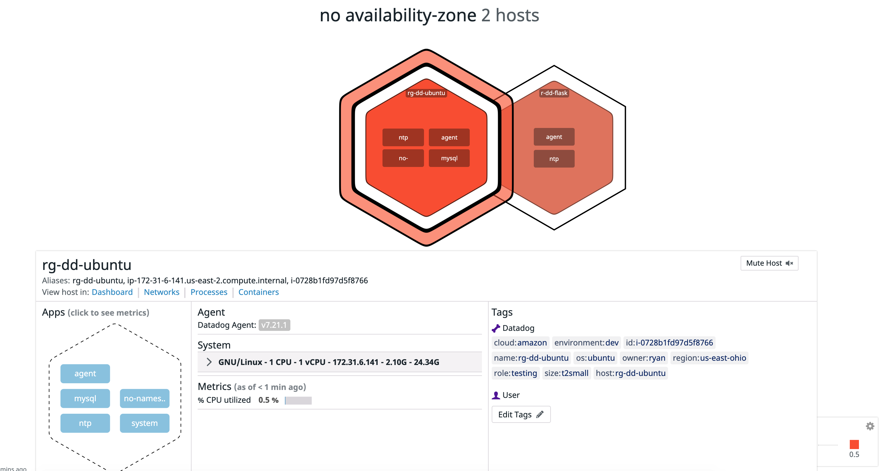
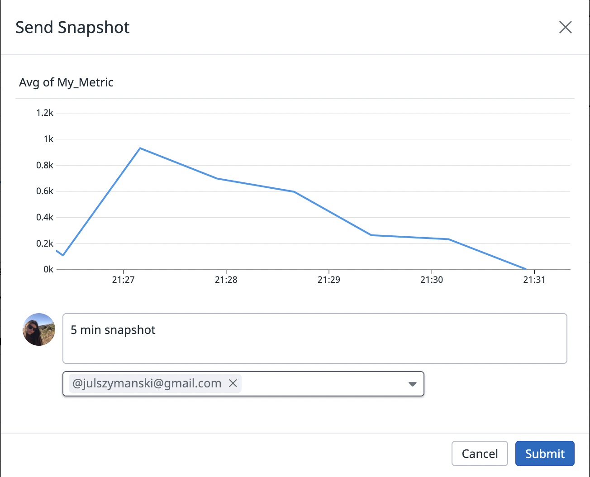
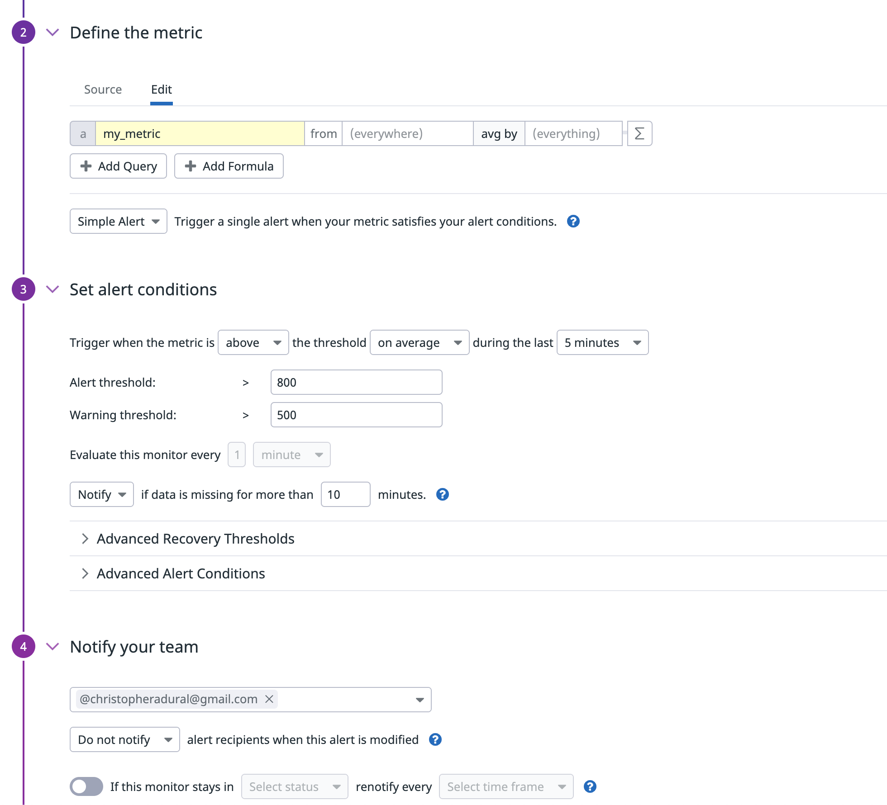
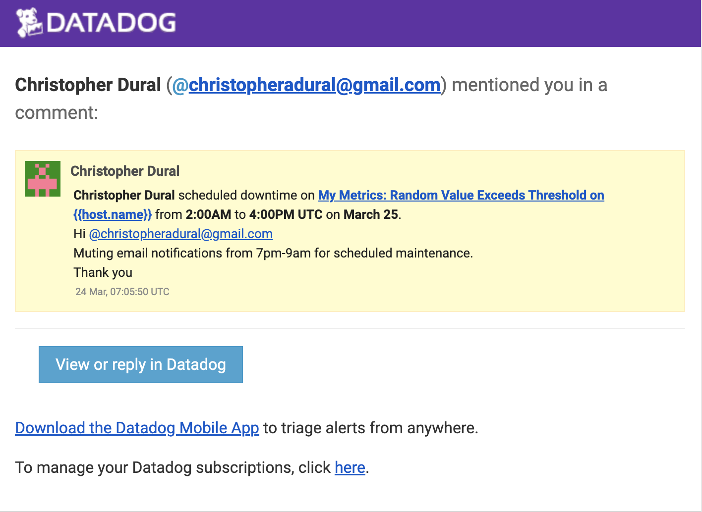
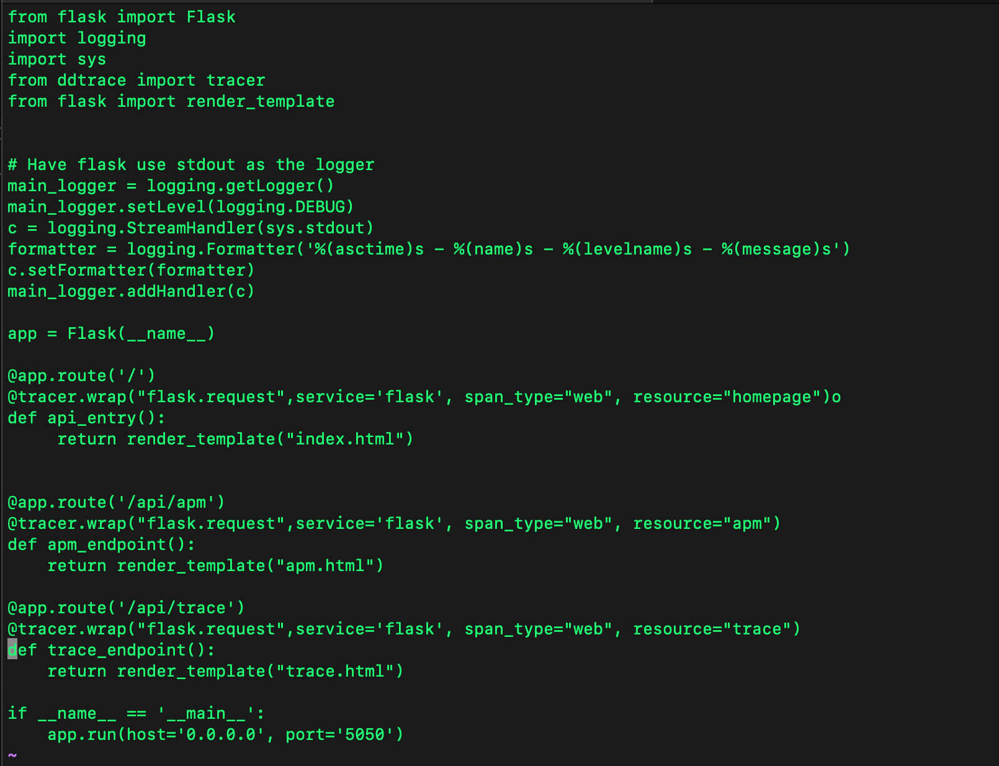

# Collecting Metrics:

* Add tags in the Agent config file and show us a screenshot of your host and its tags on the Host Map page in Datadog.




* Install a database on your machine (MongoDB, MySQL, or PostgreSQL) and then install the respective Datadog integration for that database.


* Create a custom Agent check that submits a metric named my_metric with a random value between 0 and 825.


* Change your check's collection interval so that it only submits the metric once every 45 seconds.


* **Bonus Question** Can you change the collection interval without modifying the Python check file you created?

You could set up a cron job to periodically run the script.

# Visualizing Data:

* Your custom metric scoped over your host.
* Any metric from the Integration on your Database with the anomaly function applied.
* Your custom metric with the rollup function applied to sum up all the points for the past hour into one bucket
* Set the Timeboard's timeframe to the past 5 minutes
* <a href="./APIscript.sh">API Script</a>
* <a href="https://p.datadoghq.com/sb/drfdxdm02hunipvo-541245c1ebdda33a953ccbdc6ba175f0">Timeboard Link</a>


* Take a snapshot of this graph and use the @ notation to send it to yourself.



* **Bonus Question**: What is the Anomaly graph displaying?

The Anomaly graph is displaying the average of mysql.net.connections over Host RG-DD-Ubuntu.  The anomaly graph indicates the acceptable range in a grey outline on the graph.  If this metric outside of the accepted range it can trigger a notification.

# Monitoring Data:

Create a new Metric Monitor that watches the average of your custom metric (my_metric) and will alert if it’s above the following values over the past 5 minutes:

* Warning threshold of 500
* Alerting threshold of 800
* And also ensure that it will notify you if there is No Data for this query over the past 10m.



Please configure the monitor’s message so that it will:

* Send you an email whenever the monitor triggers.
* Create different messages based on whether the monitor is in an Alert, Warning, or No Data state.

```

{{#is_alert}}

Alert on My Metric for Host {{host.name}} with IP {{host.ip}}
It has been above 800 overage for the past 5 minutes @ryangarofalo100+100@gmail.com

{{value}} - Value

{{/is_alert}}

{{#is_warning}}

Warning on My Metric for Host {{host.name}} with IP {{host.ip}}.
It has been above 500 overage for the past 5 minutes @ryangarofalo100+100@gmail.com

{{value}} - Value

 {{/is_warning}}

{{#is_recovery}}

Host {{host.name}} with IP {{host.ip}} is in recovery @ryangarofalo100+100@gmail.com

{{value}}  - Value

{{/is_recovery}}


{{#is_no_data}}

Host {{host.name}} with IP {{host.ip}} Has no data @ryangarofalo100+100@gmail.com

{{/is_no_data}}

```

* Include the metric value that caused the monitor to trigger and host ip when the Monitor triggers an Alert state.
* When this monitor sends you an email notification, take a screenshot of the email that it sends you.


* **Bonus Question**: Since this monitor is going to alert pretty often, you don’t want to be alerted when you are out of the office. Set up two scheduled downtimes for this monitor:

* One that silences it from 7pm to 9am daily on M-F,


* And one that silences it all day on Sat-Sun.


* Make sure that your email is notified when you schedule the downtime and take a screenshot of that notification.



# Collecting APM Data:
Given the following Flask app (or any Python/Ruby/Go app of your choice) instrument this using Datadog’s APM solution:




* **Note**: Using both ddtrace-run and manually inserting the Middleware has been known to cause issues. Please only use one or the other.

* **Bonus Question**: What is the difference between a Service and a Resource?

A resource is a specific action for a service.  Typically it is an individual endpoint or a query.  A service is a set of processes that do the same job (framework, database or rest API).


* Provide a link and a screenshot of a Dashboard with both APM and Infrastructure Metrics.


* Please include your fully instrumented app in your submission, as well.

# Final Question:

* Ski lift Lines

* Concert Lines

* Concert ticket website

* Xbox Live Status

* I70 Traffic
