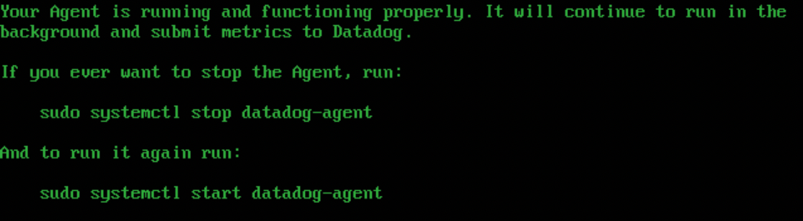
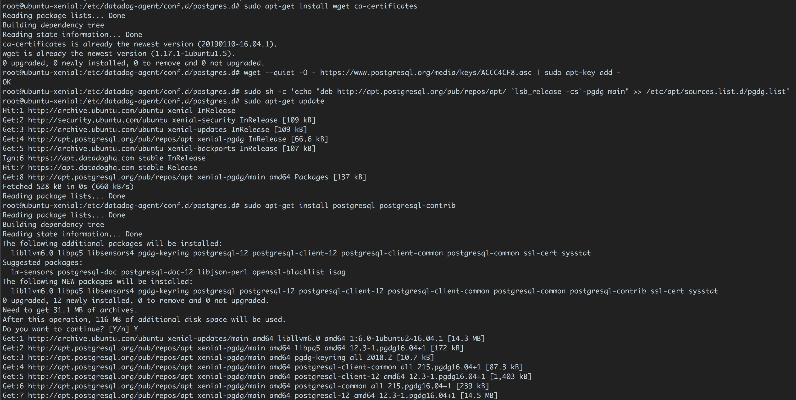

## Prerequisites - Setup the environment

- `I have spin up the vagrant ubuntu box as you suggested, fresh installation on my MacOS`
  
  
  `So, VM is up and running and I can successfully connect over ssh.`

- `Registered on DataDog webpage.`

## Collecting Metrics:

- Add tags in the Agent config file and show us a screenshot of your host and its tags on the Host Map page in Datadog.
  - `DataDog agent has been successfully installed:`
    
    
    `Tags have been added in yaml config file:`
    
    `And it's correspondingly appeared on DataDog`
    
- Install a database on your machine (MongoDB, MySQL, or PostgreSQL) and then install the respective Datadog integration for that database.
  - `PostgreSQL DB has been installed, I have added some extra tags and granted the access to the root user (not best practice :smile: ) to query dd_bessonov database`
    
    `Afterwards renamed conf.yaml.example to conf.yaml`
    
    `After restaring the datadog-agent.service metrics appeared on DataDog web page`
    
    
- Create a custom Agent check that submits a metric named my_metric with a random value between 0 and 1000.

  - `I have created 2 files:`

    - `/etc/datadog-agent/checks.d/my_metric.py`

      ```python
      # the following try/except block will make the custom check compatible with any Agent version
      try:
      # first, try to import the base class from new versions of the Agent...
      from datadog_checks.base import AgentCheck
      import random
      except ImportError:
      # ...if the above failed, the check is running in Agent version < 6.6.0
      from checks import AgentCheck

      # content of the special variable __version__ will be shown in the Agent status page
       __version__ = "1.0.0"

      class RandonNumber(AgentCheck):
          def check(self, instance):
              self.gauge('my_metric', random.randint(1,1000), tags=['TAG_KEY:TAG_VALUE'])
      ```

    - `/etc/datadog-agent/conf.d/my_metric.d/my_metric.yaml`
      ```yaml
      instances:
        - min_collection_interval: 45
      ```

  - `DD service has been restarted and custom metric appeared on DD web page`
    

- Change your check's collection interval so that it only submits the metric once every 45 seconds.
  - `This is configured in my_metric.yaml file with min_collection_interval: 45`
    
- **Bonus Question** Can you change the collection interval without modifying the Python check file you created?
  - `Interval has been configured in conf.d/my_metric.d/my_metric.yaml file`

## Visualizing Data:

Utilize the Datadog API to create a Timeboard that contains:

- Your custom metric scoped over your host.
  - `Here is JSON snippet for that metric`
    ```json
    {
      "id": 6210190090323804,
      "definition": {
        "type": "timeseries",
        "requests": [
          {
            "q": "avg:my_metric{host:ubuntu-xenial}",
            "display_type": "line",
            "style": {
              "palette": "dog_classic",
              "line_type": "solid",
              "line_width": "normal"
            }
          }
        ],
        "yaxis": {
          "label": "",
          "scale": "linear",
          "min": "auto",
          "max": "auto",
          "include_zero": true
        },
        "title": "Custom metric: my_metric on Ubuntu host",
        "show_legend": false,
        "legend_size": "0"
      }
    }
    ```
- Any metric from the Integration on your Database with the anomaly function applied.
  - `JSON snippet for DB with anomaly function`
    ```json
    {
      "id": 1052167189182458,
      "definition": {
        "type": "timeseries",
        "requests": [
          {
            "q": "anomalies(avg:postgresql.rows_returned{host:ubuntu-xenial}, 'basic', 2)",
            "display_type": "line",
            "style": {
              "palette": "dog_classic",
              "line_type": "solid",
              "line_width": "normal"
            }
          }
        ],
        "yaxis": {
          "label": "",
          "scale": "linear",
          "min": "auto",
          "max": "auto",
          "include_zero": true
        },
        "title": "PostgreSQL rows returned with anomaly function",
        "show_legend": false,
        "legend_size": "0"
      }
    }
    ```
- Your custom metric with the rollup function applied to sum up all the points for the past hour into one bucket
  - `JSON snippet for DB with rollup function applied`
    ```json
    {
      "id": 2780680859825814,
      "definition": {
        "type": "timeseries",
        "requests": [
          {
            "q": "avg:my_metric{host:ubuntu-xenial}.rollup(sum, 3600)",
            "display_type": "bars",
            "style": {
              "palette": "dog_classic",
              "line_type": "solid",
              "line_width": "normal"
            }
          }
        ],
        "yaxis": {
          "label": "",
          "scale": "linear",
          "min": "auto",
          "max": "auto",
          "include_zero": true
        },
        "title": "Custom metric: rollup of random numbers per hour",
        "show_legend": false,
        "legend_size": "0"
      }
    }
    ```

Please be sure, when submitting your hiring challenge, to include the script that you've used to create this Timeboard.

- ```bash
     DD_CLIENT_API_KEY="xxxxxxxxxxxxxxxx"
     DD_CLIENT_APP_KEY="yyyyyyyyyyyyyy"
     curl -X POST https://api.datadoghq.com/api/v1/dashboard \
     -H "Content-Type: application/json" \
     -H "DD-API-KEY: ${DD_CLIENT_API_KEY}" \
     -H "DD-APPLICATION-KEY: ${DD_CLIENT_APP_KEY}" \
     -d @- << EOF
     $JSON_FROM_ABOVE
     EOF
  ```

Once this is created, access the Dashboard from your Dashboard List in the UI:

- Set the Timeboard's timeframe to the past 5 minutes
- Take a snapshot of this graph and use the @ notation to send it to yourself.
  - `Here is small screenshot.`
    
- **Bonus Question**: What is the Anomaly graph displaying?
  - `Anomaly graph might detect when a metric is behaving differently than it has in the past, taking into account trends, seasonal day-of-week, and time-of-day patterns. This function shows a gray band on the metric showing the expected behavior of a series based on the past.`

## Monitoring Data

Since you’ve already caught your test metric going above 800 once, you don’t want to have to continually watch this dashboard to be alerted when it goes above 800 again. So let’s make life easier by creating a monitor.

Create a new Metric Monitor that watches the average of your custom metric (my_metric) and will alert if it’s above the following values over the past 5 minutes:

- Warning threshold of 500
- Alerting threshold of 800
- And also ensure that it will notify you if there is No Data for this query over the past 10m.
  - `Below is the screenshot for above required settings:`
    

Please configure the monitor’s message so that it will:

- Send you an email whenever the monitor triggers.
- Create different messages based on whether the monitor is in an Alert, Warning, or No Data state.
- Include the metric value that caused the monitor to trigger and host ip when the Monitor triggers an Alert state.
- When this monitor sends you an email notification, take a screenshot of the email that it sends you.

  - `Screenshot with the hostname, value and IP`
    
  - `Screenshot with no data`
    
  - `Screenshot for warning with value`
    

- **Bonus Question**: Since this monitor is going to alert pretty often, you don’t want to be alerted when you are out of the office. Set up two scheduled downtimes for this monitor:

  - One that silences it from 7pm to 9am daily on M-F,
    - `Screenshot for daily downtime on M-F`
      
  - And one that silences it all day on Sat-Sun.
    - `Screenshot for daily downtime on M-F`
      
  - Make sure that your email is notified when you schedule the downtime and take a screenshot of that notification.
    - `Below is the downtime schedule configuration and email`
      
      

## Collecting APM Data:

Given the following Flask app (or any Python/Ruby/Go app of your choice) instrument this using Datadog’s APM solution:

```python
from flask import Flask
import logging
import sys

# Have flask use stdout as the logger
main_logger = logging.getLogger()
main_logger.setLevel(logging.DEBUG)
c = logging.StreamHandler(sys.stdout)
formatter = logging.Formatter('%(asctime)s - %(name)s - %(levelname)s - %(message)s')
c.setFormatter(formatter)
main_logger.addHandler(c)

app = Flask(__name__)

@app.route('/')
def api_entry():
    return 'Entrypoint to the Application'

@app.route('/api/apm')
def apm_endpoint():
    return 'Getting APM Started'

@app.route('/api/trace')
def trace_endpoint():
    return 'Posting Traces'

if __name__ == '__main__':
    app.run(host='0.0.0.0', port='5050')
```

- **Note**: Using both ddtrace-run and manually inserting the Middleware has been known to cause issues. Please only use one or the other.

  - `I have used ddtrace-run, had to install couple of dependencies on fresh Ubuntu like pip, flask and configured some environment variables. Here is` [the link](https://p.datadoghq.eu/sb/t80wsat8y828cpdl-c0e5ae6518b3f1f66e5f2551879c39ec)`to the public dashboard. I have generated some load on the web page to get a bit more data on DataDog`

    [Link to the public dashboard with time frame configuration allownce](https://p.datadoghq.eu/sb/t80wsat8y828cpdl-c0e5ae6518b3f1f66e5f2551879c39ec)

    
    `Here can you see some live traces.`
    

- **Bonus Question**: What is the difference between a Service and a Resource?
  - `Services are the building blocks of modern microservice architectures - broadly a service groups together endpoints, queries, or jobs for the purposes of building your application.`
    `Resources represent a particular domain of a customer application - they are typically an instrumented web endpoint, database query, or background job.`

Provide a link and a screenshot of a Dashboard with both APM and Infrastructure Metrics.

- `Here is the screenshot of the main dashboard, please take in mind that rollup widget doesn't show anything because of the time frame is being set to 15 minutes whereas rollup has been configured for 1 hour`
  

## Final Question:

Datadog has been used in a lot of creative ways in the past. We’ve written some blog posts about using Datadog to monitor the NYC Subway System, Pokemon Go, and even office restroom availability!

Is there anything creative you would use Datadog for?

- `One of my the main idea is about IoT devices to be used in the oceans, where different kind of measurements are being collected by using millions of IoT devices and having them reporting the data in real time to DataDog would an awesome use case.`

- `Drones to be used for remote deliveries would be another interesting use case where DataDog could be perfectly used even collecting some weather data on the way for the best effective usage in the future like wind, temperature, etc.`

- `And of course to use DataDog for car manufactures with all modern embedded IoT devices to monitor, aggregate, correlate performance between different hardware, code changes, performance, etc.`
