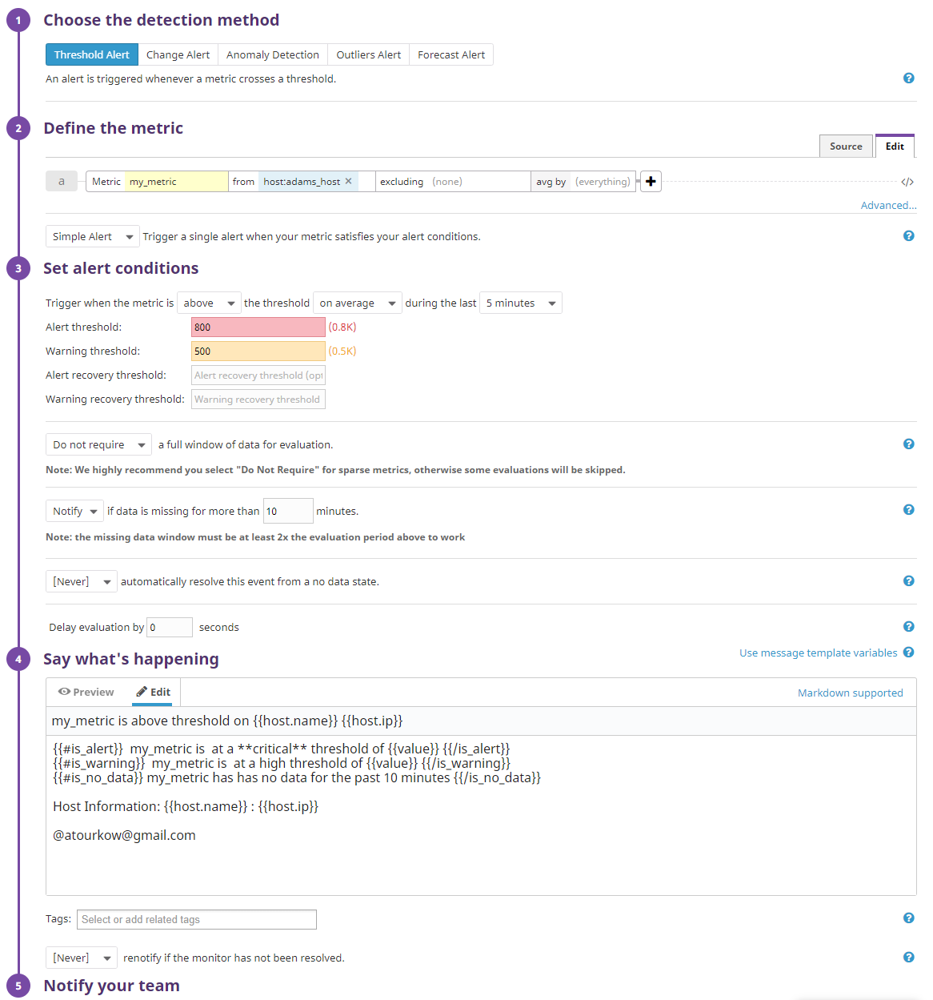
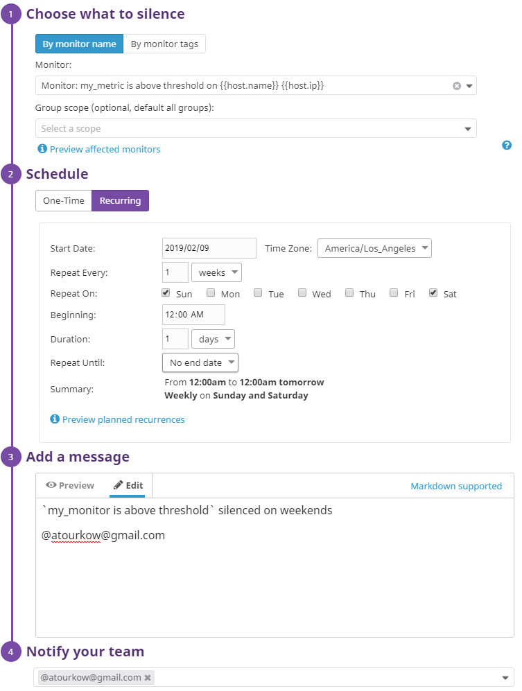
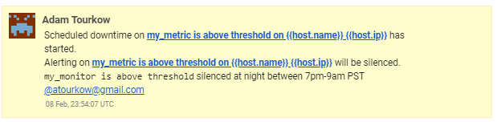

# Introduction #
> Thank you for taking the time to look my answers for the Datadog Solutions Engineer Exercise.  I have used Datadog over the past three years and am continuously surprised at finding new features and aspects that I haven't come across yet.  
>
> Working with the Datadog Agent Docker image was an interesting challenge dealing with configs, checks, and ports between the container and the host.  It helped expand my knowledge of working with Datadog and Docker.  
> 
> Below you will find answers that include the commands I used, links to configs and scripts, and screenshots in the format as if this was an instructional document to give to a client.


# Prerequisites - Setup the environment #
## Using Docker ##
Since the Agent is in a docker image, we need to mount configuration files locally and add ` -v /opt/datadog-agent-conf.d:/conf.d:ro \` to the `docker run` command.

To do this, we'll link our respository config files to `/opt/datadog-agent-conf.d`
```sh
sudo ln -s ./conf.d /opt/datadog-agent-conf.d
```

Load DataDog Agent v6 in Docker
```sh
docker run -d --name dd-agent \
-v /var/run/docker.sock:/var/run/docker.sock:ro \
-v /proc/:/host/proc/:ro \
-v /sys/fs/cgroup/:/host/sys/fs/cgroup:ro \
-v /opt/datadog-agent-conf.d:/conf.d:ro \
-e DD_API_KEY=81ea6f015908fcb85d3e7e963ca9aa75 \
datadog/agent:latest
```

# Collecting Metrics #
## Adding Tags to Agent ##
- To add tags to the Agent config file edit your local `datadog.yaml` and restart Docker
    ```sh
    vim ./conf.d/datadog.yaml
    ```
- Add the following at the bottom
    ```yaml
    tags:
    - host:adams_host
    - device:adams_laptop
    ```
- Restart the docker container
    ```sh
    docker restart dd-agent
    ```
- Tags should now be showing on your [Host Map](https://app.datadoghq.com/infrastructure/map) page like below:


## Integrate with MySQL ##
- Using the [MySQL integration](https://app.datadoghq.com/account/settings#integrations/mysql) guidelines on DataDog install the MySQL integration
- Test Permissions
    ```bash
    mysql -u datadog --password='uzuvpKA4*CDBQ6MeyW4WYMUk' -e "show status" 
    ```
- Check Agent Status to see if it appears
    ```bash
    sudo docker exec -it dd-agent agent status
    ```
- Create a Dashboard 

## Create a Custom Check ##
- The name of the check and configuation file must match. ex: `my_custom_check.py` and `my_custom_check.yaml`
- Need to update the Datadog Docker Agent to use `checks.d`, remove the docker image, and run it with the `checks.d` volume
    ```s
    sudo ln -s ./checks.d /opt/datadog-agent-checks.d
    docker rm -f dd-agent
    docker run -d --name dd-agent \
    -v /var/run/docker.sock:/var/run/docker.sock:ro \
    -v /proc/:/host/proc/:ro \
    -v /sys/fs/cgroup/:/host/sys/fs/cgroup:ro \
    -v /opt/datadog-agent-conf.d:/conf.d:ro \
    -v /opt/datadog-agent-checks.d:/checks.d:ro \
    -e DD_API_KEY=81ea6f015908fcb85d3e7e963ca9aa75 \
    datadog/agent:latest
    ```
- Check that it works
    ```bash
    sudo docker exec -it dd-agent agent check my_custom_check
    ```
- Change the collection interval to 45 (Bonus: not in python file).  Edit `conf.d/my_custom_check.yaml`, delete everything, add below:
    ```yaml
    init_config:

    instances:
        - min_collection_interval: 45
    ```
- See your metric in [Metrics Explorer](https://app.datadoghq.com/metric/explorer)  


# Visualizing Data #
We'll use Python to work with the API.  In order to do that, we need to use the datadog package.  
_It's recommended to do this in a [Python Virtual Environment](https://docs.python-guide.org/dev/virtualenvs/)_
```s
pip install datadog
```
## Create a Timeboard with the API ##
- First we need to create an Application(APP) key to work in conjunction with the API key.  Do this by going to [Integrations > APIs](https://app.datadoghq.com/account/settings#api) > Application Keys > Create Application Key
- Now use the API and APP keys within your python application based on the [Example Here](https://docs.datadoghq.com/api/?lang=python#create-a-timeboard).  
_Note: For each graph you'll need a new `definition: {}` object._
- Run the the example in `api_scripts/create_timeboard.py` to create the Timeboard
    ```
    python api_scripts/create_timeboard.py
    ```
    This will create a Dashboard with three graphs:
    - The custom metric over time with Anomaly
    - MySQL Queries count over time with Anomaly
    - The custom metric with rollups into hourly buckets
- Head over to the [Datadog Dashboards List](https://app.datadoghq.com/dashboard/lists), locate and select your newly created dashboard.
- By default, the Dashboard is set to The Past Hour. In the top right corner, change the timespan to The Past 4 Hours and notice your `my_metric` show hourly sums!  

- View a more granular timeframe by using keyboard shortcuts! Press `alt + ]` until you reach `5m`

- Send a snapshot of the graph to yourself in email  

- Bonus Question: What is the Anomaly graph displaying?
    >   
     The Anomaly Graph uses an algorithmic feature to show if metrics are not acting the same as they have in the past.  The gray area indicates average historical data and the red areas indicate deviations outside of the averages.  In short, the gray area is normal and expected, the red is abnormal, thus an anomaly.  

# Monitoring Data #
## Create a monitor for my_metric ##
- Create a new Metric Monitor that watches the average of your custom metric (my_metric) and will alert if it’s above the following values over the past 5 minutes:
    - Warning threshold of 500
    - Alerting threshold of 800
    - And also ensure that it will notify you if there is No Data for this query over the past 10m
- Configure the monitor’s message so that it will:
    - Send you an email whenever the monitor triggers.
    - Create different messages based on whether the monitor is in an Alert, Warning, or No Data state.
    - Include the metric value that caused the monitor to trigger and host ip when the Monitor triggers an Alert state.

    
- Verify it sent an email  

- **Bonus Question:** Set up weeknight and weekend scheduled downtimes for the monitor.
    - Go into [Monitors > Manage Downtime](https://app.datadoghq.com/monitors#/downtime) and click on `Schedule Downtime`
    - Weeknights from 7:00PM to 9:00AM PST  
    
    - Weekends  
    
    - Notification  
    

# Collecting Application Performance Monitoring(APM) Data #
Use the `flask_app.py` located [here](flask_app.py) to instrument Datadog's APM solution as provided by APM Introduction page.  
_More information can be found on the [Datadog Flask](http://pypi.datadoghq.com/trace/docs/web_integrations.html#flask) page._

- **Important:** Since we're using the Docker Datadog Agent we need to update the `docker run` command to enable APM and adding the port. 
    ```s
    docker rm -f dd-agent
    docker run -d --name dd-agent \
    -v /var/run/docker.sock:/var/run/docker.sock:ro \
    -v /proc/:/host/proc/:ro \
    -v /sys/fs/cgroup/:/host/sys/fs/cgroup:ro \
    -v /opt/datadog-agent-conf.d:/conf.d:ro \
    -v /opt/datadog-agent-checks.d:/checks.d:ro \
    -p 127.0.0.1:8126:8126/tcp \
    -e DD_API_KEY=81ea6f015908fcb85d3e7e963ca9aa75 \
    -e DD_APM_ENABLED=true \
    datadog/agent:latest
    ```
- Go to [APM Introduction](https://app.datadoghq.com/apm/intro) and click [Get Started](https://app.datadoghq.com/apm/install)
- Select the corresponding language (we're using Python here) and follow the instructions.
- Install the Python Modules `ddtrace` and `flask`. Then, run the flask app using ddtrace.  
*Note: Remember we should still be in our recommended Virtual Environment from above*
    ```s
    pip install ddtrace flask
    ddtrace-run python flask_app.py
    ```
- Now access some of the endpoints using `curl`. *You should see responses from each curl command*
    ```s
    curl localhost:5050/
    curl localhost:5050/api/apm
    curl localhost:5050/api/trace
    curl localhost:5050/api/trace
    curl localhost:5050/api/trace
    ```
    *Notice that `ddtrace.api` is sending reports to Datadog
- Go to [APM Services](https://app.datadoghq.com/apm/services) and click on the [Flask Service](https://app.datadoghq.com/apm/service/flask/flask.request)  

- **Bonus Question:** What is the difference between a Service and a Resource?
    > A Service is the entire application (like the flask application).  A Resource is a part of the Service (like entry points of an API)

## Provide a link and a screenshot of a Dashboard with both APM and Infrastructure Metrics. ##
- Clone the Dashboard you created from the API steps above and name it `APM and Infrastructure Metrics`
- Go back to the APM > Flask Service
- Export the `Total Requests` and `Latency` graphs into `APM and Infrastructure Metrics`
- [View the APM and Infrastructure Metrics Dashboard](https://app.datadoghq.com/dashboard/4bv-cx4-rwk/apm-and-infrastructure-metrics)  


## Final Question ##
Datadog has been used in a lot of creative ways in the past. We’ve written some blog posts about using Datadog to monitor the NYC Subway System, Pokemon Go, and even office restroom availability!

Is there anything creative you would use Datadog for?

> At a previous company we were using NSQ for a messaging queue. Being a simple queueing system messages that weren't being collected (often caused by a developer forgetting to delete a development queue) would quickly fill up disk space.  We'd get Pager Duty alerts that a server's disk space was full, only to find out that NSQ was the culprit.  From there, we'd have to look at all the NSQ topics and channels (which stored messages) to find which channel had high volume and didn't have client connections.  At the time, the Datadog/NSQ statsd would only report a metric for each channel.  A monitor was set on all known channels but not unknown (like a developer testing).  We needed a "catch all" for every channel.  I figured out I could create a "catch all" monitor if I used custom tags for each channel by using a Multi alert for each *channel* name.  In order to do this I had to create a custom monitoring script that polled all of NSQs topics/channels/message depths and submit to Datadog.  This proved invaluable when letting users of Pager Duty know, in advance, if a message queue was forgotten about.

> Personally, I run a Disney music site where people can request audio and music that's played in the parks.  DataDog could be easily used correlate the popularity of certain tracks requested with which Theme Park (Disneyland, Walt Disney World, Tokyo Disneyland, etc..) and Land (Tomorrowland, Fantasyland, etc...) with what region a user lives in.  Thus providing data of what people from where like music from where.


