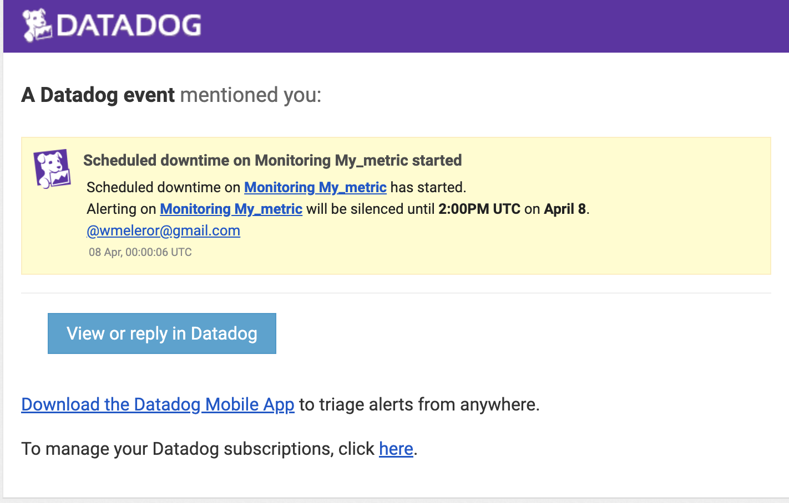
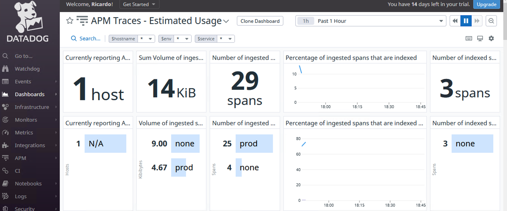

## The Exercise


## Prerequisites - Setup the environment

:heavy_check_mark: Docker container

**Please make sure to use “Datadog Recruiting Candidate” in [the “Company” field](https://a.cl.ly/wbuPdEBy)**

:heavy_check_mark: Get API-key and install agent
 
🚀 Getting started:
●  	Starting from a fresh Linux Ubuntu 18.04.6 LTS on an AWS EC2 instance.
●  	I registered for a free trial at https://www.datadoghq.com/. After choosing the docker environment, datadog Immediately provided the API key to run the agent.
●  	Chose Docker for Linux, because of its fast and containerized approach using Datadog agent image. 📦

```console
docker run -d --name dd-agent -v /var/run/docker.sock:/var/run/docker.sock:ro -v /proc/:/host/proc/:ro -v /sys/fs/cgroup/:/host/sys/fs/cgroup:ro -e DD_API_KEY=******* -e DD_SITE="us3.datadoghq.com" gcr.io/datadoghq/agent:7
```
Wallah 🎆 - dockerized Datadog agent running!
 
Datadog is now reporting metrics on a beautiful and intuitive dashboard 🤩


## Collecting Metrics:

Tags can be assigned in four different ways (UI/API/Config. File/DogStatsD). From Datadog website (https://docs.datadoghq.com/getting_started/tagging/) we can find the method using the agent configuration file (datadog.yaml), which makes it easy to add tags:

tags: ["<KEY_1>:<VALUE_1>", "<KEY_2>:<VALUE_2>", "<KEY_3>:<VALUE_3>"]

Or

tags:

	- "<KEY_1>: <VALUE_1>"
 
	- "<KEY_2>: <VALUE_2>"
 
	- "<KEY_3>: <VALUE_3>"


/etc/datadog/datadog.yaml

```yaml
## Provides autodetected defaults, for vanilla Docker environments,
## please see datadog.yaml.example for all supported options
apm_config:
  apm_non_local_traffic: true
api_key: ************************
tags:
  - env: prod
  - machine: ricardo-server
  - team: ricardo
# Use java container support
jmx_use_container_support: true
```


These tags are very important and will later allow us to pull relevant information to be displayed in the dashboard.
 
We can also convert docker labels into tags, I like this.  
DD_DOCKER_LABELS_AS_TAGS={"com.docker.compose.service":"service_name"}
Some more relevant tags, for example:
tags:
 - region:us_east
 - cloud_provider:aws
 - Instance:ec2
 - aws_account:meleroaws
 - operating_system:linux
 - env:production
 - project_id:ddogse_exercise
 - project_name:ntz_se
 
These tags would allow us to filter CPU usage by region, cloud provider, project, and we could go deeper using and/or functions


* **PostgreSQL Datadog integration.**

I decided to install PostgreSQL, my favorite database, and it was not a surprise that Datadog already had an integration available on the UI. But I was impressed with the key metrics being reported, that basically allows to troubleshoot, and predict PostgreSQL performance Issues.
Getting it running was as simple as:
 
```console
docker run --name teste-postgres --network=postgres-network -e "POSTGRES_PASSWORD=**** -p 5432:5432 -v ./PostgreSQL:/var/lib/postgresql/data -d postgres
```
 
Then we created a Datadog user and set privileges to access Postgres monitor table.
 
```console
create user datadog with password 'data123';
 
grant SELECT on pg_stat_database to datadog;
grant pg_monior to datadog
```
 
Then I tested the user Datadog access to monitoring data:
 
```console
psql -h localhost -U datadog postgres -c \ "select * from pg_stat_database LIMIT(1);" && echo -e "\e[0;32mPostgres connection - OK\e[0m" || \ || echo -e "\e[0;31mCannot connect to Postgres\e[0m"
```
Successful ✅

To configure database PostgreSQL integration on Datadog:
 
/etc/datadog-agent/conf.d/postgres.d/config.yaml
```
init_config:
 
instances:
## @param host - string - required
## The hostname to connect to.
## NOTE: Even if the server name is "localhost", the agent connects to
## PostgreSQL using TCP/IP, unless you also provide a value for the sock key.
#
  - host: db
 
## @param port - integer - required
## Port to use when connecting to PostgreSQL.
#
 	 port: 5432
 
## @param user - string - required
## Datadog Username created to connect to PostgreSQL.
#
	  username: datadog
 
## @param pass - string - required
## Password associated with the Datadog user.
#
	  password: ****
 
## @param dbname - string - optional - default: postgres
## Name of the PostgresSQL database to monitor.
## Note: If omitted, the default system postgres database is queried.
#
	  dbname: postgres
 
# @param disable_generic_tags - boolean - optional - default: false# The integration will stop sending server tag as is reduntant with host tag
 	 disable_generic_tags: true
```


* **Create a custom Agent check that submits a metric named my_metric with a random value between 0 and 1000.**

From the snippets provided at https://docs.datadoghq.com/developers/write_agent_check/?tab=agentv6v7 I was able to create a custom agent check:


/etc/datadog-agent/checks.d/custom_checkvalue.py

```py
from checks import AgentCheck
import random
class HelloCheck(AgentCheck):
	def check(self, instance):
    	self.gauge('my_metric', random.randint(0,1000),tags=['my_metric']+self.instance.get('tags',[]))
 
```

* **Change your check's collection interval so that it only submits the metric once every 45 seconds.**

I Modified the yaml file, changing the min collection to 45 seconds.

/etc/datadog-agent/conf.d/custom_checkvalue.yaml

```yaml                                                                                              
init_config:
instances:
  - min_collection_interval: 45
```


Custom Agent submits the metric once every 45 seconds.


* **Bonus Question** Can you change the collection interval without modifying the Python check file you created?

Yes. We can change the collection interval by modifying the min_collection_interval on the yaml file.

## Visualizing Data:

Utilize the Datadog API to create a Timeboard that contains:

*	**Your custom metric scoped over your host.**

Following the instructions on datadog documentation and, using Python, I generated the Timeboard.

timeboard-script.py
```py
from datadog_api_client.v1 import ApiClient, Configuration
from datadog_api_client.v1.api.dashboards_api import DashboardsApi
from datadog_api_client.v1.model.dashboard import Dashboard
from datadog_api_client.v1.model.dashboard_layout_type import DashboardLayoutType
from datadog_api_client.v1.model.log_query_definition import LogQueryDefinition
from datadog_api_client.v1.model.log_query_definition_group_by import LogQueryDefinitionGroupBy
from datadog_api_client.v1.model.log_query_definition_group_by_sort import LogQueryDefinitionGroupBySort
from datadog_api_client.v1.model.log_query_definition_search import LogQueryDefinitionSearch
from datadog_api_client.v1.model.logs_query_compute import LogsQueryCompute
from datadog_api_client.v1.model.timeseries_widget_definition import TimeseriesWidgetDefinition
from datadog_api_client.v1.model.timeseries_widget_definition_type import TimeseriesWidgetDefinitionType
from datadog_api_client.v1.model.timeseries_widget_request import TimeseriesWidgetRequest
from datadog_api_client.v1.model.widget import Widget
from datadog_api_client.v1.model.widget_sort import WidgetSort
 
body = Dashboard(
	layout_type=DashboardLayoutType("ordered"),
 	title="Dashboard by API",
 	widgets=[
     	Widget(
         	definition=TimeseriesWidgetDefinition(
             	type=TimeseriesWidgetDefinitionType("timeseries"),
             	title="Avg of My_Metric",
             	requests=[
                 	TimeseriesWidgetRequest(
               	      q="avg:my_metric{host:i-0e2dfdd13e28e8a1a}")
                     	],
                 	)
             	),
     	Widget(
         	definition=TimeseriesWidgetDefinition(
             	type=TimeseriesWidgetDefinitionType("timeseries"),
             	title="Database + Anomaly - Avg of PostgreSQL Connections",
             	requests=[
                 	TimeseriesWidgetRequest(
                     	q="anomalies(avg:postgresql.percent_usage_connections{*}, 'basic', 2)"
                     	)
                 	],
             	)
         	),
     	Widget(
         	definition=TimeseriesWidgetDefinition(
             	type=TimeseriesWidgetDefinitionType("timeseries"),
             	title="My_Metric with Rollup Function - Sum of All Points in Last Hour",
             	requests=[
                 	TimeseriesWidgetRequest(
                     	q="my_metric{host:i-0e2dfdd13e28e8a1a}.rollup(sum, 3600)"
                     	)
                 	],
             	)
         	)
 	]
 )
 
configuration = Configuration()
configuration.api_key["apiKeyAuth"] = "**********************"
configuration.api_key["appKeyAuth"] = "******************************"
with ApiClient(configuration) as api_client:
	api_instance = DashboardsApi(api_client)
	response = api_instance.create_dashboard(body=body)
	print(response)
 
```


* **Any metric from the Integration on your Database with the anomaly function applied.**

For this example, I determined that an anomaly would be the number of connections above 2%, just to make it easy to trigger the anomaly and generate the graph. There would be much more interesting anomalies to generate, including a combination of metrics, for example: number of connections, above number of actual users on the website. Or Latency, throughput, predictions, etc.

* **Your custom metric with the rollup function applied to sum up all the points for the past hour into one bucket**

I was already expecting the answer to be approximately 40k, since the average is 500 and there would be 80 points.


* **Bonus Question**: What is the Anomaly graph displaying?

Postgres connections of 2% and above. This would be relevant, if this database is only allowed to be accessed by one connection.


## Monitoring Data

On the UI it was easy to create a new Metric Monitor that watches the average of the custom metric (my_metric) and alerts if it’s above the following values over the past 5 minutes: 

* Warning threshold of 500


* Alerting threshold of 800


And also it will notify if there is No Data for this query over the past 10m.
I configured the monitor’s message so tha it:
* Sends an email whenever the monitor triggers.
( Creates a messages based on whether the monitor is in an Alert, Warning, or No Data state. And it includes the metric value that caused the monitor to trigger and host ip when the Monitor triggers an Alert state.


* **Bonus Question**: Since this monitor is going to alert pretty often, you don’t want to be alerted when you are out of the office. Set up two scheduled downtimes for this monitor:

I also set up two scheduled downtimes for this monitor:
* One that silences it from 7pm to 9am daily on M-F,
* And one that silences it all day on Sat-Sun.



  
  
  
## Collecting APM Data:

With the Flask app provided, I instrument using Datadog’s APM solution, by importing the DDflask API, and enabling runtime metrics:

Flask instrumented
```py
from flask import Flask
import blinker as _
from ddtrace import tracer
from ddtrace.contrib.flask import TraceMiddleware
import logging
import sys
 
from ddtrace.runtime import RuntimeMetrics
 
RuntimeMetrics.enable()
 
# Network sockets
tracer.configure(
	https=False,
	hostname="datadog",
	port="8126",
)
 
# Have flask use stdout as the logger
main_logger = logging.getLogger()
main_logger.setLevel(logging.DEBUG)
c = logging.StreamHandler(sys.stdout)
formatter = logging.Formatter('%(asctime)s - %(name)s - %(levelname)s - %(message)s')
c.setFormatter(formatter)
main_logger.addHandler(c)
 
app = Flask(__name__)
 
# Copypasta from the tutorial
traced_app = TraceMiddleware(app, tracer, service="my-flask-app", distributed_tracing=False)
 
@app.route('/')
def api_entry():
	return 'Entrypoint to the Application'
 
@app.route('/api/apm')
def apm_endpoint():
	return 'Getting APM Started'
 
@app.route('/api/trace')
def trace_endpoint():
	return 'Posting Traces'
 
if __name__ == '__main__':
	app.run(host='0.0.0.0', port='5050')
```
 
To collect data using ddtrace-run:
 
```console
DD_SERVICE="my-flask-app" DD_ENV="prod" DD_LOGS_INJECTION=true DD_TRACE_SAMPLE_RATE="1" DD_PROFILING_ENABLED=true ddtrace-run python flask.py
```


* **Bonus Question**: What is the difference between a Service and a Resource?

The service functionality is defined by a service interface, which can be supported by multiple implementations, it’s more like an architecture, allowing execution of a required operation, regardless of the underlying resource. And resource would be a software, or mechanism so access a specific data, on an instance of a specific type.
 
 
Provide a link and a screenshot of a Dashboard with both APM and Infrastructure Metrics.




Dashboard Link:
[Dashboard Link](https://us3.datadoghq.com/dash/integration/156/apm-traces---estimated-usage?from_ts=1649007993943&to_ts=1649011593943&live=true)


## Final Question:

* **Datadog has been used in a lot of creative ways in the past. We’ve written some blog posts about using Datadog to monitor the NYC Subway System, Pokemon Go, and even office restroom availability!**

Is there anything creative you would use Datadog for?
Datadog is a disruptive and empowering technology that can eliminate numerous applications and take advantage of data effectively. It allows the user to concentrate data from multiple sources, making it easy to see the big picture, understand the past, act now, and predict the future. There are endless possibilities to use Datadog creatively; I would have used myself on a personal project to monitor the number of passengers on a bus and predict revenue. I’m excited to enable the customers to take full advantage of this powerful service and help them build creative dashboards with relevant data. 
 

