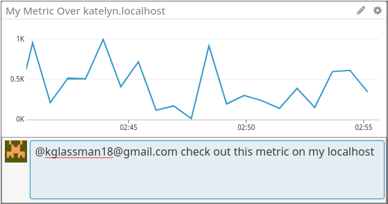
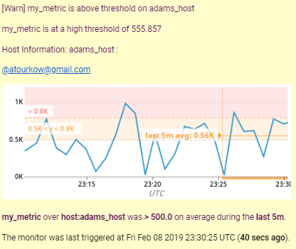

# Level 1

### Getting Started

The first thing I did after signing up for a Datadog account and installing the agent was watching the introductory video, because I thought it would be beneficial to get a general sense of what the software does and the type of customers the company is targeting.

I also read over some of the docs before beginning the challenges, including the Datadog overview and the guide to getting started with the Agent. I like to gain a bit of familiarity with new technologies before I dive into using them, and I found the provided documentation to be thorough and helpful.

### The Agent

* The Agent is a piece of software that the user installs onto a host that transmits system metrics and application data to Datadog. The Agent is made up of the collector, which collects system metrics; dogstatsd, which allows the user to send custom application data; and the forwarder, which sends all of the data to Datadog over HTTPS.

### Host Map With Tags

To complete the next objective, I read the Guide to Tagging in the Datadog docs, and in particular looked at the section pertaining to assigning tags via the configuration files. I opened the datadog.conf file and edited it to add a few example tags to my host, Kims-Macbook-Pro.local. I formatted my tags in the suggested key:value syntax so that I could observe their intended behavior in the filtering mechanisms provided within the Datadog web app.

Next, I navigated to the Host Map page and filtered by the example tags I had added so I could see my host grouped under its related tags.

### test.support.random Agent Check
    from checks import AgentCheck
    import random
    class RandomCheck(AgentCheck):
        def check(self, instance):
        self.gauge('test.support.random', random.random())

I chose to install the PostgreSQL Datadog integration because I've used Postgres for lots of projects. I added the integration via the Dashboards menu in Datadog, and then followed the provided instructions to grant read-only permissions to a 'datadog' user and configure the relevant yaml file to allow the Agent to connect to Postgres. I thought it was a nice touch that the configuration instructions are displayed as the user adds the integration to their dashboard, rather than needing to seek them out separately in the docs.

After restarting the Agent and checking that it had successfully connected to Postgres using the info command, I read through the documentation about Agent checks. In order to become familiar with the method of setting up an Agent check with the correct file structure, I implemented the hello.world example check provided in the docs and made sure that it was successfully transmitting data. Afterward, I modified the code from the check file so that it was sampling a random value instead of a static value. The code from my check file is above.

# Level 2

### Cloned Postgres Dashboard w/ Additional Metrics

Next, I cloned my Postgres integration dashboard. Being able to clone an existing dashboard as a starting point for a new one is a useful feature. I added some additional metrics to the timeboard, including a count of databases. I liked the fact that the user can view their selected data type in all the different graph formats before adding it to a dashboard, as it allowed me to visually choose the best means of displaying each metric.

Finally, I added a graph of my test.support.random metric to the timeboard.

### Dashboard Types
* Timeboards: all graphs are scoped to the same time, appear in a grid, and graphs can be shared individually
* Screenboards: more customizable layout, widgets can have different time frames, can be shared as an entire read-only entity

### test.support.random Graph Snapshot

Graph snapshots was one of my favorite features I utilized in the web app because

* I took a snapshot of the test.support.random graph going above 0.9 and sent myself a notification. I liked the easy-to-use interface for pinpointing a specific segment of a graph and notifying a teammate about it.

# Level 3

### test.support.random Multi-Alert Monitor

* I set up a multi-alert monitor on the test.support.random metric so that I would be notified if it went above 0.9 on any host within the past 5 minutes.

### Monitor Notification

* Next, I set up a notification message that would tell me which host the issue occurred on, send me a link to the relevant dashboard in the message body, and send an additional notification when the random value returned to "safe" levels.

### Monitor Email Received

* I successfully received an email notification from the monitor.

### Downtime Scheduled

* I scheduled downtime on the test.support.random monitor from 7pm-9am PST and my "teammate" received an email notification.

# Final Thoughts

Overall, I found that the provided documentation was extremely clear and helpful in detailing the product's available features and explaining how to utilize the Agent and the Datadog web app. Although I just scratched the surface of integrations and Agent checks in this exercise, I can tell that they're powerful tools and would be interested in delving deeper into their applications. As for the web app, I found the provided functionalities user-friendly and enjoyed exploring the different features. Although I was just looking at a small sample size of data from my own local machine, I can imagine how useful these tools would be when applied to the large-scale systems of a major organization.

After taking some time to explore the product, I think that working at Datadog would be an engaging challenge and a great way to continue my growth and development as an engineer.
