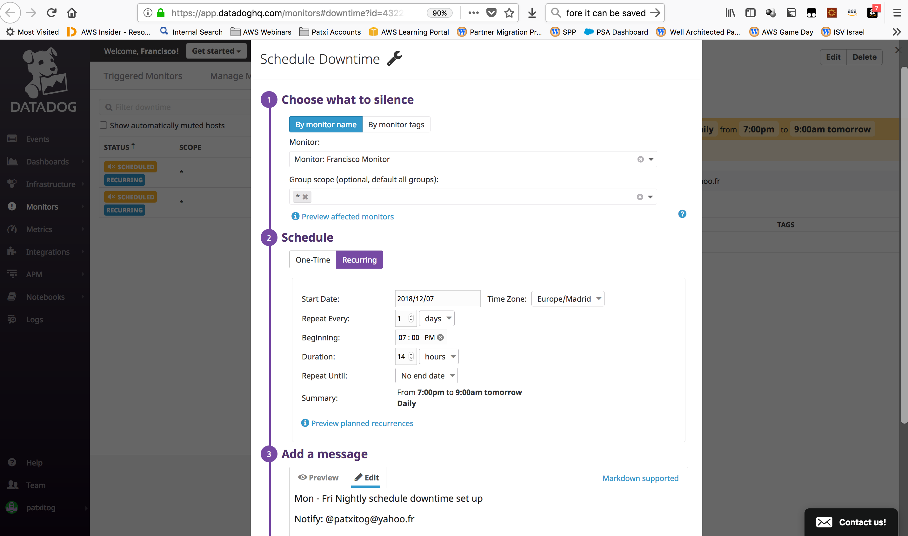
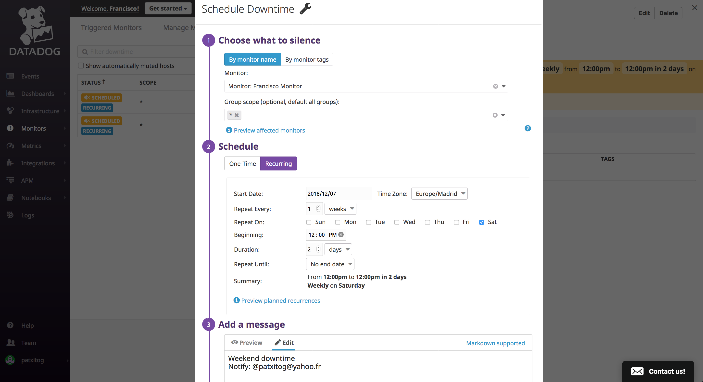

# Answers to Datadog exercise
### Candidate name: Francisco Javier Garcia Romero
### Date: 7th Dec 2018

## Collecting Metrics:
#### #1. Add tags in the Agent config file and show us a screenshot of your host and its tags on the Host Map page in Datadog.

I spinned up an EC2 instance with Instace Id: **i-049121811f75016da** in ***us-east-1*** with Amazon Linux. I installed the agent and edit the Agent config file (*/etc/datadog-agent/datadog.yaml*) and added the custom DataDog tag env:prod:

### #2. Install a database on your machine (MongoDB, MySQL, or PostgreSQL) and then install the respective Datadog integration for that database.

I ran the following command to install MySQL on the EC2 instance:
 
**# sudo yum install -y httpd24 php70 mysql56-server php70-mysqlnd**

I started the MySQL database:

**# sudo service mysqld start**

I secured the database:

**# sudo mysql_secure_installation**

I installed phpMyAdmin on the EC2 instance:

***# sudo yum install php70-mbstring.x86_64 php70-zip.x86_64 -y***

After running the MySQL integration steps, i ran the info command:

**# sudo datadog-agent status**

    mysql (1.4.0)
    -------------
        Instance ID: mysql:a911f0ef2ff5741c [OK]
        Total Runs: 10
        Metric Samples: 64, Total: 639
        Events: 0, Total: 0
        Service Checks: 1, Total: 10
        Average Execution Time : 16ms
        
In the Infraestructure - Process view, I can see the process running:

### #3. Create a custom Agent check that submits a metric named my_metric with a random value between 0 and 1000

I created a file called ***my_metric.yaml*** under */etc/datadog-agent/conf.d*:

> init_config:
> 
> instances:
>     [{}]
    
I created a file called **my_metric.py** under */etc/datadog-agent/checks.d*:

> > 
> > from checks import AgentCheck
> > 
> > import random
> > 
> > class MyMetricCheck(AgentCheck):
> > 
> >     def check(self, instance):
> > 
> >         self.gauge('my_metric', random.randint(1,1001))

I restarted the agent and verify:

**# sudo -u dd-agent -- datadog-agent check my_metric**

### #4. Change your check's collection interval so that it only submits the metric once every 45 seconds.

Edit the file called ***my_metric.yaml*** under */etc/datadog-agent/conf.d*:
> 
> init_config:
> 
> instances:
>   - min_collection_interval: 45

## Visualizing Data:

### #1. Utilize the Datadog API to create a Timeboard that contains:

1.     Your custom metric scoped over your host.
1.     Any metric from the Integration on your Database with the anomaly function applied.
1.     Your custom metric with the rollup function applied to sum up all the points for the past hour into one bucket

Please refer to the [Ex2_1.py](99_resources/Ex2_1.py) script.

### #2. Once this is created, access the Dashboard from your Dashboard List in the UI:
1. Set the Timeboard's timeframe to the past 5 minutes
1. Take a snapshot of this graph and use the @ notation to send it to yourself.

### #3. Bonus Question: What is the Anomaly graph displaying?
The highlighted area in the graph represent the expected range of the metric based on previous values, so anything outside that range is an anomaly.

# Monitoring Data

I created a new Metric Monitor on the average 5mins of my_metric that sends notifications on this thresholds:

1. Warning threshold of 500 
1. Alerting threshold of 800 
1. No Data for this query over the past 10m

Send you an email whenever the monitor triggers. Create different messages based on whether the monitor is in an Alert, Warning, or No Data state. Include the metric value that caused the monitor to trigger and host ip when the Monitor triggers an Alert state.

The following is an example of notification received:

### Bonus Question:

The following downtimes are set up:

# Collecting APM Data

I modified the supplied code. To install the middleware, add:

> from ddtrace import tracer
> 
> from ddtrace.contrib.flask import TraceMiddleware

and create a TraceMiddleware object:

> traced_app = TraceMiddleware(app, tracer, service="my-flask-app", distributed_tracing=False)

Final code in [Ex4_1.py](99_resources/Ex4_1.py)

Dashboard screenshots:

### Bonus Question: What is the difference between a Service and a Resource?
A service is a set of processes that work together. A resource is a software artifact supporting specific data used by a service.

# Final Question:

Datadog has been used in a lot of creative ways in the past. We’ve written some blog posts about using Datadog to monitor the NYC Subway System, Pokemon Go, and even office restroom availability!

Is there anything creative you would use Datadog for?

I'm very impressed by the algorithms capabilities included in the Dashboards. I can see many applications in for example IOT (use of anomaly detection in predictive maintenance use cases) or for example Predictive Autoscaling in AWS based on the Forecast algorithms included.