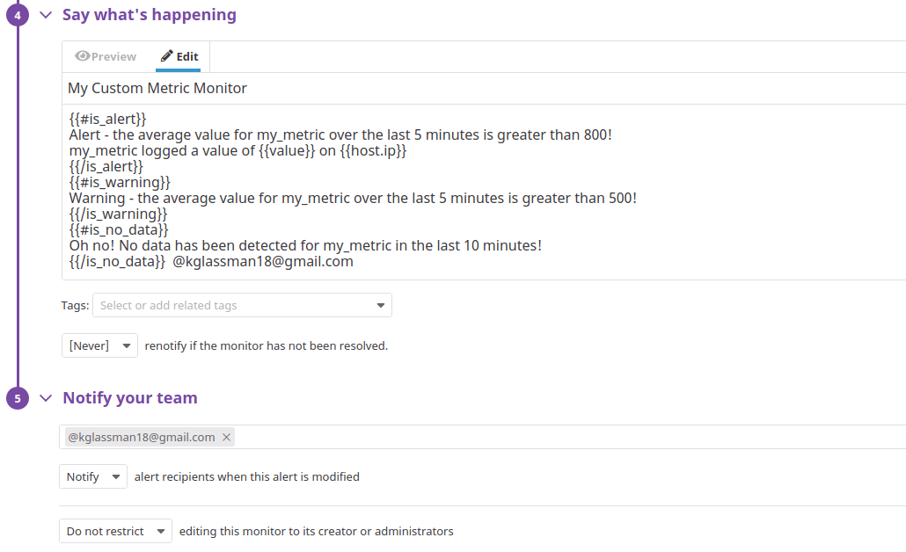
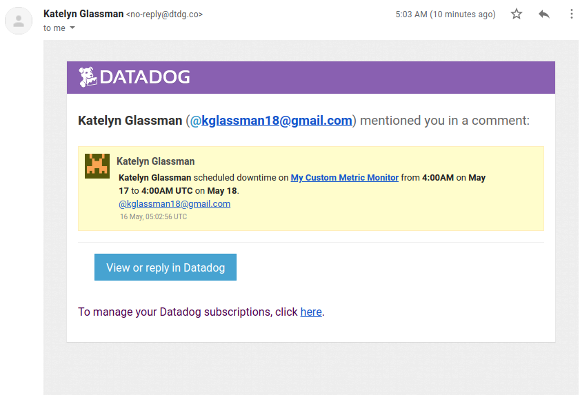

# Prerequisites

To begin this exercise, I assesed the options for a development environment to effectively model Datadog’s functionality that's also feasible within the confines of my Chromebook running Chrome OS. I opted to dual-boot my machine to run [GalliumOS](https://galliumos.org/), a lightweight Linux distribution based on Xubuntu, partitioned alongside the Chrome OS. From my new VM, I was easily able to sign up for Datadog and begin running the agent.  

# Collecting Metrics 
Next, I added the below tags into the `tags` block of my agent configuration file to add some more details about my machine.

```
## @param tags  - list of key:value elements - optional
#
tags:
   - environment:dev
   - chassis:desktop
   - os:galliumos3.1
   - kernel:linux4.16.18
```

Here is my host, named `katelyn.localhost`, and its tags, shown bottom right, on the Host Map page in Datadog.


I opted to download a PostgreSQL database on my machine and install the corresponding Datadog integration to begin collecting those metrics and logs.  After creating user `datadog` and granting the role `pg_monitor` to that user,  here is a verification of the correct permissioning on my PostgreSQL database:


To make this integration more meaningful, I wanted to allow for metric collection and log integration.  To do so, I altered my `postgres.d/conf.yaml` [configuration file](https://github.com/kmglassman/hiring-engineers/blob/kmglassman-answers-test/conf-files/postgres.d_conf.yaml) to point to my host/port and to configure logging, shown here: 
```
instances:

    ## @param host - string - required
    ## The hostname to connect to.
    #
  - host: katelyn.localhost

    ## @param port - integer - required
    ## Port to use when connecting to PostgreSQL.
    #
    port: 5432

    ## @param user - string - required
    ## Datadog Username created to connect to PostgreSQL.
    #
    username: datadog

    ## @param pass - string - required
    ## Password associated with the Datadog user.
    #
    password: *******

    ## @param dbname - string - optional - default: postgres
    ## Name of the PostgresSQL database to monitor.
    #
    dbname: datadog
```
```
logs:
 - type: file
   path: "/etc/postgresql/12/main/pg_log.log"
   source: postgresql
   service: pslogservice
```

and altered my machine's `postgresql.conf` [configuration file](https://github.com/kmglassman/hiring-engineers/blob/kmglassman-answers-test/conf-files/postgresql.conf) to configure logging, shown here:

```
logging_collector = on                          # Enable capturing of stderr and csvlog
                                                # into log files. Required to be on for
                                                # csvlogs.
                                                # (change requires restart)

# These are only used if logging_collector is on:
log_directory = 'pg_log'                        # directory where log files are written,
                                                # can be absolute or relative to PGDATA
log_filename = 'pg.log'                         # log file name pattern,
                                                # can include strftime() escapes
log_file_mode = 0644                            # creation mode for log files
```

After a quick change to `logs_enabled: true` in my Datadog agent configuration file, my setup was ready to begin log collection. 

The output of a call to `sudo datadog-agent status`, shown below, verifies that the PostgreSQL integration and logging are functioning.  


I then introduced my own metric to begin tracking on my host.  I created a new check called `custom_check` using the script `custom_check.py`, which can be found [here](https://github.com/kmglassman/hiring-engineers/blob/kmglassman-answers-test/scripts/custom_check.py).  

**Bonus question**: To change the check's collection interval without modifing this Python file, I altered the check [configuration file](https://github.com/kmglassman/hiring-engineers/blob/kmglassman-answers-test/conf-files/custom_check.yaml), `custom_check.yaml`, as shown below:
```
init_config:

instances:
  - min_collection_interval: 45
```

Now, my check is up and running as expected, submitting a random value between 0 and 1000 every 45 seconds.  

# Visualizing Data

Next, I used the Datadog API to generate some visualizations in the form of a Timeboard.  The script I used can be found [here](https://github.com/kmglassman/hiring-engineers/blob/kmglassman-answers-test/scripts/timeboard.py).  Some highlights of the script:
* I set the parameters for my three timeseries visualizations each within the `widgets` parameter.
* I prompt for a title and a description of the Timeboard to be created.
* I then pass my API key and app key and make the connection.

Here is the view of my new timeboard, [Katelyn's Timeboard](https://app.datadoghq.com/dashboard/vas-prc-xq8/), upon creation with my script:


Here are each of my visuals after I set the timeframe to the last 5 minutes.

My custom metric scoped over katelyn.localhost:

My Postgres buffer hit:

And the sum of my custom metric in buckets of one hour, which does not appear to be an informative visual at this 5 minute timeframe:


I took a snapshot of my first graph  and wrote a notification for myself:


and confirmed receipt to my Gmail:


**Bonus Question**: My anomaly graph shows when the buffer hit count to my PostgreSQL database is greater than 2 standard deviations from the average buffer hit count over the given 5 minute timeframe. 


# Monitoring Data
After making my Timeboard, I initialized a monitor to watch the average value of `my_metric` over the past 5 minutes.  Below are the configurations I used to set up this monitor:





These configurations allowed my email notifications to be customized depending on the condition of the monitor trigger - Warning, Alert, or No Data.  Here is an example of the Alert notification, as received by email:


**Bonus Question**: I set up two recurring downtimes for my monitor.  One for 7pm-9am ET Mondays to Fridays:


and one all day Saturdays and Sundays, also in ET:


Below are the email notifications of the upcoming downtimes.  The notifications express the downtimes in UTC, not ET, so there is a 4-hour offset.





## Collecting APM Data
I spun up a simple [Flask application](https://github.com/kmglassman/hiring-engineers/blob/kmglassman-answers-test/scripts/my_flask_app.py) on my machine and installed ddtrace for Python.  After enabling app analytics for the application, I was able to begin using Datadog's APM solution and posting traces. Some features of my application:
* I configured the application to randomly fail upon entry 1 in 10 times and exit. 
* I added a user page that validates userID and fails on a ValueError if the userID is invalid, yielding a 500 error on the application.  

I was now gathering meaningful analytics on my application in the Datadog APM solution.  Here are some APM and infrastructure metrics I gathered and compiled in a dashboard:
* A sum of the number of hits and errors to my application.
* A breakdown of the error count by error type - 500 Internal Server Error, or SystemExit Exception.
* Latency on my application, in milliseconds.
* The percent of time my machine's CPU spent running the kernel, with a warning marker at 10%.
* My machine's memory availabile, and the amount physical RAM used as shared memory, in mebibytes.

Here is [my custom dashboard](https://app.datadoghq.com/dashboard/uex-3bk-mzq/) showing each of these metrics:


**Bonus Question**: A **resource** is a feature of an application that represents a single action or function, such as a web endpoint, database query, or other job.  A **service** is a self-contained grouping of resources joined together by a broader business function.  

## Final Question
In normal global circumstances, I use Citi Bike everyday.  There are Citi Bike stations I use more than others - those close to my apartment and to places I frequent - but I love using Citi Bike to explore different areas of New York City. 

Citi Bike publishes rich, realtime system data according to the General Bikeshare Feed Specification [(GBFS)](https://github.com/NABSA/gbfs/blob/master/gbfs.md) formatting.  As a data enthusiast and active bikeshare user, I was very excited to learn that this exists.  The full Citi Bike GBFS feed can be found [here](http://gbfs.citibikenyc.com/gbfs/gbfs.json), and [here](https://gbfs.citibikenyc.com/gbfs/en/station_status.json) is an example of realtime station status information that is published as a JSON.  

I would love to use Datadog to monitor this data.  One specific case I had in mind is tracking the electric bike availability.  It's always an exciting treat to see an electric bike available at a station, and I would love to be able to monitor their availabiity.  This value is published in the key `num_ebikes_available` in the station status JSON.  To start, I could isolate a few station IDs of stations close to my apartment, and I could build a check that creates a metric for the number of electic bikes available in my area throughout the day. 

Expanding this, I could build a check that tags by neighborhood and creates metrics on available electric bikes, general available bikes, and available docks.  I would love to see if there are any trends by neighborhood on density of electric bikes or bike and dock availability - this would certainly impact me if I were facing a decision to move neighborhoods! 

These cases are only looking at the station status feed, but there are many other feeds published that could allow me to monitor data and build dashboards on things like system outages, trip mileages, and even basic rider information like age and gender.  
