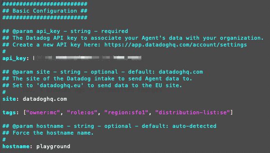
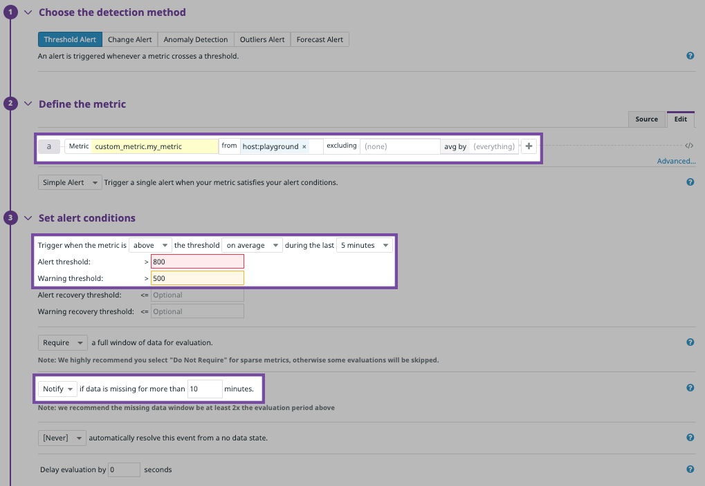

<p align="center">
  <a href="https://datadog.com">
    
    <h3 align="center">Datadog</h3>
  </a>
  <p align="center">Metrics. Traces. Logs. And More.</p>
</p>

# Git up and monitoring with Datadog. Familiarize yourself with the Datadog platform.


## Datadog: Infrastructure & Application Monitoring as a Service

<br>

> See metrics from all of your apps, tools & services in one place with Datadog's cloud monitoring as a service solution. Monitor infrastructure metrics, distributed traces, logs, and more in one unified platform with Datadog. [Sign up here to try it for free](https://app.datadoghq.com/signup)

#### Overview
* [Collecting Metrics](#Collecting-Metrics)
* [Visualizing Data](#Visualizing-Data)
* [Monitoring Data](#Monitoring-Data)
* [Collection APM Data](#Collecting-APM-Data)
* [Final Question](#Final-Question)

<details>
<summary>Objectives</summary>

### By the end of this tutorial, you should be able to: 

* Understand how to get the events and metrics from your host into Datadog
* Learn about the different ways the data collected can be used by creating dashboards 
* Define what a tag is in Datadog
* List examples of tags 
* Write a custom check
* Access and update your custom check's collection interval
* Understand your infrastructure at a higher level with host maps 
* Learn about the different graphing options available
* Create a Timeboard with the Datadog API:
* Describe what the Anomaly graph is displaying
* Learn how to create new monitors and check on existing monitors
* Use conditional statements in your monitor message notification bodies
* Set up and operate a scheduled downtime monitor
* Instrumented python app using Datadog’s APM solution
* Use Apache Bench to simulate load on a python app
* Explain the difference between a __Service__ and a __Resource__

</details>

<details>
<summary>
 Agent Architecture
</summary>
	
> Let’s set the table for how the Datadog agent operates. The agent is composed of [four main components](https://github.com/Datadog/dd-agent/wiki/Agent%20Architecture): 
> 1. Collector 
> 2. Forwarder 
> 3. DogStatsD 
> 4. SupervisorD

<br>

```
dogstatsd ---(http)------> 
                         | 
                         v 
collector ---(http)---> forwarder ---(https)---> Datadoghq

```
<br>

### Collector
- Does most of the work collecting metrics at a configurable interval. The Collector runs any additional tools required and connects to the various monitoring interfaces employed by your application.

### DogStatsD 
- Supports StatsD, a metric aggregation daemon authored by Etsy. The difference between the two is that tags and some other features used on the Datadog platform. DogStatsD is employed by a few integrations and by any of the libraries mentioned here: [DogStatsD clients](https://docs.datadoghq.com/developers/libraries/).

### Forwarder: 
- Forwards them to do over HTTPS. The forwarder will also cache metrics collected if the network has a disruption of any kind. When the connection is re-established, the forwarder flushes the metrics along. To reduce network traffic, you can increase the flush interval. 

### Supervisor D 
- Runs the master process and forks all the subprocesses as the user Datadog agent. supervisord runs a master process as dd-agent and forks all subprocesses as the user dd-agent. The agent configuration resides at `/etc/dd-agent/Datadog.yaml` and `/etc/dd-agent/conf.d`.


</details>

<details>
<summary>
Prerequisites - Setup the environment
</summary>
  <br>

  > I’ll be running a Linux virtual machine, Ubuntu 12.04 LTS 64-bit. [Setup instructions for a Vagrant Ubuntu VM here](https://learn.hashicorp.com/collections/vagrant/getting-started). 

* Boot up a virtual machine on your local machine. 


* [Basic Agent Usage for Ubuntu Docs](https://docs.datadoghq.com/agent/basic_agent_usage/ubuntu/?tab=agentv6v7#commands)

<details>
<summary>
Configuration files and paths
</summary>

### The configuration files and folders for the Agent are located in:
`/etc/datadog-agent/datadog.yaml`

### Configuration files for Integrations:

`/etc/datadog-agent/conf.d/`

  Paths
  =====
    Config File: /etc/datadog-agent/datadog.yaml
    conf.d: /etc/datadog-agent/conf.d
    checks.d: /etc/datadog-agent/checks.d

</details>
</details>

<br>

# Collecting Metrics: 

## Agent and Integration Installation 

###  How to send host events and metrics into Datadog

1. The first step to collecting metrics and events is to install the Agent. Visit Agent under the integrations tab within the Datadog UI and choose the platform you wish to install. You will find the instructions for installing the various agents in your environment—the Agent installation instructions for Ubuntu are found here: _https://app.datadoghq.com/account/settings#ubuntu_.

2. Copy the installation snippet and run the command within your environment. The snippet command already includes your API Key.

    ```zsh
    DD_AGENT_MAJOR_VERSION=7 DD_API_KEY=<INSERT_API_KEY_HERE> DD_SITE="datadoghq.com" bash -c "$(curl -L https://s3.amazonaws.com/dd-agent/scripts/install_script.sh)"
    ```

3. Run the status command: `$ sudo datadog-agent status`

> The Datadog Agent is ready. Let's configure it in the `datadog.yaml` file. Within the configuration file tags, API Keys, and other things specific to your environment are defined.

## Tags
   
4. Defining tags is important to take full advantage of what the Datadog platform has to offer. Specify your tags in the Agent config file found here: `/etc/datadog-agent/datadog.yaml`. 

<details>
  <summary>
How do tags make Datadog better? 
</summary>
<br>
 Tags allow you to get more out of the product by allowing for easy querying that creates dynamic dashboards in your environment.


#### Reference the docs and blog for more information

* [Getting Started with Tags](https://docs.datadoghq.com/getting_started/tagging/)
* [Best practices for tagging your infrastructure and applications ](https://www.datadoghq.com/blog/tagging-best-practices/)

---

</details>

<br>

* Add the following tags in the Agent config file. 

```yaml

#  datadog.yaml 
tags: ["role:os", "owner:mc", "region:sfo1", "distribution-list:se"]

```

* The basic configuration 

[](https://datadog.com)


* For a host, tags are viewable within the Datadog UI under the host maps page beneath the details pane. Reference the [details pane screenshot circled below](#Host-Map-Screenshot).

### The Host Map page

> The host map gives you a higher-level view of your infrastructure. Each hexagon represents a host, and these hosts can be grouped and filter by your team's requirements. 

<details>
<summary>
What's a Host? 
</summary>

Two things define a host at Datadog. Any computing resource that can run the Datadog Agent and a job that you want to monitor. Hexagons on the host map page represent hosts.

</details>

<br>

#### **Host Map Screenshot**

 

* Head here to view your host map here _https://app.datadoghq.com/infrastructure/map_ 
* Clicking on a host hexagon will zoom into a detailed overview of the host. 
* Zooming in displays more integrations in the detail pane. Your tag names are viewable on the right-hand side.
* Clicking on any integration on the left will preview a mini dashboard.


3. Install a database and the respective Datadog integration

    * I'll be using PostgreSQL, but any DB is acceptable. 
    * Instructions to install the Postgres integration are here: _https://app.datadoghq.com/account/settings#integrations/postgres_  
    * Enable the integration within the UI and restart the agent: `$ sudo service datadog-agent restart`. 
    * Run the status command sanity check: `$ sudo datadog-agent status`. 


4.  View the installed integrations here: _https://app.datadoghq.com/account/settings_

---

## Custom Agent Check

 > A custom check is a custom python script that will check on anything that Datadog does not have a current integration available. 

In this example, the custom check submits a random value between 0 and 1000 for the metric my_metric
Create a custom Agent check that submits a metric named my_metric with a random value between 0 and 1000

1. To create a custom check Run `$ sudo vi /etc/datadog-agent/checks.d/custom_metric_check.py` to create the file and add the following example code: 

```py
class CustomMetricCheck(AgentCheck):
    """
    CustomMetricCheck plucks a random number between 1 & 1000.
    """

    def check(self, instance):
        my_metric = random.randrange(0, 1001)
        self.gauge(
            'custom_metric.my_metric', 
            my_metric, 
            tags=[]
        )
```      

2. For our purposes, the example configuration file includes no real information, but it is necessary to add an empty sequence called `instances` containing one empty mapping. The sequence goes in `custom_metric_check.yaml`:

* Run `$ sudo vi /etc/datadog-agent/conf.d/custom_metric_check.yaml`

* Add the following example code:
```yaml
# custom_metric_check.yaml

instances: [{}]
```

> Note: The names of the configuration and check files must match. Our check is called custom_metric_check.py, and your configuration file must be named custom_metric_check.yaml.

3. Verifying your check is running

- Run the check `$ sudo -u dd-agent -- datadog-agent check custom_metric_check`


### **Bonus Question:** 

<details>
<summary>
Configure collection interval without modifying the Python check file
</summary>
<br>

Modifying the collection interval configuration, without modifying the python check file, is made within the `custom_metric_check.yaml` file. [Reference Custom Check Collection Interval Documentation](https://docs.Datadoghq.com/developers/write_agent_check/?tab=agentv6v7#collection-interval)
      
```yaml
      # conf.d/custom_metric_check.yaml snippet
      # 4500 milliseconds `min_collection_time` configuration

      instances:
           - min_collection_interval: 45
```


<details>
<summary>
Watch Dan and Greg from Datadog on 📺  as they live code a custom Agent check

</summary>

####  References

* [Datadog YouTube channel](https://www.youtube.com/user/DatadogHQ/playlists)

* [Writing a Custom Agent Check Documentation](https://docs.datadoghq.com/developers/write_agent_check/?tab=agentv6v7)

* [Dan and Greg from Datadog: live coding a custom agent check](https://youtu.be/v8F-eY8Im9I)

</details>

---

</details>


<br>
<br>

# Visualizing Data 

> Dive into the different ways to use the data collected with the DataDog API. We cover creating dashboards with the API, and a few of the graphing options available. 

<details>
<summary>
Prerequisite Datadog API Knowledge: 
</summary>

<br>

<details>
<summary>
Authentication Requirements
</summary>

<br>

> All requests to Datadog's HTTP API require authentication.
 * Requests that write data require reporting access and require an API key. 
 * Requests that read data require full access and also need an application key.

####  References

* Manage your org's API and application keys: _https://app.datadoghq.com/account/settings#api_

* [Authentication documentation](https://docs.datadoghq.com/api/v1/authentication/)

---

</details>

<br>

<details>
<summary>
Dashboard Data Model
</summary>

<br>

* The dashboard data model for the body of the request has three **required** fields:
  - `widgets`
  - `layout_type` 
  - `title` 

> Note: `widgets` have replaced the older version of the Timeboard API used `graphs`. Additionally, a `description` is no longer a required field.  


####  Reference

* [Datadog API Dashboard docs](https://docs.datadoghq.com/api/v1/dashboards/)

---

</details>

<br>

<details>
<summary>
Datadog Python library & Export dashboard JSON
</summary>

<br>

 > The easy way to get started is to create the dashboard within the Datadog UI and export the JSON blob. Then, utilizing the datadog API becomes a mapping exercise. 


* Start here to [create a new dashboard](https://docs.datadoghq.com/api/v1/dashboards/#create-a-new-dashboard).


### Export dashboard JSON


* It's possible to create a timeboard by hitting the following endpoint 
```curl
POST https://api.datadoghq.com/api/v1/dashboard
```

* However, Datadog has a convenient wrapper around their Dashboard HTTP API. We recommend using it. 

####  Reference

* [Export Dashboard JSON docs](https://docs.datadoghq.com/dashboards/#copy-import-export)

* [Datadog Python library](https://github.com/DataDog/datadogpy)

---

</details>
</details>

<br>


###  Let's take a look at creating a Timeboard using the specified options with the Datadog Python API wrapper:

1. The custom metric scoped over the host
2. A PostgreSQL metric with the anomaly function applied.
3. The custom metric with the rollup sum applied for the past hour
4. Minimum **required** fields for creating a dashboard: `widgets`, `layout_type`, `title`


### View the generated Timeboard

* Access the Dashboard after creation through the Dashboard List in the UI here: https://app.datadoghq.com/dashboard/lists

* Set the Timeboard's timeframe to the past 5 minutes
- Take a snapshot of this graph and use the @ notation to send yourself an email


### **Bonus Question:** 

<details>
<summary>
What is the Anomaly graph displaying?
</summary>

  - History-based, anomaly detection displays the history of the past metric to see whether or not it's deviating from where the algorithm infers the metric should be. Anomaly detection uncovers metrics that do not act the way they used to perform.


  - When considering whether to use anomaly detection reference the note under: [Should I use anomaly detection for everything?](https://docs.Datadoghq.com/monitors/faq/anomaly-monitor/#should-i-use-anomaly-detection-for-everything)

<details>
<summary>
Note: Outlier versus Anomaly
</summary>
<br>

Understanding how Datadog defines an _Outlier_ is essential to comprehending Datadog's Anomaly definition. Across the industry, there are different nomenclature variations for _Outlier & Anomaly_. 

> An **Outlier:** compares metrics that should be behaving similarly to one another. Said differently, one of these data points is not like the others.

---

</details>

---

</details>


<br>
<br>


# Monitoring Data

> Some think of Monitors as alerts and notifications. At Datadog, Monitors are not just about getting your attention when something goes wrong. 

1. We will be creating a new metric monitor. To create a fresh metric monitor begin by clicking on the following link to head to the monitor creation page within the Datadog UI:  https://app.datadoghq.com/monitors#create/metric

2. This Monitor will observe the _**average**_ of the my_metric we created in the step above. An alert will trigger whenever `my_metric` crosses the below threshold : 
  - Warning threshold of 500
  - Alerting threshold of 800
  - No Data for this query over the past 10m


  
3. Configuring the Monitor's message to do the following:
- Send you an email whenever the monitor triggers.
- Create different messages based on whether the Monitor is in an Alert, Warning, or No Data state.
- Include the metric value that 
  - caused the Monitor to trigger 
  - host IP when the Monitor triggers an **Alert state**


4. Check your email. The monitor notifications should look similar to the following:


<details open>
<summary>
Alert Notification Email
</summary>


<br>
</details>

<details>
<summary>
Warning Notification Email Screenshot
</summary>


---

</details>


<details>
<summary>
No Data Notification Email Screenshot
</summary>


---

</details>


-------


### **Bonus Question**:

<details>
<summary>
Set up two scheduled downtimes for this Monitor
</summary>
<br>

- **Schedule downtime to be silent from 7pm to 9am daily on M-F**


- **Schedule downtime to be silent all day on Sat-Sun _and until Monday at 9AM_**


- **Emailed Notification Metric Monitor**


---

</details>


<br>
<br>


# Collecting APM Data:

## Instrument a Python app using Datadog’s APM solution

### Install the tracer:

```bash
$ pip install ddtrace
``` 

* With ddtrace installed, the app is ready for instrumentation. Tracing requires prefixing your python entry-point command with ddtrace-run. Start your application with:

```bash
$ ddtrace-run python my_app.py
```

<details>
<summary>
Check APM is running with Agent status command: `$ sudo datadog-agent status`
</summary>

 

---

</details>

<br>

### Generating load on my_app.py with ddtrace enabled


<details>
<summary>
ApacheBench Note
</summary>

* Simulating load on the following endpoints 
    - `/`
    - `/api/trace`
    - `/api/apm`


    Run: `$ ab -n 1000 -c 100 http://0.0.0.0:5050/api/trace`

> I'm testing in the same environment where the application is deployed. This is not the perfect way to test because the testing itself is going to affect CPU usage and other metrics. Additionally, running ab at home, skews the results because network latencies are almost non-existent. A slightly better solution would be running 2 cloud servers on a private network(when packets go thru a public network, the latencies get wild), one server contains the deployed application, and the other runs ab. An even better option is to use Datadog Synthetic Monitoring

* You'll need to install `ab` on your machine

---

</details>


<details>
<summary>
Python App Code
</summary>
<br>

```python
#!/usr/bin/env python
from flask import Flask
import logging
import sys
from cowpy import cow
ddtrace.config.analytics_enabled = True

root = logging.getLogger()
root.setLevel(logging.DEBUG)
c = logging.StreamHandler(sys.stdout)
c.setLevel(logging.INFO)
formatter = logging.Formatter('%(asctime)s - %(name)s - %(levelname)s - %(message)s')
c.setFormatter(formatter)
root.addHandler(c)

app = Flask(__name__)

@app.route('/')
def api_entry():
    message = cow.milk_random_cow("Random message for the Entrypoint to the App")
    print(message)
    return message

@app.route('/api/apm')
def apm_endpoint():
    message = cow.Cowacter().milk('Hello from Python from Getting APM Started')
    print(message)
    return message

@app.route('/api/trace')
def trace_endpoint():
    cheese = cow.Moose(thoughts=True)
    message = cheese.milk("My witty mesage, for Posting Traces")
    print(message)
    return message

if __name__ == '__main__':
    app.run(host='0.0.0.0', port='5050')
```

---

</details>


<br>

### Screenshot of APM and Infrastructure Metrics

 

* [APM and Infrastructure Public Dashboard](https://p.datadoghq.com/sb/uurj1fs1fj927eap-ec65b30f14d96dbc0c2f89a4577ac48d)


<details>
<summary>
App Analytics Page Screenshot
</summary>

 

---

</details>

<br> 

### **Bonus Question:** 

<details>
<summary>
What is the difference between a Service and a Resource?
</summary>
<br>
 <p style={{marginLeft: "150px", marginRight: "150px"}}><a style={{ textDecoration: "none" }} href="https://docs.Datadoghq.com/tracing/visualization/#services" target="_blank" rel="noopener noreferrer">
          Service: APM Glossary (source):
        </a> Services are the building blocks of modern microservice architectures - broadly a service groups together endpoints, queries, or jobs for the purposes of building your application. </p>
      <p style={{marginLeft: "150px", marginRight: "100px"}}><a href="https://docs.Datadoghq.com/tracing/visualization/#resources" target="_blank" rel="noopener noreferrer">
          Resource: APM Glossary (source):
        </a> Resources represent a particular domain of a customer application - they are typically an instrumented web endpoint, database query, or background job.</p>

---

</details>


<br>

#### References: 
* [Tracing Python Applications](https://docs.datadoghq.com/tracing/setup/python/)

* [APM Getting Started](https://app.datadoghq.com/apm/getting-started) 


<br>


[](https://datadoghq.com) 

# Final Question


<details>
<summary>
Is there anything creative you would use Datadog for?
</summary>

**In these challenging times, I would like to monitor [Eviction Notices in San Francisco](https://data.sfgov.org/Housing-and-Buildings/Eviction-Notices/5cei-gny5) to assess the impact Covid-19 will have on housing.**  
* The City and County of San Francisco have 538 published open datasets [accessible here](https://datasf.org) with more data sets scheduled to be released. These data sets are available through a REST API, and there are decent [developer docs](https://datasf.org/opendata/developers). 
* These data sets, combined with dogstatsD, offer endless opportunities to be creative with Datadog. Whether it be, [Police Department Calls for Service,
](https://data.sfgov.org/Public-Safety/Police-Department-Calls-for-Service/hz9m-tj6z) when [SF plants new street trees](https://data.sfgov.org/City-Infrastructure/Street-Tree-List/tkzw-k3nq) or [Film Locations in San Francisco](https://data.sfgov.org/Culture-and-Recreation/Film-Locations-in-San-Francisco/yitu-d5am). There's lots of playful data to keep busy. 

---

</details>


