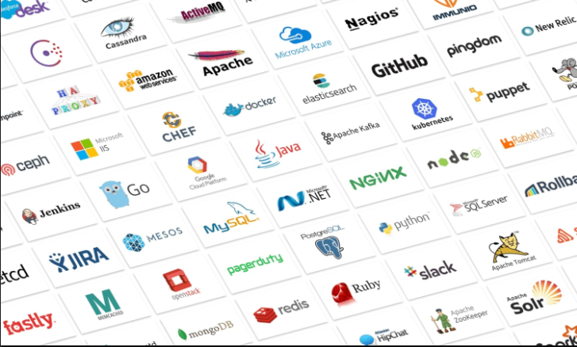
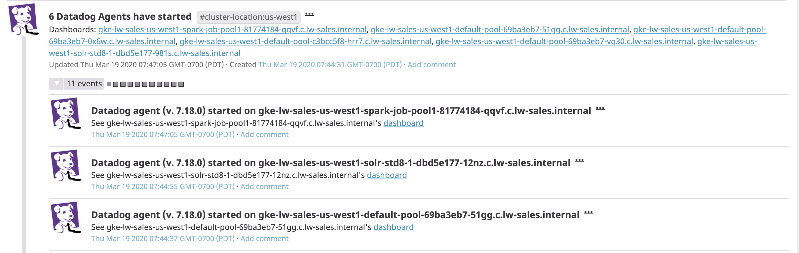
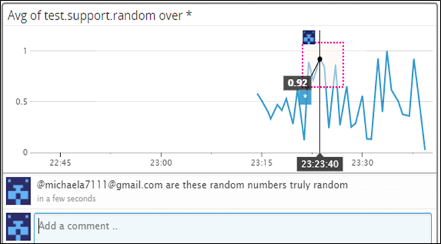

# Datadog – The Exercise by Michael Aravopoulos
Datadog is a monitoring service for cloud-scale applications, bringing together data from servers, databases, tools, and services to present a unified view of an entire stack. These capabilities are provided on a SaaS-based data analytics platform.
Datadog let's you see across systems, applications and services and with turn-key integrations it seamlessly aggregates metrics and events across the full DevOps stack.

Datadog let's you see across systems, applications and services and with turn-key integrations it seamlessly aggregates metrics and events across the full DevOps stack.

Datadog gives you full visibility into modern applications enabling you to monitor, troubleshoot and optimize application performance by tracing requests end-to-end across distributed systems or tracking application performance with auto-generated services views, which can be graphed and alerted on.
With Datadog users can build out their own real-time interactive dashboards that offer high resolution metrics and events for manipulation and graphing by host, device or any other tag.

Datadog enables operational, development and other teams to share information about system events and metrics to give visibility across those teams, where they can discuss issues in context with production data.  More information about Datadog can be found here: http://www.datadoghq.com

# Collecting data
Once you have signed up for Datadog you can follow the step by step instructions for installing the Agent on a host of different Operating Systems, which can be found here: https://app.datadoghq.com/account/settings#agent  Follow the instructions for your specific Operating System such as Windows and the simple yet straightforward guidelines will get the Agent operational in no time at all.

## What is the Agent?

The Datadog agent is a software module that runs on your host machine.  Its job is to collect data such as metrics and events and bring them to the Datadog servers to provide you with the opportunity to do something useful with the data with respect to performance and monitoring.

The Agent overhead is super lightweight and minimally impacts the host systems that it is installed and configured on.  In terms of resource overhead the Datadog agent is as follows:
-	RAM 50 MB; 
-	CPU Rumtime: less than 1% of averaged runtime
-	Disk space: Linux 120 MB & Windows 60MB
-	Network: 10-50 KB bandwidth per minute

An agent based installation provides users with a much higher data resolution than agent-less monitoring or cloud based hosted monitoring services, which will only provide part of the whole picture.  Higher data resolution means that you will be able to find anomalies or abnormal metric trends in sub-minute intervals and the ability to tie together a variety of server based application integrations to get a more comprehensive picture of what is going on.

## What are Tags and why use them?
Tags give users the ability to add dimensions to metrics and make it easier to collect and filter those elements that utilize them.  Tagging gives you the ability to scope aggregated data, so it becomes more helpful, for example, to look at CPU that spans a collection of hosts that represent a critical business service rather than CPU running on server 1.  That way if our critical business service is being impacted in some way by CPU we can identify them easily because of tags.

Screenshot of host and its tags on the Host Map page in Datadog

## Installing and monitoring MySQL
Install a database on your machine, in this example MySQL and then install the respective Datadog integration for that database.
After a few minutes, the Hostmap will show the MySQL metrics.

## Writing a Custom Agent Check
Agent Checks provide a fantastic way to collect metrics from custom applications.  There are two places that you will need to add files for your check. The first is the checks.d folder, which lives in your Agent root.  For example, on Windows 2008 or greater the file locations are:

> C:\Program Files\Datadog\Agent\checks.d\ 

and the other folder we care about is 
> C:\ProgramData\Datadog\conf.d\

To write a custom Agent check that samples a random value whose metric is called `test.support.random`, two files called myrandomcheck.py and myrandomcheck.yaml are placed in the above mentioned folders respectively and the Agent is then restarted.
After a few minutes, the Hostmap will show the Agent check.

# Visualizing data
Data visualization with Datadog provides users with a simple and intuitive representation of the information that matters most to them and this is coupled by the fact that a user can easily drag and drop graphs and other widgets to visualize metrics and events in their own dashboard.

## What is the difference between a Timeboard and a Screenboard?
A <b>TimeBoard</b> is a dashboard that is meant for troubleshooting and correlation.  Metric and event graphs are time synchronized, are automatically laid out and all graphs are always scoped to the same time.  The graphs will always appear in grid fashion, which makes them better suited for troubleshooting and correlation.

A <b>ScreenBoard</b> is a dashboard that is meant for status boards and sharing data.  It has a custom drag and drop layout for mixing widgets and timeframes and each can have a different timeframe.  A ScreenBoard is flexible and great for giving a system that high-level look.

## MySQL Dashboard
Cloned MySQL database integration dashboard with additional database metrics and `test.support.random` metric from the custom Agent check.

## Graph test.support.random & E-mail Annotation

# Alerting on data
Alerting is a machine to person communication or notification that something important has occurred.  Datadog uses several alert detection methods to provide users with the advantage of being able to respond to those situations quickly based on the alert information provide, so that users of business applications will be minimally impacted.

Datadog uses:

- Threshold Alerts that compare values in a selected timeframe against a threshold.
- Change Alerts that compare the absolute or percentage change in value between now and some time ago against a given threshold.
- Anomaly Detection that allows you to identify when a metric is behaving differently than it has in the past.
- Outlier Detection that allows you to detect when some members of a group are behaving strangely compared to others.

## Creating a Monitor
In order to not have to continually observe a dashboard to be alerted when something goes wrong, we will set up monitoring on our `test.support.random` metric so that alerts will go off when the random value goes above 0.90 at least once during the last 5 minutes.  Additionally, it will be made into a multi-alert by host so that a user won't have to create it if the infrastructure scales up.  The monitor will be descriptive with a name and message and will notify users by e-mail.

## E-mail Notification
This monitor should alert you within 15 minutes. So, when it does, take a screenshot of the email that it sends you.

## Monitor Down Time
Since this monitor is going to alert often, you don't want to be alerted when you are out of the office. Set up a scheduled downtime for this monitor that silences it from 7pm to 9am daily.

## Downtime E-mail Notification
Make sure that your email is notified when you schedule the downtime and take a screenshot of that notification.

# Datadog Summary
Datadog provides users with a robust, customizable and easy to use configuration interface allowing you to effectively monitor your dynamic infrastructure and applications.  It's this value proposition that will allow IT to remove itself from being thought of as a cost center and more so as a productivity center and will enable IT to achieve positive business outcomes.
