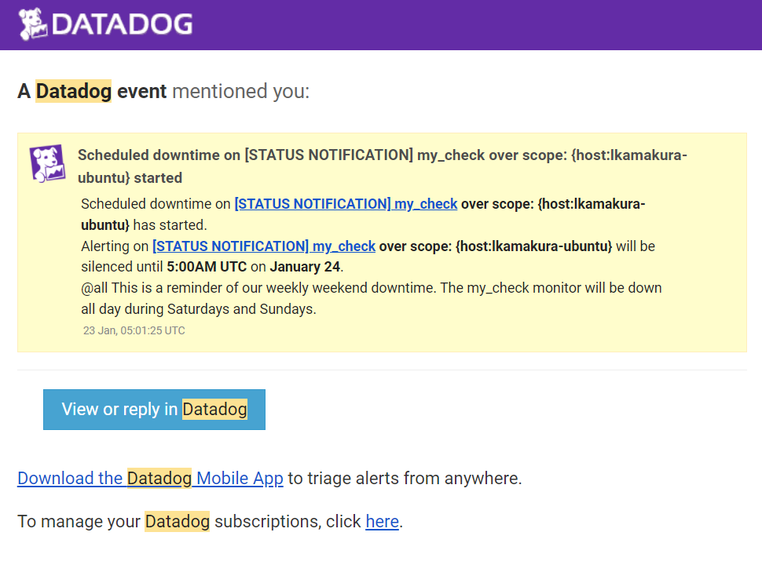

# Datadog/Hiring-Engineers by Lucas Kamakura

## Setting up my environment:
My environment of choice was to spin up an Ubuntu virtual machine via Vagrant. I followed the steps outlined here https://www.vagrantup.com/intro/getting-started/ and installed the datadog agent subsequently.

Command I used to install the datadog-agent for Ubuntu (taken from the Datadog app integrations tab):

    DD_AGENT_MAJOR_VERSION=7 DD_API_KEY=<REDACTED> DD_SITE="datadoghq.com" bash -c "$(curl -L [https://s3.amazonaws.com/dd-agent/scripts/install_script.sh](https://s3.amazonaws.com/dd-agent/scripts/install_script.sh))"

## Collecting Metrics

Added tags and a hostname to the datadog.yaml file in `/etc/datadog-agent` on my vm.

Here is my host in the Datadog app Infrastructure > Host Map tab:

Then I installed MySQL as my DB of choice on the Vagrant machine, created a user for the Datadog Agent, and provided it the necessary permissions to begin collecting metrics:

I also included this metric collection configuration block to my `mysql.d/conf.yaml` file:

Following the steps outlined in https://docs.datadoghq.com/developers/write_agent_check/?tab=agentv6v7 I created an Agent check called `my_check.py` that submitted a metric with a random value between 0 and 1000, and an empty `my_check.yaml` file. The Python script is included in the repo.

Initially the metric was being collected in intervals of around 20 seconds. I then changed the collection interval without modifying the Python file by modifying the `my_check.yaml` file:

This is the graph after setting the 45s interval and restarting the agent:

## Visualizing Data
Using the Datadog API I created a Timeboard that contained:

 - A timeseries with the `my_check` custom metric scoped over the `lkamakura-ubuntu` host

 - A timeseries calculating how many inserts were done in MySQL over time

 - A timeseries with the rollup function applied over the `my_check` custom metric for the past hour

The bash script I used to create this Timeboard is included in this repo as `my_dashboard.sh` and the logs are in `my_dashboard.log
`

Here is the final Dashboard, accessed from Dashboard List in the UI:

5 minutes interval:

1 hour interval:

I then took a snapshot of the Timeboard with its timefrate set to the past 5 minutes and used the @ notation to send it to myself:

What is the Anomaly graph displaying?
> The anomaly graph identifies when a metric is behaving differently than it has in the past, taking into account trends, seasonal day-of-week, and time-of-day patterns.

This is an excerpt taken from https://docs.datadoghq.com/monitors/create/types/anomaly/. In this snapshot we can see a red spike in the mySQL Insert Anomaly Monitor, which I created by suddenly performing multiple inserts over a small period of time, triggering the anomaly monitor.
 
## Monitoring Data
To monitor the `my_check` custom metric, I created a new Metric monitor according to the given specifications:

 - Defined the metric to be `my_check` over the `lkamakura-ubuntu` host
 - Set a warning threshold of 500
 - Set an alert threshold of 800
 - Set it to notify the team if there was no data for `my_check` over the last 10 minutes

I then configured the message to be different depending on the notification was a **warning** or an **alert**:

Here are the messages I received via e-mail when a warning or alert would trigger:

Warning:

Alert:

In order to give our team a break from all these status notification e-mails, I set up some downtime during after-work hours and weekends (keep in mind the hours in the email are in UTC, but **2:00PM UTC** is **9:00AM EST**):

7pm to 9am daily on M-F downtime:

Sat-Sun all day downtime:

## Collecting APM Data

For this part of the assignment I used the Flask script provided in the repo. I also injected `ddtrace` directly into the script:

    from  ddtrace  import  config, patch_all
    
    ## Manually injecting the Middleware ##
    config.env = "dev"
    config.service = "app"
    config.version = "0.1"
    patch_all()
    
    from  flask  import  Flask
    import  logging
    import  sys
    
    main_logger = logging.getLogger()
    main_logger.setLevel(logging.DEBUG)
    c = logging.StreamHandler(sys.stdout)
    formatter = logging.Formatter('%(asctime)s - %(name)s - %(levelname)s - %(message)s')
    c.setFormatter(formatter)
    main_logger.addHandler(c)
    
    app = Flask(__name__)
    
    @app.route('/')
    def  api_entry():
    	return  'Entrypoint to the Application'
    
    @app.route('/api/apm')
    def  apm_endpoint():
    	return  'Getting APM Started'
    
    @app.route('/api/trace')
    def  trace_endpoint():
    	return  'Posting Traces'
    	
    if  __name__ == '__main__':
    	app.run(host='0.0.0.0', port='5050')`

Updated the `datadog.yaml` file and enabled the `apm_config`:

I then ran the script and went to `localhost:5050` to see my web app:

And as I moved around the API endpoints `localhost:5050/api/apm` and `localhost:5050/api/trace` I could see activity in the UI:

Finally, here is my initial Timeboard with all the metrics being collected:

Link to dashboard: https://p.datadoghq.com/sb/fb32e96a-7876-11ec-b944-da7ad0900002-5003921d15da97b0ba781c3939aea6e8

## Final Question

> Datadog has been used in a lot of creative ways in the past. We’ve written some blog posts about using Datadog to monitor the NYC Subway System, Pokemon Go, and even office restroom availability!
> 
> Is there anything creative you would use Datadog for?

I’ve always been a big fan of competitive video games, my favorite at the moment is League of Legends. Given the game's complex nature there are thousands of metrics that can be analyzed and monitored throughout a match, and these are publicly available through Riot Games' API.

For some personal projects I explored a lot of their API and I found out that it provides us with an ocean of real time information on matches. Datadog could be used to create a tool to monitor a match (be it player scores, team resources, player position on the map, etc.) in real time and provide possible courses of actions based on the match state.

Additionally, the developer team at Riot could use Datadog to visualize macro trends in their game and identify outliers when it comes to certain characters (how much they're played, their win rate, their ban rate, etc.) and use Datadog's tool to provide balance insights into the game. 
