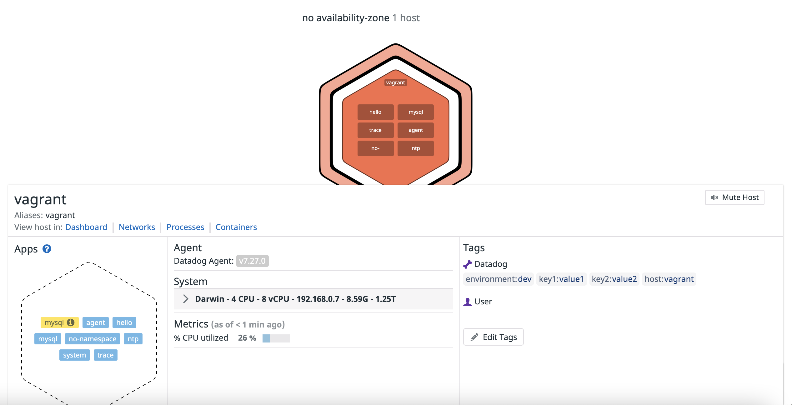
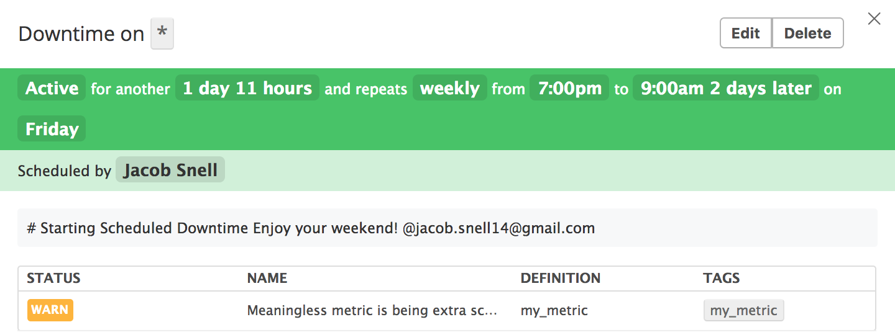

# Sales Engineer Hiring Exercise - Jacob Snell

## Datadog

Bringing sanity to DevOps teams.

Datadog is a monitoring service for hybrid cloud applications, assisting organizations in improving agility, increasing efficiency, and providing end-to-end visibility across the application and organization. These capabilities are provided on a SaaS-based data analytics platform that enables Dev, Ops and other teams to accelerate go-to-market efforts, ensure application uptime, and successfully complete digital transformation initiatives.

For more information, please feel free to visit the [Datadog website](https://www.datdog.com/).

## Overview

After completing this guide, you will know how to:
  * Install, run, and manage the Datadog monitoring agent
  * Configure and install an integration with a MongoDB instance
  * Generate a custom dashboard
  * Implement metric monitors
  * Organize notifications and schedule downtime
  * Monitor the performance of a basic flask application with Datadog Application Performance Monitoring (APM) tools

## Environment Setup

You are welcome to walk through this exercise using any platform you'd like, but the following examples were developed using the environment described below:

* Host Machine: MacBook Pro (2016)
* Host Platform: Virtual Machine (VMware Fusion)
* OS: Ubuntu 16.04 LTS
* Python Version: 2.7.12

## The Datdog Agent

The Datadog Agent is lightweight piece of software that runs on your hosts. Its job is to faithfully collect events and metrics and bring them to Datadog so that you can do something useful with your monitoring and performance data.

The agent is composed of 4 parts:
* Collector
  * The collector runs checks on the current machine for whatever integrations you have and it captures system metrics like memory and CPU.
* Dogstatsd
  * This is a StatsD backend server, it's responsible for aggregating local metrics sent from your code.
* Forwarder
  * The forwarder is pushed data from both dogstatsd and the collector and queues it up to be sent to Datadog.
* SupervisorD 
  * This is all controlled by a single supervisor process. We keep this separate so you don’t have to have the overhead of each application if you don’t want to run all parts (though we generally recommend you do).

In the diagram below, you can see how these parts are connected as part of the Datadog Agent architecture.


### Installing the Datadog Agent

Installing the Datadog Agent on Ubuntu is quite simple, as the setup is completed with the following command.

```shell
DD_API_KEY=<API-KEY> bash -c "$(curl -L https://raw.githubusercontent.com/DataDog/datadog-agent/master/cmd/agent/install_script.sh)"
```

For instructions to install the agent on all supported platforms, Navigate to your main dashboard on the Datadog web application.

In the left toolbar, click on `Integrations` 


Then click on the `Agent` tab


After clicking on the `Agent` tab, your screen should match the image below:


From here, you can select any of the supported OS/platforms and follow the inetrusctions to install your new Datadog Agent.

## Collecting Metrics:

### Add Datadog agent tags

In order to add tags for a host, you will need to update the `/etc/datadog-agent/datadog.conf` file.
For this example, there are four tags perscribed to this host, as shown in the snippet below.

```yaml
# Set the host's tags (optional)
tags:
  - ubuntu_16_04 # Host OS is Ubuntu 16.04 LTS
  - vm           # Host Type is a Virtual Machine
  - env:dev      # Environment is for development
  - role:database:mongo # MongoDB Role
  ```

Once these changes have been saved, restart the systemd service by running the following command:

```shell
sudo service datadog-agent restart
```

As you can see in the screenshot below, each of these tags is reflected in the Datadog Agent Host Map, (circled in red).

**Host Map Screenshot**


### Installing a local MongoDB database

MongoDB is free, distributed and open-source document database at its core to power high availability, horizontal scaling, and geographic distribution. It stores data in JSON-like documents and supports Ad hoc queries, indexing, and real time aggregation.

For this exercise, we're going to install a local MongoDB following the instructions [here](https://docs.mongodb.com/manual/tutorial/install-mongodb-on-ubuntu/).

To ensure your new MongoDB is alive and well, run `sudo service mongod status` and ensure the prmiary daemon is active and running.

### Installing a Datadog integration with MongoDB

Now that your database has been installed, we want to enable and configure the Datadog integration with MongoDB so that we can:

* Visualize key MongoDB metrics.
* Correlate MongoDB performance with the rest of your applications.

In order to enable the integration, we will first setup a Datadog user for the database.  Follow the instructions at the Datadog [MongoDB Integration](https://docs.datadoghq.com/integrations/mongo/) page.

Be sure to restart the `datadog-agent` after your changes have been made to ensure they take effect, which can be executed with this command:

```
sudo service datadog-agent restart
```

### Creating a custom agent check
Writing a custom agent check allows you to tailor the Datadog Agent reporting to your system.  To keep things simple, let's build a custom agent check that reports a random number between 0 and 1000.
  
```python
import random

from checks import AgentCheck


class CustomCheck(AgentCheck):
    def check(self, instance):
        my_metric_value = random.randint(0, 1000)
        self.gauge('my_metric', my_metric_value)


if __name__ == '__main__':
    check.check(instance)
```

A copy of this code can be found in [custom_check.py](code/custom_check,py).

Each agent check requires a corresponding configuration file in the `/etc/datadog-agent/conf.d/` directory.
Since our custom check is called `custom_check`, create a directory for your configuration file.

```shell
mkdir /etc/datadog-agent/conf.d/custom_check.d/
```

Now we want to create the configuration file for our custom check and call it `custom_check.yaml`

```shell
touch /etc/datadog-agent/conf.d/custom_check.d/custom_check.yaml
```

Copy and paste the snippet below into `custom_check.yaml`

```yaml
init_config:

instances:
    - username: datadog
      password:
```

Since there is no specified reporting interval for the custom check, the agent defaults to a 15 second reporting interval.

**Bonus Question**: Can you change the collection interval without modifying the Python check file you created?

**Bonus Answer**:
  Yes. In order to modify the collection interval, edit the corresponding .yaml file for the Python check file.  The yaml file includes an `instances` group and a `min_collection_time` variable that can be modified to any collection interval, (in seconds).

Snippet from `conf.d/custom_check.d/custom_check.yaml` with a 45 second `min_collection_time` configured below:

```yaml
init_config:

instances:
    - username: datadog
      password:
      min_collection_interval: 45
```

## Visualizing Data - Datadog Dashboards

For a quick introduction to graphing and Datadog dashboards, visit the Datadog documentation [here](https://docs.datadoghq.com/graphing/dashboards/timeboard/)

For building a dashboard, its important to know the primary differences between a [Timeboard](https://docs.datadoghq.com/graphing/dashboards/timeboard/) and [Screenboard](https://docs.datadoghq.com/graphing/dashboards/screenboard/)

|          |      Timeboards      |  Screenboards |
|:---------|:-------------:|:------:|
| Time Scope |  All graphs share same time scope | All graphs can have individual time scope |
| Layout | Graphs appear in a fixed grid | Graphs are placed anywhere you like on the canvas |
| Can Share Graphs Individually | Yes | No |
| Can Share the Entire Dashboard | No | Yes |
| Sharing can be Read-Only | Yes | Yes |

### Create a Timeboard with the Datadog API

The best starting place to learn about the API is, of course, the [documentation](https://docs.datadoghq.com/api/?lang=python#timeboards).


The script below, (copied from [gen_timeboard.py](code/gen_timeboard.py)), can be used to generate a Timeboard with three charts via the API.  The charts will display the following:

* `my_metric` scoped over the host.
* The average heap memory usage of the database from our MongoDB integration with the anomaly function applied.
* `my_metric` with the rollup function applied to sum up all the points for the past hour into one bucket.

```python
from datadog import initialize, api

options = {
    'api_key': '1fb7eafb0c00427eba0dd20070d2bbb6',
    'application_key': '7214295e75df236125e7dd8c535b94b57683be73',
}

initialize(**options)

title = "Jake's First Timeboard"
description = "A super informative Timeboard of random metrics"
graphs = [{
    "definition": {
        "events": [],
        "requests": [
            {
                "q": "my_metric{host:ubuntu}",
                "type": "line",
                "style": {
                    "palette": "cool",
                    "type": "dash",
                    "width": "thin"
                }
            }
        ],
        "viz": "timeseries"
    },
    "title": "my_metric Value from Ubuntu host"
},
    {
    "definition": {
        "viz": "timeseries",
        "events": [],
        "requests": [
            {
                "q": "anomalies(avg:mongodb.extra_info.heap_usage_bytesps{role:database:mongo}, 'basic', 1.5)",
                "type": "line",
                "style": {
                    "palette": "cool",
                    "type": "solid"
                }
            }
        ],
    },
    "title": "Average MongoDB heap usage with Anomaly Detection"
},
    {
    "definition": {
        "viz": "timeseries",
        "requests": [
            {
                "q": "avg:my_metric{*}.rollup(sum, 3600)",
                "type": "line",
                "style": {
                    "palette": "cool",
                    "type": "solid",
                    "width": "thick"
                },
            }
        ],
    },

    "title": "Sum of random metric over 1 hour duration"
}
]

template_variables = [{
    "name": "test",
    "prefix": "host",
    "default": "host:ubuntu"
}]

read_only = True
api.Timeboard.create(title=title,
                     description=description,
                     graphs=graphs,
                     template_variables=template_variables,
                     read_only=read_only)
```

Click the link below for the timeboard created by the above script.

* [Jake's First Timeboard](https://app.datadoghq.com/dash/807109/jakes-first-timeboard)

### Managing Timeboards
Once the Timeboard is created, you can access the Dashboard from your Dashboard List in the UI:

From the Datadog web application home page, click on the `Dashboards` tab in the left toolbar.


From the Dashboard window, either select your Timeboard from the list or use the search bar at the top of the window to search for your Timeboard.


One of the important tools in the Timeboard is the ability to take Snapshots and send those graphs to members of your team for review.  To take a Snapshot of a graph, click the camera icon in the top right corner of one of your graphs.


To select a team member to send the notifcation too, use the `@` notation, followed by the users name or email.


After selecting yourself as the recipient, verify that you've received an email similar the screenshot below.


**Bonus Question**: What is the Anomaly graph displaying?  

**Bonus Answer**:
The Anomaly graph is displaying two things:

1. The color of the line represents the observed value of `my_metric`. 
     * Blue line = value is in expected range
     * Red = value is outside expected range
1. The gray zone represents where the region of expected values based on the historical values observed by the Datadog agent.

It's important to note that the gray region is representative of the historical data, although it isn't currently displayed in the timeseries chart.

## Monitoring Data

### Configure monitors
Since you’ve already caught your test metric going above 800 once, you don’t want to have to continually watch this dashboard to be alerted when it goes above 800 again. So, let’s make life easier by creating a monitor.

Start by creating a new Metric Monitor that watches the average of your custom metric (my_metric) and will alert if it’s above the following values over the past 5 minutes:

* Warning threshold of 500
* Alerting threshold of 800
* And also ensure that it will notify you if there is No Data for this query over the past 10m.

Follow these steps to configure your monitor alert:

1. Choose the detection method
    * Select `Threshold Alert`

    

1. Define the Metric
    * Metric = my_metric
    * Select `Simple Alert`

     

1. Set alert conditions

    * Warning threshold of 500
    * Alerting threshold of 800
    * Notify you if there is No Data for this query over the past 10m.

     

1. Say what's happening in the form of an email notification

     

    The Alert message below will do the following: 

    * Send you an email whenever the monitor triggers.
    * Send different messages based on whether the monitor is in an Alert, Warning, or No Data state.
    * Include the metric value that caused the monitor to trigger and host ip when the Monitor triggers an Alert state.


    **Alert Message**

    ```
        ... but no need to panic.

        {{#is_no_data}}
        No data means no issues, right?  I think that's how that works...
        {{/is_no_data}}


        {{#is_warning}}
        ##**WARNING**

        Make sure you:

        - Stop
        - Drop
        - Shut 'em down
        - Open up shop

        Cause that's how Ruff Ryders roll
        {{/is_warning}}


        {{#is_alert}}
        ## **THIS IS NOT A DRILL**

        Host:  {{host.name}}
        IP: {{host.ip}}
        Metric: my_metric
        Value: {{value}}


        Ok, well it's sort of a drill.  Carry on with whatever it is you were carrying on with before this notification interrupted your peaceful lives.

        {{/is_alert}}

        @jacob.snell14@gmail.com
    ```

1. Specify the team members to notify

 

If setup correctly, you should receive an email that looks similar the image below:


**Bonus Question**: Since this monitor is going to alert pretty often, you don’t want to be alerted when you are out of the office. Set up two scheduled downtimes for this monitor:

* One that silences it from 7pm to 9am daily on M-F,
* And one that silences it all day on Sat-Sun.
* Make sure that your email is notified when you schedule the downtime and take a screenshot of that notification.

**Bonus Answer**:  

The screenshots below show two downtime schedules.  The first for Monday-Thursday from 7 PM - 9 AM the following day, (repeating weekly).


The second downtime is set for 7 PM Friday to 9 AM Monday, (repeating weekly).




## Collecting APM Data:

To help convey the benefits of Datadog Application Performance Monitoring(APM), we're going to instrument a basic flask app.

Here is the original application:
```python
    from flask import Flask
    import logging
    import sys

    # Have flask use stdout as the logger
    main_logger = logging.getLogger()
    main_logger.setLevel(logging.DEBUG)
    c = logging.StreamHandler(sys.stdout)
    formatter = logging.Formatter('%(asctime)s - %(name)s - %(levelname)s - %(message)s')
    c.setFormatter(formatter)
    main_logger.addHandler(c)

    app = Flask(__name__)

    @app.route('/')
    def api_entry():
        return 'Entrypoint to the Application'

    @app.route('/api/apm')
    def apm_endpoint():
        return 'Getting APM Started'

    @app.route('/api/trace')
    def trace_endpoint():
        return 'Posting Traces'

    if __name__ == '__main__':
        app.run()
```

The resulting app is below and can be referenced at the source file [app.py](code/app.py).

```python
import logging
import sys
import requests

from flask import Flask, Response
from ddtrace import tracer
from ddtrace.contrib.flask import TraceMiddleware
from time import sleep

# Have flask use stdout as the logger
main_logger = logging.getLogger()
main_logger.setLevel(logging.DEBUG)
c = logging.StreamHandler(sys.stdout)
formatter = logging.Formatter(
    '%(asctime)s - %(name)s - %(levelname)s - %(message)s')
c.setFormatter(formatter)
main_logger.addHandler(c)

app = Flask(__name__)
traced_app = TraceMiddleware(
    app, tracer, service="my-flask-app", distributed_tracing=False)


@app.route('/')
def api_entry():
    return 'Home'


@app.route('/api/apm')
def apm_endpoint():
    return 'Getting APM Started'


@app.route('/api/trace')
def trace_endpoint():
    return 'Posting Traces'


@app.route('/traffic')
def traffic():
    with tracer.trace("/traffic", service="test") as span:
            span.set_tag("traffic", 3)
            sleep(3)
            r = "Congrats! You've got 3 seconds of lag"
    return r


@app.route('/fail')
def failure():
    with tracer.trace('/fail', service="test") as span:
        span.set_tag("fail", 0)
        r = Response(response="Service Unavailable - You Lose :(",
                     status=503, mimetype='application/json')
    return r


if __name__ == '__main__':
    app.run()
```

The new application includes two additional routes and the Datadog APM tracer middleware.


After combining the APM and infrastructure monitoring data and adding a couple charts to our dashboard, the final presentation is shown below:


**Bonus Question**: What is the difference between a Service and a Resource?

**Bonus Answer**:
* Services
  * A service is a set of processes that do the same job.

* Resources
  * A Resource is particular action for a service.

  * For a web application: some examples might be a canonical URL, such as /user/home or a handler function like web.user.home (often referred to as “routes” in MVC frameworks).
  * For a SQL database: a resource is the query itself, such as SELECT \* FROM users WHERE id = ?.

## Final Question:

Datadog has been used in a lot of creative ways in the past. We’ve written some blog posts about using Datadog to monitor the NYC Subway System, Pokemon Go, and even office restroom availability!

Is there anything creative you would use Datadog for?

### Smart Cities - Instrumented with Datadog

I think the case for instrumenting a Smart City implementation with DataDog would be one of the most interesting applications of both the infrastructure monitoring and APM.

One of the biggest struggles in developing a distributed application at this scale is the ability to federate systems and data that are otherwise isolated from a majority of the other entities.  For example, if I were the head of IT for the state of Colorado working on the Smart City initiative, I'd likely be losing sleep over my inability to know if all the systems in Denver/Boulder/Colorado Springs are running, error-free, and reporting in their expected intervals.

Datadog could be the single solution to monitor all of these disparate systems.  Most of these implementations include some combination of the following:

* Cloud hosted services
  * Databases
  * Communication Brokers
  * APIs
  * Networking/Content Delivery
* Mobile apps for accessing information about urban objects, processes and maps
* On-premise software components for the development of localized services linking to various urban systems, sensors and open data sources.
* Environmental monitoring systems
* Public safety systems

Each of these components could be instrumented with Datadog tools to bring the monitoring of all systems under one umbrella.