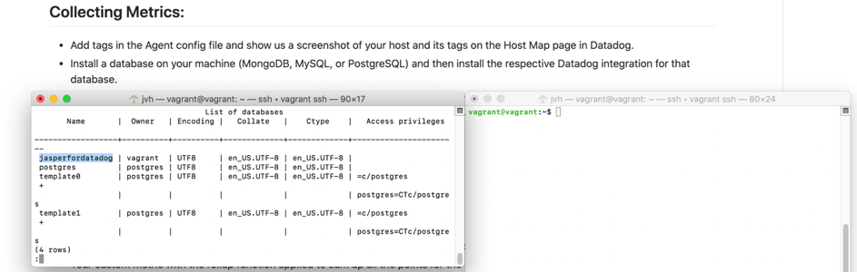
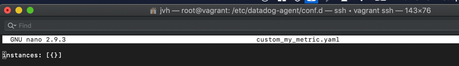

Dear DataDog Recruiting Team, dear Reviewers,

thank you for giving me the chance to submit a solution attempt to your tech exercise. The task was a lot of fun and allows applicants to learn a lot about the leading IAM Platform.
Throughout my responses I decided to add a _**“Why this is cool!?”**_-theme to many questions in order to separate the solution description from the business value presentation, as well as to improve readability.
At the end I provide you with two small bits of feedback that I noticed over the last couple of weeks while I got to know DataDog and its product(s). Aside from the product, I’m also hoping to get to know more of Datadogs people soon ;-).


# Collecting Metrics:

## Task: Add tags in the Agent config file and show us a screenshot of your host and its tags on the Host Map page in Datadog.

Below you can find a screenshot of the hostmap that includes the Vagrant Ubuntu VM I created to fulfill the first task. In addition, there is a second screenshot that displays the information about the tags that correspond to the tags you can see in the first screenshot.


_**Why this is cool!?**_ 

This is the first “Why this is cool!?” paragraph that I will use throughout the responses.
Using the Host Map gives you a great overview over your entire infrastructure. It has never been easier to identify hosts with the specific conditions you’re looking for. Let's say your applications are slower than they used to be. That's when the Host Map will be your go-to identifier. By default, the color scheme will represent the host’s CPU Utilization which gives you the visibility you need to identify the right hosts. However, it’s all in your hands. You can easily filter and configure the metrics (custom or default) and also the way that hosts are displayed in relation to those metrics (by size or by color).
Once you’ve identified what you’re looking for you can easily drill down on every host. Or if you prefer to just loosely observe certain hosts just copy a small version of the host map as widget to your dashboards.
After all, this birds-eye view gives you a great entry point to your analysis and reduces efforts and costs of your IT department significantly. 

## Task: Install a database on your machine (MongoDB, MySQL, or PostgreSQL) and then install the respective Datadog integration for that database.

Not much to say here, the screenshot below displays an overview of the installed PostgreSQL. The DataDog integration will be shown on the dashboard later on.

 

## Task: Create a custom Agent check that submits a metric named my_metric with a random value between 0 and 1000.

In the screenshot below we can see the final result of how the custom Agent submits my_metric. Please note that the collection interval defaults to one collect every 15 seconds.

 

To create the custom Agent check we can simply enter the Python code below to a file in the agent’s checks.d folder (e.g., custom_my_metric.py). In addition, we only need to add a the following code snippet
```
instances: [{}]
```
 to the config yaml file in the conf.d directory. The yaml file should have the same name as our custom_metric check (e.g. custom_my_metric.yaml).
 To fulfil the requirement that we should submit a random value between 0 and 1000 in the Python custom-agent we import the `random` module. Then we utilize the random method `randint` as our parameter.

```python
import random
# the following try/except block will make the custom check compatible with any Agent version
try:
    # first, try to import the base class from new versions of the Agent...
    from datadog_checks.base import AgentCheck
except ImportError:
    # ...if the above failed, the check is running in Agent version < 6.6.0
    from checks import AgentCheck

# content of the special variable __version__ will be shown in the Agent status page
__version__ = "1.0.0"

class JaspersCheck(AgentCheck):
    def check(self, instance):
        self.gauge('my_metric', random.randint(0, 1000), tags=['howcoolisdatadog:verycool'])

```

 
 


_**Why this is cool!?**_
The ability to collect metrics from custom and unique applications or systems allows you to integrate all relevant metrics from all relevant sources at customized pace and scope. Even better, you can also specify performance counters for existing integrations beyond those that are natively provided. While the metrics that are provided by Datadog’s integrations are great, you sometimes need the metrics tailored to your own business use case. For instance, as I read on the Datadog blog, the currently highly successful company Peloton Cycle recently needed a metric to figure out how far their slave databases are behind their master databases. They achieved this by using the same kind of custom agent check we used above:

`self.gauge(METRIC, lag_time, tags=useful_tags)`

https://www.datadoghq.com/blog/peloton-cycle-integrates-it-business-custom-metrics/


How cool is that!?

## Tasks: Change your check's collection interval so that it only submits the metric once every 45 seconds. Can you change the collection interval without modifying the Python check file you created?

The check’s collection interval can be easily configured using the same config file (“custom_my_metric.yaml”) in the ‘datadog-agent/confd.’ folder that we used above to instantiate the custom agent-check. 
We simply add the following yaml configuration data to the file:


_**Why this is cool!?**_
Regardless of how many times we could potentially collect a metric, sometimes there is good reason to lower the number of intervals per period. For example, network utilization is highly affected by this setting. If we collect the metric every 15 seconds that is an additional 5760 network requests per day for a single agent check. A lot, even for high speed networks. What if we collect hundreds or thousands of metrics? Moreover, a single graph on a timegraph usually displays only 300 pixels anyways so for most use cases the overall “picture” doesn’t change by increasing the interval to e.g., 45 seconds. Meanwhile, it saves us two-thirds of network traffic per metric.

PS: I solved the collection interval taks using the yaml config file in the first place (because it was suggested that way by the DataDog docs) and did not touch the Python for that. However, I assume we could have used the e.g. the `time` module and `time.sleep(45)` inside a `while True`-loop to achieve the same result.

# Visualizing Data:

The timeboard that I created as result of the “Visualization Data” section can be found here: https://p.datadoghq.eu/sb/ck0s611n5hqag91x-bede9919eb0ec5dc0ab7f13572a9adb7

This is what it should look like:

 
_Please note: If the host hasn’t been running the graphs might appear empty. For my_metric I chose to keep the collection interval to 15 seconds for this task._

## Tasks: Utilize the Datadog API to create a Timeboard that contains:
### - Your custom metric scoped over your host.
### - Any metric from the Integration on your Database with the anomaly function applied.
### - Your custom metric with the rollup function applied to sum up all the points for the past hour into one bucket

I’m not sure if I understood this last task correctly. What I understand is that you want all data points summed for the past hour only. However, only displaying a one hour bucket with rolled-up data is not necessarily useful and doesn’t require a rollup function. Meanwhile, we could instead display multiple rolled up buckets for multiple past hours as this would allow us to see the sums of each hour separately in the graph. I decided for the ladder in the screenshot above and combined it with a regular line graph that does the same thing. We can neatly see how I went to bed late Tuesday night and opened up my laptop around 10 again the next morning ;-)

## Please be sure, when submitting your hiring challenge, to include the script that you've used to create this Timeboard.

I chose to create the Dashboard using JSON and the REST-API via the Postman collection that Datadog provides.

```JSON
{
    "title": "Jasper's Applicant Timeboard",
    "widgets": [
    {
        "definition": {
            "type": "timeseries",
            "requests": [
                {
                    "q": "avg:my_metric{$jasper.vagrant}"
                }
            ],
            "title": "My_Metric scoped over my host Jasper.Vagrant"
        }
    },
    {
        "definition": {
        "type": "timeseries",
        "requests": [
            {
                "q": "anomalies(avg:postgresql.commits{*}, 'basic', 2)"
            }
        ],
        "title": "Any metric [postgresql.commits] from the Integration on your Database with the anomaly function applied"
        } 
    },
    {
        "definition": {
        "type": "timeseries",
        "requests": [
            {
                "q": "avg:my_metric{$jasper.vagrant}.rollup(sum, 3600)",
                "style": {
                    "line_width": "thick",
                    "palette": "orange",
                    "line_type": "solid"
                }
            },
             {
                        "q": "avg:my_metric{$jasper.vagrant}.rollup(sum, 3600)",
                        "style": {
                            "line_width": "normal",
                            "palette": "dog_classic",
                            "line_type": "solid"
                        },
                        "display_type": "bars"
             }
        ],
        "title": "My_Metric with applied rollup function so that all data points within one hour are summed up into a bucket each"
        } 
    }
    
],
    "layout_type": "ordered",
    "description": "<DASHBOARD_DESCRIPTION>",
    "is_read_only": false,
    "notify_list": [
        "test@datadoghq.com"
    ],
    "template_variables": [
        {
            "name": "jasper.vagrant",
            "prefix": "host",
            "default": "jasper.vagrant"
        }
    ],
    "template_variable_presets": [
        {
            "name": "Saved views for hostname 2",
            "template_variables": [
                {
                    "name": "host",
                    "value": "<HOSTNAME_2>"
                }
            ]
        }
    ]
}
```
_**Why this is cool!?**_ 
This postman collection option provides an amazing usability and flexibility allowing you to test your code by only customizing the JSON to your needs. Subsequently, you can even wrap the JSON inside your custom application code (e.g., Python, Go, Java, Ruby). This allows you to create dashboards based on/triggered by events that occur in your application! This is super useful when you need to look at the history of certain metrics after a specific condition (e.g., an error) occurred.

## Task: Once this is created, access the Dashboard from your Dashboard List in the UI:
### Set the Timeboard's timeframe to the past 5 minutes:
For some reason the UI kept reverting the overall Timeboard timeframe to 15-minute timespans. Only when accessing single graphs, I was able to reduce the timeframe to 5 minute timespans. Maybe this is an unresolved bug as the custom timeframes are still in beta according to the link below?
https://docs.datadoghq.com/dashboards/guide/custom_time_frames/#pagetitle

### Take a snapshot of this graph and use the @ notation to send it to yourself.
I’m not sure which graph exactly you meant. I chose the “My_Metric scoped over my host” graph from the created timeboard. Below you can find a screenshot of the received mail and the corresponding @notation.

 
 

_**Why this is cool?**_ 

The collaboration via @notation allows you to notify and point your colleagues to the exact graph/metric you intend them to look at. This ensures that the recipient receives the exact data link and it avoids confusion. Furthermore, you can remind yourself by generating an email to yourself. Also, your event stream will contain more relevant data. Lastly, it is super easy to notify the datadog support via the @notification. 

### Bonus Question: What is the Anomaly graph displaying?
Anomaly algorithms generally look for strange behavior. The algorithms base their analysis on past/historic metric performance. The detection occurs based on proven statistical algorithms (e.g., SARIMA algorithm).

_**Why this is cool!?**_ 
 This is super useful because a lot of times the most valuable metrics are also the most variable ones. Take user requests for any e-commerce platform or online streaming service as an example. Those graphs might surge unexpectedly on a Sunday night. Is this a reason to set an alert? How should we set it? We can’t really set the alert based on drops or surges as these will occur naturally at different times of the week, or year. That means, we would likely receive alerts for normal graph behavior at some point. Thus, what’s so cool about the Anomaly algorithm is that it includes seasonal and historic data. Thereby, it “learns” (identifies trends) over time whether a certain number of requests on a Sunday night is abnormal. Therefore, this feature presents huge business value. We can even adjust the detection in accordance with our business requirements (e.g., how vulnerable is our business if this metric reports terrible values?) by setting bounds or adapting for robustness.

 # Monitoring Data

## Task: Create a new Metric Monitor that watches the average of your custom metric (my_metric) and will alert if it’s above the following values over the past 5 minutes:
### - Warning threshold of 500
### - Alerting threshold of 800
### - And also ensure that it will notify you if there is No Data for this query over the past 10m.

This section is quite self-explanatory in my opinion as pretty much all of it happens in the UI and is very end-user-friendly. Still, I will add a short paragraph with regard to…

_**Why this is cool!?**_ 
The ability to alert users based on specific preset application conditions is obviously a main feature of a monitoring platform. Yet, there’s more to it than just the pure ability to set alerts. The user should be capable of differentiating and customizing the alerts with regard to severity. DataDog does this in an easy-to-configure fashion by allowing the user to set alerts as records (for low severity). Records are mainly a sort of ‘living documentation’ and also used for trouble shooting. Next, alerts can be set as notifications (for moderate severity). These are the type of errors where you don’t wake up your colleague in the middle of the night just quite yet... but you do make sure they check on the error before the first coffee in the morning ;-)
Lastly, alerts as pages (for high severity) are there to wake up the right people asap with all necessary information provided in the alert.
All in all, Datadog is well set to meet all requirements that users (should) have.


## Task: Please configure the monitor’s message so that it will:
### - Send you an email whenever the monitor triggers.
### - Create different messages based on whether the monitor is in an Alert, Warning, or No Data state.
 
### - Include the metric value that caused the monitor to trigger and host ip when the Monitor triggers an Alert state.
### - When this monitor sends you an email notification, take a screenshot of the email that it sends you.
 

## Bonus Question: Since this monitor is going to alert pretty often, you don’t want to be alerted when you are out of the office. Set up two scheduled downtimes for this monitor:
### One that silences it from 7pm to 9am daily on M-F,
### And one that silences it all day on Sat-Sun.
### Make sure that your email is notified when you schedule the downtime and take a screenshot of that notification.
 

# Collecting APM Data:

## Given the following Flask app (or any Python/Ruby/Go app of your choice) instrument this using Datadog’s APM solution:

To solve this task, I first began manually designing a TraceMiddleware instance but then found how easy it is to automatically inject trace and span IDs. However, I kept the middleware instance as comments in the code below as it was already working to a large degree.
What gave me a hard time is the connection of logs and traces that I couldn’t get to work. I’m pretty sure that I just have a minor error due to missing information somwhere but I’ve tried for hours and in a real work situation this is the point when I would have reached out to the team mates of the team that I’m trying to become a member of ;-).
Nevertheless, this doesn’t mean I’m giving up. I’ll start over again and read through flask logging basics and the datadog docs once more.
I posted the APM graphs to the same Dashboard as before with the URL:
https://p.datadoghq.eu/sb/ck0s611n5hqag91x-bede9919eb0ec5dc0ab7f13572a9adb7 

Here the code that I ran in different ways but last with the following CLI command:
 ‘ddtrace-run python3 DataDogFinalTaskFlaskHiringChallenge.py DD_LOGS_INJECTION=true’

 ```python 
•	from flask import Flask
•	import logging
•	import sys
•	
•	#Import of relevant ddtrace components:
•	#from ddtrace.contrib.flask import TraceMiddleware
•	from ddtrace import patch_all; patch_all(logging=True)
•	from ddtrace import config
•	from ddtrace import tracer
•	
•	# Tracer configuration below:
•	# tracer.configure()
•	# Enable distributed tracing
•	config.flask['distributed_tracing_enabled'] = True
•	
•	# Have flask use stdout as the logger
•	main_logger = logging.getLogger()
•	main_logger.setLevel(logging.DEBUG)
•	c = logging.StreamHandler(sys.stdout)
•	formatter = logging.Formatter('%(asctime)s - %(name)s - %(levelname)s - %(message)s')
•	c.setFormatter(formatter)
•	main_logger.addHandler(c)
•	
•	app = Flask(__name__)
•	#traced_app = TraceMiddleware(app, tracer, service='HiringChallengeService', distributed_tracing=True)
•	
•	@tracer.wrap()
•	@app.route('/')
•	def api_entry():
•	    #tracer.current_span().set_tag('subject')
•	    return 'Entrypoint to the Application'
•	
•	@app.route('/api/apm')
•	def apm_endpoint():
•	    return 'Getting APM Started'
•	
•	@app.route('/api/trace')
•	def trace_endpoint():
•	    return 'Posting Traces'
•	
•	if __name__ == '__main__':
•	    app.run(host='0.0.0.0', port='5050')

 ```
Below you can find the screenshot of the automatically created flask service dashboard:


_**Why this is cool!?**_
Modern Internet services are usually widely distributed (at least figurately speaking) and highly complex. DataDog APM allows its users to address some of the major challenges that arise with the modern service architecture.
For example, without tracing we can usually only measure an overall request time. Meanwhile, it is very difficult to get detailed insight in “long tail latency” of a distributed system. APM enables you to see which of the servers along the “tail” takes the longest and releases you from the need to guestimate on where the cause for long request-response duration may come from.
Also, how well did your colleagues document the dependencies for your microservice? What are the chances the microservice relies on a second or third service? DataDog APM delivers the right visualization capabilities to answer these questions. Additional related use cases are debugging, network modeling, and troubleshooting/firefighting. In summary, DataDog APM provides multiple features that only grow in relevance over the coming years. Especially in the European market (and the DACH region) there is a huge need for this type of capabilities.


## Bonus Question: What is the difference between a Service and a Resource?

Broadly speaking, a service refers to a set of processes (endpoints, queries, or jobs) that are bundled together to provide some feature set. Nowadays the term is usually related to modern microservices as these can then be scaled together when needed. Examples would be an API service that offers a group of URL endpoints or a group of database queries bundled as a database service. In Datadog the services list builds the entry point to the APM section. 

In contrast, resources refer to a specific domain of a customer application.
An individual endpoint for a given service. Those endpoints are represented by HTTP requests, names of functions, cache commands, queries. A single request to one of these endpoints would then be called a ‘trace’. 

# Final Question:

When the Covid-19 lockdown started in Germany in March there was an owner of a bakery group (Germans love to go to bakeries) on the nationwide news who eventually started crying as he didn’t know how to overcome the financial burden that Covid would put on him and his employees. (Here is the video on Youtube: (https://www.youtube.com/watch?v=89BNbDSZOqg).
At the time a couple of friends of mine and I discussed how one could potentially help out the bakeries. Particularly when keeping in mind that a second lockdown in fall remains a possibility. We thought of offering a PaaS or SaaS solution that would allow customers to order their bread or rolls online and pick them up in the most hygienic way possible (without any human interactions). The cloud-based solution should be available to all bakeries for free and should be financed by a small percentage per order. There are many more advantages of such an approach that I’m not going to list because what I want to use Datadog for is the following but feel free to discuss with me at any time :-).
Did you know that millions of tons of bread are being thrown away every year? Once the data about orders and stock is stored on the virtually separated databases/instances and accessible via the different endpoints of the bakerie(s) I would ask them for permission to not only monitor application performance but also to analyze the data to create dashboards that help prevent food waste (in a non-hurtful way for the bakery businesses). Questions that Datadog can (help) answer quicker than anyone else would be for example: At what time do customers think about ordering/buying bread? Is there enough time between them deciding on what they want to buy and reacting to the demand in an on-demand fashion? How do customers react if on stock bread is being discounted before it’s thrown away? In this way, Datadog can save jobs and reduce food waste.

# Two Words of Feedback

Thanks again, for letting me try to solve the tech exercise. I learned a lot and besides all the benefits that you as employer get, I also believe this is a great way for applicants to reassure themselves that this is something that they would want to do over the coming years.

Here the two bits of promised feedback among many others points that we could discuss in future conversations:

Firstly, as I started to become acquainted with DataDog I was confronted with a ton of commercials/ads from one of your main competitors, Dynatrace, on YouTube/social media platforms. Considering the fact that I could have been a lead instead of an applicant this may have led to me at least considering Dynatrace as an alternative solution. It took a few days until I saw the first DataDog ad. This referts to the German market only however.

Secondly, a personal view on the learnings platform: While the learning content is great and conveys the necessary skills to configure and use the basic features of the Datadog Platform content, the learning platform could emphasize more “why” and how DataDog features bring business value/ROI to the table.
After all, business leaders will often make the decision on whether a product is purchased based on ROI. Therefore, I feel like the ROI could be emphasized more thoroughly throughout. The portrayal of use cases or case studies on the learning platform might motivate students as it makes them envision themselves bringing value to their employers. 

I hope you can draw something from this feedback.

I’m really looking forward to hearing back from you.

All the best,
Jasper