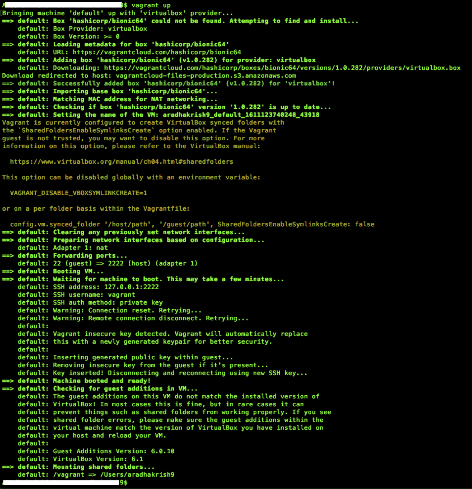
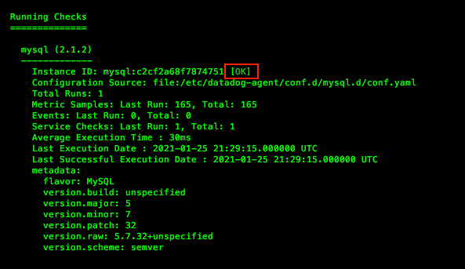

## *Amrith's answers to the exercise*

*Please find below answers to the excercise*


# Setting up the environment

## Installing Vagrant and VirtualBox on a local machine

### Install Vagrant:


Download the proper package for your operating system and architecture from [Vagrant Download page](https://www.vagrantup.com/downloads). Additional instructions on installation if needed are available [here](https://www.vagrantup.com/docs/installation)


### Install VirtualBox:

VirtualBox is a free and open source virtualisation software. We will use VirtualBox to run Ubuntu 18.04 The latest version is available in the [VirtualBox Download page](https://www.virtualbox.org/wiki/Downloads)


## Configuring Vagrant and verifying the OS

The following command initialises Vagrant on your local machine and downloads the image of Ubuntu 18.04 also known as Bionic Beaver.
````
vagrant init hashicorp/bionic64
````


### Launching the server

The following command would bring the server up. If this is the first time the command is run and if Vagrant cannot find the image it will attempt to find and install the OS on VirtualBox

````
vagrant up
````


### Connecting to the server

Once Vagrant has brought up the server you will need to connect to it by performing a Vagrant ssh. This simulates connecting to the server through Secure Socket Shell (SSH). The following command connects to the Ubuntu Bionic server that we just spun up:
````
vagrant ssh
````


### Verify the OS version by running the command
````
lsb_release -a
````


### Change the hostname for better identification

The below screenshot confirms that the hostname has been changed.


### Create a new Datadog account.

* Use your browser and open https://www.datadoghq.com/ and create a new account
* After siging up, your new Datadog home page may appear like below:


## Installing Datadog agent

### Agent Installation Instructions

Agent installations instructions are available in the following path:

Integrations ⇨ Agent ⇨ Ubuntu(choose based on the OS)  ⇨ Copy the instruction that matches the most suitable option. In our case, we will be performing a new installation.

The command would look similar to below.
Note: The API key will be associated to your account only and should not be shared.

````
DD_AGENT_MAJOR_VERSION=7 DD_API_KEY=███████████████████████████ DD_SITE="datadoghq.com" bash -c "$(curl -L https://s3.amazonaws.com/dd-agent/scripts/install_script.sh)"
````

Copy and paste the command on the server and run it. You may have to enter your password if prompted.

### Verify the installation

The installation can be verified by checking the status of the Datadog service.

### Checking the status of the agent

````
sudo systemctl status datadog-agent
````


Please note the following commands which will be used to stop, start or restart the agent.

The agents will need to be restarted whenever there is a change to the any configuration.

### Stopping the agent
````
sudo systemctl stop datadog-agent
````

### Starting the agent
````
sudo systemctl start datadog-agent
````

### Restarting the agent
````
sudo systemctl restart datadog-agent
````

## Confirming that the agent is reporting metrics:

Login to your Datadog account to verify that the agent is reporting metrics. This can be verified by any of the following options:

* Datadog event stream would indicate that the agent on the new host has been started. Datadog  ⇨ Events

* Datadog Infrastructure section would start reporting a new host. Datadog  ⇨ Infrastructure

* Checking the home page as well where you would notice a new host has started to report
* Further, the default dashboard would start reporting metrics in graphs as well.

# Collecting Metrics

## Updating tags

Change the tags in the datadog_conf.yaml as per your requirement.

The datadog_conf.yaml is located in /etc/datadog for Ubuntu 18.04. The file location may vary depending on the platform. You can refer [this page](https://docs.datadoghq.com/agent/guide/agent-configuration-files/?tab=agentv6v7) for additional details
````
~
tags:
   - env:test
   - app:vagrant
   - owner:amrith
~
````


Verify that the tags are reporting in Datadog by navigating to
Infrastructure  ⇨ Host maps


## Installing a Database

We will be installing MySQL as an example. Follow the below instructions to install MySQL on Ubuntu

Updating the OS
````
sudo apt update
````

Installing MySQL
````
sudo apt install mysql-server
````


Enter the following commands and accept the defaults to configure the security settings of MySQL:
````
sudo mysql_secure_installation
````


Verify that the installation is successful by entering the mysql command followed by performing a SELECT statement:
````
$ sudo mysql

mysql> SELECT user,authentication_strig,plugin,host FROM mysql.user;

````
If you see a table listed as shown in the screenshot below, you can be assured that the installation was successful.


### Create a datadog user and providing privilges to collect metrics

Enter the following command in mysql to create a new user named 'datadog' with a password
````
CREATE user 'datadog'@'localhost' IDENTIFIED BY '████████';
````

Verify that the user was created by running the previously run SELECT user command.


The datadog agent needs a few privileges to collect metrics. Run the following commands to grant limited privileges only
````
mysql> GRANT REPLICATION CLIENT ON *.* TO 'datadog'@'localhost' WITH MAX_USER_CONNECTIONS 5;
Query OK, 0 rows affected, 1 warning (0.01 sec)

mysql>
mysql>
mysql> GRANT PROCESS ON *.* TO 'datadog'@'localhost';
Query OK, 0 rows affected (0.00 sec)

mysql>
mysql>
mysql> ALTER USER 'datadog'@'localhost' WITH MAX_USER_CONNECTIONS 5;
Query OK, 0 rows affected (0.00 sec)

````
Verify that metrics can be collected from the performance_schema database and grant additional privilege by running the GRANT command

````
mysql>
mysql> show databases like 'performance_schema';
+-------------------------------+
| Database (performance_schema) |
+-------------------------------+
| performance_schema            |
+-------------------------------+
1 row in set (0.00 sec)

mysql>
mysql>


mysql> GRANT SELECT ON performance_schema.* TO 'datadog'@'localhost';
Query OK, 0 rows affected (0.02 sec)

````

### Configuration to collect MySQL metrics

Edit the mysql.d/conf.yaml file, in the conf.d/ folder at the root of your Agent’s configuration directory to start collecting your MySQL metrics and logs.

MySQL configuration for Datadog in our example is located in the following directory:
````
/etc/datadog-agent/conf.d/mysql.d
````
Modify the config file at these sections with the datadog username, password and other settings as shown below:
````
~
instances:
  - host: localhost
    user: datadog
    pass: ███████
    port: 3306
~
.
~

    options:
      replication: false
      galera_cluster: true
      extra_status_metrics: true
      extra_innodb_metrics: true
      extra_performance_metrics: true
      schema_size_metrics: false
      disable_innodb_metrics: false
````
Note: localhost may be replaced with 127.0.0.1 if needed. Also if you need to extract the database performance from a remote DB server

Additional details can be refered from the [MySQL Integration page](https://docs.datadoghq.com/integrations/mysql/?tab=host)

Save the conf.yaml in the mysql.d directory and restart the datadog agent.

### Verifying the integration check

Confirm that the mysql check is running correctly by running this specific agent subcommand:
````
sudo datadog-agent check mysql
````
Notice there are no warnings when you run this command:




### Verifying the metrics in Datadog
Navigate to Datadog  ⇨ Dashboards  ⇨ All Dashboards  ⇨ MySQL - Overview which is a preset dashboard for MySQL. Verify if you can see MySQL metrics as shown below:


## Creating a Custom agent check

### Agent Check and config directory structure

The custom agent check would reside in a directory named ````checks.d```` while the corresponding configuration would reside in a directory in ````conf.d````

```
etc
|
└───
    datadog-agent
    |
    └───checks.d
    │   │   my_metric.py
    |
    └───conf.d
    │   │
    │   └───my_metric.d
    │       │   my_metric.yaml
    │   └───mysql.d
    │_______│   conf.yaml
```

Now that we understand where to place the files, lets create an agent check called ````my_metric.py```` in folder ````/etc/datadog-agent/checks.d/````

````my_metric.py:````

````
import random
    # first, try to import the base class from new versions of the Agent...
from datadog_checks.base import AgentCheck
    # content of the special variable __version__ will be shown in the Agent status page
__version__ = "1.0.0"

class MyCheck(AgentCheck):
    def check(self, instance):
        self.gauge('my_metric',random.randint(0,1000))
````

Lets update the configuration file which would go in conf.d/my_metric.yaml

````my_metric.yaml:````

````
init_config:

instances:
  - min_collection_interval: 45
````
Note: Leaving the configuration with no real information is acceptable but it would choose the default collection interval which is 15 seconds.

Restart the datadog-agent to use the latest configuration.

## Verify the agent check

Run the following command to verify if the agent is running normally:

````
sudo -u dd-agent -- datadog-agent check my_metric
````
or
````
sudo datadog-agent check my_metric
````

Notice that both the commands show the same output:

Output for ````sudo -u dd-agent -- datadog-agent check my_metric````


Output for ````sudo datadog-agent check my_metric````


## View the Dashboard

You can also view the my_metric values in a Dashboard. Here is a sample below:


### Bonus Question Can you change the collection interval without modifying the Python check file you created?

Yes. The collection interval can changed by changing the ````my_metric.yaml```` located in ````conf.d/my_metrid.d/```` folder

````
init_config:

instances:
  - min_collection_interval: 45
````
