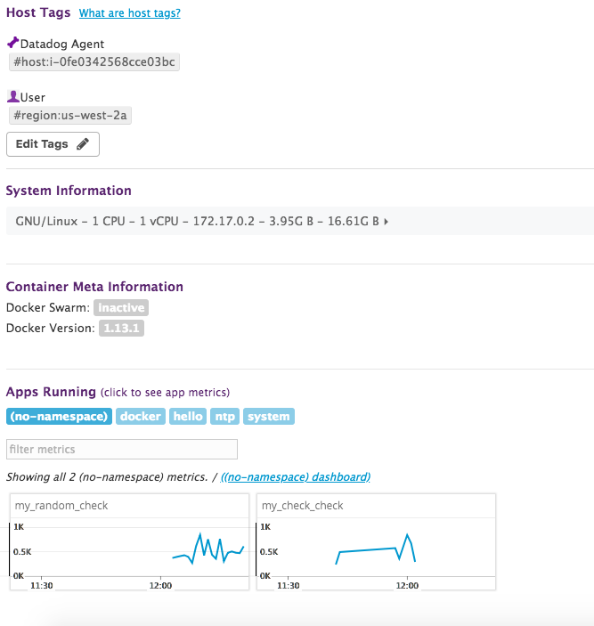

As a solutions engineer/sales engineer one of the parts of the job I enjoy is learning new things 
on the fly.  It keeps things interesting and constantly adds new skills to my repertoir.  While 
I ran into a few obstacles and am unsure of a few things (noted below) I enjoyed the exercise and 
the chance to learn more about Datadog.  While there were a few areas where I found the documentation confusing, 
I found it mostly clear and helpful.  I also found the UI mostly easy to navigate and straight 
forward to use.   

Prerequisites - Setup the environment
--  

1) Installed a containerized agent on an Ubunto EC2 host.  Later switched to the Ubuntu agent as the containerized agent
could not communicate with MySQL.

  

I generally use AWS if given a choice, however am familiar with Azure and GCP as well.  As recommended I used Vagrant to
 spin up an Ubuntu 16.04 host.  

  

As recommended, I started off with the containerized agent however switched to the Ubuntu version after running into some 
communication issues between the agent and MySQL.

Collecting Metrics
--  

1) Installed AWS integration  

  

This was well documented and very straight forward.

2) Add tags in the Agent config file and show us a screenshot of your host and its tags on the Host Map page in Datadog.  

  

I found the tagging support to be rich and flexible.  I like the support for 200 characters which gives way to a lot of 
flexibility and the many ways that tags can be sourced (e.g. cloud provider and Chef or Puppet tags).

3) Install a database on your machine (MongoDB, MySQL, or PostgreSQL) and then install the respective Datadog integration for that database.  

I installed MySQL and found the integration documentation clean and complete.  I did hit a bit of a roadblock when checking 
the integration.  The issue was a refused connection.  I ended up mentioning the issue to the team and as suggested it was 
that the container couldn't talk to the local DB.  This made sense and was fixed easily by switching to the Ubuntu agent.  I know this about containers 
however I think it didn't cross my mind since the containerized version was recommended for use.  Out of curiousity, 
what do you all recommend to customers in relation to containerized agent integration communication?

4) Create a custom Agent check that submits a metric named my_metric with a random value between 0 and 1000.  

  

This was straight forward and well documented.  I started out with the hello world example and then implemented my_check with 
conf.d/my_metric.yaml and checks.d/my_metric.py  After creating a random value between 0 and 1000 I passed it as the 
second argument of self.guage.

5) Change your check's collection interval so that it only submits the metric once every 45 seconds.

Added min_collection_interval: 45 to the instances section of conf.d/my_metric.yaml  I read the documentation on this.  
I don't think this is the right answer, however I did not see a better alternative.  I would appreciate feedback on this.

6) Bonus Question Can you change the collection interval without modifying the Python check file you created?  

This was well documented in the documentation.  To do this one can change the yaml file as noted in 5 above as that is the configuration that is passed to the check method.  

Visualizing Data
-   

Utilize the Datadog API to create a Timeboard that contains:  
  
1) Your custom metric scoped over your host.

Created by timeboard.py,  my_metric.py, and my_metric.yaml  This was well documented and straight forward.

2) Any metric from the Integration on your Database with the anomaly function applied.

I ran into a little trouble finding how to call MySQL metrics, however after a quick searchi I located the correct 
documentation.  In mysql_timeboard.py.  I started out reading up on the anomoly function.  I started to implement it in code and was 
initially unsuccessful.  I then implemented it in the UI and was able to get the query string I needed from there to use 
in the code.  

  

  

  

3) Your custom metric with the rollup function applied to sum up all the points for the past hour into one bucket

My experience here was similar to the anomaly function.  I looked at the API documentation and the rollup function I used 
did not work.  I then implemented it in the UI and was able to see how to implement the query string properly.  The 
code is in timeboard_rollup.py.	  

4) Set the Timeboard's timeframe to the past 5 minutes

I am not confident my answer here is correct.  The task was to set the timeboard's timeframe to the past five minutes.  
I did not see how to set the timeboard's timeframe to less than an hour.  I did see how to do this in the anomaly monitor and I implemented 
it there.  I am interested in feedback on this.    

  

5) Take a snapshot of this graph and use the @ notation to send it to yourself.  

This was very straight forward from the documentation and the UI.  

6) Bonus Question: What is the Anomaly graph displaying?  

The last five minutes is highlighed.  It changed from the default of 15.

Monitoring Data  
-  

1) Since you’ve already caught your test metric going above 800 once, you don’t want to have to continually watch this dashboard to be alerted when it goes above 800 again. So let’s make life easier by creating a monitor.

Create a new Metric Monitor that watches the average of your custom metric (my_metric) and will alert if it’s above the following values over the past 5 minutes:

Warning threshold of 500
Alerting threshold of 800
And also ensure that it will notify you if there is No Data for this query over the past 10m.

This section was straight forward.  It was clear how to set these in the UI.  

2) Send you an email whenever the monitor triggers.

This section was straight forward.  It was clear how to configure this in the UI.  

  
  
3) Create different messages based on whether the monitor is in an Alert, Warning, or No Data state.  

This section was clear from the documentation.  

  

4) Include the metric value that caused the monitor to trigger and host ip when the Monitor triggers an Alert state.  

This was also clear from the documentation.  I did not see the metric value, but the UI did a good
job of providing a drop down from where I chose what I needed.  

5) When this monitor sends you an email notification, take a screenshot of the email that it sends you.  

This was straight forward to configure.  

6) Bonus Question: Since this monitor is going to alert pretty often, you don’t want to be alerted when you are out of the office. Set up two scheduled downtimes for this monitor:

One that silences it from 7pm to 9am daily on M-F,
And one that silences it all day on Sat-Sun.
Make sure that your email is notified when you schedule the downtime and take a screenshot of that notification.  

This was clear from the documentation.  I did get thrown for a second because the configuration 
is in PDT and the email is in UTC, but once I noticed that I was good.  

  
  

  
  

7) Provide a link and a screenshot of a Dashboard with both APM and Infrastructure Metrics.  

I ran into a little issue here after installing the library.  I ran the samlple flask app using 
and ddtrace-run python <app>.py and it executed but I never saw the trace in the UI.  I am not 
sure what happened there, but can look into that at another time.  I ended up using the 
 sample_app.py that is in the GitHub examples and this worked like a charm.  I also had trouble 
 figuring out how to get a dashboard with both APM and infrastructure metrics.  I then dug into 
 the documentation and learned how to do it.  

8) Bonus Question: What is the difference between a Service and a Resource?  

This was clearly documented so I used the documentation.  It makes sense to me.  

From the Datadog documentation:  

"A service is a set of processes that do the same job."  So, it could be a database or webapp service.  

"A Resource is a particular action for a service. For a web application: some examples might be a canonical URL, such as /user/home or a handler function like web.user.home (often referred to as “routes” in MVC frameworks).
For a SQL database: a resource is the query itself, such as SELECT * FROM users WHERE id = ?."

Final Question  
--    

Is there anything creative you would use Datadog for?  

An iteresting thought is to use it to monitor traffic flow on toll roads to increase / decrease price based on traffic loads.  

Final Comment
-

I enjoyed getting an introduction to Datadog.  I found the initial ramp-up to be quick and straight forward.  As I noted, 
I was able to get over the hurdles I accomplished by mentioning an issue I had and using the documentation and UI.  The Product 
is interesting in many aspects, however I love that it is DevOps focused and covers hybrid environments including infrastructure, 
third party applications as well as custom applications.  This was a great introduction and I look forward to learning more.  