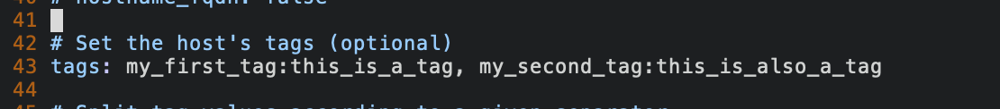
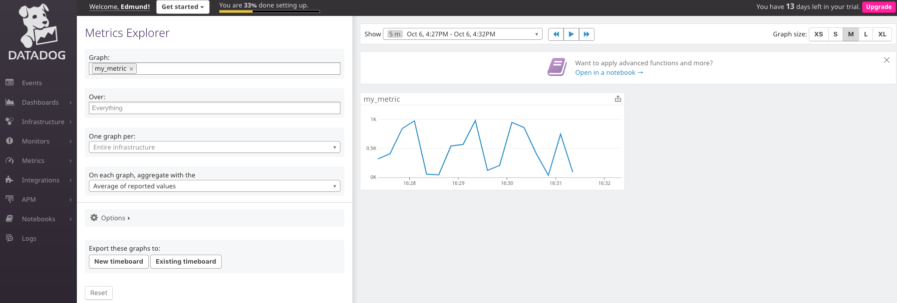

# Answers.md

Alright Reader buckle in because you're about to bear witness to my magnum opus AND learn how to use DataDog. If I've done my job right then by the end of this you'll find yourself a *big dog* at DataDog. 


## 1. Prerequisites 

###1.2 Setting up VirtualBox and Vagrant

Before we delve into using DataDog we're going to need to set up a fresh virtual machine environment. This guide will be using Vagrant with Ubuntu `v.16.04`. If you've got a different virtual machine installed congratulations you've tripped at the first hurdle. Anyway, battling on:


1. Download VirtualBox for [OS X hosts](https://www.virtualbox.org/wiki/Downloads)
2. Install the .dmg
3. Follower the installer
4. Download Vagrant for [macOS](https://www.vagrantup.com/downloads.html)
5. Follower the installer
6. Open up your terminal
7. run `vagrant -v` 

8. We can now create a new Vagrant environment for Ubuntu 16.04. Run the follower: `vagrant init ubuntu/xenial64`
9. Let's try starting our vagrant environment: `vagrant up`

Congratulations! You have a working virtual machine. Try ssh'ing into it with `vagrant ssh`. Alternative you can destroy it with `vagrant destroy`. The remainder of this guide will take place within the Vagrant environment so go ahead and make sure you've run `vagrant ssh`!

###1.3 DataDog sign up

1. Head over to [DataDog to sign up](https://app.datadoghq.com/signup)
2. Enter *Datadog Recruiting Candidate* in the *Company* field
3. Once you arrive at the *Agent Setup* page, click *Ubuntu*
4. Follow the instructions on the page
5. The DataDog Agent report will take around a minute or two to complete so while that's toiling away maybe go make yourself a cup of te- oh cool okay it's done.
6. Click Finish
7. We can make our life easier down the line by sorting our group permissions now. Let's create a new group:`sudo groupadd ddGroup`
8. Now let's add our vagrant user and dd-agent to it: run `sudo usermod -a -G ddGroup ubuntu` and `sudo usermod -a -G ddGroup dd-agent`
9. Finally let's see the permissions for our datadog-agent directory. Run `sudo chgrp -R ddGroup /etc/datadog-agent/` to change the group ownership to our new group, and then run `sudo chmod -R 770 /etc/datadog-agent/` to only allow users within our group to read,write, and execute it


##2. Collecting Metrics 
###2.1 Tags

A *tag* enables for finer granularity of your metrics. For instance you could group the CPUs of all your hosts across different regions, and then filter by that region.

1. Let's add some tags to our DataDog config file. Our DataDog confile file can be found at `/etc/datadog.yaml`
2. Open that file up with your editor of choice (vim, VS Code, Sublime, nano, Microsoft Word, etc)
3. Navigate to line 43 and add some tags<br>Caveat: For the `datadog.yaml` config file only an inline dictionary with list of values is valid.
4. Restart your agent to apply the changes: `sudo service datadog-agent restart`
5. If the agent doesn't start up automatically then run `datadog-agent run`
5. Navigate to [the datadog portal](https://app.datadoghq.com/)
6. Click on the third dropdown on the navbar, then click host map
7. Your tags and host should now be visible, however if they're not then give the agent a few minutes to deliver the new payload to Datadog:<br>
 
###2.2 Installing our Database (Postgres)

1. Let's refresh our package list: `sudo apt-get update`
2. Now for the main event: `sudo apt-get install postgresql postgresql-contrib`
3. Let's try switching over to our postgres account: `sudo -i -u postgres`
4. If you run `psql -V` and you get your Postgres version number out -- that's great it worked! However you may get this nasty error (and odds are you will if you're following along via a vagrant ssh) 
5. To fix this hit Cmd+D to return to the `Ubuntu` user in your shell
6. Using your editor of choice edit `~/.bashrc`
7. Add the lines `export LC_CTYPE=en_US.UTF-8` and `export LC_ALL=en_US.UTF-8`
8. save and close
9. Execute your `.bashrc` by running `source ~/.bashrc` (otherwise it won't 'refresh' until your next shell instance)


###2.3 Installing PostgreSQL intergration on DataDog
1. Head back over to the DataDog portal
2. Click on the jigsaw on the navbar
3. Enter *Postgres* in the searchbar
4. Click on the *Postgres* tile and go to the *Configuration* tab
5. Scroll to the bottom and click *Install Integration*
6. Enter your postgres database: `psql postgres`
7. Copy the sql command (including the password) into your postgres server
8. exit your postgres server and return to the terminal. Enter: `psql -h localhost -U datadog postgres -c "select * from pg_stat_database LIMIT(1);" && \
echo -e "\e[0;32mPostgres connection - OK\e[0m" || \
echo -e "\e[0;31mCannot connect to Postgres\e[0m"`
9. If prompted for a password then enter the one from the previous sql command
10. Create a new file in `/etc/datadog-agent/conf.d/postgres.d` called `postgres.yaml`.
11. Paste in the config text in point 2 of the Postgres integration section.
12. Restart your datadog agent.
13. Verify that the integration has been completed by running `datadog-agent status` and scrolling to the postgres section. Alternatively just run `datadog-agent status | grep postgres`. It should say `instance ID: postgres:<some id> [OK]`.

###2.4 Creating a custom Agent check

Creating an *Agent* allows for the collection of metrics from custom application or unique systems. 

1. Confirm you have python3 installed: `python3 --version`. It should be installed by default but otherwise just install it with `sudo apt install python3`
2. We need 2 files for DataDog Agent checks. These are a config (.yaml) file and our python script (.py). Let's create both of them now for our `my_metric` agent check.
3. `touch /etc/datadog-agent/conf.d/my_metric.yaml`
4. `touch /etc/datadog-agent/checks.d/my_metric.py`

Our YAML file needs to contain two sections: an `init_config` section and an `instances` section. The `init_config` section allows for global configuration options which can be access within `my_metric.py`. The `instances` section lists the instances which the check will run against.

###2.4.1 my_metric.yaml
1. Let's start off our first check by passing in some very simple information to our yaml file. <br>
2. 
```yaml
	init_config:

	instances:
		[{}]
```


###2.4.2 my_metric.py
1. We'll create a pretty barebones check file to start off. All our check will do is send a random value between 0 and 1000 every 45 seconds.
2. Copy the follow values into your `my_metric.py`.
3. 
```python
from checks import AgentCheck
import random
	class my_metric(AgentCheck);
		def check(self, instance):
			self.gauge(‘my_metric’, str(random.randint(1,1001)))
```

 Our first line will import `AgentCheck` from the `checks` module, our second will import the `random` function which will use later on. We then simply define a class (`my_metric`) which our AgentCheck module is passed into. Our `check` function is what is called by DataDog, and our `self.gauge(...)` is used  to send a gauge metric with name `my_metric` and a random value between 1 and 1000 (inclusive) :).
4. Let's test our new check! Restart the agent and run `sudo -u dd-agent -- datadog-agent check my_metric` and you should see output similar to below: <br> 
5. Start your agent back up if it's off and head over to your Datadog portal. On the sidebar go to *Metrics* > *Explorer* > and type *my_metric* into the *graph* searchbar. You should now see our metric graph moving at 15 second intervals between 1 and 1000. <br>
6. Look let's just cut straight to it here. You're a beginniner. 15 seconds might be a little bit *too* fast for you and hey that's fine. Let's slow it down to a lazy 45 second interval. 
7. Edit the `conf.d/my_metric.yaml` file and add `min_collection_interval: 45` to it

```yaml
	init_config:

	instances:
		- min_collection_interval: 45
```
Restart your client and voilà!<br> 

##3. Visualising Data

###3.1 Creating our Python client

Before we begin delving into the wonderful world of RESTful services we're going to need to create a client capable of making API callouts. Let's leverage the `datadog` python library to help us out with this.

1. Create a new directory for our program: `mkdir -p ~/dataDog/client`, `cd ~/dataDog/client`
2. Install Python's package mananger (pip): `sudo apt install python-pip`
3. Now to install the Datadog python library: `pip install datadog`
4. Let's make our app's entry point: `touch app.py`

Great! We're now ready to create our first Timeboard

###3.2 Creating a Timeboard

####3.2.1 Creating a graph of *my_metric*
Paste this into your `app.py` file

```python
from datadog import initialize, api # import our modules from data dog

# set our api and app keys so we can authorise with datadog
# you can get these values from the Integrations > API section of the datadog dashboard
options = {
    'api_key': '<your api key>',
    'app_key': '<your app key>'
}
# pass in our options dictionary object
initialize(**options)

# let's pass through the options for our timeboard
title = 'My First Timeboard'
description = 'A Timeboard is a dashboard of graphs. These graphs enable you to visualise your data over some scope of time.'
graphs = [{
    'title': 'my_metric graph',
    'definition': {
        'requests': [
            {'q': 'avg:my_metric{host:ubuntu-xenial}'} # our custom metric's average on our host
        ],
        'viz': 'timeseries'
    },
}]
#let's call Timeboard.create() with those options to create it on Datadog
resp = api.Timeboard.create(title=title,
                     description=description,
                     graphs=graphs)

print resp # let's print our response
```
If you then run the file with our python interpreter using `python app.js` you should see the following output:

```
{'dash': {'read_only': False, 'description': 'A Timeboard is a dashboard of graphs. These graphs enable you to visualise your data over some scope of time.', 'created': '2018-10-07T02:07:58.055591+00:00', 'title': 'My First Timeboard', 'modified': '2018-10-07T02:07:58.083989+00:00', 'created_by': {'handle': 'edmundcong1@gmail.com', 'name': 'Edmund Cong', 'access_role': 'adm', 'verified': True, 'disabled': False, 'is_admin': True, 'role': None, 'email': 'edmundcong1@gmail.com', 'icon': 'https://secure.gravatar.com/avatar/057515f2f8b8a623ea74e5128edf5451?s=48&d=retro'}, 'graphs': [{'definition': {'viz': 'timeseries', 'requests': [{'q': 'avg:my_metric{host:ubuntu-xenial}'}]}, 'title': 'my_metric graph'}], 'id': 939124}, 'url': '/dash/939124/my-first-timeboard', 'resource': '/api/v1/dash/939124'}
```
This response has some useful metadata in it. For instance it responds with when it was created, who created it, whether or not that person was an admin, the endpoint you hit, and more.

If you navigate back to your Datadog portal, and then go *Dashboards* > *Dashboard List* you should see a Timeboard called *My First Timeboard*. Click on that to see your new graph. You can see our average if you click on the enlarge icon, alternatively you can click on the pencil then on *Query Value*.  

####3.2.2 Expand this to include database integration metrics
1. Wouldn't it be nice to have a graph showing the number of rows inserted by query in our Postgres database (that we totally have *not* forgotten about)? Why don't we do that?
2. Before we get started creating a Timeboard for that we're going to need to set up a python file which periodically inserts rows into a database. We'll also need to make it so there's a bit of variance in the amount of rows it'll insert.
3. Let's create a new file called `insertRows.py`
4. We'll need to install `psycopg2`. Psycogp2 allows us to interact with PostgreSQL from Python. Go ahead and run `pip install psycopg2`
5. Next we'll need to create a new database to muck around with. Let's log into our `postgres` user to do this. Run `sudo -i -u postgres`
6. Next run `psql`, then `CREATE DATABASE timeboard;` 
7. We now need to switch to that database: `\c timeboard`
8. Next we'll create a very simple table in the database that we'll insert rows into: `CREATE TABLE numbers(NUMBER INT NOT NULL);`
9. Let's try it out! `INSERT INTO numbers (number) values (10);`
10. Running `SELECT * FROM NUMBERS;` should return a single row with `id=1` and `number=10` 
11. Have you noticed that we've been dancing around using the `postgres` user's password? Why are we doing that? Let's reassign it from the mysterious default password to something we know. This will come in handy later when we need to connect to it via our python program. While we're still inside our `psql` terminal run `ALTER USER postgres PASSWORD '<some password>;`
12. ctrl+d to exit the postgres user's terminal
13. Create a new file called `database.ini` and fill it the following information:


```ini
[postgresql]
host=localhost
database=timeboard
user=postgres
password=<postgres user's password>
```
Next paste this code into your `insertRows.py` file:

```python
#!/usr/bin/python
import schedule
import time
import psycopg2
import random
from configparser import ConfigParser  # module to read our config file


def config(filename='database.ini', section='postgresql'):
    parser = ConfigParser()  # create our parser
    parser.read(filename)  # parse database.ini
    db = {}
    if parser.has_section(section):
        params = parser.items(section)
        for param in params:
            db[param[0]] = param[1]  # populate our db config object
    else:
        raise Exception(
            'section {0} not found in {1}'.format(section, filename))
    return db
 count = 1

 def connect():
     conn = None
     try:
         # read in our config obj
         params = config()
         conn = psycopg2.connect(**params) # connect to our db
         # create our db cursor
         cur = conn.cursor()
         rnd = random.randint(1,1001) # number to insert as our value
         rows = random.randint(1,11) # amount of rows to insert
         global count # so we can use count as a global variable
         if (count == 50):
             rows = 200 # at our 50th call to this function let's add A LOT of rows
         # insert a random nmber into our numbers table
        for i in range(rows):
            cur.execute("INSERT INTO numbers VALUES (%s)", (rnd,))
         count += 1 # increment our counter
         conn.commit() # commit our transaction
     except (Exception, psycopg2.DatabaseError) as error:
         conn.rollback() # rollback since we've had an error
         print(error)
     finally:
         if conn is not None:
             conn.close() # close our connection
             print('Database connection closed.')

schedule.every(30).seconds.do(connect)

 # only run if we're not importing this into a different module
 if __name__ == '__main__':
     while True:
         schedule.run_pending()
         time.sleep(1)
```

After running `pip install schedule` and `pip install configparser` go ahead and run the script with `python insertRows.py`. Now we'll need to return to our `app.py` to create a new graph for our *number of rows inserted* metric.

```python
from datadog import initialize, api  # import our modules from data dog

# set our api and app keys so we can authorise with datadog
options = {
        'api_key': '<your api key>',
        'app_key': '<your app key>'
}
# pass in our options dictionary object
initialize(**options)

# let's create our timeboard

title = 'My First Timeboard with an anomaly monitor, and rollup sum'
description = 'A Timeboard is a dashboard of graphs. These graphs enable you to visualise your data over some scope of time.'
graphs = [{
    'title': 'my_metric graph',
    'definition': {
        'requests': [
            # our custom metric's average on our host
            {'q': 'avg:my_metric{host:ubuntu-xenial}'}
        ],
         'viz': 'timeseries'
    },
},
{
    'title': 'rows inserted',
    'definition': {
        'requests': [
            # get the anomalies using the basic detection algorithm with a deviation of 2
            {'q': 'anomalies(top(avg:postgresql.rows_inserted{host:ubuntu-xenial}, 10, \'mean\', \'desc\'), \'basic\', 2)'}
        ],
        'viz': 'timeseries'
    }
},
}]

resp = api.Timeboard.create(title=title,
                            description = description,
                            graphs = graphs)

print resp  # let's print our response

```

####3.2.3 Expand our Timeboard to include a rollup sum of my_metric over the past hour

1. This will be very similar to our first graph, the only different being that we'll append a `.rollup(sum,36000)` to the end of our query to get the sum of all data points over the past hour

```python
from datadog import initialize, api  # import our modules from data dog

# set our api and app keys so we can authorise with datadog
options = {
        'api_key': '<your api key>',
        'app_key': '<your app key>'
}
# pass in our options dictionary object
initialize(**options)

# let's create our timeboard

title = 'My First Timeboard with an anomaly monitor, and rollup sum'
description = 'A Timeboard is a dashboard of graphs. These graphs enable you to visualise your data over some scope of time.'
graphs = [{
    'title': 'my_metric graph',
    'definition': {
        'requests': [
            # our custom metric's average on our host
            {'q': 'avg:my_metric{host:ubuntu-xenial}'}
        ],
         'viz': 'timeseries'
    },
},
{
    'title': 'rows inserted',
    'definition': {
        'requests': [
            # get the anomalies using the basic detection algorithm with a deviation of 2
            {'q': 'anomalies(top(avg:postgresql.rows_inserted{host:ubuntu-xenial}, 10, \'mean\', \'desc\'), \'basic\', 2)'}
        ],
        'viz': 'timeseries'
    }
},
{
    'title': 'sum of my_metric over the past hour',
    'definition': {
        'requests': [
            # our average, then sum all over the past hour (3600 seconds)
            {'q': 'avg:my_metric{host:ubuntu-xenial}.rollup(sum,3600)'}
        ],
        'viz': 'timeseries'
    }
}]

resp = api.Timeboard.create(title=title,
                            description = description,
                            graphs = graphs)

print resp  # let's print our response
```
###3.3 What is the Anomaly graph displaying?


<br>The above anomaly graph highlights in red the points where our average number of row insertions per second are above or below a deviation of 2, which is calculated using our [basic](https://docs.datadoghq.com/monitors/monitor_types/anomaly/#anomaly-detection-algorithms) algorithm. For instance at 18:16 we can clearly see a datapoint which is well above the predicted average, while at around 14:14:20 we can see a datapoint which is far below the predicted average.

##4. Monitoring Data

###4.1 Creating a new Metric Monitor

Let's create a *Metric Monitor* that will watch the average of *my_metric* and alert us if there's anything odd going on with it. We'll start off by having our metric monitor sending us a warning at a threshold of 500, alerting us at 800, and notifying us if there's been *No Data for this query* over the past 10 minutes.

1. `touch monitor.py`
2. Paste the following into your `monitor.py` file:

```python
from datadog import initialize, api # import our modules from data dog

# set our api and app keys so we can authorise with datadog
options = {
    'api_key': '<your api key>',
    'app_key': '<your app key>'
}
# pass in our options dictionary object
initialize(**options)

monitor_options = {
    "name": "STATUS EMAIL: my_metric",
        "type": "metric alert",
        "query": "avg(last_5m):avg:my_metric{host:ubuntu-xenial} >= 800",
        "message": "{{#is_alert}}\nALERT: my_metric has had a sustained value of 800 or above over the past 5 minutes!\n{{/is_alert}} \n\n{{#is_warning}}\nWARNING: my_metric has had a sustained value of 500 or above over the past 5 minutes.\n{{/is_warning}} \n\n{{#is_no_data}}\nmy_metric has had no data for the 10 minutes.\n{{/is_no_data}} @edmundcong1@gmail.com",
        "tags": [],
        "options": {
                    "notify_audit": False,
                    "locked": False,
                    "timeout_h": 0,
                    "new_host_delay": 300,
                    "require_full_window": True,
                    "notify_no_data": True,
                    "renotify_interval": "0",
                    "escalation_message": "",
                    "no_data_timeframe": 10,
                    "include_tags": False,
                    "thresholds": {
                                    "critical": 800,
                                    "warning": 500
                                }
                }
}

resp = api.Monitor.create(**monitor_options)

print resp

```
Make sure your DataDog agent is still running and fire off the script: `python monitor.py`. Since this might take a few minutes why don't you take this as a chance to go make yourself that cup of tea I suggested a few sections ag-

oh nevermind.

###4.2 Scheduling downtimes for the monitor

Let's now modify our monitor to not alert us when we're outside of the office. We'll need to schedule two downtimes for this monitor:

* One that silences it from 7pm-9am Monday to Friday,
* On that silences it all day on Satuday and Sunday

Like our previous alerts, these will follow the same format with the only difference being the options object, endpoint method we're using and that the start and end date for each scheduled downtime will be the epoch time of their next occurence date:

### Weekday
```python
from datadog import initialize, api # import our modules from data dog
import time

# set our api and app keys so we can authorise with datadog
options = {
    'api_key': 'de80ad2a1bffe3273e4765ac1b8a85d7',
    'app_key': '490954065d91b99b46fc59efc4a748141fae365b'
}
# pass in our options dictionary object
initialize(**options)

recurrence = {
    'type': 'weeks',
    'period': 1,
    'week_days': ['Mon', 'Tue', 'Wed', 'Thu', 'Fri'],
}

start = 1538985600 # monday 7th of october 19:00:00
finish = 1539036000 # tuesday 8th of october 09:00:00
message = 'There will be scheduled downtime of alerts from 7pm to 9am each weekday. @edmundcong1@gmail.com'

resp = api.Downtime.create(
    scope='host:ubuntu-xenial',
    start=start,
    message=message,
    end=finish,
    timezone='Australia/NSW',
    monitor_id=6611157,
    recurrence=recurrence
)
```


Note: the email comments are in UTC not GMT+11. The downtimes themselves are configured for *Australia/NSW*

### Weekend
```python
from datadog import initialize, api # import our modules from data dog
import time

# set our api and app keys so we can authorise with datadog
options = {
    'api_key': 'de80ad2a1bffe3273e4765ac1b8a85d7',
    'app_key': '490954065d91b99b46fc59efc4a748141fae365b'
}
# pass in our options dictionary object
initialize(**options)

recurrence = {
    'type': 'weeks',
    'period': 1,
    'week_days': ['Sat', 'Sun'],
}

start = 1539349199 # friday the 12th of october at 11:59:59pm gmt+11
finish = 1539521999 # sunday the 14th of october at 11:59:59pm gmt+11
message = 'There will be scheduled downtime of alerts from 11:59:59pm friday to 11:59:59pm sunday. @edmundcong1@gmail.com'

resp = api.Downtime.create(
    scope='host:ubuntu-xenial',
    start=start,
    end=finish,
    message=message,
    monitor_id=6611157,
    timezone='Australia/NSW',
    recurrence=recurrence
)

```


Note: the email comments are in UTC not GMT+11. The downtimes themselves are configured for *Australia/NSW*

#5. Collecting APM Data

This was the first time where `datadog-agent` being run in my vagrant environment gave me some issues. My agent was giving me a TLS handshaking issue whenever my Python script's trace information was trying to be sent out. <br>Datadog agent's output: `018-10-07 13:29:36 UTC | ERROR | (log.go:179 in Printf) | http: TLS handshake error from 127.0.0.1:59096: tls: first record does not look like a TLS handshake`<br>
I tried alternating between the middleware and ddtrace-run, hardcoding values into the `ddtrace.writer` class, changing values which looked promising in `datadog.yaml`, running `ddtrace_run` with the `DATADOG_TRACE_DEBUG=true`, and even tried from the ground up on a Windows machine. I thought a Docker approach might be fruitful because [this](https://docs.datadoghq.com/tracing/faq/why-am-i-getting-errno-111-connection-refused-errors-in-my-application-logs/) FAQ page talked about how you may run into issues *using* a Docker container, so naturally I decided to *use* Docker (a bit counter-intuitive there, Ed). With that being said we'll need to exit the land of virtualisation and take a journey into containerisation so exit your vagrant machine cause we're going to start using Docker.

1. Let's create a new folder called ddTracers: `mkdir ~/ddTracers` and then cd into it: `cd ddTracers`
2. If you haven't got [Python](https://www.python.org/downloads/mac-osx/) and [pip](https://stackoverflow.com/questions/17271319/how-do-i-install-pip-on-macos-or-os-x) installed go ahead and install them on your host os. 
3. Let's install `virtualenv`. It does a lot of neat things like create a create virtual environment for avoiding dependencies and versioning issues and allows us to modify Python modules without access to the global istallation -- however we'll be using it to easily install Flask: `pip install virtualenv`. We'll then create a virtualenv for our current directory: `virtualenv .` We then need to turn on virtualenv: `source bin/activate`. Now we can install Flask with no issues! `pip install flask`. See below for a before and after of venv:

4. We'll also need to install the `ddtrace` library to trace our requests: `pip install ddtrace`
3. Now let's copy in the sample Flask API a file `app.py`:

```python
from flask import Flask
import logging
import sys
#Have flask use stdout as the logger
main_logger = logging.getLogger()
main_logger.setLevel(logging.DEBUG)
c = logging.StreamHandler(sys.stdout)
formatter = logging.Formatter('%(asctime)s - %(name)s - %(levelname)s - %(message)s')
c.setFormatter(formatter)
main_logger.addHandler(c)
app = Flask(__name__)

@app.route('/')
def api_entry():
    return 'Entrypoint to the Application'

@app.route('/api/apm')
def apm_endpoint():
    return 'Getting APM Started'

@app.route('/api/trace')
def trace_endpoint():
    return 'Posting Traces'

if __name__ == '__main__':
    app.run(host='127.0.0.1', port='5050')
```
5. The last thing we need to install is [Docker]()
6. Once you've got Docker up and running we need to create a container for our datadog-agent since we're no longer using our vagrant environment to host it. Run this command: `docker run -d --name dd-agent -v /var/run/docker.sock:/var/run/docker.sock:ro -v /proc/:/host/proc/:ro -v /sys/fs/cgroup/:/host/sys/fs/cgroup:ro -e DD_API_KEY=<api-key> -e DD_APM_ENABLED=true datadog/agent:latest`<br> What this does is create a new docker container called dd-agent, mounts a some files and a socket to it, passes in your api key and a flag to enable us to use our agent for APM, and finally tells docker to pull the latest datadog agent image.
7. Now that our agent is running we need to run our Flask API: `ddtrace-run python app.py`
8. Finally if you post in any of the following our APM dashboard will pick up on the requests and visualise our traces:
  <br> `curl -X GET http://0.0.0.0:5050/ `<br>`curl -X GET http://0.0.0.0:5050/api/trace `<br> `curl -X GET http://0.0.0.0:5050/api/apm`
9. Now if we go to the APM section on our Datadog dashboard we should see some cool metrics and graphs:

[Here's a link to my APM and Infrastrcture Screenboard as an example](https://p.datadoghq.com/sb/a34d3d959-3579b887024535849e662ba18f7f80ef)


###Bonus Question: *What is the difference between a Service and a Resource?*

A service is a process which is a discrete part of your system, while a resource is a particular query to that service. You can think of a resource as a child to a service.

For instance if we had a web app which ran Express on the backend and Postgres as its database we could categorise it as the following:

Services:
- Our backend Express application
- Our Database layer<br>
Resource:
- An http request to Express
- A database query in Postgres

#Final Question

I used to play World of Warcraft fairly religiously, especially whenever a large content patch or expansion came out. I'd rush home from school or uni to enjoy the fruits of Blizzard's labour when suddenly: *your server is currently full: your position in queue is 1148th*. All that wasted energy spent rushing home and clearing my schedule when I could have invested that energy in creating a Datadog monitor.

Similar to the Pokomon GO monitoring article I could create a client which hits [Blizzard OAuth api for my region](https://dev.battle.net/docs/read/oauth) to get a gage on the latency of my requests. I could then apply an anomaly function to my metric to visualise if there's an increased amount of traffic. If I didn't want to manually check the Datadog dashboard then I could set up a scheduler email to alert me when it's looking like there's a large queue of people waiting to login.

####I'd just like to say thanks for giving me the opportunity to apply and considering me. Over the past few days I've enjoyed being able to play around on the platform, and it's pretty gratifying seeing your programs visualised and metrics listed. I hope you've enjoyed reading this.
<br>
####Edmund

##Notes:
* (If ssh'd into your vagrant machine) Making vim + python tolerable: https://realpython.com/vim-and-python-a-match-made-in-heaven
* Datadog logs for python: https://app.datadoghq.com/logs/onboarding/server
* Datadog graphing with JSON: https://docs.datadoghq.com/graphing/graphing_json/
