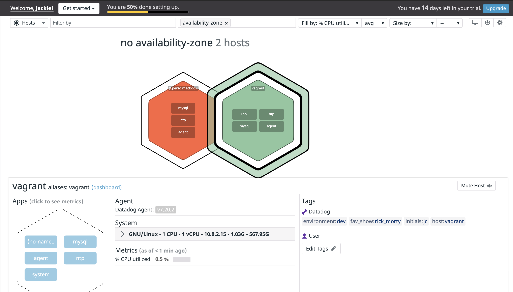
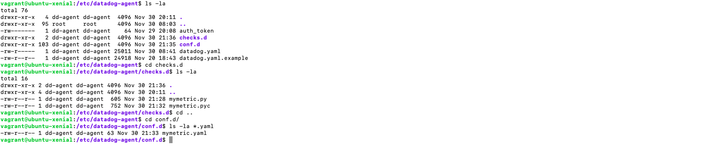
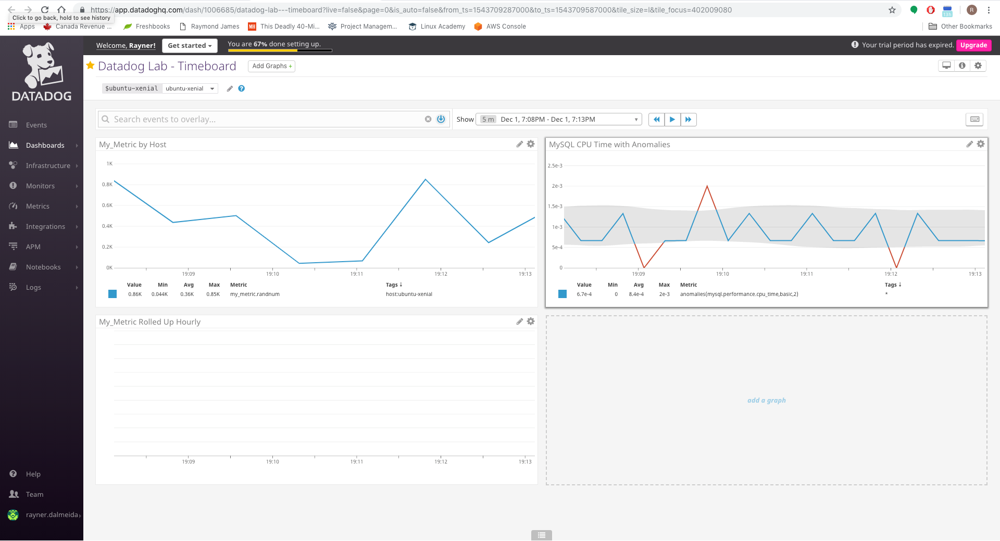
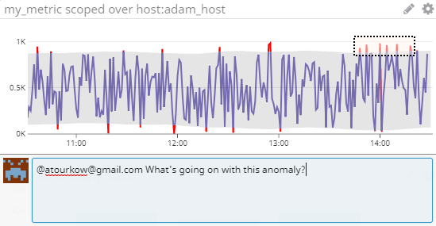
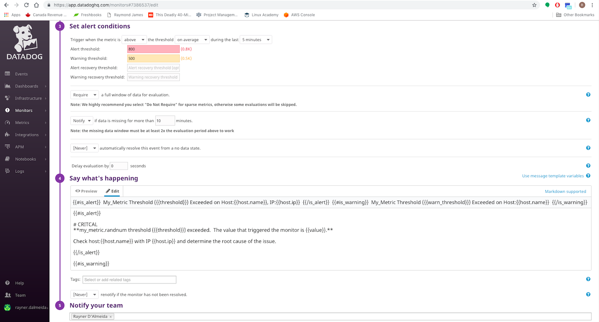
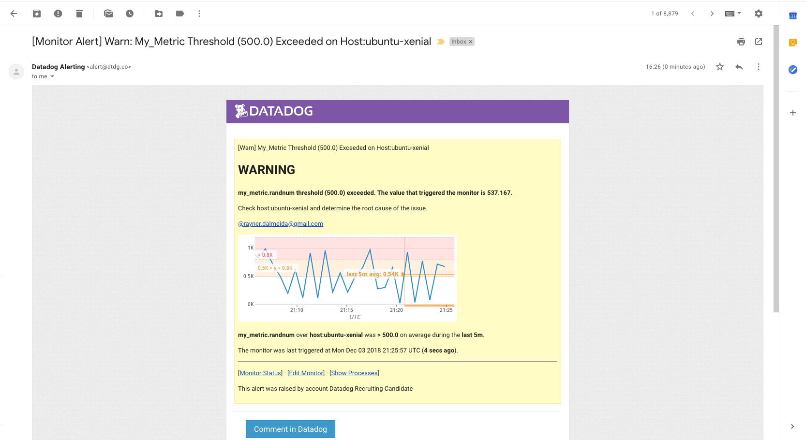
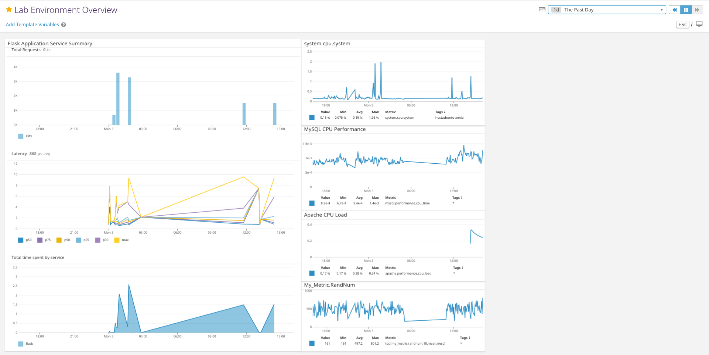

## Datadog - Solutions Engineer Exercise

## Answers

## Prerequisites - Setup the environment

* Environment - 16.04.5 LTS (Xenial Xerus).  Environment was setup and accessed through Vagrant ([Vagrantfile](config/Vagrantfile)).
* Datadog Account - Linked to Google account, rayner.dalmeida@gmail.com.
* Installed Ubuntu Datadog agent using the Datadog supplied instructions: https://app.datadoghq.com/account/settings#agent/ubuntu

  _Host Agent Installation:_
  

  

## Collecting Metrics:

* Tags were added by updating the tags parameter within the Datadog agent config file, /etc/datadog-agent/datadog.yaml.

  [Datadog Agent Configuration File - datadog.yaml](config/datadog.yaml)

  _Agent Config File with Tags:_
  

  _Host Map Displaying Host Tags_:
  <br/>
  

* For this exercise I installed a MySQL database onto my VM and completed the Datadog MySQL integration instructions, https://docs.datadoghq.com/integrations/mysql/.

  _MySQL Database Installation:_
  

  

  _MySQL.yaml Configuration File (/etc/datadog-agent/conf.d/mysql.d/conf.yaml):_

  [MySQL Configuration File - conf.yaml](config/conf.yaml)

  

  _MySQL Datadog Commands:_
  

* Created a custom agent check that submits a metric named my_metric.randnum with a random value between 0 and 1000.  I updated the metric name to utilize a proper namespace and follow the naming convention established by the out-of-box metrics.  Prior to the update the host map rendered the metric with a "no namespace" label.

  _Custom Agent File List:_

  [Agent Configuration File - mymetric.yaml](config/mymetric.yaml)

  [Agent Python Script - mymetric.py](scripts/mymetric.py)

    ```python
    # the following try/except block will make the custom check compatible with any Agent version
    import random  

    try:
        # first, try to import the base class from old versions of the Agent...
        from checks import AgentCheck
    except ImportError:
        # ...if the above failed, the check is running in Agent version 6 or later
        from datadog_checks.checks import AgentCheck

    # content of the special variable __version__ will be shown in the Agent status page
    __version__ = "1.0.0"

    class RandomNumCheck(AgentCheck):
        def check(self, instance):
            self.gauge('my_metric.randnum', random.randint(0,1000))
    ```

  

  _Custom Agent Check Validation:_
  <br/>
  

  Host Map Displaying Custom Agent Check:
  

* Updated the collection interval for the custom agent check to 45 seconds by updating the min_collection_interval parameter in mymetric.yaml.


* **Bonus Question:** Can you change the collection interval without modifying the Python check file you created?

  **Answer:** The collection interval can be modified through the min_collection_interval parameter stored in the custom agent configuration file (/etc/datadog-agent/conf.d/mymetric.yaml).

## Visualizing Data:

The timeboard presented below was generated through a Python script calling the Datadog Timeboard APIs.  The timeboard contains:
* Custom metric (my_metric) scoped over my host, ubuntu-xenial.
* MySQL CPU time performance metric (mysql.performance.cpu_time) with the anomaly function applied.
* Custom metric (my_metric) with the rollup function applied to sum up all the points for the past hour into one bucket.

  [API Generated Timeboard](https://app.datadoghq.com/dash/1006685/datadog-lab---timeboard)

  [Timeboard Python Script - timeboard.py](scripts/timeboard.py)
  ```Python
  # Datadog Timeboard Script

  # imports
  from datadog import initialize, api
  from json import dumps

  # API initialization parameters
  options = {'api_key': '956b376eda4be274a4d8a54fbfb84a42',
             'app_key': 'ab521a571251baa8202cef85a2d1a95bb2e26ffd'}

  initialize(**options)

  # Timeboard API parameters
  title = "Datadog Lab - Timeboard"
  description = "Timeboard generated through Datadog APIs"
  graphs = [{"definition": {"events": [],
                            "requests": [{
                              "q": "avg:my_metric.randnum{host:ubuntu-xenial}",
                              "type": "line"}],
                              "viz": "timeseries"},
                            "title": "My_Metric by Host"},
            {"definition": {"events": [],
                            "requests": [{
                              "q": "anomalies(avg:mysql.performance.cpu_time{*}, 'basic', 2)",
                              "type": "line"}],
                              "viz": "timeseries"},
                            "title": "MySQL CPU Time with Anomalies"},
            {"definition": {"events": [],
                            "requests": [{
                              "q": "avg:my_metric.randnum{*}.rollup(sum, 3600)",
                              "type": "line"}],
                              "viz": "timeseries"},
                            "title": "My_Metric Rolled Up Hourly"}
          ]

  template_variables = [{
      "name": "ubuntu-xenial",
      "prefix": "host",
      "default": "host:ubuntu-xenial"
  }]
  read_only = True

  apiResponse = api.Timeboard.create(
                       title=title,
                       description=description,
                       graphs=graphs,
                       template_variables=template_variables,
                       read_only=read_only)
  ```

  _API Generated Timeboard:_
  

* Accessed the dashboard through the dashboard list and set the timeboard's timeframe to the past 5 minutes.

  _Timeboard for the Past 5 Minutes:_
  

* Took a snapshot and used the @ notation to send it to myself.

  _Timeboard Snapshot and Notificaiton:_
  

  


* **Bonus Question:** What is the Anomaly graph displaying?

  **Answer:**  The anomaly graph identifies when a metric does not adhere to the normal trending values.  The anomaly function utilizes historic data to determine if a value is considered outside the normal trends.  The grey area in the graph represents the range of acceptable values based on historic data.  If a value goes outside the grey area the value will be considered abnormal and classified as an anomaly and identified with a red line.

## Monitoring Data

Configured a new metric monitor tracking the average of my_metric.randnum.  The monitor generates alerts if it exceeds the values below over the past 5 minutes:

* Warning threshold of 500.
* Alerting threshold of 800.
* Notification sent out when there is no data for the past 10 minutes.

The monitor was configured with the following functionality:

* Send an email when the monitor is triggered.
* Different messages are sent out based on the alert state: Alert, Warning and No Data  
* Messaging includes the metric value that triggered the monitor.
* The host IP is included in the messaging when the monitor enters the Alert state.

  _Monitor Configuration:_
  

  

  [Monitor JSON Export](config/mymetric_monitor.json "Monitor JSON Export")

  _Monitor Properties and Messaging:_
  

  _Warn Email Notification:_
  <br/>
  


* **Bonus Question:** Since this monitor is going to alert pretty often, you don’t want to be alerted when you are out of the office. Set up two scheduled downtimes for this monitor:

  * One that silences it from 7pm to 9am daily on M-F.
  * One that silences it all day on Sat-Sun.
  * Make sure that your email is notified when you schedule the downtime and take a screenshot of that notification.

  <br/>
  **Answer:**

  _Weekday Downtime Configuration:_
  

  _Weekend Downtime Configuration:_
  

  _Schedule Downtime Email Notification:_
  

  


## Collecting APM Data:

In order to run the Flask application in my environment I had to install Flask and an Apache web server.  The following reference was used in my environment setup:
- Flask Installation: https://www.digitalocean.com/community/tutorials/how-to-deploy-a-flask-application-on-an-ubuntu-vps#step-five-%E2%80%93-create-the-wsgi-file

To enable APM I followed the Datadog APM setup instructions:  
- https://docs.datadoghq.com/tracing/setup/?tab=agent630
- http://pypi.datadoghq.com/trace/docs/web_integrations.html#flask (Flask Application Instrumentation)

_Flask Application Service Overview:_


_Service Trace List:_


_APM and Infrastructure Dashboard:_


[APM and Infrastructure Dashboard](https://app.datadoghq.com/screen/520905/lab-environment-overview)

_Instrumented Flask Application:_
```python
from flask import Flask
from ddtrace import patch_all
import logging
import sys

patch_all()

# Have flask use stdout as the logger
main_logger = logging.getLogger()
main_logger.setLevel(logging.DEBUG)
c = logging.StreamHandler(sys.stdout)
formatter = logging.Formatter('%(asctime)s - %(name)s - %(levelname)s - %(message)s')
c.setFormatter(formatter)
main_logger.addHandler(c)

app = Flask(__name__)

@app.route('/')
def api_entry():
    return 'Entrypoint to the Application'

@app.route('/api/apm')
def apm_endpoint():
    return 'Getting APM Started'

@app.route('/api/trace')
def trace_endpoint():
    return 'Posting Traces'

if __name__ == '__main__':
    app.run(host='0.0.0.0', port='5050')
```
[Flask Application - \_\_init\_\_.py](scripts/__init__.py)

**Bonus Question**: What is the difference between a Service and a Resource?

**Answer**:  A service is a set of processes that do the same job, while a resource is a particular action for a service.  For the Flask application the service is the application itself, while the resources are the individual routes (/, /api/apm, /api/trace) defined within the Flask application.

## Final Question:

Datadog has been used in a lot of creative ways in the past. We’ve written some blog posts about using Datadog to monitor the NYC Subway System, Pokemon Go, and even office restroom availability!

Is there anything creative you would use Datadog for?

**Answer**:  The cannabis industry has experienced extreme growth over the past several years.  With this growth technology companies have emerged providing software platforms to licensed producers and retail operations.  In Canada, Ample Organics (https://ampleorganics.com) has developed a seed-to-sale platform that provides licensed producers the ability to manage their cannabis production, clients, sales, packaging and fulfillment, quality assurance and reporting.  Given the complexity and multitude of services provided by this platform Ample Organics would benefit from using Datadog to monitor their platform. 
