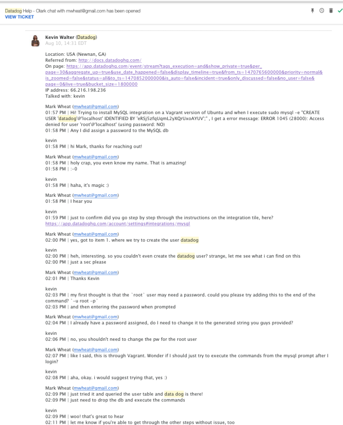

Mark Wheat answers to hiring engineers assignment

## Level 0 - Setup an Ubuntu VM
I setup the VM as outlined.  I was not familiar with Vagrant but think it is pretty freaking cool right now.  I have also always used VMware Fusion for all my virtualization and was blown away at how good VirtualBox preformed.

***Level 0 complete***


## Level 1 - Collecting your Data 
- **Sign up for Datadog** - I had previously signed up for a test Datadog account which was tied to my personal account.  When I signed up for the new DD account using "Datadog Recruiting Candidate" in the company field, there was no impact. 


- **What is the Agent?** - The agent is a lightweight piece of software that manages the configuration, collection and transport of data points gathered by different integration plugins on a host system to the DD servers. 


- **Adding Tags:**
https://app.datadoghq.com/infrastructure/map?fillby=avg%3Acpuutilization&sizeby=avg%3Anometric&groupby=none&nameby=name&nometrichosts=false&tvMode=false&nogrouphosts=false&palette=green_to_orange&paletteflip=false


- **Install a database and matching DD integration on your machine** -I installed mySQL on Vagrant image, no issues.  Where installing the DD integration there was a problem as I provided a root password during the DB installation and that caused some issue when trying to create the Datadog DB user.  I got to try chat support and it was spectacular!  See transcript below:





- **Write a custom agent to sample random value** - Wrote the custom Agent check, it is not fancy but works very well:

```
 from checks import AgentCheck
 import random
 
 class SupportTest(AgentCheck):
     def check(self, instance):
     self.gauge('test.support.random', random.random())
```

***Level 1 complete***


## Level 2 - Visualizing your Data
- **Clone db integration dashboard, add metrics** - I cloned the dashboard and added the metrics as requested and it can be viewed at 
https://app.datadoghq.com/dash/169922/mysql---cloned-overview?live=true&page=0&is_auto=false&from_ts=1470855820367&to_ts=1470942220367&tile_size=m


- **Difference between timeboard and screenboard** - All graphs within a **Timeboards** are scoped to the same time and all graphs appear in  a grid layout.  Graphs from a **Timeboard** can be shared individually.  A **Screenboard** is created with widgets and each can have their own time frame or view.  An entire **Screenboard** can be shared unlike a Timeboard.


- **Take snapshot of test.support.random graph and draw box around upper limit, include email** - The snapshot can be seen in the events under the user mwheat@gmail.com and I have included a graphic as well:


***Level 2 complete***

## Level 3 - Alerting on your Data

-**Setup multi-alert monitor:**


-**Monitor activation email:**


-**Scheduled Downtime config:**


