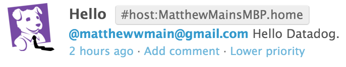

## Answers - Matthew Main

### Level 1

* **Sign up for Datadog (use "Datadog Recruiting Candidate" in the "Company" field), get the agent reporting metrics from your local machine.**

	<a href="https://app.datadoghq.com/dash/host/53841307?live=true&page=0&from_ts=1459983982643&to_ts=1459998382643&is_auto=false&tile_size=m">Signed Up With Agent Reporting Metrics Locally:</a><br>
	<br><br>

* **Bonus question: what is the agent?**

	<i>The Agent is the software that gathers data from a host and transfers it to Datadog. The a agent's collector stores a host's local metrics, including any integrations, while Dogstatsd, the agent's backend server, stores custom metrics sent from an application. The agent's forwarder is responsible for gathering data from both the collector and from Dogstatsd and delivering it to Datadog.</i><br><br>

* **Submit an event via the API.**

		#api_event.rb:

		require 'rubygems'
		require 'dogapi'

		api_key='30bb1d28fce2e3e1c2976895ec020abd'
		app_key='91a4188beee745a5ff48aa35d3937f9c98e2baa9'

		event = Dogapi::Client.new(api_key, app_key)

		event.emit_event(Dogapi::Event.new('Hello Datadog.', :msg_title => 'Hello'))

	<a href="https://app.datadoghq.com/event/stream?tags_execution=and&show_private=true&per_page=30&query=hosts%3AMatthewMainsMBP.home%20status%3Aall%20priority%3Aall&aggregate_up=true&use_date_happened=false&display_timeline=true&from_ts=1459404000000&priority=normal&is_zoomed=false&status=all&to_ts=1460008800000&is_auto=false&incident=true&only_discussed=false&no_user=false&page=0&live=true&bucket_size=10800000#mac">Event Submitted Via API:</a><br>
	<br><br>

* **Get an event to appear in your email inbox (the email address you signed up for the account with)**

		#api_event.rb:

		require 'rubygems'
		require 'dogapi'

		api_key='30bb1d28fce2e3e1c2976895ec020abd'
		app_key='91a4188beee745a5ff48aa35d3937f9c98e2baa9'

		event = Dogapi::Client.new(api_key, app_key)

		event.emit_event(Dogapi::Event.new('@matthewwmain@gmail.com Hello Datadog.', :msg_title => 'Hello'))

	<a href="https://app.datadoghq.com/event/stream?tags_execution=and&show_private=true&per_page=30&query=hosts%3AMatthewMainsMBP.home%20status%3Aall%20priority%3Aall&aggregate_up=true&use_date_happened=false&display_timeline=true&from_ts=1459404000000&priority=normal&is_zoomed=false&status=all&to_ts=1460008800000&is_auto=false&incident=true&only_discussed=false&no_user=false&page=0&live=true&bucket_size=10800000#mac">Event Sent to Email:</a><br>
	<br>

	Event in Email Inbox:
	<br><br>


<br><br><br>

### Level 2

* **Take a simple web app ([in any of our supported languages](http://docs.datadoghq.com/libraries/)) that you've already built and instrument your code with dogstatsd. This will create **metrics**.**
* **While running a load test (see References) for a few minutes, visualize page views per second. Send us the link to this graph!**
* **Create a histogram to see the latency; also give us the link to the graph**
* **Bonus points for putting together more creative dashboards.**

### Level 3

Using the same web app from level 2:
* **tag your metrics with `support` (one tag for all metrics)**
* **tag your metrics per page (e.g. metrics generated on `/` can be tagged with `page:home`, `/page1` with  `page:page1`)**
* **visualize the latency by page on a graph (using stacked areas, with one color per `page`)**

### Level 4

Same web app:
* **count the overall number of page views using dogstatsd counters.**
* **count the number of page views, split by page (hint: use tags)**
* **visualize the results on a graph**
* **Bonus question: do you know why the graphs are very spiky?**
 
### Level 5

**Let's switch to the agent.**

* **Write an agent check that samples a random value. Call this new metric: `test.support.random`**
* **Visualize this new metric on Datadog, send us the link.**

**Here is a snippet that prints a random value in python:**

```python
import random
print(random.random())
```

## Instructions
If you have a question, create an issue in this repository.

To submit your answers:

1. Fork this repo.
2. Answer the questions in `answers.md`
3. Commit as much code as you need to support your answers. At a minimum, for level 5.
4. Submit a pull request.
5. Don't forget to include links to your dashboard(s), even better links *and* screenshots.


