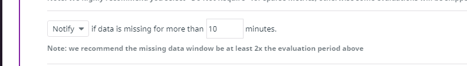
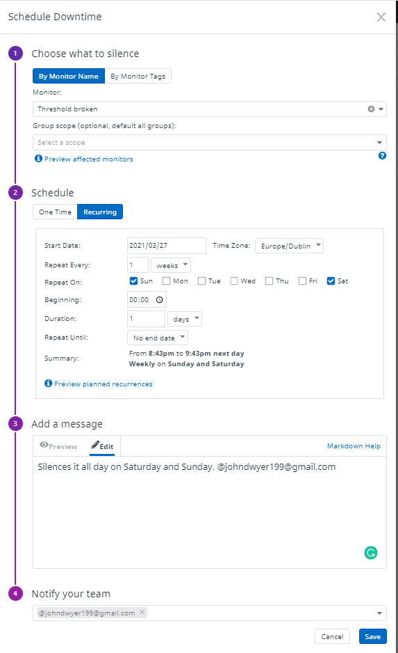

# John Dwyer
#### Email:  Johndwyer19@gmail.com
#### Account used for trial: Johndwyer199@gmail.com
___
## Prerequisites - Setup the environment

When choosing which Agent and technologies I would use for this exercise, I decided to experiment a little.

### Initial Setup: 
* OS: Windows
* Agent: Windows Agent 
* DB: My SQL

My initial setup combines the Windows Agent with a MySQL DB. I did this to learn about how Datadog integrations and configuration are implemented with the least possible points of failure. 


### Final Setup:

* VM: Windows Subsystem for Linux (WSL2)
* OS: Ubuntu 
* Agent: Linux Agent 
* DB: MySQL

Once I learned how integrations work with DataDog, I decided to upgrade my setup choosing Windows Subsystem for Linux (WSL2) as my virtual machine with the Datadog Linux Agent with a MySQL database.

The first step was installing Windows subsystem (WSL2) (note: I have ran virtualization before but if you hadn't you must enable it in the bios).

I did this using PowerShell and the following link commands [from here](https://docs.microsoft.com/en-us/windows/wsl/install-win10).

After Windows Subsystem for Linux installed, I opened the Windows store and installed [Ubuntu 18.04 LTS](https://www.microsoft.com/en-ie/p/ubuntu-1804-lts/9n9tngvndl3q?rtc=1#activetab=pivot:overviewtab).

Lastly I installed the Datadog Ubuntu Agent using the easy one-step install command 
[from the Datadog Ubuntu section](https://app.datadoghq.eu/account/settings#agent/ubuntu).

My API key = ```{DD_CLIENT_API_KEY}```
```
DD_AGENT_MAJOR_VERSION=7 DD_API_KEY= {DD_CLIENT_API_KEY} DD_SITE="datadoghq.eu" bash -c "$(curl -L https://s3.amazonaws.com/dd-agent/scripts/install_script.sh)"
```

Once the Agent was installed, I confirmed the status of my integration to make sure it was successfully installed using:


```
   sudo datadog-agent status
```

This installation process went well, but I did have the below issue.

### Issue encountered during Datadog Linux setup

#### Systemd not supported by WSL:

The Datadog Agent install required systemd, which isn’t supported currently by Windows subsystem (WSL2). I attempted to resolve the issue using online recommendations such as
[genie](https://github.com/arkane-systems/genie) but was unable to get the error to disappear.

Afterwards, I realised by checking the status of my services on my VM that the Datadog services were installed.
```
   sudo service --status-all
```

Although there was a minor compatibility error related to a lack of systemd, Datadog didn’t rollback the installation and I was able to start the service and continue with the integration by using:

```
   sudo service datadog-agent start
```

#### Port issue:

Due to having experimented with other Agents the default ports were already in use. Since I no longer required my Windows integration I decided to remove it from my system.

### Database Setup

Microsoft has a handy setup guide for most databases located on their website ([link here](https://docs.microsoft.com/en-us/windows/wsl/tutorials/wsl-database#install-mysql)). I followed these steps to get my database up and running.

1. ```sudo apt update```
1. ```sudo apt install mysql-server```
1. ```sudo service mysql start```

Once it was installed, I checked the Service status to ensure it was working correctly. 

* ```sudo service mysql status```

### Environmental Configuration 

With the environment setup the next step was to configure Datadog.
 
First, I went to the datadog-agent folder located here
``` /etc/datadog-agent ```.

In this directory, I modified the ```datadog.yaml``` file to ensure the following was correct.

* ```api_key```
* ```site: datadoghq.eu```
* ``` hostname: JohnLinuxWsl```

___

## Collecting Metrics:
### Task: Add tags in the Agent config file

While I was in the ```datadog.yaml``` file, I set the following tags which can be seen in the host map and infrastructure list screenshots.
```
tags:
   - "environment:dev"
   - "data:dog"
```

[Link to Host Map screen](https://app.datadoghq.eu/infrastructure/map?fillby=avg%3Acpuutilization&sizeby=avg%3Anometric&groupby=availability-zone&nameby=name&nometrichosts=false&tvMode=false&nogrouphosts=true&palette=green_to_orange&paletteflip=false&node_type=host)


### Task: Configure the database on your machine

Following the MySQL guidelines from Datadogs integrations section ([here](https://docs.datadoghq.com/integrations/mysql/?tab=host)), I setup the integration.

This involved creating a new Datadog user. I used datadog as the password to keep things simple.
```
CREATE USER 'datadog'@'localhost' IDENTIFIED BY 'datadog';
```
After the user creation, I went to the conf.d directory.

```
cd /etc/datadog-agent/conf.d/mysql.d
```

In this directory, I created a copy of the ```conf.yaml.example``` file using the ```cp``` Linux command ([Info here](https://www.geeksforgeeks.org/cp-command-linux-examples/)). My MySQL integrations can be viewed on the [MySQL Dashboard](https://app.datadoghq.eu/dash/integration/9/mysql---overview?from_ts=1617037296330&live=true&to_ts=1617040896330).


Now that I had a copy of ```conf.yaml.example``` called ```conf.yaml``` , I configured the instances to have the following configuration:

* ```host: 127.0.0.1```
* ``` pass: datadog```
* ```port: 3306```

### Task: Create a custom Agent check

For this step, I followed the steps outlined in the Custom Agent Check documentation [located here](https://docs.datadoghq.com/developers/write_agent_check/?tab=agentv6v7).

For testing purposes, I copied the hello (```hello.yaml/.py```) example, which allowed me to see a working check before creating my own.

First, I created the ```hello.yaml``` file in conf.d. 
```
   cd /etc/datadog-agent/conf.d
```


In the ```hello.yaml``` file, I added an instance as your documentation mentions:
 
> The configuration file includes no real information but it is necessary to include a sequence called instances containing at least one mapping, that can be empty.

```
instances: [{}]
```

The next thing I did was head over to the checks.d directory.

```
   cd /etc/datadog-agent/checks.d
```
In this folder, I created the ```hello.py``` file. This custom check sends a value of 1 for the metric ```hello.world```.

```
# the following try/except block will make the custom check compatible with any Agent version
try:
    # first, try to import the base class from new versions of the Agent...
    from datadog_checks.base import AgentCheck
except ImportError:
    # ...if the above failed, the check is running in Agent version < 6.6.0
    from checks import AgentCheck

# content of the special variable __version__ will be shown in the Agent status page
__version__ = "1.0.0"

class HelloCheck(AgentCheck):
    def check(self, instance):
        self.gauge('hello.world', 1, tags=['TAG_KEY:TAG_VALUE'] + self.instance.get('tags', []))
```
I restarted the Agent to see my changes.
```
sudo service datadog-agent restart
```
Running the check using the below command, I confirmed everything was ok.
```
sudo -u dd-agent -- datadog-agent check hello
```


Finally, I checked the metrics tab in the application to see it in action.


Now that I had a working example, I proceeded to work on the ```my_metric``` task.

I followed the same steps, creating a new ```YAML``` file. Only this time calling it ```my_metric.yaml``` and changing the collection interval to 45 seconds.

Note: I did not use the prefix ```custom_``` ,which could avoid conflicts with the names of pre-existing Datadog Agent integrations as the task requested it to be named ```my_metric```. 


```
   init_config:

   instances:
   - min_collection_interval: 45
  ```

  >The min_collection_interval is set to 45, it does not mean that the metric is collected every 45 seconds, but rather that it could be collected as often as every 45 seconds.


 Now I needed to create the Python file. To do this went to the ```checks.d``` directory and created a new file called ```my_metric.py```. 
 
 ```
   cd /etc/datadog-agent/checks.d
 ```
 I based ```my_metric.py``` on the ```hello.py``` example except this time I am using the ```randint``` function to get a random number from 0 to 1000. 

Using the [Python random](https://docs.python.org/3/library/random.html) documentation, I understood how to utilise the ```randint``` function.

 ```
# importing randint function
# from random module
from random import randint
# the following try/except block will make the custom check compatible with any Agent version
try:
    # first, try to import the base class from new versions of the Agent...
    from datadog_checks.base import AgentCheck
except ImportError:
    # ...if the above failed, the check is running in Agent version < 6.6.0
    from checks import AgentCheck

# content of the special variable __version__ will be shown in the Agent status page
__version__ = "1.0.0"

class MyMetricCheck(AgentCheck):
    def check(self, instance):
        self.gauge('my_metric',randint(0, 1000), tags=['metric:check', 'host:john'] )
 ```
I then restarted the Agent to see my changes.
```
   sudo service datadog-agent restart
```

Finally, I checked that the ```my_metric``` check was operating as expected.

 ```
 sudo -u dd-agent -- datadog-agent check my_metric
 ```


### Bonus Question: Can you change the collection interval without modifying the Python check file you created? 

Yes, this can be done by modifying the ```min_collection_interval``` in your ```YAML``` file

This is shown in the Datadog documentation [here](https://docs.datadoghq.com/developers/write_agent_check/?tab=agentv6v7#collection-interval) and in the ```my_metric.yaml``` example above.
___

## Visualizing Data:

### Task: Utilize the Datadog API to create a Timeboard that contains: ###

* Your custom metric scoped over your host.
* Any metric from the Integration on your Database with the anomaly function applied.


For this task, I created a ```curl``` request and used average ```mysql.performance.cpu_time```. I choose to use agile detection with is for seasonal metrics expected to shift. This means that the algorithm should quickly adjust to metric level shifts.

For information on anomalies, I used this [link:](https://docs.datadoghq.com/monitors/monitor_types/anomaly/) 

 

I specified the metric_query, algorithm and deviations for my anomalies request in the following format:

`"q":"anomalies(avg:mysql.performance.cpu_time{host:JohnLinuxWsl}, 'agile', 2)",`

#### Issue encountered using basic

I encountered issues using Basic anomaly detection as the chart would experience problems with basic selected. Unfortunately, I wasn’t able to track down the route cause and tried using the browser developer tools to investigate further. 

Due to this, I opted for agile detection.


### Task: Custom metric with the rollup function applied to sum up all the points for the past hour into one bucket

To utilise the rollup function, I looked to the Datadog documentation guidance ([link here](https://docs.datadoghq.com/dashboards/functions/rollup/)). The documentation specified that I need to provide a method (sum) and Time (in seconds) to accomplish the task of summing up all points for the past hour.

`"q":"sum:my_metric{host:JohnLinuxWsl}.rollup(sum, 3600)",`

>Appending the .rollup() function at the end of a query allows you to perform custom time aggregation, i.e. this function enables you to define:
The time intervals for a given graph (if larger than the query-enforced rollup interval).
How data points are aggregated within a given time interval.

I specified 3600 for the time as that's equal to the number of seconds in an hour.


### Task: Set the Timeboard's timeframe to the past 5 minutes

[Dashboard link here](https://app.datadoghq.eu/dashboard/2nn-nd6-pi9/visualizing-data)


### Task: Take a snapshot of this graph and use the @ notation to send it to yourself.
For taking the screenshot I found the demo provided by Datadogs You Tube channel to be very helpful [Link](https://www.youtube.com/watch?v=xFIRfcY3Ybo&t=170s).


### Bonus Question: What is the Anomaly graph displaying?

The Anomaly graph shows us what is expected based on historical trends. The chart shows what is expected in the grey sections should the data breach the expected trends (the grey zone), this would be considered an anomaly as it is outside the predictions.

For my example, I choose Agile, which is for Seasonal metrics that are expected to shift. The algorithm should quickly adjust to metric level shifts.

Helpful links: 
* [Anomaly Detection | Datadog you tube video](https://www.youtube.com/watch?v=kld520s-d0M)
* [Datadog Anomaly Detection Algorithms](https://docs.datadoghq.com/monitors/monitor_types/anomaly/#anomaly-detection-algorithms)


```
curl -X POST "https://api.datadoghq.eu/api/v1/dashboard" \
-H "Content-Type: application/json" \
-H "DD-API-KEY: ${DD_CLIENT_API_KEY}" \
-H "DD-APPLICATION-KEY: ${DD_CLIENT_APP_KEY}" \
-d @- << EOF
{
   "title":"Visualizing Data",
   "description":"Visualizing Data",
   "layout_type":"ordered",
   "widgets":[
      {
         "definition":{
            "title":"My Metric",
            "type":"timeseries",
            "requests":[
               {
                  "q":"my_metric{host:JohnLinuxWsl}",
                  "display_type":"line",
                  "style":{
                     "line_type":"solid",
                     "line_width":"normal",
                     "palette":"Cool"
                  }
               }
            ],
            "yaxis":{
               "scale":"linear",
               "include_zero":true,
               "min":"auto",
               "max":"auto"
            }
         }
      },
      {
         "definition":{
            "title":"anomalies",
            "show_legend":false,
            "type":"timeseries",
            "requests":[
               {
                  "q":"anomalies(avg:mysql.performance.cpu_time{host:JohnLinuxWsl}, 'agile', 2)",
                  "display_type":"line",
                  "style":{
                     "line_type":"solid",
                     "line_width":"normal",
                     "palette":"Cool"
                  }
               }
            ],
            "yaxis":{
               "scale":"linear",
               "include_zero":true,
               "min":"auto",
               "max":"auto"
            }
         }
      },
      {
         "definition":{
            "title":"Hourly Rollup",
            "show_legend":false,
            "type":"timeseries",
            "requests":[
               {
                  "q":"sum:my_metric{host:JohnLinuxWsl}.rollup(sum, 3600)",
                  "display_type":"line",
                  "style":{
                     "line_type":"solid",
                     "line_width":"normal",
                     "palette":"Cool"
                  }
               }
            ],
            "yaxis":{
               "scale":"linear",
               "include_zero":true,
               "min":"auto",
               "max":"auto"
            }
         }
      },
      {
         "definition":{
            "title":"30 Sec Rollup",
            "show_legend":false,
            "type":"timeseries",
            "requests":[
               {
                  "q":"sum:my_metric{host:JohnLinuxWsl}.rollup(sum, 30)",
                  "display_type":"line",
                  "style":{
                     "line_type":"solid",
                     "line_width":"normal",
                     "palette":"Cool"
                  }
               }
            ],
            "yaxis":{
               "scale":"linear",
               "include_zero":true,
               "min":"auto",
               "max":"auto"
            }
         }
      }
   ]
}
EOF
```
___

## Monitoring Data

### Task: Create a new Metric Monitor that watches the average of your custom metric (```my_metric```) and will alert if it’s above the following values over the past 5 minutes:

* Warning threshold of 500.
* Alerting threshold of 800.
* Ensure that it will notify you if there is No Data for this query over the past 10m.


One way you can create a monitor go to your graph click on the settings tab and click create monitor.


Alternatively, you can use the monitor tab.


This will bring you to your monitor for your specific metric
([Monitor Link](https://app.datadoghq.eu/monitors#839576/edit)).


From this screen, I scrolled down to section 3 “Set alert conditions”.


In the alert conditions, I set the duration as well as the Alert/Warning threshold.
* Alert threshold of 800.
* Warning threshold of 500.


In section three I set the option to send a notification if data is missing for over the past ten minutes.



### Complete Screen Image


### Task: Please configure the monitor’s message so that it will:
* Send you an email whenever the monitor triggers.
* Create different messages based on whether the monitor is in an Alert, Warning, or No Data state.
* Include the metric value that caused the monitor to trigger and host ip when the Monitor triggers an Alert state.
* When this monitor sends you an email notification, take a screenshot of the email that it sends you.

Answer:

In section 4 “Say what's happening” I used Datadogs [notifications](https://docs.datadoghq.com/monitors/notifications/?tab=is_alert) documentation to create the following code to provide the above functionality:

```
{{#is_alert}}Threshold of 800 broken{{/is_alert}}
{{#is_warning}}Threshold of 500 broken{{/is_warning}}
{{#is_no_data}}There is no data{{/is_no_data}}

The value that breached the alert for metric based query monitors: {{value}}	

Host Name {{host.name}} and IP Address {{host.ip}}

To investigate, login and check out the Visualisation data dashboard. 

If you need help contact John @johndwyer199@gmail.com
```

* ```{{#is_alert}}```	: The is the alert monitor.
* ```{{#is_warning}}```	: The is the warn monitor. 
* ```{{#is_no_data}}``` : This states the monitor is triggered for missing data.
* ```{{value}}```	:The value that breached the alert for metric based query monitors is here.
* Tag variables ```{{host.name}}``` and IP Address ```{{host.ip}}``` are here. 

Lastly, I hit the test notifications button to send out email notifications.


#### Here is the notifications in action:

Alert notification:


Waning notification:


No data notification:


### Bonus Question: Since this monitor is going to alert pretty often, you don’t want to be alerted when you are out of the office. Set up two scheduled downtimes for this monitor:

* One that silences it from 7pm to 9am daily on Monday to Friday,
* one that silences it all day on Sat-Sun.
* Make sure that your email is notified when you schedule the downtime and take a screenshot of that notification.

For this, I went to the manage downtime in the monitor’s section ([Information here](https://app.datadoghq.eu/monitors#downtime)).


Below are the settings I used for Weekday Downtime and the notification:

Weekday Downtime:


Weekday Downtime notification 


Below are the settings I used for Weekend Downtime and the notification:

Weekend Downtime:



Weekend downtime notification 


___

## Collecting APM Data:

To setup APM I used the following documentation
* [APM Setup & Docs](https://app.datadoghq.eu/apm/docs?architecture=host-based&language=python)


Steps
* First, I verified my Python installation ([Python installation documentation](https://docs.python-guide.org/starting/install3/linux/)).
* Next I Installed flask using the below command ([Flask installation documentation](https://flask.palletsprojects.com/en/1.1.x/installation/)).

```
   pip install Flask
```


```
   pip install ddtrace
```
When intalling DDtrace, I noticed I was missing cython and to resolve this I executed these commands:
* [ Error resolution resource: Command "python setup.py egg_info" failed with error code 1]( https://github.com/facebook/prophet/issues/418)
* [Error resolution resource: ImportError: No module named Cython.Build]( https://github.com/CellProfiler/centrosome/issues/78)

```
   pip install --upgrade setuptools 
```
Solution:
```
   pip install --upgrade cython
```


#### Working with traces

Next, I used the code provided by Datadog for this hiring exercise GitHub into a file called ```my_service.py``` and placed it in my home directory. Then I added the tracer import reference and some ```tracer.wraps```.

Once everything was setup I executed the trace using the following command in /```home/john``` directory.

```
   ddtrace-run python my_service.py
```
When the ddtrace-run was running, I hit the below endpoints to generate data on the flask dashboard.

* http://localhost:5050/
* http://localhost:5050/api/apm
* http://localhost:5050/api/trace

After hitting the endpoints, I went to view my services on the Datadog
website.

[Link to Service list](https://app.datadoghq.eu/apm/services?end=1617043598877&paused=false&start=1617039998877&env=none)


Here I could view the requests I made.


In the tracer section, I was able to view my trace wraps.

Example Tracer wrap:
```
@tracer.wrap('flask.request',
                service='flask',
                resource='flask.We_Hit_entry')
```


To learn about how the trace worked I used the following documentation:
* [Tracing Python Applications](https://docs.datadoghq.com/tracing/setup_overview/setup/python/?tab=containers)
* [Tracing](https://docs.datadoghq.com/tracing/)
* [Tracing/visualization/resource/](https://docs.datadoghq.com/tracing/visualization/resource/)
* [Primary Operations in Services
](https://docs.datadoghq.com/tracing/guide/configuring-primary-operation/)


#### Contents of ```my_service.py``` :
```
from flask import Flask
import logging
import sys
from ddtrace import tracer

# Have flask use stdout as the logger
main_logger = logging.getLogger()
main_logger.setLevel(logging.DEBUG)
c = logging.StreamHandler(sys.stdout)
formatter = logging.Formatter('%(asctime)s - %(name)s - %(levelname)s - %(message)s')
c.setFormatter(formatter)
main_logger.addHandler(c)

app = Flask(__name__)

@app.route('/')
@tracer.wrap('flask.request',
                service='flask',
                resource='flask.We_Hit_entry')
def api_entry():
    return 'Entrypoint to the Application'

@app.route('/api/apm')
@tracer.wrap('flask.request',
                service='flask',
                resource='flask.We_Hit_Apm')
def apm_endpoint():
    return 'Getting APM Started'

@app.route('/api/trace')
@tracer.wrap('flask.request',
                service='flask',
                resource='flask.We_Hit_Trace')
def trace_endpoint():
    return 'Posting Traces'

if __name__ == '__main__':
    app.run(host='0.0.0.0', port='5050')
```


### Bonus Question: What is the difference between a Service and a Resource?
The exact definition, according to Datadog documentation would be the following:

[Ref: Services](https://docs.datadoghq.com/tracing/visualization/#services)

>Services are the building blocks of modern microservice architectures - broadly a service groups together endpoints, queries, or jobs for the purposes of scaling instances.

[Ref: Resource](https://docs.datadoghq.com/tracing/visualization/resource/)
> A resource is a particular action for a given service (typically an individual endpoint or query).

In Datadog, for example, Flask would be the service and the API endpoints APM and Trace would be the resources.
 

## Final Question: Is there anything creative you would use Datadog for?
### Improve Public Transportation in cities by improving utilisation

Issue: Overcrowding and Congestion on Public Transportation 

In cities such as Dublin, it could be used to provide real-time metrics on the number of passengers on each mode of transportation and recommend alternatives to passengers to reduce overcrowding and congestion. 

Benefits
For public transportation
* Identify anomalies and respond to the increased demand by routing extra transport options.
* Use metrics to suggest ideal leave times to passengers to prevent overburdening infrastructure via an app.
* Suggest an Ideal route and mode of transport based on the occupancy of transportation and current congestion levels. This could also be used to ensure low numbers on each method of transportation.

 
Occupancy metrics that could be utilised by connecting different systems:
* Ticket purchases.
* Leap card check-ins.
* Identifying if public transport such as buses is on or behind schedule.
* Reports from road watch.


