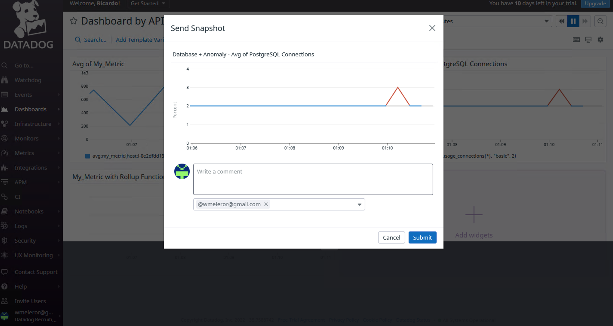
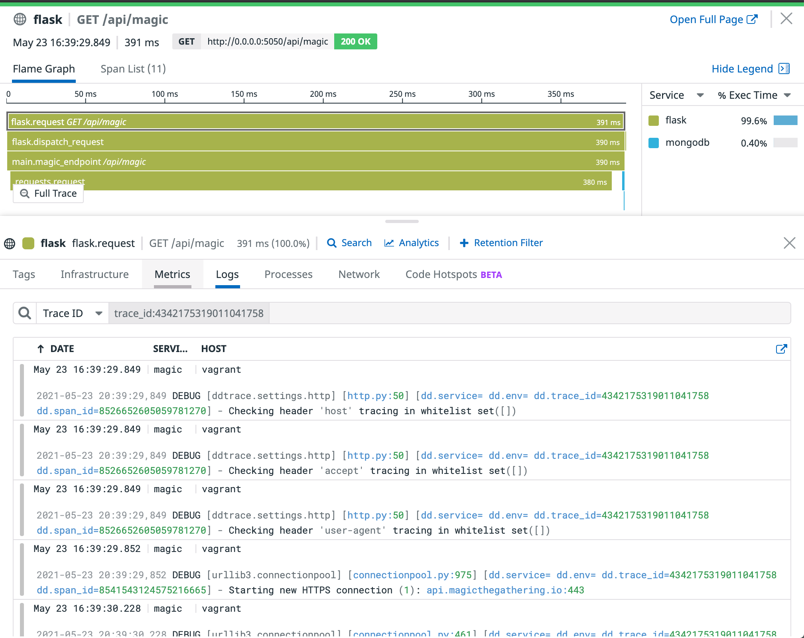

# Answers

## Collecting Metrics:

Host map showing host with tags:

A quick aside: I opted for vagrant because I thought it would provide the best opportunity for really learning how the agent works and how it can be set up to correlate logs, metrics, traces, etc, even though the container route was probably easier. You can find my entire datadog.yaml config file [here](datadog.yaml).

For database I went with a local install of MongoDB, using [this config file](conf_mongo.yaml).

I created my custom check as requested with increased collection interval, and added a tag for the IP address (to potentially use later):
[custom.yaml](custom.yaml)
[custom.py](custom.py)

* **Bonus Answer** I'll be honest that I'm a bit unsure about this one, mostly because I did not change the Python file to answer the question above; that change was made in the yaml config. The change I did in the config file is specific to this check, but it can also be done at the global level.

## Visualizing Data:

I've provided two scripts to create these dashboards, one using the [old](timeboard_old.sh) `/dash` endpoint (these were the first docs I landed on and I didn't notice they were being sunset) and one for the [new](timeboard_new.sh) `/dashboard`.

A 5 minute view of the dashboard with three graphs:

Note because one of the three is an hourly roll-up it will not show data.

Of most interest is the anomaly example, which is looking at document inserts per second into Mongo. I've used API from my flask app (see APM) to run a large number of inserts (at least relative to the historical data of almost none) and captured a snapshot of this sent to myself:

* **Bonus Answer**: The anomaly functions allow a user to run their metric data through algorithms that look at the historical data to understand what values are considered 'normal' and which are potentially anomalies. This range of normal values would show as a gray shaded area on the chart which is incredibly useful in helping users understand if a spike they are seeing is problematic and requires action or not. No two spikes are created equal, and sometimes they are perfectly normal (due to seasonality, time of day, holidays, etc).

## Monitoring Data

Thresholds:

Message:

Note: I want to call out that this does *not* include the Host IP, which I couldn't quite figure out how to get. I thought that adding at as a tag to the custom Python check file would make it available, but couldn't get it to work.

E-mail Examples:

* **Bonus Answer**:

Scheduled Downtime:

E-mail Notification:

## Collecting APM Data:

* **Bonus Answer**: A service is "broadly a service groups together endpoints, queries, or jobs for the purposes of building your application." I copied this definition from the glossary because I couldn't come up with a non-awful way of defining them. In practice that means individual microservices (lambdas, etc), databases, message queues, etc. These show up on the service map, i.e:

Resources are actions taken by services. An example of that would be a GET request out to an API, as show in this example traces from my [flask app](app.py):

You'll see that I also made sure to get the logging set up so that I had access to those in context with my traces.

And here's an [updated dashboard](https://p.datadoghq.com/sb/1ead0e3e-b81a-11eb-a477-da7ad0900002-8008fe8171c713645022e9c2a537e860) from above that now includes a fourth graph using APM data:

## Final Question:

My flask app was a clue to this answer in the `/api/magic` endpoint, which calls out to a Magic the Gathering API. I'm a pretty big fan of Magic the Gathering and can admit it's not the first time I've used this. There's an interesting market for Magic cards past and present. What's interesting is that the prices can fluctuate pretty dramatically for a number of reasons, for example when new set is released that has great synergy with older cards.

It could be interesting to scrape various card sellers and markets to try and get an understanding of where things are moving.
