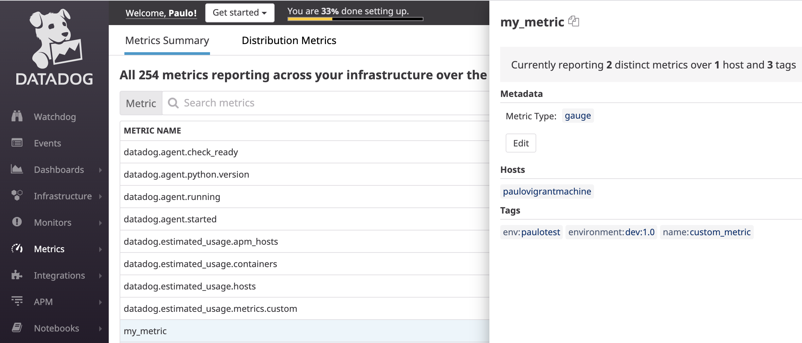
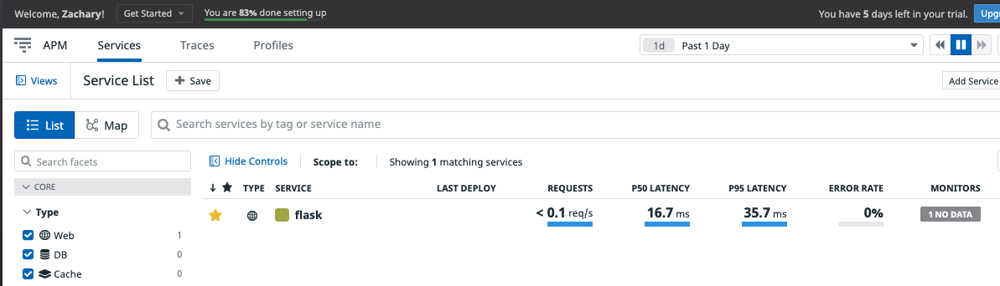

# Introduction

I decided to take a slightly technical/IaC approach since it's the most natural to me these days.
I deployed a CentOS7 VM with Vagrant and all the needed configuration is done with an ansible playbook.

I tried to map an ansible role to a chapter in this markdown answer file.

I'll describe in every step what I did but for the details I'll suggest you to look at the ansible code (for example for the actual JSON payload of the API calls).

**Please note**: do not take this implementation as reference for proper production work because some shortcuts were made (example: running things as root when it's not actually suggested).

# Setup the environment

To leverage the automation tool I used these roles from ansible Galaxy:

```bash
ansible-galaxy install Datadog.datadog
ansible-galaxy install geerlingguy.mysql
```

Next step is of course to run a CentOS7 VM vit Vagrant (`vagrant box add centos/7 && vagrant init centos/7 && vagrant up`) and configure the ssh connection to it:

```bash
Host default
  HostName 127.0.0.1
  User vagrant
  Port 2222
  UserKnownHostsFile /dev/null
  StrictHostKeyChecking no
  PasswordAuthentication no
  IdentityFile $PWD/.vagrant/machines/default/virtualbox/private_key
  IdentitiesOnly yes
  LogLevel FATAL
```

At this point we are ready to run the playbook against the VM to provision it: we need of course the API/APP keys from Datadog as found on this [link](https://app.datadoghq.eu/account/settings#api). The application key was manually created.

The whole setup is done by:

```bash
ansible-playbook -i 127.0.0.1:2222, setup.yaml --key-file $PWD/.vagrant/machines/default/virtualbox/private_key
```

Let's see it split by role:

| **Role**                          | **Description**                                                         |
| --------------------------------- | ------------------------------------------------------------------------|
| Datadog.datadog                   | installs and configures the agent (see `groups_var/all` for details)      |
| geerlingguy.mysql                 | installs and configure MySQL (see `groups_var/all` for user and grants)   |
| configure-agent-mysql-integration | configures the Datadog agent for MySQL integration                      |
| configure-agent-custom-check      | adds the custom check, the agent configuration and restarts it          |
| apm                               | configures the appication as a service with ddtrace and the dummy calls |
| create-timeboard                  | creates the required timeboard                                          |
| create-monitor                    | creates the required monitor and its downtimes                          |


## Collecting Metrics

The default metric collection (system metrics) is ready right out of the box and can be seen via the preset [System dashboard](https://app.datadoghq.eu/dash/host/5043588?live=4h&page=0&tile_size=m)
The Datadog role was instructed to add some meaningful tags which are very important to filter and scope every Datadog objects like metric panels, monitors, etc...
You can see those tags here:


The two roles setup the database and its integration: we cannot expect much traffic on an empty database but it's reporting its metrics:


While system and database metrics are good it's even better to be able to submit your custom one. The requirement was to send a random number in the 1-1000 range every 45 seconds:



If the interval has to be handled by the code I would detach the script from the agent and just run it as a daemon by using something like `threading.Timer` (if in python).
Without using the Agent class it's also possible to submit to the DogStatsD endpoint, for example using a shell script (snippet tested for bash):

```bash
TAGS="application:my_custom_app,sample_interval:45"
VALUE=$(expr $RANDOM \% 1000)
echo -n "custom_namespace.my_metric:$VALUE|g|@1|$TAGS" >/dev/udp/localhost/8125
```

To schedule the check from the Datadog agent with a specific interval I suggest to use the `min_collection_interval` instance property which is very easy to implement and doesn't require changes to the code.

As the sample rate increases it's worth considering buffering/downsampling them before submitting.

## Visualizing Data

Adding and editing dashboard in the Datadog GUI is pretty straightforward but I wanted to show how is possible to do that by pushing their definition via the API from the playbook. Apart from very specific use cases I think this is useful only to adhere strictly to the IaC paradigm. Otherwise a more language-oriented approach would be beneficial if the goal is, for example, to have a dynamic dashboard.

Here is the dashboard with the custom metric and the mysql metric with the requested functions applied ([link](https://app.datadoghq.eu/dash/7142/custom-metric-and-mysql-cpu-timeboard)), notice the fewer amount of samples in the rollup graph (rollup,1h):


Anomaly graph just before sharing:


This panel was shared via email and is showing the spikes (either up or down) outside the "normal" range of data.


## Monitoring Data

We saw how to display system and custom metrics but what if we want to alert on that? We can create a monitor.
There are many possibilities to create monitor: in this case I opted for an API call. Another option is via the python module `datadogpy` (which is a wrapper for the API).

**Please note** that the ansible role is only implementing the POST verb: to edit a monitor you need the PUT verb otherwise POSTing again will create a new monitor. That's why it's disabled by a "feature flag" in the global variables list (group_vars/all).

My preferred way of creating monitors is the Terraform provider as suggested/supported by Datadog itself (and do a `terraform import` to create a local resource ID before applying changes).
Of course the API is always an option if a proper language is needed.

After creating the monitor the related downtimes were created via API calls by referencing the monitor ID directly.

A couple of considerations:

- a more correct implementation would be: GET the monitor ID and use it in the following tasks
- start/end times are tricky because they are expressed always in epoch format even when the starting/ending points are hours (since the recurrence is taking care of the date) and there is an hard constraint on dates in the past (the same is true for metrics).


For sure this is a feature (adding downtimes) that I would solve with a python snippet on a real production scenario.

Here is the notification of the added downtime:


## Collecting APM Data

Instrumenting your python code is as easy as starting your application prefixed with `ddtrace-run`.

In this example I created a systemd unit file to run the application as a service and to be able to create some API calls to generate the metrics (I normally use siege but in this case I just scheduled a bunch of requests via cron).

**Bonus Question**: What is the difference between a Service and a Resource?

The service is the endpoint of the entire application while a resource is a single URI/method.

Main app:


Services:



Traces:


APM+Infra dashboard [link](https://app.datadoghq.eu/dash/7183/apm--infra):


## Final Question

Being an home automation enthusiast I can easily add a "Datadog destination" to my metric collection flow to send, for example, all the vitals of my plants (light, temperature, moisture, etc.) and trigger an alert on my mobile if something is off (for example using the free service PushOver).
