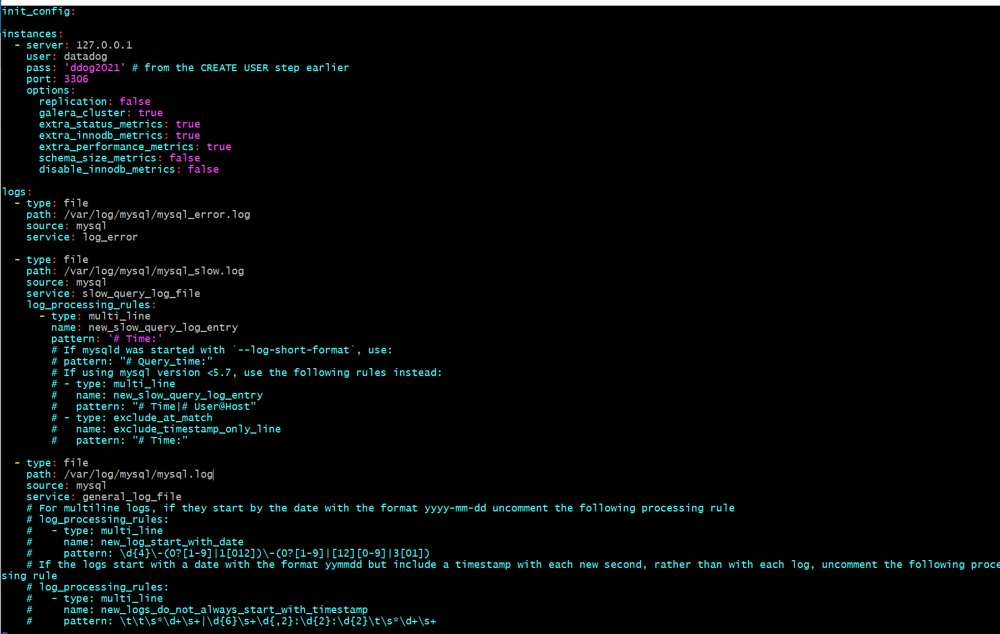
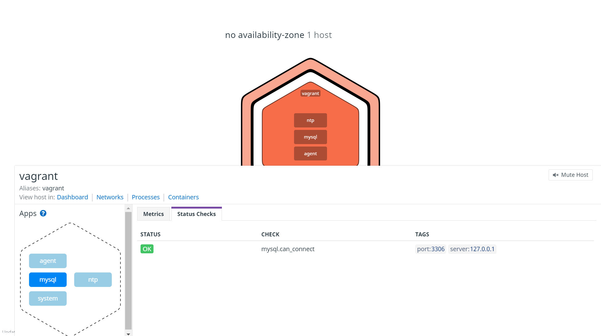

DataDog - Sales Enginner Mid Market

Your answers to the questions go here.

## **Prerequisites - Setup the environment**
---

### Setup Vagrant

I followed the instructions and installed vagrant and virtual box. Once installed I tested some simple commands in vagrant to make sure it works properly.

vagrant -v


vagrant up


vagrant ssh

note the packages will say zero here, when the ddog agent is installed, there will be packages


vagrant logout and destroy


Now that testing of simple commands are done, I ended up also installing a git bash shell. Once I ssh in the virtual machine, I ran apt updates and upgrades.

sudo apt update
sudo apt upgrade


---

### Setup DataDog trial

I signed up for a trial Datadog at https://www.datadoghq.com/

Then installed the datadog unbuntu agent from here https://app.datadoghq.com/signup/agent#ubuntu
DD_AGENT_MAJOR_VERSION=7 DD_API_KEY=<?????> DD_SITE="datadoghq.com" bash -c "$(curl -L https://s3.amazonaws.com/dd-agent/scripts/install_script.sh)"


taking note of the commands to start/stop agent in the green text above for later

check to see if the agent is installed by running status command


---

## Collecting Metrics:

### Add tags

* Add tags in the Agent config file and show us a screenshot of your host and its tags on the Host Map page in Datadog.

* Before adding tags, I briefly read up on tags here https://docs.datadoghq.com/getting_started/tagging/.  Looks like there is 4 ways to assign tags, I'll demonstrate 2 ways below.

   1) **config files** - Access the datadog.yaml file by refering to this doc https://docs.datadoghq.com/agent/guide/agent-configuration-files/?tab=agentv6v7

   sudo vi /etc/datadog-agent/datadog.yaml

   I also double checked the to see if the API keys match the UI which it does.


   First attempt failed, I made the mistake of not uncommenting the tags: line and only adding the params. Now that the config file is updated, I restarted the agent.

   

   

   Checked against the UI hostmap and the tags appear as intended

   

   2) UI

   manually added 1 tag via the UI

   

   3) API - skipping collection of tags via this method

   4) DogStatsD - skipping collection of tags via this method

---


## Install DB


* Install a database on your machine (MongoDB, **MySQL**, or PostgreSQL) and then install the respective Datadog integration for that database.

I ran the command below to install mysql


I make sure its installed by running this command


I followed the instructions here https://docs.datadoghq.com/integrations/mysql/?tab=host once done with mysql setup

I check the version of mysql


sudo into mysql and create a user for datadog agent


CREATE USER 'datadog'@'localhost' IDENTIFIED WITH mysql_native_password by 'ddog2021';


check if it's created in the user's table


check if new user is connected


granting permission to this user and run flush


grant the performance_schema to ddog for more metric collection


created a conf.yaml file


I restarted it agent with this command

sudo service datadog-agent restart

edit files in sql
i didn't see this file so skilling this step in the instruction

sudo vi /etc/mysql/my.cnf

"Edit /etc/mysql/conf.d/mysqld_safe_syslog.cnf and remove or comment the lines."

my.cnf file edits


restart mysql


checked logrotate to make sure it looks like documentation


enable log collection in datadog yaml.conf


enable

 sudo vi /etc/datadog-agent/conf.d/mysql.d/conf.yaml

add more config settings to the file



restart mysql Service with "service mysl restart"
restart ddog agent with sudo service datadog-agent restart

For references, copying these file locations

* The configuration files and folders for the Agent are located in:
* /etc/datadog-agent/datadog.yaml
* Configuration files for Integrations:
* /etc/datadog-agent/conf.d/

check the connection via the UI



I realized my error logs are not integrating properly, I'm not sure what the fix is but I wanted to move on from here since it was taking me too long to figure out the issue. We can see a little yellow warning in the UI because the ddog user was denied log access. For the sake of time, we shall move on. (I did restart mysql and flush priveleges and recheck all config files but was unable to resolve it)


---

### Create Custom Agent Check

##### Create a custom Agent check that submits a metric named my_metric with a random value between 0 and 1000

Referring to this documentation https://docs.datadoghq.com/developers/write_agent_check/?tab=agentv6v7. I copied the sudo hello.py code over to a new file and import random so I can use the randint funcion to override current hardcode "1" value

```
Sudo vi /etc/datadog-agent/checks.d/custom_check.py
```
Note I later realized I needed to name it my_metric, so I eventually came back to this file and renamed custom_check to my_metric


##### Change your check's collection interval so that it only submits the metric once every 45 seconds.

we can do so by going into the file and editing the interval

```
Sudo vi /etc/datadog-agent/conf.d/custom_check.yaml
```


run the checks to make sure the custom_check is running ok


##### **Bonus Question:** Can you change the collection interval without modifying the Python check file you created?

Yes, we changed the custom_check.yaml file and set the "min_collection_interval"


Here we can see the UI is displaying the custom_check records


---
## Visualizing Data:

Utilize the Datadog API to create a Timeboard that contains:

**TASK**
* Your custom metric scoped over your host.
* Any metric from the Integration on your Database with the anomaly function applied.
* Your custom metric with the rollup function applied to sum up all the points for the past hour into one bucket

**STEPS**
* To do this, we need to familiarize ourselves with Datadog UI, API, postman and timeboards. Let's play around with the UI, watch some youtube videos and build a dashboard manually with the anomaly funciton and rollup function for the past hour. Here's the dashboard built manually.  I was also able to find an "export dashboard JSON" feature in the UI that allows us to export the JSON to help with creation of the dashboard via API.

* 

* Now that we know what we want to build, let's replicate it via the API in postman.
* Follow the steps in the API/postman setup.  A new application key is required, generate one in the datadog UI
* Sign up for postman and follow the instructions to authenticate the keys, run a test call and see if it returns a status 200 pass.


* 


ref:
* https://docs.datadoghq.com/api/latest/
* https://docs.datadoghq.com/dashboards/timeboards/
* https://docs.datadoghq.com/dashboards/guide/timeboard-api-doc/?tab=python#get-all-timeboards
* https://docs.datadoghq.com/getting_started/api/
* https://docs.datadoghq.com/api/latest/dashboards/
* https://www.youtube.com/watch?v=KoKtlF2NShc

* In postman, click on create a new dashboard POST request, click on the body and JSON. There are 2 ways to do this, I created an inital api dashboad manually via the api documentation but also found the faster way is the take the exported dashboad JSON file and copy it here, get rid of the IDs and rename the dashboard.

 1. simple api manually created


 

```
{
    "title": "dashboard api 2",
    "layout_type": "ordered",
    "widgets": [
        {
            "definition": {
                "type": "timeseries",
                "title": "graph 1_custom check anomaly",
                "title_align": "center",
                "requests":[
                    {
                        "q": "anomalies(avg:custom_check{*}, 'basic', 1)",
                        "display_type": "line",
                        "style": {
                            "palette": "dog_classic",
                            "line_type": "solid",
                            "line_width": "normal"
                        }
                    }
                ],
            "yaxis": {
                "scale": "linear",
                "min": "auto",
                "max": "auto",
                "label": "123"
                }
            }
        },
        {
            "definition": {
                "type": "timeseries",
                "title": "graph 1_custom check anomaly",
                "title_align": "center",
                "requests":[
                    {
                        "q": "anomalies(avg:custom_check{*}, 'basic', 1)",
                        "display_type": "line",
                        "style": {
                            "palette": "dog_classic",
                            "line_type": "solid",
                            "line_width": "normal"
                        }
                    }
                ],
            "yaxis": {
                "scale": "linear",
                "min": "auto",
                "max": "auto",
                "label": "123"
                }
            }
        }
    ],
    "description": "dash timeboard api",
    "is_read_only": false,
    "notify_list": [
        "tonseattle@gmail.com"
    ],
    "template_variables": [
        {
            "name": "host1",
            "prefix": "host",
            "default": "my-host"
        }
    ]
}

```
2.  The faster method with 3 graphs.


```
{
    "title": "dashboard 3_api call from postman",
    "widgets": [
        {
            "definition": {
                "title": "Avg of custom check with anomaly",
                "title_size": "16",
                "title_align": "left",
                "show_legend": true,
                "legend_layout": "auto",
                "type": "timeseries",
                "requests": [
                    {
                        "q": "anomalies(avg:custom_check{*}, 'basic', 1)",
                        "style": {
                            "palette": "dog_classic",
                            "line_type": "solid",
                            "line_width": "normal"
                        },
                        "display_type": "line"
                    }
                ],
                "yaxis": {
                    "scale": "linear",
                    "label": "",
                    "include_zero": true,
                    "min": "auto",
                    "max": "auto"
                }
            }
        },
        {
            "definition": {
                "title": "System cpu rollup sum 1 hr",
                "title_size": "16",
                "title_align": "left",
                "show_legend": true,
                "legend_layout": "auto",
                "time": {
                    "live_span": "2d"
                },
                "type": "timeseries",
                "requests": [
                    {
                        "q": "max:system.cpu.user{*} by {environment}.rollup(sum, 3600)",
                        "style": {
                            "palette": "dog_classic",
                            "line_type": "solid",
                            "line_width": "normal"
                        },
                        "display_type": "line"
                    }
                ],
                "yaxis": {
                    "scale": "linear",
                    "label": "",
                    "include_zero": true,
                    "min": "auto",
                    "max": "auto"
                },
                "markers": []
            }
        },
        {
            "definition": {
                "title": "custom metric scope over host",
                "title_size": "16",
                "title_align": "left",
                "show_legend": true,
                "legend_layout": "auto",
                "legend_columns": [
                    "avg",
                    "min",
                    "max",
                    "value",
                    "sum"
                ],
                "time": {},
                "type": "timeseries",
                "requests": [
                    {
                        "q": "avg:custom_check{*} by {host}",
                        "style": {
                            "palette": "dog_classic",
                            "line_type": "solid",
                            "line_width": "normal"
                        },
                        "display_type": "line"
                    }
                ],
                "yaxis": {
                    "scale": "linear",
                    "label": "",
                    "include_zero": true,
                    "min": "auto",
                    "max": "auto"
                }
            }
        }
    ],
    "template_variables": [
        {
            "name": "var",
            "default": "host"
        }
    ],
    "layout_type": "ordered",
    "is_read_only": false,
    "notify_list": [],
    "reflow_type": "auto"
}

```

Please be sure, when submitting your hiring challenge, to include the script that you've used to create this Timeboard.

 * Note the script is called "api call create dash 1" and "api call create dash 2". Since both scripts were run in postman, the authentication is in part of the file.

---
## Visualizing Data: Dashboard
Once this is created, access the Dashboard from your Dashboard List in the UI:

* Set the Timeboard's timeframe to the past 5 minutes


* Take a snapshot of this graph and use the @ notation to send it to yourself.


* **Bonus Question**: What is the Anomaly graph displaying?

* It shows abnormal metrics by taking in 2 parameters 1) algorithms based on basic/agile or robust settings and the bounds for that alogirthm. Everything within the bounds of the algoritm is displayed in gray while abnomal data will extend outside of the gray area.

Ref:
https://www.datadoghq.com/blog/introducing-anomaly-detection-datadog/


## Monitoring Data

Since you’ve already caught your test metric going above 800 once, you don’t want to have to continually watch this dashboard to be alerted when it goes above 800 again. So let’s make life easier by creating a monitor.

Create a new Metric Monitor that watches the average of your custom metric (my_metric) and will alert if it’s above the following values over the past 5 minutes:

* Warning threshold of 500
* Alerting threshold of 800
* And also ensure that it will notify you if there is No Data for this query over the past 10m.
---
* I just realized I didn't name my custom metric my_metric and had to go back to the code to edit it, the data is sparse because it only ran for a few minutes by the time I took this screenshot


 * 
 * 


Please configure the monitor’s message so that it will:

* Send you an email whenever the monitor triggers.
* Create different messages based on whether the monitor is in an Alert, Warning, or No Data state.
* Include the metric value that caused the monitor to trigger and host ip when the Monitor triggers an Alert state.
* When this monitor sends you an email notification, take a screenshot of the email that it sends you.

```
{{#is_alert}}
- Alert triggered on {{last_triggered_at}}
- Value is {{value}} and over alert threshold of {{threshold}}
{{/is_alert}}

{{#is_warning}}
- Warning triggered on  {{last_triggered_at}}
- Value is {{value}} and over warning threshold of {{warn_threshold}}
{{/is_warning}}

{{#is_no_data}}
As of {{last_triggered_at}}, there is NO data for over 10 minutes
{{/is_no_data}}

@tonseattle@gmail.com
```
* warning email - note this is a test so value is 0


* no data email


* alert email


ref: https://docs.datadoghq.com/monitors/notifications/?tab=is_alert#message-template-variables


* **Bonus Question**: Since this monitor is going to alert pretty often, you don’t want to be alerted when you are out of the office. Set up two scheduled downtimes for this monitor:

  * One that silences it from 7pm to 9am daily on M-F,
  * And one that silences it all day on Sat-Sun.
  * Make sure that your email is notified when you schedule the downtime and take a screenshot of that notification.

 * I originally left the timezone in PST but went back to change it so the email shows 7pm to 9am.


## Collecting APM Data:

Given the following Flask app (or any Python/Ruby/Go app of your choice) instrument this using Datadog’s APM solution:

```python
from flask import Flask
import logging
import sys

# Have flask use stdout as the logger
main_logger = logging.getLogger()
main_logger.setLevel(logging.DEBUG)
c = logging.StreamHandler(sys.stdout)
formatter = logging.Formatter('%(asctime)s - %(name)s - %(levelname)s - %(message)s')
c.setFormatter(formatter)
main_logger.addHandler(c)

app = Flask(__name__)

@app.route('/')
def api_entry():
    return 'Entrypoint to the Application'

@app.route('/api/apm')
def apm_endpoint():
    return 'Getting APM Started'

@app.route('/api/trace')
def trace_endpoint():
    return 'Posting Traces'

if __name__ == '__main__':
    app.run(host='0.0.0.0', port='5050')
```

**Install Flask App Steps**

1. run "pip install flask"
2. run "pip install ddtrace" but ran into this error "Command "python setup.py egg_info" failed with error code 1 in /tmp/pip-build-g0x7pu/ddtrace/"
3. So I ran "pip3 install --upgrade setuptools" and "pip3 instsall --upgrade pip" and "pip install cython" to fix the issue
4. configure the datadog yaml file "sudo vi /etc/datadog-agent/datadog.yaml" 
5. create app.py and save the file (contexts of the file are in the code above)
6. Run the instrument code "DD_SERVICE="flask_app_my_metric" DD_ENV="prod" DD_LOGS_INJECTION=true DD_RUNTIME_METRICS_ENABLED=true ddtrace-run python app.py" 
7. Originally I ran this with python3 but ran into a Flask not found error so I had to redownload flask/ddtrace on python 2 and then ran step 6 for it to work
8. Following the reference doc below, we need to run curl commands in a SEPARATE command prompt. 
9. As that is running, we can tell the traces are getting sent in the original command prompt. 
10. As expected, the UI is now showing the flask app traces  


ref:
* https://docs.datadoghq.com/tracing/setup_overview/setup/python/?tab=containers
* https://www.datadoghq.com/blog/monitoring-flask-apps-with-datadog/
* https://app.datadoghq.com/apm/docs?architecture=host-based&language=python
* https://docs.datadoghq.com/getting_started/tracing/#run


* **Note**: Using both ddtrace-run and manually inserting the Middleware has been known to cause issues. Please only use one or the other.

* **Bonus Question**: What is the difference between a Service and a Resource?

Provide a link and a screenshot of a Dashboard with both APM and Infrastructure Metrics.

Please include your fully instrumented app in your submission, as well.


ref: https://docs.datadoghq.com/getting_started/tracing/#test

## Final Question:

Datadog has been used in a lot of creative ways in the past. We’ve written some blog posts about using Datadog to monitor the NYC Subway System, Pokemon Go, and even office restroom availability!

Is there anything creative you would use Datadog for?

Yes, in the advertising space, retailers are getting more sophisticated and finding ways to monitor their customers and their customer's frequecy of shopping whether it's online or in store. Datadog can be use to grab signals from a retailer's physical location, POS system and online store to monitor overall health. For example if a POS system is expected to run and generate x dollars during store hours, if there is no data, we can identify the outage. 

## Instructions

If you have a question, create an issue in this repository.

To submit your answers:

* Fork this repo.
* Answer the questions in answers.md
* Commit as much code as you need to support your answers.
* Submit a pull request.
* Don't forget to include links to your dashboard(s), even better links and screenshots. We recommend that you include your screenshots inline with your answers.

## References

### How to get started with Datadog

* [Datadog overview](https://docs.datadoghq.com/)
* [Guide to graphing in Datadog](https://docs.datadoghq.com/graphing/)
* [Guide to monitoring in Datadog](https://docs.datadoghq.com/monitors/)

### The Datadog Agent and Metrics

* [Guide to the Agent](https://docs.datadoghq.com/agent/)
* [Datadog Docker-image repo](https://hub.docker.com/r/datadog/docker-dd-agent/)
* [Writing an Agent check](https://docs.datadoghq.com/developers/write_agent_check/)
* [Datadog API](https://docs.datadoghq.com/api/)

### APM

* [Datadog Tracing Docs](https://docs.datadoghq.com/tracing)
* [Flask Introduction](http://flask.pocoo.org/docs/0.12/quickstart/)

### Vagrant

* [Setting Up Vagrant](https://www.vagrantup.com/intro/getting-started/)

### Other questions:

* [Datadog Help Center](https://help.datadoghq.com/hc/en-us)
