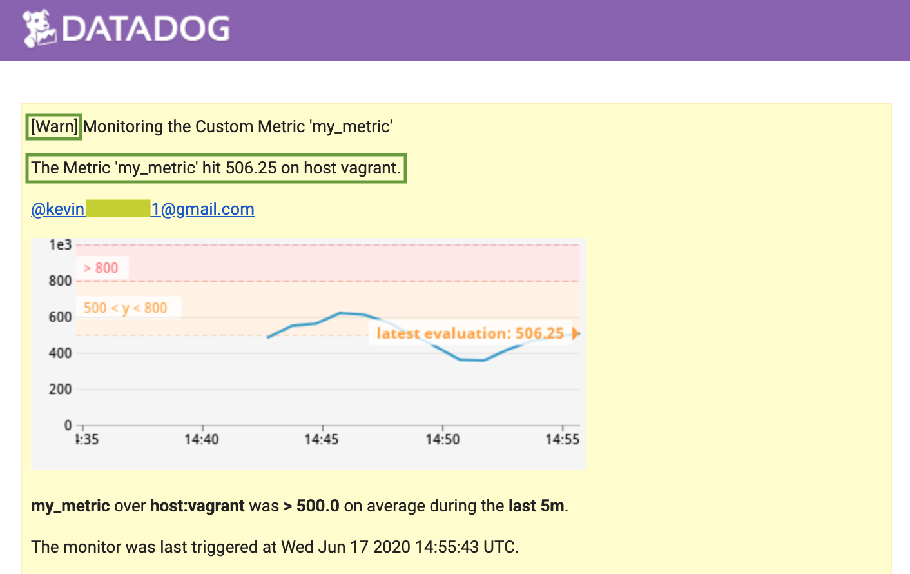

# Datadog Hiring Challenge - Solutions Engineer

### Table of contents:

* [About Datadog](#about-datadog)
* [Prerequisites and Environment Setup](#prerequisites-and-environment-setup)
* [Collecting Metrics with Datadog](#collecting-metrics-with-datadog)
* [Visualizing Data with Datadog Timeboards](#visualizing-data-with-datadog-timeboards)
* [Monitoring Data with Datadog](#monitoring-data-with-datadog)
* [Collecting APM Data with Datadog](#collecting-apm-data-with-datadog)
* [Using Datadog in real world applications](#using-datadog-in-real-world-applications)


## About Datadog

Datadog is a Cloud Monitoring as a Service company that lets you monitor any stack and app at any scale. Started as an Infrastructure Monitoring Service, Datadog quickly became a full-stack Monitoring provider trusted by many thousands of customers worldwide. Today the company has 1000+ employees and offers best in class Infrastructure and [Application Performance Monitoring](https://www.datadoghq.com/product/apm/) and services such as Log Management and [Security Monitoring](https://www.datadoghq.com/blog/announcing-security-monitoring/).


## Prerequisites and Environment Setup

In the following you will be walked through a number of steps that help you get familiar with Datadog. We will set up a new Ubuntu VM instance on your local machine (Host) and install the Datadog Agent on it. The Datadog Agent will be able to collect useful Infrastructure metrics and APM data. 

Be prepared to learn a lot about Infrastructure Monitoring, Application Performance Monitoring and Data Visualization along the way. Ready? Let's start!


### Setting up your local Environment

We will use [Vagrant](https://www.vagrantup.com/) to set up the local development environment. Vagrant is a great tool for building and maintaining virtual environment setups and will help us to speed up things. We are going to follow Vagrant's [Getting Started](https://www.vagrantup.com/intro/getting-started) documentation, that guides us through all necessary steps to spin up a new Ubuntu VM instance in minutes:


**1)** First download and  [install the latest version of Vagrant](https://www.vagrantup.com/docs/installation/) as well as [VirtualBox](https://www.virtualbox.org/), an open-sourced virtualization softwae.

**2)** Next, create a new directory for your Datatdog exercise:

```
$ mkdir datadogTest && cd datadogTest
```

**3)** Initialize Vagrant by running the two short commands:

```
$ vagrant init hashicorp/bionic64
$ vagrant up
```

That's it! You now have a fully functioning **Ubuntu 18.04 LTS 64-bit** virtual machine running in your VirtualBox, that is control via Vagrant.

The init-command placed a `Vagrantfile` in your `datadogTest` directory. With the help of the Vagrant file you can easily describe the virtual environment setup you would like to have. Your VM needs more RAM? No problem, open the Vagrantfile, change the value of `vb.memory` to `2048` and save the file. Reload the Vagrant with `vagrant reload` and you are all set.


### Installing the Datadog Agent 

In the previous section we have set up the Host. But it is not yet reporting any data to Datadog because both still don't know from each other. This is where the [Datadog Agent](https://docs.datadoghq.com/agent/) comes into place. The Datadog Agent will run on your Host, where it collects data and metrics and sends them over to Datadog. 

**1)** The installation of the Datadog Agent is fairly simple. First you need to SSH into your Vagrant environment:

```
vagrant ssh
```

**2)** Next, grant yourself root access to the machine to make things easier along the way:

```
vagrant@vagrant:~$ sudo passwd root
```

**3)** You will be prompted to pick as password, do so and confirm it. Now switch user to **root** and confirm again using your new password:

```
vagrant@vagrant:~$ su
```


##### Signing up up for a Free Trial on Datadog 

Switch to the [Datadog Website](https://www.datadoghq.com/) and click on the **Free Trial** button to sign up for a 14 days trial that lets you monitor as many servers as you like at no costs. 

> **Note:** If you are a Recruiting Candidate working through an exercise, type "*Datadog Recruiting Candidate*" in the "*Company*" filed. 

After you signed up, you are forwarded to the **Install your first Datadog Agent** section. Pick **Ubuntu**, as this is the environment that we installed on our VM. Copy the installation command and paste it in your Vagrant SSH:

```
root@vagrant# DD_AGENT_MAJOR_Version...
```

Wait for the installation to finish and then start the Datadog Agent:

```
root@vagrant# service datadog-agent start
```

Your Agent will spin up and register itself with Datadog. Click the **Next** button on the Datadog website and see your Host lighting up in green color on the welcome page. Congratulations, you successfully registered your first Host with Datadog!


## Collecting Metrics with Datadog

Monitoring data comes in many forms. While some systems pour out data continuously others only produce data when special conditions are met. Datadog helps you monitor any kind of data and data source. When your environments grow in computing capacity and in number of instances it is helpful to tag the single parts to keep the overview. Datadog provides a rich set of tagging functionalities that help you to provide context to your services. In the following we will start with adding tags to our Host and then move on to collect data from a MySQL database.

Learn more about tags in the [Getting started with tagging](https://docs.datadoghq.com/getting_started/tagging/) section in the Datadog Docs.


#### Adding tags to your Host

**1)** List all files in your `datadog-agent` directory:

```
ls -la /etc/datadog-agent
```

Youl'll notice that there is a file called `datadog.yaml.example`.

**2)** Make a copy of the Agent configuration file that you can work in:

```
cp /etc/datadog-agent/datadog.yaml.example /etc/datadog-agent/datadog.yaml
```

**3)** Open the [Agent main configuration file](https://docs.datadoghq.com/agent/guide/agent-configuration-files/?tab=agentv6v7) in Vim:

```
vim /etc/datadog-agent/datadog.yaml
```

**4)** The first thing that you'll notice is that the **API** setting has no value. In order to make your Agent communicate with Datadog, it must know your API key. An API key is unique to your organization and can be found in your [Datadog API configuration page](https://app.datadoghq.eu/account/settings#api):


Copy and paste your API-key to your `datadog.yaml` file:


**5)** If you have decided to have your Datadog in the Europe (EU) region during signup, you must now change the site of the Datadog intake `@param site`, as well as the host address of the Datadog intake server `@param dd_url`. This is necessary as your API key is only valid for the region it was generated for:


**6)** Finally, find the tags section of your config file. Uncomment it and add two new tags. Set an `environment` tag with a value of `dev` and set a `name` tag with the value `kevins_datadog_demohost`:


**7)** After you've saved the file the Datadog agent must be restarted. As stated in the [Datadog Docs](https://docs.datadoghq.com/agent/basic_agent_usage/ubuntu/?tab=agentv6v7), this can be done by typing the following command in you Vangart SSH:

```
service datadog-agent restart
```

**8)** Once the Agent restarted it picks up the new config settings and tagged your host as expected. Open your Datadog [Host Map](https://app.datadoghq.eu/infrastructure/map) to validate the changes:


### Datadog Integration with MySQL

Datadog has more than **400** **built-in integrations** ranging from messaging plugins to orchestration apps. This list cannot be complete without a **MySQL integration**! Datadog comes with fully integrated MySQL support that is super easy to set up.

The MySQL check is already included in the Datadog Agent package. Hence, no additional installation is needed on your MySQL server. The only thing that is currently missing on our Host environment is the MySQL database itself. Follow these quick steps to install a copy:

**1)** First, change to you Vangart SSH terminal window and update the apt package by running:

```
sudo apt update
```

**2)** Then install the MySQL package on your Ubuntu machine with the following command:

```
sudo apt install mysql-server
```

**3)** Once the installation is completed, the MySQL service will start automatically. To check whether the MySQL server is running, type in the following command:

```
sudo systemctl status mysql
```


**4)** Now that MySQL is installed and is running on the Agent, we prepare the Database for the Datadog integration as described in the [Datadog Docs](https://docs.datadoghq.com/integrations/mysql/). To interact with your MySQL instance, login as root:

```
sudo mysql
```

**5)** Now create a database user for the Datadog Agent:

```
mysql> CREATE USER 'datadog'@'localhost' IDENTIFIED BY '<UNIQUEPASSWORD>';
```

**6)** Finish all further steps described in Datadog's [MySQL Docs](https://docs.datadoghq.com/integrations/mysql/).

**7)** Restart the Agent once the database setup is done:

```
sudo service datadog-agent restart
```

**8)** And inspect the Agent status log:

```
sudo datadog-agent status
```


The Database is sucessfully installed on our host and the Agent integration was sucessful. Now it is time to install your first Datadog integration. Select **Integrations** from the Datadog sidebar and type in **MySQL** in the search field. Click on the MySQL integration and install it:


Change to your [MySQL - Overview](https://app.datadoghq.eu/dash/integration/9/mysql---overview?from_ts=1592254130144&to_ts=1592257730144&live=true) Dashboard on Datadog's website and watch your first MySQL database metrics coming in:


Congratulations! You can now monitor your database and collect all kinds of important metrics. Datadog helps you to keep an eye  on metrics like Query throughput, Query performance or Open Connections. 

**Submission links:**

* [Link to my MySQL-Overview Dashboard](https://app.datadoghq.eu/dash/integration/9/mysql---overview?from_ts=1592254130144&to_ts=1592257730144&live=true)


### Custom Agent Check submitting a random value

Next we will go over the process of creating a **Custom Agent Check** that submits a metric named `my_metric` with a random value between `0` and `1000`. Custom checks are well suited to collect metrics from custom applications and are sheduled to run on a fixed interval.

To perform the custom check as described above, you can use a fairly simple Python script:

```python
from datadog_checks.checks import AgentCheck
from random import randint

class CheckMetric(AgentCheck):
    def check(self, instance):
        self.gauge('my_metric', randint(0,1000))
```

Copy and paste the script to Vim:

```bash
vim /etc/datadog-agent/checks.d/custom_agent_check.py
```

The execution of the script requires a `.yaml` file defining the collection interval:

```yaml
init_config:

instances:
  - min_collection_interval: 15
```

Copy and paste the script to Vim:

```bash
vim /etc/datadog-agent/conf.d/custom_agent_check.yaml
```

> **Note:** The names of the configuration and check files must match. If your check is called `custom_agent_check.py`, your configuration file *must* be named `custom_agent_check.yaml`.

Restart the Datadog Agent:

```
sudo service datadog-agent restart
```

And watch your Custom Agent Metric report data to from your Host to Datadog:


**Submission links:**

* [Link to the Metrics Explorer](https://app.datadoghq.eu/metric/explorer?from_ts=1592256469750&to_ts=1592260069750&live=true&page=0&is_auto=false&tile_size=m&exp_agg=avg&exp_row_type=metric&exp_metric=my_metric)


#### Changing the check's collection interval

Changing the interval at which the check is performed from the default value of `15` seconds can easily be done via the check's `.yaml` file. Open the file with Vim

```
vim /etc/datadog-agent/conf.d/custom_agent_check.yaml
```

 and change the `min_collection_interval` value from `15` to `45`:

```
init_config:

instances:
  - min_collection_interval: 45
```

**Bonus:** By setting the collection interval value in the associate `.yaml` file, the Python script must not be touched to parametrize the data collection.  


## Visualizing Data with Datadog Timeboards

**Timeboards** a fantastic way to visualize your data across an entire dashboard. They are well suited for any kind of troubleshooting, correlation and general data exploration. This makes Datadog Timeboards a good canditate for large TV displays in your cafeteria or lobby. The good thing is, Datadog provides you with the **easiest possible feature** to do exactly that - a prebuild **TV icon** that lets your stream your Datadog Timeboard on large TV screens.

Let's upgrade your cafetria and set up your very first Datadog Timeboard!

##### The goal:

In the last section you've set up a custom metric publishing data via the Datadog Agent installed on your Host. In this section we will take that Metric and build a Timeboard to visualize it. Following the instructions from the [Datadog Docs](https://docs.datadoghq.com/dashboards/timeboards/), we will utilize the **Datadog API** to create a Timeboard that contains:

- Your custom metric scoped over your host.
- Any metric from the Integration on your Database with the anomaly function applied.
- Your custom metric with the rollup function applied to sum up all the points for the past hour into one bucket.

#### Utilizing the Datadog API

Datadog maintains an API that allows you to get data in and out of Datadog in a programmatic fashion. The API is documented in great detail in the offical [Datadog Docs](https://docs.datadoghq.com/api/). Performing API calls to Datadog can easliy be done using Postman. Within the docs we find a very helpful [step-by-step guid](https://docs.datadoghq.com/getting_started/api/)e on how to set up Postman for Datadog API development. 

First go on and setup **Postman** as described in the Docs - import the Datadog collection and set up your environemnt. To finalize the setup, run a quick check to see if your Postman environment can successfully communicate with the Datadog API (`POST`):


If the POST check was successful, the Datadog API should respond with a Status of **202 (Accepted)** and a positive JSON response:


#### Creating a Timeboard in Datadog via the API

Now that Postman is set up on our machines we can create our first Datadog Timeboard via the API. The [Datadog Docs](https://docs.datadoghq.com/api/v1/dashboards/) have a section on this topic. First open your **Datadog API Collection** in Postman, click on **Dashboard** and select the `POST - Create a Dashboard` option.


The following POST body will do a couple of things:

* It will create a Datadog Dashboard with the title `Kevin's Datadog Timeboard`
* It will create a [Timeseries Widget](https://docs.datadoghq.com/dashboards/widgets/timeseries/) that displays your custom metric `my_metric`
* It will add a description for your new Timeboard explaining its purpose
* It will add `test@datadoghq.com` to the list of users being notified when changes are made

Copy the **Body** to Postman and Send a **POST** request to the Datadog API:

```json
{
    "title": "Kevin's Datadog Timeboard",
    "widgets": [
        {
            "definition": {
                "type": "timeseries",
                "requests": [
                    {
                        "q": "avg:my_metric{host:vagrant}"
                    }
                ],
                "title": "Custom Metric 'my_metric' scoped over host"
            }
        }
    ],
    "layout_type": "ordered",
    "description": "This Timeboard will be used to visualize a custom metric, an anomaly function and a rollup function.",
    "is_read_only": true,
    "notify_list": [
        "test@datadoghq.com"
    ]
}
```

The API should respond with the header code **200 (OK)**. Now change to the Datadog website, click on *Dashboard > Dashboard List* in the sidebar and notice that a new Dashboard with the title `Kevin's Datadog Timeboard` showed up in the list. Click on the Dashboard and open it:


The API request has been successful! A simple API request was enough to set up your first Timeboard in Datadog visualizing a Custom Metric from your Host. It definitely is a strength of Datadog to have such a well documented and easy to use API that can be uitilized to automate the task of metric collection and visualization.

##### Enhance the Timeboard functionality

In the next step we are going to update our Timeboard to include a metric from our database integration with the anomaly function applied. Furthermore, we will display the custom metric with the rollup function applied to sum up all the points for the past hour into one bucket.

Again we utilize Postman to perform the updates. Choose the `PUT - Update a Dashboard` collection endpoint and add the `DASHBOARD_ID` path variable of the Timeboard you want to update (The ID can be found in the Dashboard URL and in the API response received after creating the Dashboard):


Next change to the Body tab in Postman and add the following script. It will do a couple of things:

* Add a new widget that applies the anomaly function to a metric
* Add a new widget that applies the roll up function on our custom metric

Copy the **Body** to Postman and Send a **PUT** request to the Datadog API:

```json
{
  "title": "Kevin's Datadog Timeboard",
  "widgets": [{
      "definition": {
        "type": "timeseries",
        "requests": [{
          "q": "anomalies(avg:mysql.performance.user_time{host:vagrant}, 'basic', 3)"
        }],
        "title": "Mysql CPU time per user - Anomalies Graph"
      }
    },
    {
      "definition": {
        "type": "query_value",
        "requests": [{
          "q": "my_metric{host:vagrant}.rollup(sum, 3600)"
        }],
        "title": "Custom metric 'my_metric' with rollup function applied"
      }
    },
    {
      "definition": {
        "type": "timeseries",
        "requests": [{
          "q": "avg:my_metric{host:vagrant}"
        }],
        "title": "Custom Metric 'my_metric' scoped over host"
      }
    }
  ],
  "layout_type": "ordered",
  "description": "This Timeboard will be used to visualize a custom metric, an anomaly function and a rollup function.",
  "is_read_only": true,
  "notify_list": [
    "test@datadoghq.com"
  ]
}
```

The API should respond with the header code **200 (OK)**. Now change to the Datadog website, and reload our Datadog Timeboard tab.


The Update has been successful and your Timeboard now visualizes all the required metrics. The speed of the update clearly emphasizes the benefits of an easy-to-use API. With Datadog you're pulling in new metrics in minutes not hours or days allowing you to focus on metrics analysis not setup efforts.

#### Working with the Timeboard from the Datadog UI

Let us investigate our options to manipulate the newly created Timeboard from the Datadog UI. First set the timeframe of the Dashboard to `5min The past 5 minutes` via the dropdown in the top right corner. Now hover the **Anomalies Graph** and click on the Share icon. Choose to **Send a Snapshot...** and send a short message to one of your co-workers:


**Bonus:** The Anomaly Graph visualizes events of unusual highs or lows of a metric. Metric data that falls out of the normal band (grey) is displayed in red color. In this specific case the Anomaly Graph indicates such events for the metric `MySQL CPU time per user`.

**Submission Links:**

* [Link to my Datadog Timeboard](https://app.datadoghq.eu/dashboard/yp7-ari-z3p/kevins-datadog-timeboard?from_ts=1592322736854&to_ts=1592326336854&live=true)


## Monitoring Data with Datadog

Datadog makes your life very easy by providing a wide range of prebuild and fully integrated product - This is also true for [Monitors](https://www.datadoghq.com/blog/monitoring-101-collecting-data/). Monitoring with Datadog is well documented in the [Docs](https://docs.datadoghq.com/monitors/) and provides many options and settings to set up alerts and warnings just as you need them.

### Setting up a Datadog Monitor

Since you’ve already caught your test metric going above 800 once, you don’t want to have to continually watch this dashboard to be alerted when it goes above 800 again. So let’s make life easier by creating a monitor. 

The process of setting up a Monitor that is able to track our custom metric and alert us if special conditions are met is fairly simple. Change to the Monitoring section in Datadog (*Monitors > Manager Monitors*) and click on the Button **New Monitor +** in the top right corner:


Choose to set up a **Metric-Monitor** by clicking on that button. In the next window you have plenty of options to define your new monitor. We will adjust the Monitor so that it watches the **average** of your custom metric (`my_metric`) and will **alert** you if it’s above the following values **over the past 5 minutes**:

- `Warning` threshold of `500`
- `Alerting` threshold of `800`
- `Notification` if there is No Data over the past `10 minutes`

Copy the requirements to the Monitor settings, choose the detection method to be a **Threshold Alert** and don't forget to define the **Host** as we will need some of its parameters for the Email reporting we'll set up later:


Set the name of your Monitor to `Monitoring the Custom Metric 'my_metric'` and finally save the Monitor by clicking on **Save** at the bottom of the page.

Congratulations, to have successfully set up your first Datadog monitor with minimal effort. Below you can see a visual interpretation of the alerting rules that you've defined in your Monitor for quick check and validation: 


### More advanced Monitoring options

Setting up your first Datadog Monitor was easy and very fast. Now we are going one step further and configure our monitor even more. The following functionalities will be implemented:

- Send you an **email** whenever the **monitor triggers**.
- Create different messages based on whether the monitor is in an **Alert**, **Warning**, or **No Data state**.
- Include the **metric value** that caused the monitor to trigger and host ip when the Monitor triggers an Alert state.

To set up the required behavior stated above we will make use of the **4) Say what's happening** section of the Monitor settings:


The option seems to be rather simple but is indeed very powerful. As described in the [Datadog Docs](https://docs.datadoghq.com/monitors/notifications/?tab=is_alert#tag-variables) there are many pre-build template and conditional variables available that allow you to highly customize your Datadog notifications. 

Copy and paste the following script to the notification box in your Monitor settings:

```
{{#is_alert}}
The Metric 'my_metric' hit {{value}} on host {{host.name}} with IP {{host.ip}}.
{{/is_alert}}

{{#is_warning}}
The Metric 'my_metric' hit {{value}} on host {{host.name}}.
{{/is_warning}}  

{{#is_no_data}}
The Metric 'my_metric' has not reported data on {{host.name}}.
{{/is_no_data}}
```

Set your **user** as recipient in **5) Notify your team** and save your changes.

It does not take much time and the first warning is triggered by our metric passing the value of `500`. As expected we receive an email notification from Datadog that includes all the important information about the Metric and the Host:





#### Scheduled monitoring downtimes

**Bonus**: Since this monitor is going to alert pretty often, you don’t want to be alerted when you are out of the office. Set up two scheduled downtimes for this monitor:

- One that **silences** it from **7pm to 9am** daily on **weekdays**,
- And one that **silences** it all day on **Saturday** until **Sunday**.
- Make sure that your email is notified when you schedule the downtime and take a screenshot of that notification.

Such settings can be added in the **Managed Downtime** view (*Monitors > Manage Downtime*) of Datadog. Click **Schedule Downtime** in the top right corner of the page and specify the Downtime settings as stated above:


The defined receipents are notified about the new scheduled downtime rule via email. This is a great feature the Datadog provides to keep your team up to date on important changes:


Next we repeat the process and set up a second scheduled downtime that is active all day on the weekend. Again, click on the **Schedule Downtime** button and fill in the required information:


The defined recipients are again notified about the new scheduled downtime rule via email:


**Submission Links:**

* [Link to my Monitor](https://app.datadoghq.eu/monitors/177703)
* [Link to scheduled Downtime 1](https://app.datadoghq.eu/monitors#/downtime?id=12706768) 
* [Link to scheduled Downtime 2](https://app.datadoghq.eu/monitors#downtime?id=12707093)


## Collecting APM Data with Datadog

Datadog has a strong set of features and product for state-of-the-art [APM](https://www.datadoghq.com/product/apm/) (Application Performance Monitoring). Seamless application navigation with [Service Maps](https://www.datadoghq.com/blog/service-map/), [App analytics](https://www.datadoghq.com/blog/apm-watchdog-service-map-trace-search/) and Auto-instrumentation for distributed tracing are just some of many features Datadog offers in the APM space.


### Setting up a Dashboard collecting APM metrics

Let us set up an examplary application that reports metrics to an APM Dashboard. We will be using a [Flask app](https://www.datadoghq.com/blog/monitoring-flask-apps-with-datadog/) with Datadog's APM solution.

Datadog maintains a step-by-step guide on [Getting started with Tracing](https://docs.datadoghq.com/getting_started/tracing/) that we will follow along to get the APM Dashboard up and running. First verify that your APM Agent is running by printing the Datadog Agent status report:

```
sudo datadog-agent status
```


Next install `pip` then `flask` and `ddtrace` on your Ubuntu VM by typing in the following commands:

```
sudo apt-get install python-pip
pip install flask
pip install ddtrace
```

> **Note:** If the `ddtrace` installation fails, run `pip install --upgrade cython`  first.

Now create a folder for your flask application:

```
mkdir datadog_flask && cd datadog_flask
```

Define the title of your service:

```
export DD_SERVICE=kevins_datdog_service
```

Create a flask script file and edit it with Vim:

```
vim flaskapp.py
```

Copy an paste the following [Flask](https://flask.palletsprojects.com/en/0.12.x/quickstart/) script to Vim:

```python
from flask import Flask
import logging
import sys

# Have flask use stdout as the logger
main_logger = logging.getLogger()
main_logger.setLevel(logging.DEBUG)
c = logging.StreamHandler(sys.stdout)
formatter = logging.Formatter('%(asctime)s - %(name)s - %(levelname)s - %(message)s')
c.setFormatter(formatter)
main_logger.addHandler(c)

app = Flask(__name__)

@app.route('/')
def api_entry():
    return 'Entrypoint to the Application'

@app.route('/api/apm')
def apm_endpoint():
    return 'Getting APM Started'

@app.route('/api/trace')
def trace_endpoint():
    return 'Posting Traces'

if __name__ == '__main__':
    app.run(host='0.0.0.0', port='5050')
```

Use ddtrace to run your flask app:

```
ddtrace-run python flaskapp.py
```

You should get an output similar to this:

```
 * Serving Flask app "flaskapp" (lazy loading)
 * Running on http://0.0.0.0:5050/
```

Open a new terminal window and reconnect with your Vagrant SSH:

```
vagrant ssh
```

Test your Flask application by sending traces to Datadog. Use `curl` on the url your app is running at:

```
curl http://0.0.0.0:5050/
```

If you get the following output, your test has been successful:

```
Entrypoint to the Application
```


#### Service and Traces visualization on Datadog

By following the steps stated above we managed it to set up a Flask Service that data to Datadog. Open either your [services page](https://app.datadoghq.eu/apm/services?end=1592415999212&env=none&paused=false&start=1589823999212) or your [trace list](https://app.datadoghq.eu/apm/traces?from_ts=1589824036360&index=apm-search&live=true&query=env%3Anone&to_ts=1592416036360) to see the data coming in from your Host:


Select a Trace from the Flask Service and inspect the Flame Graph visualizing the `GET` request:


Now that the data from the Flask Service is being sent to Datadog, you can go on and include the **APM metrics** next to your **Infrastructure metrics** in a new **Datadog Dashboard **(*Dashboard > New Dashboard*). 


### Difference between a Service and a Resource

* **(Datadog) Service:** A Service is a group of processes fulfilling a specific job. *Example: A MySQL database.*
* **(Datadog) Resource:** A Resource is a particular function running on a Service. *Example: A SQL query*


**Submission Links:**

* [My APM/Infrastructure Dashboard](https://app.datadoghq.eu/dashboard/272-tq5-96j/kevins-apm-and-infrastructure-metrics?from_ts=1592325924391&live=true&to_ts=1592326824391)


## Using Datadog in real world applications

Beside of the fact that Datadog is used by thousands of happy commercial customer all over the world, the platform can also be used in many other creative ways. Datadog has already been used to monitor the [NYC Subway System](https://www.datadoghq.com/blog/monitor-mta-status/), the [Pokemon Go App](https://www.datadoghq.com/blog/monitoring-pokemon-go-service-status-datadog/) and even [office restroom availability](https://www.datadoghq.com/blog/engineering/restroom-hacks/). 

In these days nearly anything is a smart device producing some sort of data. No matter if it is your Refrigerator, your Toaster or your new Smart Stroller - all these devices are already connected to the internet and many others will follow. These circumstances not only predict successful times ahead for a data analytics platform like Datadog, it also allows anyone to build promising new services and products solely based on these incredible amounts of data produced each day.

#### Helping to fix air-pollution with Datadog

It would be a fun exercise to use the power of the Datadog platform to solve a real world problem. One thing that comes to my mind is the very difficult and heated-up public discussion about air-pollution in Germany and especially in Stuttgart (City in southern Germany). Stuttgart is among the cities with the [highest levels of air-pollution](https://www.dw.com/en/stuttgart-germanys-beijing-for-air-pollution/a-18991064) for years and constantly struggling with fine dust smog caused by traffic.

The Stuttgart residents are directly affected by the fine dust (air pollution) levels. Cars may be prohibited from entering the city and public transportation prices drop on days with high fine dust levels. These circumstances make it very important for the public to know the current fine dust levels to prepare accordingly (e.g. take the metro instead of the car).

Local organizations started collecting fine dust metrics a few years ago and even maintain [public APIs](https://github.com/opendata-stuttgart/meta/wiki/APIs) for easy access to measurement values. But one thing that is still missing is meaningful aggregation of data and detailed data visualization. The screenshot below shows a currently available fine dust heatmap for the Stuttgart area ([Source](https://luftdaten.info/)):


If **Datadog** would be used as a data aggregation and monitoring service one could merge multiple data sources to gain insights on a higher abstraction level. It would be interesting to bring the fine dust levels in relation with traffic and public transportation utilisation ("Does more traffic correlate with higher fine dust levels?", "Does more public transportation utilisation correlate with lower fine dust levels?").

Furthermore, it would be highly useful if the simple air pollution heatmap (see above) would be extented with more Dashboard widgets from Datadog's extensive [Widgets Library](https://docs.datadoghq.com/dashboards/widgets/). Having a **Fine Dust Dashboard** (similar to the [MTA service Tracker]([https://p.datadoghq.com/sb/c654eb94b-113d9af87f?tpl_var_host=host%3Amta-status-tracker&tpl_var_line=%2A](https://p.datadoghq.com/sb/c654eb94b-113d9af87f?tpl_var_host=host%3Amta-status-tracker&tpl_var_line=*))) displaying all aggragated Metrics in one place (probably even availabe as **Web- or Native App**) would be very practical for the city of Stuttgart. People would have more realtime insights about their city, which would help them to leave their car at home when it's time again to fight fine dust.

