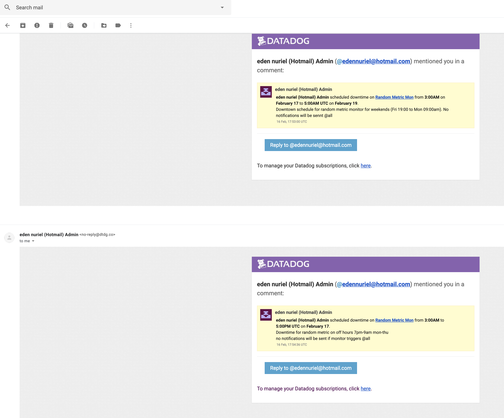
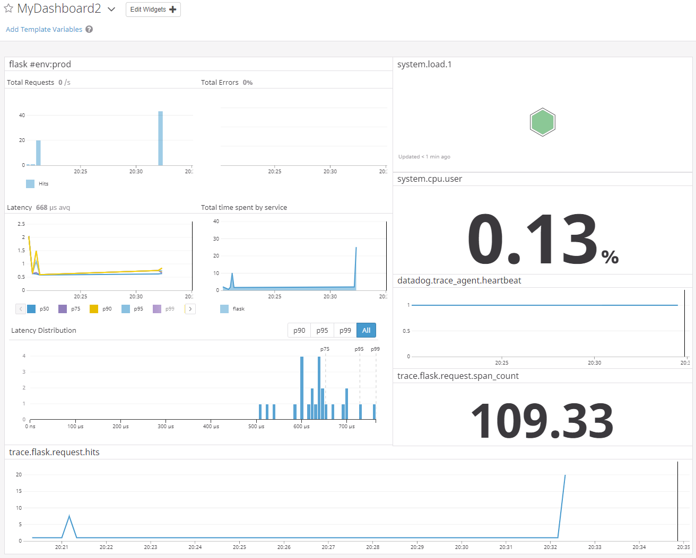

# Table of Contents
1. [Setting Up My Environment](#setup)
2. [Collecting Metrics](#metrics)
3. [Visualizing Data](#visualizing)
4. [Monitoring Data](#monitoring)
5. [Collecting APM Data](#apm)
6. [Final Question](#final)

## Setting Up My Environment 

For my datadog entry point, I installed datadog agent on my local machine and set up dashboard/metrics to monitor local resources.

While setting up a screenboard dashboard, I ran into a webpage display issue on Google Chrome (timeseries preview is behind config text):

While trying to add an event list, I found that the search query field was not intuitive to use, as I couldn’t get it to filter with the “Romans-Macbook-Air” string. I suspect there is a special escape character I need to use for dashes, but couldn’t see an obvious way to get to search query documentation (it really should be next to the search query field title). I tried the typical backslash as an escape character but was still unable to get desired search query results.

After getting comfortable with the agent on my local machine, I set up an Ubuntu server on Amazon Lightsail for the agent tagging and database portions of the exercise. 

## Collecting Metrics 

The linux agent one-line install was really nice and worked flawlessly on my Lightsail Ubuntu Server. I was able to edit tags in the configuration file easily enough, and also edited the hostname to more easily identify the host in the datadog UI.

The mongodb integration was a little bit more involved. Copying and pasting the mongodb.yaml configuration didn’t work off the bat - I suspect now it was due to spacing issues pasting into Lightsail's web console terminal. However after reviewing and updating the .yaml configuration, I was able to get the metrics successfully reporting to my datadog console.

My previous experience with monitoring and metrics is from using Paessler PRTG and similar IT endpoint monitoring solutions, for monitoring basic high-level metrics (connectivity/latency via ping, disk space, CPU usage, memory usage, etc via WMI-like agents). So datadog's much more low-level capabilities took some getting used to.

Despite this help article - https://help.datadoghq.com/hc/en-us/articles/206955236-Metric-types-in-Datadog - it was unclear when you would use gauge metrics vs counter metrics.

After reading through custom agent checks, I got my_metric to report the random 0-1000 value every 45 seconds. I was able to do so by modifying the .yaml file and setting min_collection_interval, and also by using a temporary file on the filesystem to keep track of the last time the agent submitted a value for my custom metric.

### Bonus Question 

The way to change check's collection interval so that it only submits the metric once every 45 seconds, outside of the python check file,  is to edit the .yaml configuration file and add the following line to init_config:
min_collection_interval: 45

## Visualizing Data 

Using the API reference and datadog python library, I was able to create python script (api-exercise.py) to generate a timeboard my custom metric and database graphs. The examples in the API guide and the anomaly detection article were the most helpful resources.

To set the timeboard's timeframe to the past 5 minutes, I used the cursor dragging function over a 5 minute period on one of the graphs. I then took a snapshot and sent it to myself by using the little camera icon and @s.roman@gmail.com notation.

### Bonus Question

The anomaly graph is displaying unexpected spikes and dips in the database resident memory. Since it uses the basic algorithm, it determines what’s unexpected using a lagging rolling quantile computation. https://docs.datadoghq.com/guides/anomalies/

## Monitoring Data 

Monitors were very easy to set up, with both alert and warning thresholds. Here is the monitoring email I received when my custom metric hit >500.

### Bonus Question

Downtime scheduling was very clearly located in the same section as monitoring. I scheduled downtime as well for M-F 7p-9a and Sat-Sun.

## Collecting APM Metrics 

I was able to collect APM metrics via the APM quick setup in the datadog web console. By simply running the ddtrace command on the provided flask python app, and accessing a few of the URLs in the app, I was able to get metrics on access time and other attributes for the flask app.

https://p.datadoghq.com/sb/aa5f65a0f-6c9a9e1a64

### Bonus Question

A service would be the app (like flask in this case) that ddtrace is monitoring and a resource would be a query to that app (like /api/apm in this case). More info:
https://help.datadoghq.com/hc/en-us/articles/115000702546-What-is-the-Difference-Between-Type-Service-Resource-and-Name-

## Final Question 

I think an interesting use for Datadog would be monitoring Brooklyn Bridge pedestrian and bicyclist traffic. With a few well placed sensors, you could track pure daily numbers, see the difference between holiday traffic and regular traffic, and tell when biking across the bridge is most difficult due to all the tourists :).
