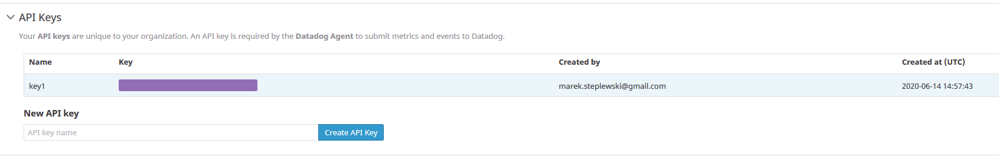
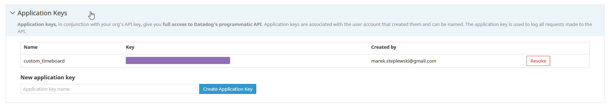
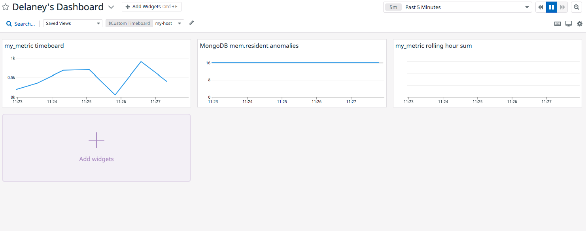
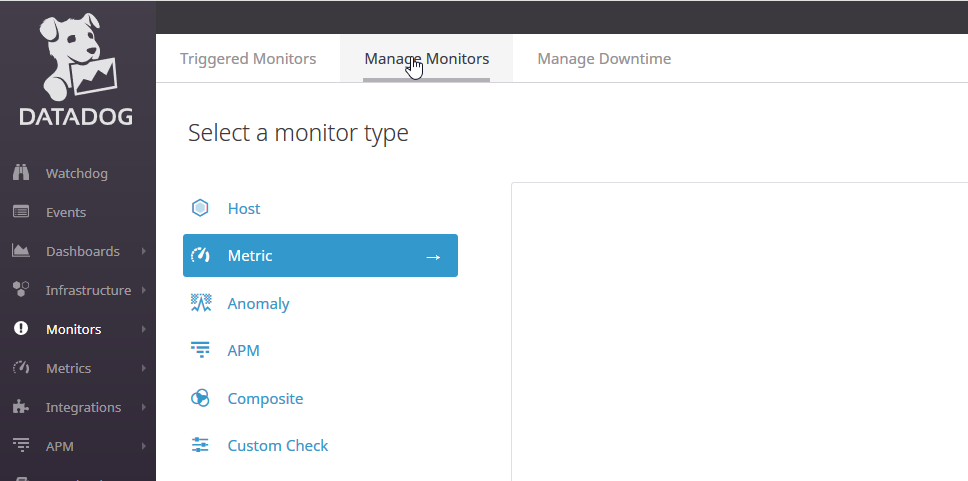
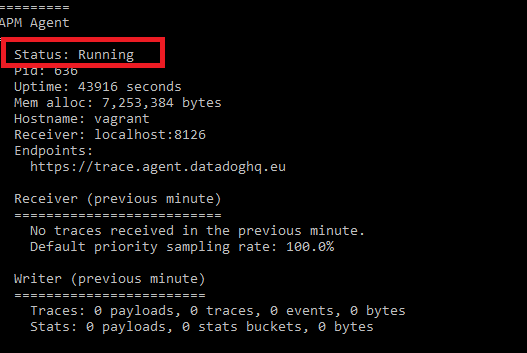

# Datadog Solutions Engineer Challenge

Datadog is a monitoring and analytics tool for information technology (IT) and DevOps teams that can be used to determine performance metrics as well as event monitoring for infrastructure and cloud services. The software can monitor services such as servers, databases and tools. It supports hundreds of integrations out of the box and is designed to be quick and easy to setup and install.


## Table of Contents

* [Environment Setup](#environment-setup)
* [Collecting Metrics](#collecting-metrics)
* [Visualizing Data](#visualizing-data)
* [Monitoring Data](#monitoring-data)
* [Collecting APM Data](#collecting-apm-data)
* [Datadog in the Wild](#datadog-in-the-wild)
* [References](#references)
 

## Environment Setup

In the following readme you will be taken through a number of different features of Datadogs platform that will help familiarise you with the capabilities
and strengths.

To start we will download and install [Vagrant](https://www.vagrantup.com/downloads). Please choose your OS version for this and follow the [Vagrant setup](https://www.vagrantup.com/intro/getting-started) instructions. You should now have a local contained instance of Ubuntu running.
> **Note:** By default the username and password are vagrant:vagrant

Next signup to the [Datadog platform](https://www.datadoghq.com/). Once you have access follow the [installation instructions](https://app.datadoghq.eu/account/settings#agent/ubuntu) for Ubuntu to setup a Datadog Agent locally in vagrant.

Login to Datadog and go to the "Infrastructure-> Host Map" you should see your vagrant host.


To access your virtual machine run `vagrant ssh` from the location you setup and ran your vagrant instance this should then give you a command line terminal

## Collecting Metrics


### Creating Tags in your Agent

In this section we cover [tags](https://docs.datadoghq.com/getting_started/tagging/) and how to add them to your agent.

To start lets edit the the relevant `datadog-agent` yaml file, more information can be found [here](https://docs.datadoghq.com/agent/guide/agent-configuration-files/?tab=agentv6v7) on the location of this file on different operating systems.

Documentation on assigning tags can be found [here](https://docs.datadoghq.com/getting_started/tagging/assigning_tags/?tab=noncontainerizedenvironments), here you have more information on creating tags via the API, UI and DogstatsD. For our exercise we will do this via the command line using the following steps:

1) Open the configuration file
```
vi /etc/datadog-agent/datadog.yaml
```

> **Note:** If you followed the easy install many of the following steps will have been done for you

2) Next you will need to get your API key, this can be found under [Integrations API](https://app.datadoghq.eu/account/settings#api) in the Datadog platform. This key is used to identify your agent to your organisation and required for the two to communicate.



Once you have your key paste it into your file


3) One important thing to note is if you register to Datadog EU you will need to ensure your `site` and `dd_url` are set accordingly as your API key is linked to the region of the platform you have registered to, if this is set incorrectly your Agent will experience problems authenticating to Datadog. These should be set to  `datadoghq.eu` and `https://app.datadoghq.eu` respectively.


4) To set the tags within the file find the `tags` parameter and set your key pairs


5) Next you will need to restart your Agent service for the changes to take effect, more documentation around this can be found [here](https://docs.datadoghq.com/agent/basic_agent_usage/ubuntu/?tab=agentv6v7)
```
sudo service datadog-agent restart
```

6) Finally verify that your changes applied by checking your [Host Map](https://app.datadoghq.eu/infrastructure/map?fillby=avg%3Acpuutilization&sizeby=avg%3Anometric&groupby=availability-zone&nameby=name&nometrichosts=false&tvMode=false&nogrouphosts=true&palette=green_to_orange&paletteflip=false&node_type=host) in Datadog


### Mysql installation and configuration

1) Next we will install Mysql database on your vagrant VM, to install Mysql make sure to update and then run the install for `mysql-server`
```
sudo apt update
sudo apt install mysql-server
```

2) Once this has completed ensure your installation is running correctly
```
sudo service mysql status
```


3) Login to Mysql as `root` and follow the [Mysql Integration Documentation](https://docs.datadoghq.com/integrations/mysql/) to allow Datadog to collect metrics on the database.
```
sudo mysql
```

As part of the setup you will need to create a `conf.yaml` file under `/etc/datadog-agent/conf.d/mysql.d` like the following example [conf.yaml](src/conf.yaml) file.

4) Restart the Agent again and check if it is monitoring Mysql correctly
```
sudo service datadog-agent restart
sudo datadog-agent status
```


5) Now that we have setup the Agent we need to make sure to install the [Integration](https://app.datadoghq.eu/account/settings#integrations/mysql) in Datadog to start monitoring Mysql. This is found under the "Integrations" section where you will see a list of all possible systems Datadog can integrate with out of the box.


6) Finally you can view the [Mysql Dashboard](https://app.datadoghq.eu/dash/integration/9/mysql---overview) and see Datadog monitoring your database.


### Creating a Custom Agent with a check

In this section we will cover creating a **Custom Agent**, we will follow the [instructions](https://docs.datadoghq.com/developers/write_agent_check/?tab=agentv6v7) to create a python file that wil call the Datadog API. This agent will use a custom metric called `my_metric` submitting a random value between `0` and `1000` running on a set interval. Use the following steps to get up and running:

1) Lets create your [my_metric](src/my_metric.py) python script under the `/etc/datadog-agent/checks.d` directory
```python
# the following try/except block will make the custom check compatible with any Agent version
import random

from random import randint
try:
    # first, try to import the base class from new versions of the Agent...
    from datadog_checks.base import AgentCheck
except ImportError:
    # ...if the above failed, the check is running in Agent version < 6.6.0
    from checks import AgentCheck

# content of the special variable __version__ will be shown in the Agent status page
__version__ = "1.0.0"

class MyMetric(AgentCheck):
    def check(self, instance):
        randomValue = randint(0,1000)
        self.gauge('my.metric', randomValue, tags=['test:my_new_key'])
```

2) Then you will need to create your [my_metric.yaml](src/my_metric.yaml) file that will define the interval that your value will be collected at
```yaml
init_config:

instances:
 - min_collection_interval: 45
tags:
- test:my_new_key
```

> **Note:** Please ensure that your `tags` match in both the `.yaml` and `python` file


3) Restart your Agent for the changes to take effect
```
sudo service datadog-agent restart
```

4) You should now be able to see `my_metric` in the [Metrics Explorer](https://app.datadoghq.eu/metric/explorer?from_ts=1592494330915&to_ts=1592497930915&live=true&page=0&is_auto=false&tile_size=m&exp_metric=my.metric&exp_agg=avg&exp_row_type=metric) once you set
the graph to `my.metric`.


### Changing the Collection Interval

To change your agents collection interval ideally you don't want to edit your files to do this you can do the follow:

- In the Datadog UI go to the [Metric Summary section](https://app.datadoghq.eu/metric/summary?filter=my&metric=my.metric)
- Enter your tag to filter by find your metric you are looking for
- Select `my.metric`
- Click edit on the panel that comes up
- Set the interval

More information can be found in the [Metric Summary](https://docs.datadoghq.com/metrics/summary/).


Alternatively you can edit your `my_metric.yaml` file and update the `min_collection_interval` value
```yaml
init_config:

instances:
 - min_collection_interval: 15
tags:
- test:my_new_key
```

## Visualizing Data

In this section we will cover how we can visualise data from our Agents using dashboards. These allow you to visually track, analyse, and display key performance metrics, which enable you to monitor the health of your infrastructure. We will look at creating our own custom dashboard to capture metrics around our Mysql database as well as our custom metric `my_metric`. Here we will utilise the **API** to create our dashboard as per the [Dashboard Documentation](https://docs.datadoghq.com/api/v1/dashboards/).

### Create Dashboard

We will create our dashboard using Datadogs [python API](https://github.com/DataDog/datadogpy).

1) We need to install the Datalog libraries let's do this using a package manager for python called [pip](https://pypi.org/project/pip/)

> **Note:** If you haven't already install pip3
```
sudo apt install python3-pip
pip3 install datadog
```

2) You will need to get your `API KEY` and `APP KEY` , so once more we go to the [Integrations API](https://app.datadoghq.eu/account/settings#api) section and get your `API KEY` and we will find the `APP KEY`just below it



3) We will create a [my_dashboard.py](src/my_dashboard.py) file , here we are creating 3 graphs:
- One showing Anomalies of our Mysql CPU performance
- Second showing a [Rollup](https://docs.datadoghq.com/dashboards/functions/rollup/) and sum of our `test:my_new_key` values for the past hour
- And our final graph will show the average the count of our `test:my_new_key`
```python
from datadog import initialize, api

options = {
    'api_key': '<DATADOG_API_KEY>',
    'app_key': '<DATADOG_APPLICATION_KEY>'
}

initialize(**options)

title = 'Solution Enigneering Test Dashboard'
widgets = [{
    'definition': {
        'type': 'timeseries',
        'requests': [
            {'q': 'anomalies(avg:mysql.performance.user_time{host:vagrant}, \'basic\',2)'}
        ],
        'title': 'Anomalies graph Average MySQL CPU time (per sec)'
    }
},
{
    'definition': {
        'type': 'query_value',
        'requests': [
            {'q': 'my.metric{test:my_new_key}.rollup(sum,3600)'}
        ],
        'title': 'Custom \'my_metric\' graph with rollup sum'
    }
},
{
    'definition': {
        'type': 'timeseries',
        'requests': [
            {'q': 'avg:my.metric{test:my_new_key}'}
        ],
        'title': 'Custom \'my_metric\' graph of my_new_key'
    }
}]
layout_type = 'ordered'
description = 'This dashboard displaysa visualisation of a custom metric, an anomaly of mysql cpu usage and a rollup function applied on a custom metric'
is_read_only = False
notify_list = ['marek.steplewski@gmail.com']


api.Dashboard.create(title=title,
                     widgets=widgets,
                     layout_type=layout_type,
                     description=description,
                     is_read_only=is_read_only,
                     notify_list=notify_list)

```

We can then run our file:
```
python3 my_dashboard.py
```

### Set the Dashboards timeframe to the past 5 minutes

Now that we have successfully created our [dashboard](https://app.datadoghq.eu/dashboard/q5h-988-f3z/solution-enigneering-test-dashboard) we can now view our metrics



Here we can drill down into our [timeseries](https://docs.datadoghq.com/dashboards/widgets/timeseries/) and [query value](https://docs.datadoghq.com/dashboards/widgets/query_value/) graphs. Now lets say we want to see what happened in the past 5 minutes in our graphs. We can go to the top right and set a [custom time](https://docs.datadoghq.com/dashboards/guide/custom_time_frames/) frame. Alternatively we can drag over a 5 minute period
on the graph to get a similar result.

> **Note:** Possible BUG: I was unable to edit the 5 minute time frame as per the documentation it did not accept any custom values for the main timeboard


### Annotation snapshot

Next we will take a snapshot of our Anomalies graph, this can be done by clicking on the graphs and selecting the annotate button.


Then simply type @youremail@address.foo and press enter. You should then receive an email similar to this one with the annotation


### What is the Anomaly graph?

The [Anomaly graph](https://docs.datadoghq.com/monitors/monitor_types/anomaly/) provides deeper context for dynamic metrics. By analyzing a metric’s historical behavior, anomaly detection distinguishes between normal and abnormal metric trends.
This is visualised by showing the highs and lows of a particular metric that fall out of what is considered the **norm** which is represented by the grey band, and highs or lows are represented in red.


## Monitoring Data

Datadog provides a whole host of [monitoring](https://docs.datadoghq.com/monitors/) features. We will cover some of these in this section where we will look at how we can monitor and alert on our metrics.

### Setting up a Monitor

Since you’ve already caught your test metric going above 800 once, you don’t want to have to continually watch this dashboard to be alerted when it goes above 800 again. So let’s make life easier by creating a monitor.

We will create a new [Metric Monitor](https://app.datadoghq.eu/monitors#/create) by going to the Monitoring section in Datadog and choosing "New Monitor -> Metric", this will watch the average of your custom metric `my_metric` and will alert if it goes over some thresholds. Lets start by creating our monitor:



This should bring you to a new window and here we can define and adjust how our [Metric Monitor](https://docs.datadoghq.com/monitors/monitor_types/metric/?tab=threshold) will work, we want to monitor the average of our custom metric `my_metric` and be **alerted** when
the values are above the following settings in the past **5 minutes**:

- `Warning` threshold of 500
- `Alerting` threshold of 800
- `Notification` if there is **No Data** for this query in  the past **10 minutes**


Make sure to set a **Name** for your monitor we will call it `Custom Metric Monitor - my_metric`, set yourself as the person to be **notified** this will send you and email if an alert is triggered and hit **Save**


Now if you go to [Manage Monitors](https://app.datadoghq.eu/monitors/manage) you should see your new monitor and we go view [our monitor](https://app.datadoghq.eu/monitors#180109)


Now we want to add some extra logic to our monitors notifications so have a better idea of what's causing the alerts provide some useful information, so we will add  the following:

- A different message for `Alert`, `Warning` and `No Data`
- The `metric` and `value` that caused the notification
- The `IP Address` of the host only when it is an `Alert`

To do this we can use the [notification](https://docs.datadoghq.com/monitors/notifications/?tab=dashboards) documentation. We can update the notifications to the following:

```
{{#is_alert}}
An alert was triggered on {{host.ip}} for 'my_metric'-  {{value}} it reached the 800 threshold in the past 5 minutes
{{/is_alert}}

{{#is_warning}}
A warning was triggered for 'my_metric' - {{value}} it reached the 500 threshold in the past 5 minutes  
{{/is_warning}}

{{#is_no_data}}
No data was sent for 'my_metric' in the past 5 minutes
{{/is_no_data}}}
```

You should receive an email similar to this one:


Now that we have enhanced our notifications we want to ensure we aren't notified out of hours so we will setup a [scheduled downtime](https://docs.datadoghq.com/monitors/downtimes/?tab=bymonitorname) with the following parameters:
- No notifications **7pm** to **9am** daily on **Monday** to **Friday**,
- No notifications on **Saturday** to **Sunday**

To do this we will go to the Monitors [Managed Downtime](https://app.datadoghq.eu/monitors#/downtime) dashboard and click on **Schedule Downtime** in the top right


We will set two scheduled down times one for the **Weekdays** and one for **Weekends**, make sure to add recipients that are notified of these downtimes so everyone is aware that they are scheduled. Lets create the Weekday downtime:


Now lets repeat the same but adjusting our times for Weekends:


If you successfully created both our [Weekday](https://app.datadoghq.eu/monitors#downtime?id=12909256) and [Weekend](https://app.datadoghq.eu/monitors#downtime?id=12908961) downtimes. You and any recipients should receive confirmation emails once these are setup


## Collecting APM Data

In the next section we will cover Datadogs [APM](https://www.datadoghq.com/product/apm/) (Application Performance Monitoring) and how we can create an implementation using this.

### Setup Dashboard and Collect APM Metrics

We will create a simple APM dashboard and we will implement it combiging  [Flask](https://flask.palletsprojects.com/en/0.12.x/quickstart/) and APM. For this we can reference Datadogs [guide](https://docs.datadoghq.com/getting_started/tracing/) on setting up our dashboard. We will want to make sure we can see our **Trace** and include those metrics in a **Infrastructure metrics** dashboard.

Let start with  verifying our APM is enabled

```
sudo datadog-agent status
```


Now that we have confirmed the **APM AGENT** is up and running we need to setup `flask` and `ddtrace` using pip that we installed earlier:

```
pip3 install flask
pip3 install ddtrace
```
> **Note:** Sometimes ddtrace fails to install, if this happens run `pip3 install --upgrade cython` this should resolve the issue

Now we can create our [flask_app.py](src/flask_app.py) using the following code:

```python
from flask import Flask
import logging
import sys

# Have flask use stdout as the logger
main_logger = logging.getLogger()
main_logger.setLevel(logging.DEBUG)
c = logging.StreamHandler(sys.stdout)
formatter = logging.Formatter('%(asctime)s - %(name)s - %(levelname)s - %(message)s')
c.setFormatter(formatter)
main_logger.addHandler(c)

app = Flask(__name__)

@app.route('/')
def api_entry():
    return 'Welcome to the Application'

@app.route('/api/apm')
def apm_endpoint():
    return 'Getting APM Started'

@app.route('/api/trace')
def trace_endpoint():
    return 'Posting Traces'

if __name__ == '__main__':
    app.run(host='0.0.0.0', port='5050')
```

Next need to make sure to define our service

```
export DD_SERVICE=m_custom_service
```

Now we can run our application using `ddtrace` which will automatically instrument it to Datadog

```
ddtrace-run python3 flask_app.py
```

If everything ran successfully you should see a message similar to

```
* Serving Flask app "hello" (lazy loading)
  ...
* Running on http://0.0.0.0:5050/ (Press CTRL+C to quit)
```

You can verify your application is running by sshing into your vagrant instance and running a `curl` call against the ip and port

```
vagrant ssh
curl http://0.0.0.0:5050/
```

This should give you the following output

```
Welcome to the Application
```

### APM Services and Traces Dashboard

Now that we have our **Flask** application running lets go to our [APM Services](https://app.datadoghq.eu/apm) and check if our [Trace](https://app.datadoghq.eu/apm/traces) is there and we are receiving data from our vagrant host


After clicking into the [trace](https://app.datadoghq.eu/apm/traces?from_ts=1592511405872&index=apm-search&live=true&query=env%3Avagrant&spanID=2293476844156930116&to_ts=1592512305872&trace=AQAAAXLJG2_E1-E8cQAAAABBWExKRzREMWZzZ200SS90Sk9WUw&traceID=5935516991774517350) we can see that our vagrant host is sending us data via our flask application.

### Infrastructure metrics Dashboard

Now that we have our metrics we still need to add the to our [Infrastructure metrics dashboard](https://app.datadoghq.eu/dashboard/num-spd-xd9/infrastructure-metrics-and-apm-metrics) by creating a new timeboard (Dashboard -> New Dashboard -> Timeboard). Here we can create some new graphs using our flask trace.


In Datadog we have two types of main APM visualisations [Service](https://docs.datadoghq.com/tracing/visualization/#services) and [Resources](https://docs.datadoghq.com/tracing/visualization/#resources):

- Service: A Service is a process providing access to an underlying resource Eg: Flask app, Apache, Ngnixn, Mysql etc.
- Resource: A Resource is a function that would run on a Service Eg: Web request, SQL query etc.


## Datadog in the Wild

Datadog provides a quick to deploy and easy to use solution with hundreds of integrations out of the box. The range of real-world applications for the platform ranges from monitoring NYC Subway System, Pokemon Go, and even office restroom availability!

Given the recent Covid-19 outbreak healthcare monitoring is ever more important in the modern day with the potential application of monitoring patients themselves. Utilising Datadogs ease of integration it could be use to hook into mobile medical devices to monitor patients and instantly alert of any deterioration in health notifying relevant emergency services eg: paramedics, the nearest hospital and the patients GP.


## References

### How to get started with Datadog

* [Datadog overview](https://docs.datadoghq.com/)
* [Guide to graphing in Datadog](https://docs.datadoghq.com/graphing/)
* [Guide to monitoring in Datadog](https://docs.datadoghq.com/monitors/)

### The Datadog Agent and Metrics

* [Guide to the Agent](https://docs.datadoghq.com/agent/)
* [Datadog Docker-image repo](https://hub.docker.com/r/datadog/docker-dd-agent/)
* [Writing an Agent check](https://docs.datadoghq.com/developers/write_agent_check/)
* [Datadog API](https://docs.datadoghq.com/api/)

### APM

* [Datadog Tracing Docs](https://docs.datadoghq.com/tracing)
* [Flask Introduction](http://flask.pocoo.org/docs/0.12/quickstart/)

### Vagrant

* [Setting Up Vagrant](https://www.vagrantup.com/intro/getting-started/)

### Other questions:

* [Datadog Help Center](https://help.datadoghq.com/hc/en-us)


